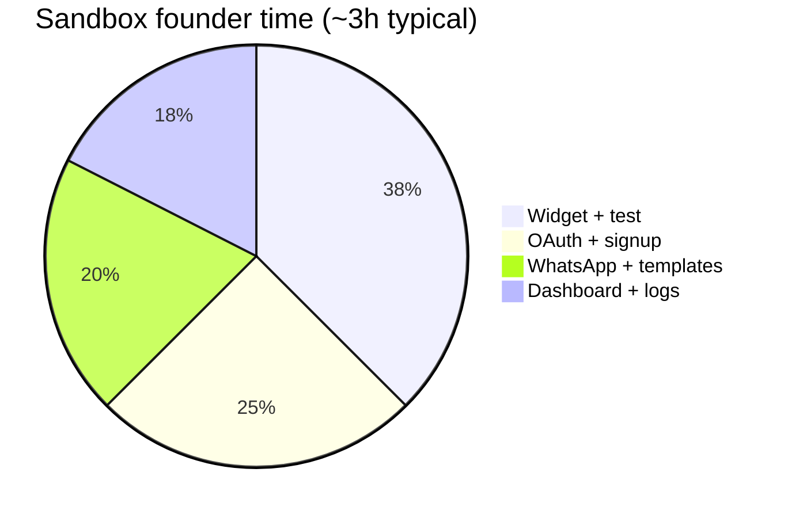

# Founder Hours Reduction Audit v1

**Date (UTC):** 2026-05-19  
**Scope:** Read-only audit — why CartFlow needs **~2–4 h founder support (sandbox)** and **~8–16 h (production)** per first merchant. **No** runtime or feature changes.  
**Commit message:** `docs: add founder hours reduction audit v1`

**Evidence base:** `docs/cartflow_first_production_merchant_readiness_v1.md`, `docs/cartflow_first_merchant_journey_audit_v1.md`, `docs/audit_merchant_onboarding_reality_v1.md`, `docs/cartflow_whatsapp_production_readiness_audit_v1.md`, `docs/cartflow_merchant_activation_path_v1.md`, `docs/cartflow_whatsapp_template_24h_enforcement_audit_v1.md`, `services/merchant_onboarding_v1.py`, `services/whatsapp_send.py`.

---

## Executive summary

| Question | Answer |
|----------|--------|
| **Where does founder time go?** | Mostly **off-product work** (Twilio/Meta/Zid consoles, env, test orchestration) and **interpreting gaps** the dashboard does not close (mock vs real, recovered vs sent, OAuth vs widget-only). |
| **Why 2–4 h sandbox?** | One guided day: fix funnel entry, stand up a test surface, explain delay/KPIs, watch first cart/send together. |
| **Why 8–16 h production?** | Platform provider is **not merchant self-serve**; templates and callbacks are **ops-led**; calendar wait on Meta; first real-send/debug cycles. |
| **Low-touch SaaS today?** | **No** |
| **Honest positioning today?** | **High-touch onboarding product** (pilot / concierge), not self-serve PLG |

Recent hardening (**`[WA SEND TRUTH]`**, **`[WA TEMPLATE ENFORCEMENT]`**) **reduces bad production sends** but can **add short ops explanations** until merchant-facing copy exists for `blocked_template_required`.

---

## Part 1 — Time breakdown (founder hours by category)

Legend: ranges are **founder-active** hours for **first merchant** on a **pre-provisioned** host (Twilio sandbox or prod env already exists). Add **+4–12 h** if OAuth/Twilio/env is broken.

### 1.1 Sandbox go-live (~2–4 h total)

| Category | Typical h | Range h | What founder actually does | Product trigger |
|----------|-----------|---------|------------------------------|-----------------|
| **Signup confusion** | 0.4 | 0.2–0.6 | Send `/signup` link; explain `/register` dead-end; sometimes create account | `cartflow_landing.html` → `register_placeholder.html` |
| **OAuth (Zid)** | 0.6 | 0–1.5 | Fix redirect URI / env; walk merchant through consent; explain slug ≠ connected | `ZID_CLIENT_*`, onboarding **store** step needs `access_token` |
| **WhatsApp provider (sandbox)** | 0.4 | 0.2–0.8 | Explain mock vs real; optional Twilio sandbox join on test phone | `PRODUCTION_MODE` off; UI “ربط واتساب” ≠ Twilio connect |
| **Templates (local JSON)** | 0.4 | 0.2–0.6 | Fill `reason_templates_json`; avoid empty → skip send | Signup default empty templates |
| **Widget embed** | 0.8 | 0.5–1.2 | Build/share test HTML or verify theme snippet; fix `data-store` | No Zid theme installer; theme access variance |
| **Test failures** | 0.7 | 0.4–1.2 | 2 min wait coaching; wrong `/demo/store` slug; no abandon event | `recovery_delay=2`; `demo_store.html` vs `/dashboard/test-widget` |
| **Logs interpretation** | 0.4 | 0.2–0.6 | Read `[MERCHANT READINESS]`, carts row, optional `/dev/recovery-health` | Ops-oriented logs, not merchant panel |
| **Dashboard confusion** | 0.3 | 0.2–0.5 | Align 5-step card vs readiness %; KPI 0 after send | Dual setup UIs; “recovered” ≠ sent |
| **Production cutover (prep)** | 0.1 | 0–0.3 | Set expectations for day 2+ only | N/A in pure sandbox |
| **Total** | **~3.1** | **2.0–4.0** | | |

### 1.2 Production cutover (incremental ~6–12 h on top of sandbox)

| Category | Typical h | Range h | What founder actually does | Product trigger |
|----------|-----------|---------|------------------------------|-----------------|
| **WhatsApp provider setup (platform)** | 2.0 | 1.5–3.0 | `PRODUCTION_MODE`, `TWILIO_*`, `CARTFLOW_PUBLIC_BASE_URL`, status callback URL | No in-app provider connect |
| **Templates (provider approval)** | 2.5 | 1.0–6.0 | Meta/Twilio console submission; match copy to `reason_templates_json`; set `CARTFLOW_WHATSAPP_PROVIDER_TEMPLATES_APPROVED` | No template ID layer; approval external |
| **24h / compliance guard** | 0.5 | 0.2–1.0 | Explain `blocked_template_required`; seed inbound test; env flag | v1 gate blocks cold outbound in prod |
| **Production cutover debug** | 2.5 | 1.5–4.0 | First `sent_real`, delivery webhook, failed sends | Sync path + provider policy |
| **OAuth (if not done in sandbox)** | 0.3 | 0–1.0 | Same as sandbox | |
| **Widget (production domain)** | 0.4 | 0.2–0.8 | Live theme vs test page | |
| **Test failures (prod)** | 0.8 | 0.4–1.5 | Sandbox join, template reject, callback missing | |
| **Logs interpretation** | 0.6 | 0.3–1.0 | `[WA SEND TRUTH]`, `[WA TEMPLATE ENFORCEMENT]`, delivery truth | |
| **Dashboard confusion** | 0.4 | 0.2–0.6 | `production_ready` vs reality | Readiness ≠ first send |
| **Purchase / conversion wiring** | 0.5 | 0–2.0 | Explain KPI; `POST /api/conversion`; Zid webhook gap | Purchase truth not on live Zid webhook |
| **Total incremental** | **~10.5** | **6.0–12.0** | | |
| **Cumulative first prod merchant** | **~13.6** | **8.0–16.0** | sandbox + production | |

### 1.3 Steady state (after first merchant, per merchant week 1)

| Category | h / merchant |
|----------|----------------|
| Ticket-style debug (send, widget, OAuth) | 2–4 |
| Template/provider follow-up | 1–2 |
| Dashboard “is it working?” | 0.5–1 |
| **Week 1 subtotal** | **4–8** (matches readiness doc) |
| **Month 2+** | **1–2 h/mo** (assumes playbooks + stable env) |

---

## Part 2 — Gap classification (A / B / C / D)

| Category | Dominant gap type | Why founder time exists |
|----------|-------------------|-------------------------|
| Signup confusion | **A** Product | Broken public funnel |
| OAuth | **C** Operational + **A** | Env + Zid portal; checklist stricter than widget-only path |
| WhatsApp provider | **C** Operational | Platform Twilio, not merchant UI |
| Templates (local) | **A** + **D** | No wizard; merchant must know copy |
| Templates (provider) | **C** + **B** | External approval; no in-app status |
| Widget embed | **A** + **D** | No theme installer; merchant IT skill |
| Test failures | **A** + **B** | Delay, demo slug, no in-product checklist |
| Logs interpretation | **A** + **C** | Logs are ops dialect |
| Dashboard confusion | **A** + **D** | Dual narratives; KPI semantics |
| Production cutover | **C** | Deploy + consoles + callbacks |
| 24h enforcement | **A** (improved) + **B** | Block exists; merchant message thin |
| Purchase proof | **A** + **C** | Integration not wired on Zid webhook |

**Gap type key:**

| Code | Meaning |
|------|---------|
| **A** | Product gap — missing UX, wrong wiring, misleading UI |
| **B** | Documentation gap — runbook / in-app explanation missing |
| **C** | Operational gap — consoles, env, secrets, provider accounts |
| **D** | Merchant education gap — Zid theme, WhatsApp policy literacy |

---

## Part 3 — Self-serve potential

| Support burden | Self-serve? | Guided? | Must stay founder-assisted? |
|----------------|-------------|---------|----------------------------|
| Signup discovery | **Yes** (redirect `/register`→`/signup`) | — | Until fixed: **founder** sends link |
| Login / reset | **Yes** | Guided if Resend misconfigured | Resend DNS: **ops** |
| Dashboard onboarding steps | **Partial** | **Guided** checklist | OAuth + provider: **founder/ops** |
| Zid OAuth | **Partial** | **Guided** in-app | Misconfigured env: **ops** |
| Twilio / WABA connect | **No** | **No** | **Founder/ops** until per-merchant connect |
| Local templates | **Partial** | **Guided** wizard | Policy copy: **merchant** |
| Provider template approval | **No** | **Guided** status page (future) | **Merchant + ops** with Meta |
| Widget on Zid | **Partial** | **Guided** (video/steps) | Theme access: **merchant** |
| First recovery test | **Partial** | **Guided** (`/dashboard/test-widget`) | First pilot: **founder** on call |
| Interpret failures | **Partial** | Merchant-safe health panel | Complex incidents: **ops** |
| Production cutover | **No** | Runbook | **Ops** |
| Env / callbacks / `PRODUCTION_MODE` | **No** | — | **Ops** |
| 24h / template gate | **Partial** (auto-block) | Explain block in UI | Approval flag: **ops** |
| Revenue “recovered” KPI | **No** | Explain expectations | Integration: **ops + merchant** |

---

## Part 4 — Top reduction opportunities (ranked)

Scoring: **hours saved** = per first merchant founder time; **effort** = S (days), M (1–2 wk), L (month+).

### P0 — High hours saved, worth doing first

| # | Fix | Today → After | Hours saved | Effort | Gap |
|---|-----|---------------|-------------|--------|-----|
| P0-1 | Redirect all CTAs `/register` → `/signup` | 0.4 h hand-holding → ~0 | **~0.3–0.5 h** | **S** | A |
| P0-2 | In-dashboard **first recovery test** path (link `test-widget` + phone + “wait 2 min”) | 0.7–1.2 h debug → **0.2–0.3 h** | **~0.8–1.0 h** | **S** | A + B |
| P0-3 | **Merchant test path** — scoped URL, correct `data-store`, pre-filled templates on signup | 0.8 h widget assist → **0.2 h** | **~0.5–0.8 h** | **M** | A |
| P0-4 | **Sandbox vs production** banner on `#whatsapp` + cart row mock/real label | 0.4–0.6 h trust calls → **0.1 h** | **S** | A + D |
| P0-5 | **Ops runbook** (single Notion/README): env checklist, Twilio, callback, approval flag | 2–3 h prod setup → **1–1.5 h** | **~1.0–1.5 h** | **S** | B + C |
| P0-6 | Align onboarding **store** step with widget-only OR clear “OAuth required for Zid sync” | 0.3–0.5 h confusion → **0.1 h** | **~0.2–0.4 h** | **M** | A |

**P0 bundle (realistic):** **~3–4 h** off sandbox (toward **~1–1.5 h**); **~2–3 h** off production setup (toward **~6–10 h** first prod merchant).

### P1 — Medium savings

| # | Fix | Hours saved | Effort | Gap |
|---|-----|-------------|--------|-----|
| P1-1 | Merchant-safe **recovery status** (subset of recovery-health) | **~0.4–0.6 h** | M | A |
| P1-2 | Countdown “إرسال خلال X د” for `recovery_delay` | **~0.3–0.5 h** | S | A |
| P1-3 | Default `reason_templates_json` on signup | **~0.2–0.4 h** | S | A |
| P1-4 | In-app **provider template status** (pending/approved) + block reason AR | **~0.5–1.0 h** | L | A + C |
| P1-5 | Zid theme install guide (screenshots) | **~0.3–0.5 h** | S | B + D |
| P1-6 | Per-store admin health (not “latest store” only) | **~0.2 h/merchant** at scale | M | C |

### P2 — Lower ROI or longer horizon

| # | Fix | Hours saved | Effort |
|---|-----|-------------|--------|
| P2-1 | Per-merchant Twilio/WABA self-serve connect | **~2–3 h** prod onboarding | **L** |
| P2-2 | Template ID router on outbound API | **~1–2 h** + fewer rejects | **L** |
| P2-3 | Salla/Shopify connect | Market expansion | **L** |
| P2-4 | Purchase truth on live Zid webhook | **~0.5–2 h** KPI confusion | **L** |

### Example (requested format)

| Fix | Founder time |
|-----|----------------|
| **Merchant test path** (P0-2 + P0-3): dashboard link → `/dashboard/test-widget` → `/demo/store?store_slug={merchant}` + signup templates | **~1.5 h test/debug → ~30 min** |
| **Funnel fix** (P0-1) | **~0.4 h → ~0** |
| **Ops runbook + env templates** (P0-5) | **Production setup ~3 h → ~1.5 h** (first time only) |

---

## Part 5 — Honest projection (scale)

Assumptions: **current architecture** (platform Twilio, ops-led go-live), **no** dedicated support hire, founder/ops does onboarding. Template enforcement **reduces** bad sends but **does not** remove console work.

| Scale | One-time onboarding (founder+ops) | Steady-state / month | Risk |
|-------|-----------------------------------|----------------------|------|
| **10 merchants** | **~30–50 h** (3–5 h × 10; mix sandbox/prod) | **~10–25 h/mo** | Manageable side project |
| **50 merchants** | **~100–200 h** one-time wave | **~15–40 h/mo** (~0.3–0.8 FTE) | Founder becomes **support bottleneck** |
| **100 merchants** | **~200–400 h** one-time | **~30–80 h/mo** (~0.6–1.5 FTE) | Requires **support role** or **productized self-serve** |

**Without P0 bundle:**

| Scale | Outcome |
|-------|---------|
| 10 | Founder-led onboarding **works** with discipline |
| 50 | **Unsustainable** without hire or automation |
| 100 | **Ops collapse** — same tickets repeat (OAuth, widget, “no message”, KPI 0) |

**With P0 bundle only (no per-merchant provider):**

| Scale | Outcome |
|-------|---------|
| 10 | **~1–2 h** founder per sandbox merchant |
| 50 | **~50–80 h** onboarding wave + **~20–35 h/mo** |
| 100 | Still **high-touch** for **production**; sandbox improves |

**Dominant tickets at scale:** message not received, sandbox join, template rejected/blocked, callback URL, “recovered” KPI zero, OAuth pending.

---

## Part 6 — Verdict

### Can CartFlow realistically become low-touch SaaS?

| Criterion | Today | After P0 only | After P0 + P1 + per-merchant provider (L) |
|-----------|-------|---------------|-------------------------------------------|
| Signup → sandbox proof without founder | No | **Maybe** (1 merchant / 10) | **Likely** |
| Production WhatsApp without ops | No | No | **Partial** |
| 50 merchants without support hire | No | No | **Maybe** with 1 FTE |

**Verdict: Low-touch SaaS — not today.** Product has strong **recovery engine** but **go-to-market path is concierge**: founder supplies URLs, env, test surfaces, and interprets logs.

### High-touch onboarding product?

**Yes — honest current fit.**

| Segment | Fit |
|---------|-----|
| Pilot / design partners (1–10) | **Strong** — founder pairing is a feature |
| SMB self-serve PLG | **Weak** — funnel, provider, widget block |
| Agency-led rollout | **Medium** — agency absorbs widget/OAuth; ops still for Twilio |

### Path to lower touch (documentation-only roadmap)

1. **P0** (weeks): funnel, test path, banners, runbook → **sandbox ~1–1.5 h** founder.  
2. **P1** (month): merchant health UI, delay UX, template status → **fewer “is it broken?” calls**.  
3. **L** (quarter+): per-merchant WABA/Twilio connect + template IDs → **production approaches SaaS** for WhatsApp slice only; Zid/widget still guided.

---

## Appendix — Code / log hotspots (where founders look today)

| Symptom | Where founder looks |
|---------|---------------------|
| Send attempted | `CartRecoveryLog`, `[WA SEND TRUTH]` |
| Blocked outside 24h | `[WA TEMPLATE ENFORCEMENT]`, `blocked_template_required` |
| Readiness % | `[MERCHANT READINESS]`, `merchant_production_readiness_path_v1` |
| Schedule / worker | `/dev/recovery-health`, `recovery_health_v1` |
| OAuth | `/api/merchant/store-connection`, Zid developer console |
| Provider | Server env, Twilio console, Meta Business |

---

## Document control

| Item | Value |
|------|--------|
| Runtime changes | **None** |
| Related commits (context) | `docs: add first production merchant readiness audit v1`; `fix: align whatsapp send status with operational truth`; `fix: enforce whatsapp template window guard` |
