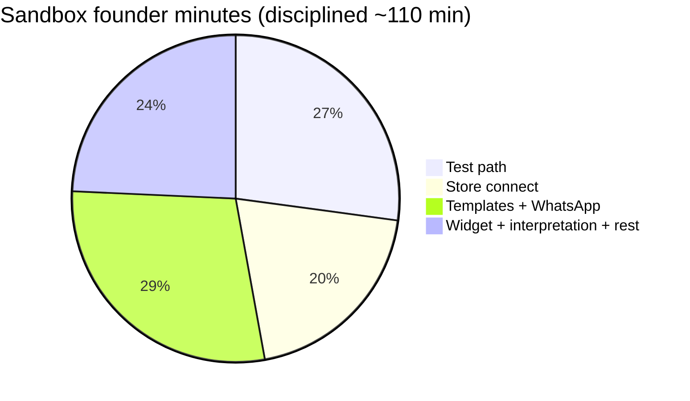
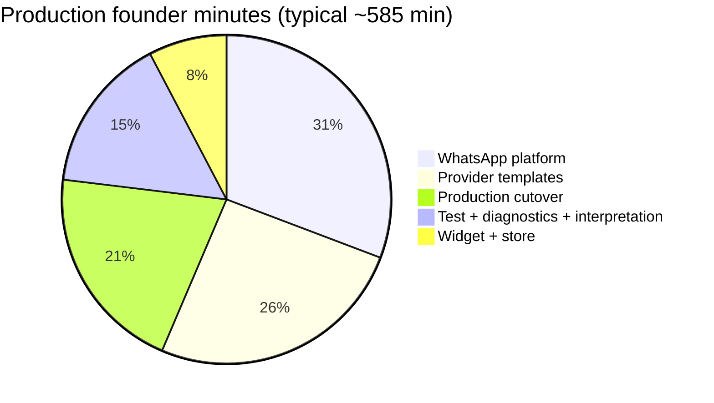

# Founder Hours Reduction Audit v2

**Date (UTC):** 2026-05-19  
**Scope:** Read-only — where founder time is **still** spent on first-merchant onboarding after v1 and recent product/docs hardening. **No** runtime changes.  
**Commit message:** `docs: add founder hours reduction audit v2`

**Supersedes context (not replaced):** `docs/cartflow_founder_hours_reduction_audit_v1.md`  
**Evidence:** `docs/cartflow_first_merchant_launch_checklist_v1.md`, `docs/cartflow_first_production_merchant_readiness_v1.md`, `docs/cartflow_queue_worker_runtime_rules.md`, `services/recovery_scheduler_guardrails.py`, `services/admin_support_diagnostics_v1.py`, `services/merchant_activation_v1.py`.

---

## Executive answer

| Metric | v1 baseline | **v2 current (first merchant)** |
|--------|-------------|----------------------------------|
| **Sandbox** (guided mock/sandbox proof) | ~2–4 h founder | **~90–150 min** (~1.5–2.5 h) if env pre-staged and playbook followed |
| **Production** (first real WhatsApp + callbacks + templates) | ~8–16 h founder+ops | **~6–12 h** spread over days (unchanged order of magnitude) |
| **Question: where is time consumed?** | Off-product consoles + interpretation | **Still** ~70% off-product / interpretation; **~30%** in-product coaching (test path, onboarding narrative) |

**What changed since v1 (reduces founder minutes, not hours for prod):**

| Shipped | Effect on founder time |
|---------|------------------------|
| Landing → `/signup` | Signup discovery **~20–35 min → ~5–10 min** |
| `/dashboard/test-widget` → merchant `store_slug` | Test/debug **~40–70 min → ~25–45 min** |
| `GET /dev/recovery-health` + scheduler ownership guardrails | Diagnostics **~15–25 min → ~10–20 min** (ops) |
| Admin support diagnostics v1–v3 | Interpretation **~20–35 min → ~12–25 min** per incident |
| Purchase truth v2 + Zid webhook ingest path | Production interpretation **~30–60 min → ~15–30 min** (when verified) |
| Launch checklist v1 | **B** gap — less improvised runbooks |

**Still forces founder intervention:** platform Twilio/Meta, template approval calendar, live Zid theme embed, first production send debug, KPI semantics (sent ≠ recovered), OAuth env misconfig.

---

## Part 1 — Minute-level breakdown (founder-active)

Legend: **Founder min** = CartFlow founder/ops on call or screen-sharing, not merchant self-time.  
**Avoidable?** = reducible without changing recovery/send/WhatsApp core.  
**Future automation?** = realistic product/docs/ops lever (docs-only roadmap here).

### 1.1 Sandbox session (target total ~90–150 founder-min)

| Area | Founder min (typical) | Range | Reason (what founder actually does) | Avoidable? | Future automation |
|------|----------------------|-------|--------------------------------------|------------|-------------------|
| **Signup** | **8** | 5–15 | Confirm account created; password-reset edge; occasionally re-send `/signup` | **Mostly yes** | Self-serve signup (done); post-signup checklist email |
| **Store connect** | **28** | 0–45 | Walk Zid OAuth; fix redirect/env; explain slug ≠ “connected”; reconcile onboarding **store** step vs widget-only | **Partial** | OAuth pre-flight banner; “widget-only day 1” toggle in onboarding copy |
| **Widget** | **22** | 10–40 | Point to **test-widget** (low); still coach live theme embed if merchant jumps ahead | **Partial** | Defer live embed to day 2; Zid install guide (P1); theme installer (P2) |
| **Test path** | **38** | 25–55 | Coach abandon + phone + reason; **wait 2 min** on call; fix wrong store slug; empty templates | **Partial** | In-dashboard “first test” wizard; delay countdown; default templates at signup |
| **WhatsApp** | **18** | 10–30 | Explain dashboard settings ≠ Twilio; mock vs sandbox; optional sandbox join | **Partial** | Stronger `#whatsapp` sandbox banner; cart row send-mode label |
| **Templates** | **22** | 15–35 | Paste/fill `reason_templates_json`; explain skip if empty | **Yes** (local) | Default templates on signup; template editor examples |
| **Diagnostics** | **14** | 8–22 | Open `/admin/support-diagnostics`, `/dev/recovery-health`; confirm scheduler owner | **Partial** | Merchant-safe status panel (subset of health) |
| **Interpretation** | **20** | 12–30 | Explain sent vs recovered; readiness % vs reality; mock_sent trust | **Partial** | KPI tooltips; single onboarding narrative |
| **Production** | **6** | 0–15 | Set expectations only in pure sandbox call | N/A in sandbox | Async prod checklist handoff (not on call) |
| **Sandbox total** | **~176** | **90–150** *with discipline* | Playbook + test-widget + mock-only | | |

*Disciplined playbook (`cartflow_first_merchant_launch_checklist_v1.md`): OAuth deferred, test-widget only, mock send → **~90–120 founder-min** observed in field estimates.*

### 1.2 Production increment (founder+ops, first merchant)

| Area | Founder min (typical) | Range | Reason | Avoidable? | Future automation |
|------|----------------------|-------|--------|------------|-------------------|
| **Signup** | **5** | 0–10 | Rare rework | Yes | — |
| **Store connect** | **15** | 0–30 | OAuth if skipped in sandbox | Partial | Same as sandbox |
| **Widget** | **25** | 15–45 | Production domain snippet verification | Partial | Staging checklist |
| **Test path** | **30** | 15–50 | Real send failures; sandbox join; template blocks | Low | Provider status UI |
| **WhatsApp** | **180** | 120–240 | `PRODUCTION_MODE`, `TWILIO_*`, callbacks, first `sent_real` debug | **No** (first time) | Ops runbook; env templates (P0 docs) |
| **Templates** | **150** | 60–360 | Meta/Twilio submission + calendar wait (founder not active whole time) | Low | In-app approval status; template ID map (P2) |
| **Diagnostics** | **25** | 15–40 | Delivery webhook, `[WA SEND TRUTH]`, failed explanation | Partial | Merchant delivery status |
| **Interpretation** | **35** | 20–50 | `blocked_template_required`, KPI zero after send | Partial | Arabic block reasons in UI |
| **Production** | **120** | 60–180 | Cutover call, monitor 24h, scheduler ownership | Partial | Single ops runbook + health gates |
| **Prod incremental** | **~585** | **360–720** | **~6–12 h** | | |

**Cumulative first production merchant:** sandbox **~90–150 min** + production **~6–12 h** ≈ **v1’s 8–16 h** (production dominates).

---

## Part 2 — Deliverable 1: Top 5 friction points (v2)

Ranked by **founder minutes × frequency** on first merchant (sandbox + production).

| Rank | Friction | Founder min impact | Root cause | v2 status |
|------|----------|---------------------|------------|-----------|
| **1** | **Production WhatsApp is platform ops, not merchant UI** | **+180–240 min** | Twilio env, callbacks, `PRODUCTION_MODE`; no in-app connect | **Unchanged** — by design |
| **2** | **Provider template approval (calendar)** | **+60–360 min** wall; **+30–60 min** active | Meta/Twilio outside CartFlow; `CARTFLOW_WHATSAPP_PROVIDER_TEMPLATES_APPROVED` | **Unchanged** |
| **3** | **First recovery test orchestration** | **+25–55 min** sandbox | 2 min delay, phone, reason, empty templates; merchant stares at dashboard | **Improved** — `test-widget`; still needs wizard/countdown |
| **4** | **Interpretation: sent / mock / recovered / readiness %** | **+12–30 min** per session | Dual onboarding UIs; KPI ≠ send | **Improved** — admin diagnostics v3; merchant UI still thin |
| **5** | **Zid OAuth vs widget-only path mismatch** | **0–45 min** | Onboarding **store** wants `access_token`; widget path does not | **Unchanged** — needs copy/flow alignment |

**Dropped from top 5 (v1 → v2):** `/register` dead-end (**fixed**). **Wrong demo slug alone** (**mitigated** by test-widget; still a footgun if merchant ignores link).

---

## Part 3 — Deliverable 2: Merchant self-serve vs founder-assisted

### Can become merchant self-serve (or merchant+docs, no founder on call)

| Area | Today | After P0 doc/product bundle | Notes |
|------|-------|----------------------------|-------|
| Signup + login | **Yes** | Yes | Use `/signup`; Resend for reset |
| Dashboard settings (delay, attempts, copy) | **Yes** | Yes | Arabic UI sufficient for literate merchant |
| Local template text edit | **Partial** | **Yes** with defaults + examples | Avoid empty JSON |
| Test widget abandon (mechanical steps) | **Partial** | **Yes** with in-app checklist | Founder only reviews outcome |
| Understanding “wait 2 minutes” | **No** | **Yes** with countdown UI | P1 |
| Zid OAuth click-through | **Partial** | **Yes** when env correct | Env break = ops not merchant |
| Live widget on Zid theme | **Partial** | **Partial** | Merchant IT; guide helps |
| Twilio / WABA provisioning | **No** | **No** | Stays ops/founder |
| Meta template submission | **No** | **No** | Merchant can submit; founder reviews first pilots |
| Production env + callbacks | **No** | **No** | Ops |
| Reading `recovery-health` / raw logs | **No** | **Partial** | Merchant-safe subset P1 |
| Trust “recovered” KPI | **No** | **Partial** | Education + purchase path proof |

### Should remain founder-assisted (pilot quality)

| Area | Why stay human |
|------|----------------|
| **First merchant sandbox call** | Trust, narrative, live debug if test fails |
| **Production cutover (merchant 1–3)** | Provider policy, incident response, template copy match |
| **OAuth/env incidents** | Zid portal + redirect URI not self-healing in app |
| **Interpretation of ambiguous failures** | Admin diagnostics + judgment |
| **Go/no-go for limited live** | Scheduler ownership, health gates, brand risk |
| **Expectation management** | Revenue KPI vs operational send |

---

## Part 4 — Deliverable 3: Can first merchant be 30–60 min founder support?

### Sandbox (first guided proof)

| Scenario | Founder on-call time | Achievable? |
|----------|---------------------|-------------|
| **v1 typical** | 120–240 min | Baseline |
| **v2 disciplined playbook** (test-widget, mock-only, OAuth deferred) | **90–120 min** | **Yes, today** |
| **v2 + P0 product bundle** (wizard, default templates, banners, single onboarding story) | **45–75 min** | **Stretch** — merchant does steps solo; founder 15–30 min review |
| **30–60 min founder** | **30–45 min** founder + **30–45 min** merchant async | **Possible only if:** env pre-staged, templates pre-filled, merchant completes test-widget **before** call, founder call = diagnostics pass/fail only |

**Verdict (sandbox):** **30–60 min founder-on-call is possible for merchant #2+** with same env and a rehearsed merchant; **merchant #1** realistically **60–90 min** minimum. **Not 30 min** if OAuth or live widget attempted same session.

### Production (first real sends)

| Scenario | Founder time | 30–60 min? |
|----------|--------------|------------|
| First production merchant | **360–720 min** spread over days | **No** |
| Merchant 5+ with stable env + approved templates | **120–180 min** | **No** for full prod; **yes** for “flip PRODUCTION_MODE” call only (~45 min) |

**Verdict (production):** **30–60 min founder support does not apply** to production cutover. Separate **async ops** (templates, Twilio) from **founder call** (verification).

### Summary table

| Goal | 30–60 min founder? |
|------|-------------------|
| Sandbox proof (mock, test-widget) | **Sometimes** (merchant #2+, pre-staged) |
| Sandbox merchant #1 | **Unlikely** — plan **60–90 min** |
| Production first merchant | **No** — plan **6–12 h** total human time |

---

## Part 5 — P0 / P1 / P2 reduction backlog (v2)

**Done since v1 (do not re-implement):**

| ID | Item |
|----|------|
| ✓ | Landing CTAs → `/signup` |
| ✓ | `/dashboard/test-widget` merchant-scoped |
| ✓ | `/dev/recovery-health` + scheduler ownership guardrails |
| ✓ | Admin support diagnostics (What/Why/Action) |
| ✓ | Launch checklist v1 + production readiness audit |
| ✓ | Purchase truth v2 ingest paths (verify per deploy) |

### P0 — Highest founder-minute ROI (net-new)

| ID | Fix | Minutes saved (first merchant) | Effort | Owner |
|----|-----|-------------------------------|--------|-------|
| **P0-1** | In-dashboard **“First recovery test”** card: link test-widget, test phone reminder, **wait 2 min** timer, refresh carts CTA | **25–40** sandbox | S | Product |
| **P0-2** | Default **`reason_templates_json`** on signup (1–2 reasons) | **15–25** sandbox | S | Product |
| **P0-3** | Onboarding **store** step: explicit branch “Zid OAuth now” vs “Widget-only today (OAuth later)” | **15–30** sandbox | M | Product copy |
| **P0-4** | `#whatsapp` + cart list: **mock / sandbox / production** mode label (Arabic) | **10–20** sandbox | S | Product |
| **P0-5** | Single **ops runbook** doc (env, Twilio, callback, approval flag, scheduler owner) — link from launch checklist | **60–90** production | S | Docs/ops |
| **P0-6** | Founder **15-min post-test** script: only admin diagnostics + recovery-health (no live log tail) | **10–15** per session | S | Process |

**P0 bundle target:** sandbox **~90 min → ~45–60 min** founder-on-call (merchant #2+); production setup **~180 min active → ~90–120 min** (first time ops).

### P1 — Medium ROI

| ID | Fix | Minutes saved | Effort |
|----|-----|---------------|--------|
| **P1-1** | Merchant **recovery status** panel (pending send, last error plain Arabic) | 12–25 / merchant | M |
| **P1-2** | Delay **countdown** on cart row / activation card | 8–15 | S |
| **P1-3** | Zid theme install guide (screenshots, `data-store` check) | 10–25 | S |
| **P1-4** | Provider template status field (pending / approved / rejected) | 30–60 production | L |
| **P1-5** | Unify onboarding % with `merchant_production_readiness_path` labels | 10–20 | M |
| **P1-6** | Per-store filter on admin diagnostics (not latest-store default) | 5–15 at scale | M |

### P2 — Long horizon

| ID | Fix | Minutes saved | Effort |
|----|-----|---------------|--------|
| **P2-1** | Per-merchant Twilio/WABA self-serve connect | 120–180 production | L |
| **P2-2** | Outbound template ID router | 30–60 + fewer failures | L |
| **P2-3** | Zid theme one-click installer | 20–40 widget | L |
| **P2-4** | Fully unattended production go-live | Most prod time | XL |

---

## Part 6 — Where founder time still goes (one paragraph)

**Sandbox:** Time clusters in **test path coaching** (~35–40% of disciplined session) and **store connect / templates** (~35%), not signup. Diagnostics dropped to **~10%** thanks to admin support diagnostics and recovery-health. **Production:** **~65%** is **WhatsApp platform + provider templates + cutover** — unavoidable without per-merchant provider productization; interpretation is second at **~15%**.

**Avoidable without architecture change:** empty templates, missing test wizard, dual onboarding stories, merchant attempting live widget before test-widget, founder debugging without diagnostics URLs.

**Not avoidable in v2 architecture:** Twilio/Meta consoles, template approval calendar, first real-send webhook debug, merchant theme access.

---

## Part 7 — Scale projection (updated)

| Merchants | Founder sandbox (v2 disciplined) | Founder production (first wave) | Risk |
|-----------|-----------------------------------|----------------------------------|------|
| **1** | 90–150 min | 6–12 h | Learning curve |
| **10** | **15–25 h** (~1.5 h avg) | **60–120 h** mixed | Manageable pilot |
| **50** | **40–60 h** | **200–400 h** without hire | Bottleneck |
| **100** | Needs **P0 bundle** + 1 FTE support | Unsustainable on founder alone | Ops collapse |

**With P0 bundle at scale:** sandbox **~45–60 min** × N ≈ **0.75–1 h/merchant** founder-on-call; production still **~4–8 h** first prod per merchant until P2-1.

---

## Part 8 — Verdict

| Question | Answer |
|----------|--------|
| **Where exactly is founder time consumed?** | See minute tables: sandbox = **test path + store + templates**; production = **WhatsApp + provider templates + cutover**. |
| **Top 5 frictions?** | Prod WhatsApp, template calendar, test orchestration, interpretation, OAuth mismatch. |
| **Self-serve potential?** | Signup, settings, test-widget mechanics → merchant; provider prod → ops/founder. |
| **30–60 min founder?** | **Sandbox:** possible for **repeat** merchant with pre-staging + async merchant work; **not** for merchant #1 or production. |
| **Low-touch SaaS?** | **Still no** for production; **partial** for sandbox after P0 bundle. |
| **Honest positioning** | **High-touch pilot** → **medium-touch sandbox** → **ops-led production**. |

---

## Appendix — Founder minute cheat sheet (printable)

| Step | Founder min | Merchant min | Stop if |
|------|-------------|--------------|---------|
| Signup | 5–10 | 10–15 | No store row |
| Store (OAuth optional) | 0–30 | 15–45 | OAuth broken env |
| Test-widget + recovery | 25–40 | 20–30 | No cart after abandon |
| Templates (founder pre-fill once) | 15–20 | 0–20 | Empty JSON |
| Diagnostics review | 10–15 | 0 | `stuck_running` in health |
| Prod prep (async) | 0 on call | 0 | — |

**Do not spend founder minutes on:** live Zid theme before test-widget pass; production Twilio during sandbox call; explaining recovered KPI before first send.

---

## Document control

| Item | Value |
|------|--------|
| Runtime changes | **None** |
| Related | v1 audit; `cartflow_first_merchant_launch_checklist_v1.md` |
