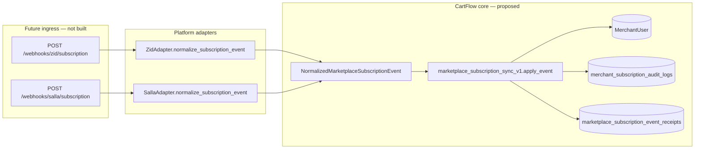
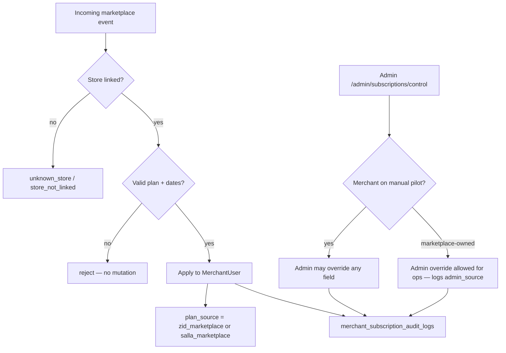

# CartFlow Marketplace Subscription Sync v1 — Zid/Salla Subscription Event Architecture Audit

**Date (UTC):** 2026-06-07  
**Phase:** Architecture audit only — **no implementation**  
**Commit message:** `marketplace subscription sync architecture audit`  
**Status:** Design reference for v1 implementation

**Builds on:**

- [cartflow_saas_foundation_phase1_marketplace_plan_system_audit_v1.md](cartflow_saas_foundation_phase1_marketplace_plan_system_audit_v1.md) — plan model, `plan_source`, event vocabulary stub
- [cartflow_saas_foundation_phase3_1_automatic_subscription_dates_audit_v1.md](cartflow_saas_foundation_phase3_1_automatic_subscription_dates_audit_v1.md) — `billing_interval`, automatic date helpers
- [cartflow_saas_foundation_phase3_trial_admin_subscription_control_audit_v1.md](cartflow_saas_foundation_phase3_trial_admin_subscription_control_audit_v1.md) — admin control + audit log
- [cartflow_packages_pricing_foundation_audit_v1.md](cartflow_packages_pricing_foundation_audit_v1.md) — Starter / Growth / Pro tiers

**Explicitly not in scope:** payment gateway, checkout, invoices, billing engine, auto-renewal, Moyasar/Stripe/HyperPay, merchant self-service upgrade UI, entitlement enforcement (remains off by default).

---

## Executive summary

CartFlow already stores subscription state on **`MerchantUser`** and exposes read-only subscription APIs to the merchant dashboard. Phase 3.1 added **`billing_interval`** and automatic date calculation helpers. **Marketplace Subscription Sync v1** defines how **Zid** and **Salla** marketplace webhooks (or push events) will update that same state — without a CartFlow billing engine.

**Design principle:** Marketplace is the **primary** subscription authority when `plan_source` is `zid_marketplace` or `salla_marketplace`. **Admin control** (`/admin/subscriptions/control`) remains a **fallback** for pilot merchants, ops corrections, and stores not yet linked to a marketplace subscription.

**Current code (today):**

| Component | Status |
|-----------|--------|
| `MerchantUser` subscription fields + `billing_interval` | Implemented |
| `merchant_billing_interval_v1.calculate_expires_at_from_interval()` | Implemented (architecture helper) |
| `merchant_subscription_v1.preview_marketplace_plan_event()` | Stub — validates 4 event types, no DB mutation |
| `MARKETPLACE_PLAN_EVENT_TYPES` | 4 types today — v1 extends to **6** (add `*_cancelled`) |
| Webhook routes / signature verification / mutation | **Not implemented** |

---

## Part A — Event types (canonical vocabulary)

Six marketplace subscription events — symmetric across platforms:

| Event type | Platform | Intended marketplace meaning |
|------------|----------|------------------------------|
| `zid_plan_activated` | Zid | Merchant installs/subscribes to CartFlow on Zid App Marketplace; first active entitlement period |
| `zid_plan_changed` | Zid | Upgrade, downgrade, interval change, renewal period update, or status transition (e.g. grace → active) |
| `zid_plan_cancelled` | Zid | Subscription cancelled or app uninstalled with billing termination |
| `salla_plan_activated` | Salla | First active Salla marketplace subscription |
| `salla_plan_changed` | Salla | Plan or billing period change on Salla |
| `salla_plan_cancelled` | Salla | Cancellation / uninstall on Salla |

**Naming rule:** `{platform}_plan_{activated|changed|cancelled}` where `platform ∈ {zid, salla}`.

**Implementation note:** Extend `MARKETPLACE_PLAN_EVENT_TYPES` in `merchant_subscription_v1.py` to include both `*_cancelled` types before wiring real handlers.



---

## Part B — Normalized event contract (adapter output)

Adapters translate raw Zid/Salla payloads into a **single normalized shape**. Core logic must not read raw marketplace JSON outside the adapter layer (consistent with `NormalizedPlatformEvent` pattern in `integrations/normalized_platform_event.py`).

### Proposed: `NormalizedMarketplaceSubscriptionEvent`

| Field | Required | Description |
|-------|----------|-------------|
| `event_type` | yes | One of the six canonical types |
| `platform` | yes | `zid` or `salla` |
| `external_store_id` | yes | Marketplace store identifier (maps to `Store.zid_store_id` for Zid; Salla store id field TBD at adapter time) |
| `marketplace_event_id` | yes | Platform-unique id for idempotency |
| `marketplace_subscription_id` | recommended | Stable subscription/install id across renewals |
| `plan` | yes* | Marketplace plan slug or sku → mapped via `normalize_plan_id()` |
| `billing_interval` | recommended | `trial` \| `monthly` \| `annual` \| `manual_custom` |
| `started_at` | recommended | ISO-8601 UTC period start |
| `expires_at` | optional | ISO-8601 UTC period end; if absent, CartFlow calculates |
| `status_hint` | optional | `active` \| `trialing` \| `expired` \| `cancelled` — used when event type alone is ambiguous |
| `event_time` | recommended | When the marketplace recorded the event |
| `raw_payload` | internal | Preserved for ops/debug only |

\*Required for `*_activated` and `*_changed`; optional for `*_cancelled` (cancel may not include next plan).

### Example normalized payload (Zid activation)

```json
{
  "event_type": "zid_plan_activated",
  "platform": "zid",
  "external_store_id": "884422",
  "marketplace_event_id": "evt_zid_abc123",
  "marketplace_subscription_id": "sub_zid_xyz789",
  "plan": "growth",
  "billing_interval": "monthly",
  "started_at": "2026-06-07T10:00:00Z",
  "expires_at": null,
  "status_hint": "active",
  "event_time": "2026-06-07T10:00:05Z"
}
```

---

## Part C — Store → merchant resolution

Subscription state lives on **`MerchantUser`**, not `Store`. Resolution chain:

1. Lookup **`Store`** by platform external id:
   - **Zid:** `Store.zid_store_id == external_store_id`
   - **Salla:** dedicated column or normalized slug (to be added at integration time; audit assumes same pattern as Zid)
2. Read **`Store.merchant_user_id`** → **`MerchantUser`**
3. If store exists but `merchant_user_id` is null → **failure: `store_not_linked`** (see Part H)
4. If no store row → **failure: `unknown_store`**

**OAuth / onboarding alignment:** Marketplace activation may arrive **before** the merchant completes CartFlow signup. v1 policy:

| Scenario | v1 behavior |
|----------|-------------|
| Known store + linked merchant | Apply event |
| Known store, no merchant | Queue or dead-letter; ops links store later (no silent create of MerchantUser in v1) |
| Unknown store | Reject + log; optional ops alert |

Admin fallback: ops can assign plan manually until marketplace linkage is complete.

---

## Part D — Field mapping (event → `MerchantUser`)

Target columns (existing — no new subscription columns required for v1):

| CartFlow field | Source |
|----------------|--------|
| `current_plan` | `normalize_plan_id(payload.plan)` — must be `starter` \| `growth` \| `pro` |
| `plan_status` | Derived from event type + optional `status_hint` (see table below) |
| `plan_source` | `zid_marketplace` or `salla_marketplace` via `marketplace_plan_event_source_for_type()` |
| `billing_interval` | `normalize_billing_interval(payload.billing_interval)` |
| `plan_started_at` | `started_at` or `event_time` or `now()` |
| `plan_expires_at` | `expires_at` if present; else `calculate_expires_at_from_interval()` for `monthly`/`annual` |
| `trial_started_at` | Set only when `billing_interval == trial` via `apply_trial_dates()` |
| `trial_expires_at` | Same as above |

### Event type → default `plan_status`

| Event type | Default `plan_status` | Trial fields |
|------------|----------------------|--------------|
| `*_activated` | `trialing` if interval=`trial`, else `active` | Set/clear per interval |
| `*_changed` | From `status_hint`, else `active` (or `trialing` if interval=`trial`) | Update per interval |
| `*_cancelled` | `cancelled` | Clear `trial_*`; retain `plan_expires_at` for audit context optional |

### `plan_status` from `status_hint` (override)

| `status_hint` | `plan_status` |
|---------------|---------------|
| `active` | `active` |
| `trialing` | `trialing` |
| `expired` | `expired` |
| `cancelled` | `cancelled` |

### Date calculation when `expires_at` is missing

Reuse **`services/merchant_billing_interval_v1.py`** (Phase 3.1):

```python
# Pseudocode — not implemented
if billing_interval == "trial":
    dates = apply_trial_dates(started_at=started)
    user.trial_started_at = dates["trial_started_at"]
    user.trial_expires_at = dates["trial_expires_at"]
    user.plan_expires_at = None
elif billing_interval in ("monthly", "annual"):
    dates = apply_active_plan_dates(
        billing_interval=billing_interval,
        started_at=started,
        plan_expires_at=None,
    )
    user.plan_started_at = dates["plan_started_at"]
    user.plan_expires_at = dates["plan_expires_at"]
    user.trial_started_at = None
    user.trial_expires_at = None
elif expires_at provided:
    user.plan_expires_at = expires_at
    user.billing_interval = "manual_custom"
```

If **`billing_interval` is missing** and **`expires_at` is missing** → see failure case **missing_interval** (Part H).

### Plan slug mapping (marketplace → CartFlow)

Marketplace listings will expose plan identifiers that adapters normalize before core sync:

| Marketplace slug examples (illustrative) | CartFlow `current_plan` |
|------------------------------------------|-------------------------|
| `cartflow-starter`, `starter`, `basic` | `starter` |
| `cartflow-growth`, `growth` | `growth` |
| `cartflow-pro`, `pro` | `pro` |

**Single mapping table** per platform in adapter config (not hardcoded in core). Unknown slugs → **failure: `unknown_plan`** — do not mutate subscription.

---

## Part E — Authority model: marketplace primary, admin fallback



| `plan_source` before event | Marketplace event | Result |
|----------------------------|-------------------|--------|
| `manual` | `*_activated` | Switch to marketplace source; marketplace becomes primary |
| `zid_marketplace` | `zid_plan_*` | Marketplace updates state |
| `zid_marketplace` | `salla_plan_*` | Reject — platform mismatch (`wrong_platform_source`) |
| `manual` | Admin action | Admin remains primary (unchanged Phase 3 behavior) |
| `zid_marketplace` | Admin action | Admin **fallback** — allowed with mandatory reason; does not disable future marketplace events |

**No automatic reversion:** A later marketplace `*_changed` event can overwrite an admin adjustment when the store remains marketplace-billed.

**Enforcement:** `CARTFLOW_PLAN_ENTITLEMENTS_ENFORCE` stays **off by default**. Marketplace sync v1 only updates subscription **state**; it does not enable feature blocking.

---

## Part F — Audit log behavior

Reuse existing table **`merchant_subscription_audit_logs`** (Phase 3 / 3.1). Marketplace apply uses the same append-only pattern as admin actions.

| Audit column | Marketplace value |
|--------------|-------------------|
| `action` | Canonical event type (e.g. `zid_plan_changed`) or internal `marketplace_subscription_apply` |
| `admin_source` | `zid_webhook`, `salla_webhook`, or `marketplace_replay` |
| `reason` | `marketplace_event_id={id}; subscription_id={sub}; result=applied\|rejected\|duplicate` |
| `old_*` / `new_*` | Snapshot before/after: plan, status, billing_interval, plan/trial dates |
| `merchant_user_id` | Resolved merchant |
| `store_id` | Resolved store |
| `created_at` | Processing time (UTC) |

**Additional table (recommended for v1 implementation):** `marketplace_subscription_event_receipts`

| Column | Purpose |
|--------|---------|
| `marketplace_event_id` | Unique — idempotency |
| `event_type`, `platform`, `store_id` | Index for ops queries |
| `processing_result` | `applied`, `duplicate`, `rejected` |
| `reject_reason` | e.g. `unknown_store` |
| `audit_log_id` | FK to audit row when applied |
| `raw_payload_hash` | Optional integrity check |

Every marketplace ingress attempt gets a receipt row — including failures — so ops can reconcile without mutating `MerchantUser`.

---

## Part G — Proposed service surface (implementation v1 — not built)

| Module | Responsibility |
|--------|----------------|
| `services/marketplace_subscription_sync_v1.py` | `apply_marketplace_subscription_event()`, idempotency, mapping, audit |
| `integrations/adapters/zid.py` | `normalize_subscription_event()`, signature verify |
| `integrations/adapters/salla.py` | Same for Salla |
| `routes/marketplace_webhooks.py` (or extend `admin_operations` / `main`) | HTTP ingress, 2xx on duplicate idempotent success |

**Public core entry (proposed):**

```python
def apply_marketplace_subscription_event(
    event: NormalizedMarketplaceSubscriptionEvent,
    *,
    ingress_source: str = "zid_webhook",
) -> MarketplaceSubscriptionSyncResult:
    ...
```

**Result shape:** `ok`, `applied`, `duplicate`, `reject_reason`, `merchant_user_id`, `audit_log_id`.

---

## Part H — Failure cases

| Failure | Detection | DB mutation | HTTP / ops response |
|---------|-----------|-------------|---------------------|
| **Unknown store** | No `Store` for `external_store_id` | None | Log + receipt `rejected`; return 404 or 422 (platform retry policy TBD) |
| **Store not linked** | Store exists, `merchant_user_id` null | None | Receipt `rejected`; ops links merchant or uses admin fallback |
| **Unknown plan** | `normalize_plan_id()` not in `CANONICAL_PLAN_IDS` | None | Receipt `rejected`; alert ops — mapping table may need update |
| **Missing interval** | No `billing_interval` and no `expires_at` on activate/change | None | Receipt `rejected`; marketplace should resend with interval or expiry |
| **Missing interval (lenient path — optional)** | Same, but event includes `expires_at` | Apply with `billing_interval=manual_custom` | Document as **explicit ops-config flag**, default **strict reject** in v1 |
| **Duplicate event** | `marketplace_event_id` already in receipts with `applied` or `duplicate` | None | Return **200 OK** idempotent; audit optional skip |
| **Expired subscription** | `status_hint=expired` or `*_changed` with past `expires_at` | Set `plan_status=expired`; keep dates for display | Applied; merchant dashboard shows expired |
| **Cancelled subscription** | `*_cancelled` or `status_hint=cancelled` | Set `plan_status=cancelled`; clear trial dates | Applied |
| **Wrong platform** | e.g. Salla event for `zid_marketplace` merchant | None | Reject — prevents cross-platform hijack |
| **Invalid signature** | Adapter `verify_signature()` false | None | 401 — no receipt with merchant mutation |
| **Stale event** | `event_time` older than last applied subscription revision (optional v1.1) | None or no-op | Log `stale_event_ignored` |

**Entitlements:** Failures never enable enforcement. Successful `expired` / `cancelled` only affect features when ops sets `CARTFLOW_PLAN_ENTITLEMENTS_ENFORCE=1`.

---

## Part I — Merchant dashboard reflection

No UI changes required for v1 architecture — existing surfaces already read `GET /api/merchant/subscription`:

| Dashboard field | After marketplace sync |
|-----------------|-------------------------|
| Current plan | `current_plan_label_ar` |
| Status | `plan_status_label_ar` |
| Source | `Zid` / `Salla` via `plan_source_label_ar` |
| Billing interval | `billing_interval_label_ar` (Phase 3.1) |
| Trial ends | Shown when interval=`trial` or status=`trialing` |
| Plan expires | Shown when interval=`monthly`/`annual`/`manual_custom` |

---

## Part J — Security and ingress (design only)

| Requirement | v1 design |
|-------------|-----------|
| Signature verification | Per-platform secret in env; adapter validates before normalize |
| Idempotency | `marketplace_event_id` unique constraint |
| PII | Store ids only; no payment card data in subscription events |
| Rate limiting | Per-IP + per-store throttle on webhook routes |
| Replay | Receipt table prevents double-apply |

---

## Part K — Regression safety

Marketplace sync v1 implementation must **not** break:

| Area | Constraint |
|------|------------|
| Widget / recovery / VIP / WhatsApp | No subscription checks added in send paths by default |
| Admin subscription control | Remains available as fallback |
| Signup defaults | New merchants still `starter` / `manual` / `active` |
| Phase 3.1 date helpers | Reused, not duplicated |
| Existing tests | Phase 1–3.1 SaaS tests remain green |

---

## Part L — Implementation checklist (future — not this task)

| Step | Deliverable |
|------|-------------|
| 1 | Add `zid_plan_cancelled`, `salla_plan_cancelled` to `MARKETPLACE_PLAN_EVENT_TYPES` |
| 2 | Define `NormalizedMarketplaceSubscriptionEvent` dataclass |
| 3 | Implement `marketplace_subscription_sync_v1.apply_marketplace_subscription_event()` |
| 4 | Create `marketplace_subscription_event_receipts` table |
| 5 | Zid webhook route + adapter normalization + plan slug map |
| 6 | Salla webhook route + adapter normalization |
| 7 | Tests: happy path, unknown store, unknown plan, missing interval, duplicate, cancelled |
| 8 | Ops runbook: dead-letter review, admin fallback procedure |

---

## Part M — Related artifacts

| Artifact | Path |
|----------|------|
| Plan registry | `services/cartflow_plans_v1.py` |
| Billing interval + date helpers | `services/merchant_billing_interval_v1.py` |
| Subscription read model | `services/merchant_subscription_v1.py` |
| Admin control + audit | `services/admin_subscription_control_v1.py` |
| Store linkage | `models.Store.zid_store_id`, `Store.merchant_user_id` |
| Zid adapter scaffold | `integrations/adapters/zid.py` |
| Salla adapter scaffold | `integrations/adapters/salla.py` |
| This audit | `docs/cartflow_marketplace_subscription_sync_v1_audit.md` |

---

**End of audit — architecture only, no webhook or mutation code in this deliverable.**
