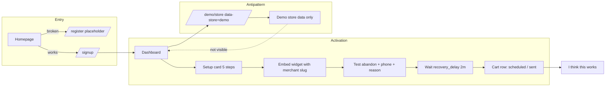

# CartFlow Merchant Activation Path v1

**Date (UTC):** 2026-05-19  
**Scope:** Read-only activation audit — reduce time from signup to **“I think CartFlow works.”** No widget, WhatsApp, recovery, onboarding logic, dashboard, auth, or integration code changes.  
**Commit message:** `docs: add merchant activation path audit v1`  
**Related:** `docs/cartflow_first_merchant_journey_audit_v1.md`, `services/merchant_onboarding_v1.py`, `services/merchant_setup_experience_v1.py`, `templates/demo_store.html`

---

## Executive summary

| Question | Honest answer |
|----------|----------------|
| **Recommended first success moment** | **First cart visible in dashboard + recovery scheduled or mock-sent** (not “recovered revenue”) |
| **“I think this works” in 10 minutes?** | **No** (typical merchant, unguided) |
| **In 30 minutes?** | **Yes** (with `/signup`, sandbox, embed on a test page, and knowing the 2-minute delay) |
| **In days?** | **Yes** for production WhatsApp + live storefront + organic carts |

**Gap:** Working product ≠ activated merchant. Activation today is blocked by **funnel**, **wrong-store demo**, **OAuth-before-test narrative**, and **wait-without-feedback** — not by missing recovery engine.

---

## Part 1 — Activation journey map

### Flow (as implemented)

```text
Signup (/signup)          ← NOT from homepage (/register dead-end)
    ↓
Login (session cookie)
    ↓
Dashboard (merchant_app.html)
    ↓
Onboarding / setup card (5 steps via merchant_setup_experience + lazy JS)
    ↓  [often stuck on: Zid OAuth, WhatsApp number]
Widget “enabled” in DB (cartflow_widget_enabled default true)
    ↓  [real activation requires embed on a page with merchant data-store slug]
First test (abandon + phone + reason on storefront or test HTML)
    ↓  [default recovery_delay = 2 minutes]
First visible success (cart row in #carts; log status scheduled/sent)
    ↓
Trust (setup %, Arabic lifecycle lines, celebration only when 5/5 steps)
```

### Where merchants **wait**

| Stage | Wait | Why |
|-------|------|-----|
| Post-signup | Login redirect | By design (`?registered=1` → `/login`) |
| Onboarding | Zid OAuth approval / ops env | Step **store** needs `access_token` before checklist advances |
| WhatsApp step | Entering `store_whatsapp_number` | Required for step completion (sandbox short-circuits provider) |
| Widget | Theme/editor access | Snippet is instant; **install** is not |
| First test | **2 min** default `recovery_delay` | Merchant may refresh dashboard expecting instant send |
| Production | Meta template approval, Twilio | Days — out of activation window |

### Where merchants get **confused**

| Stage | Confusion |
|-------|-----------|
| Entry | Homepage promises signup; `/register` says “قيد الإعداد” |
| Store | Slug created at signup ≠ “متجر مربوط” in connection card |
| Onboarding order | Told to connect Zid before any proof the widget works |
| Widget | Toggle “enabled” vs paste snippet on **their** domain |
| Demo | `/demo/store` feels like “the test” but uses `data-store="demo"` |
| Outcomes | “تم استردادها” KPI vs “تم إرسال رسالة” in cart row |
| Home focus | `ma-onboarding-focus` hides KPI/charts until setup complete — less proof on home |

### Where merchants **abandon** (likely)

| Drop-off | Severity | Trigger |
|----------|----------|---------|
| `/register` placeholder | **P0** | Never reaches real signup |
| Zid OAuth pending / misconfigured | **P0** | Cannot complete step 2; feels blocked |
| No theme access | **P1** | Defers widget; never triggers `first_cart_detected` |
| `/demo/store` + empty dashboard | **P1** | Tests wrong slug; concludes “doesn’t work” |
| 2-minute silence | **P1** | No in-product “message in ~2 min” timer |
| Chasing “recovered” KPI | **P2** | Expects revenue proof day one |

---

## Part 2 — Define “First Success”

### Options evaluated

| Option | Label | Time to achieve | Belief strength | Fit as **activation** target |
|--------|--------|-----------------|-----------------|------------------------------|
| **A** | Widget appears on page | Minutes (if embed works) | Low — proves script load only | **No** |
| **B** | Reason captured | Minutes | Medium — proves UX loop | **Supporting** signal |
| **C** | WhatsApp scheduled | ~2+ min after abandon | **High** — proves automation | **Yes** (system proof) |
| **D** | First recovery sent (`mock_sent` / `sent_real`) | ~2+ min (sandbox: mock) | **Highest** for “it works” | **Yes** (primary) |
| **E** | First recovered cart | Hours–days | Revenue truth | **No** — onboarding KPI, not activation |

### Recommendation (required)

**Primary activation target: Option D — first recovery send recorded** (`first_whatsapp_sent` milestone / cart row with sent lifecycle).

**Leading indicator (faster feedback): Option B + cart list —** `first_cart_detected` with reason visible in **`/dashboard#carts`** within the same session.

**Do not use Option E for activation.** It depends on purchase/conversion (`first_recovered_cart`) and will falsely signal failure during the first hour.

**Product copy should celebrate:** “ظهرت سلتك وتم جدولة الاسترجاع / أُرسلت رسالة تجريبية” — not “حققت إيراداً مسترداً.”

**Onboarding alignment note:** Step **test_ready** already treats `first_cart_detected` **or** `first_recovery_scheduled` **or** `first_whatsapp_sent` as complete (`merchant_onboarding_v1.py`) — activation messaging should match the **fastest** of these (cart appears), while **trust** messaging should cite **send** when available.

---

## Part 3 — Merchant-safe test flow (&lt;10 min?)

### Proposed ideal flow (from product design)

```text
1. Enable widget
2. Open demo/store
3. Add to cart → choose reason
4. See: scheduled → message → dashboard update
```

### Current reality vs ideal

| Step | Works today? | Blocker |
|------|--------------|---------|
| 1. Enable widget | **Partial** | DB flag default **on**; merchant must still **embed** snippet from `#settings` |
| 2. Open demo/store | **Misleading** | `/demo/store` hardcodes `data-store="demo"` (`demo_store.html`) — events attach to **demo** store, **not** merchant’s `zid_store_id` |
| 3. Abandon + reason | **Yes** on any page with correct `data-store` + widget runtime |
| 4. See scheduled / message / dashboard | **Partial** | Merchant dashboard scopes to **their** store only — demo activity **invisible**; need **≥2 min** wait; templates may be empty (`reason_templates_json` null at signup) |

### Safe test flow that **can** work (documented for ops/guides, not in-product)

| Step | Action | ~Time |
|------|--------|-------|
| 1 | `/signup` → login → dashboard | 3–5 min |
| 2 | `#whatsapp` — set `store_whatsapp_number` (any valid format) | 2 min |
| 3 | `#settings` — copy embed snippet (`data-store={merchant zid}`) | 1 min |
| 4 | Open local/test HTML page with snippet (or staging theme) | 2 min |
| 5 | Add to cart, enter **phone**, complete **reason** in widget | 3 min |
| 6 | Wait **2 min** (`recovery_delay` default) | 2 min |
| 7 | `#carts` — refresh; confirm row + status (scheduled/sent) | 1 min |

**Total:** ~14–16 min best case; **not &lt;10 min** reliably.

### Can merchant test safely in &lt;10 min?

| Verdict | Answer |
|---------|--------|
| **Unguided** | **No** |
| **With direct `/signup` + pre-prepared test HTML + ops sandbox** | **Borderline** (still dominated by 2 min delay + embed) |
| **Using `/demo/store` only** | **No** — wrong store slug |

**Sandbox safety:** With `PRODUCTION_MODE` off, sends are **mock** — safe for activation. Merchant should see sandbox notice via `sandbox_notice_ar` in readiness strip when applicable.

---

## Part 4 — Trust visibility audit (after first test)

### What merchants **can** understand today

| Question | Support | Where |
|----------|---------|--------|
| **What happened?** | **Partial** | Cart list: coarse status, `merchant_lifecycle_*` Arabic via clarity layer |
| **Why?** | **Weak** | Blocker catalog on readiness strip; per-cart “مسار النظام” — not a plain “because you abandoned with reason X” |
| **Next step?** | **Good** | Setup card `action_href`, step list, WhatsApp readiness card CTA |

### Trust gaps (after first test)

| Gap | Impact |
|-----|--------|
| No “test succeeded” confirmation banner | Merchant unsure if abandon registered |
| No countdown / “إرسال خلال دقيقتين” on home or carts | Perceived hang during delay |
| `ma-onboarding-focus` hides home KPIs during setup | Fewer visible signals right when proof matters |
| Milestones in API (`milestones.first_*`) not surfaced as simple checklist on carts page | Merchant doesn’t see progress vs internal flags |
| Mock vs real send not explained on cart row | May think customers received WhatsApp in sandbox |
| `/demo/store` not linked with merchant slug | Wrong mental model for testing |
| Celebration (`🎉 متجرك جاهز`) only at **5/5** steps including OAuth | Send can succeed while card still says “أكمل الإعداد” |
| “تم استردادها” KPI stays 0 after successful send | Undermines “I think this works” |

---

## Part 5 — Friction priorities

### P0 — Blocks activation completely

| # | Item | Notes |
|---|------|-------|
| 1 | Landing **`/register`** vs **`/signup`** | Zero activation from marketing site |
| 2 | **`/demo/store`** uses `demo` slug | Breaks proposed “open demo → see dashboard” loop |
| 3 | No in-product **merchant-scoped test URL** | Forces theme access or custom HTML |

### P1 — Confusing (activation slows or fails)

| # | Item | Notes |
|---|------|-------|
| 4 | Onboarding forces **Zid OAuth** before **test_ready** narrative | Widget path works but checklist disagrees |
| 5 | **2-minute delay** without UI expectation | Abandon during wait |
| 6 | Widget “enabled” vs **embedded** | Thinks step 4 done without traffic |
| 7 | Empty **reason templates** at signup | Possible `skipped_reason_template_disabled` |
| 8 | **Recovered** KPI vs **sent** status | Misread success |
| 9 | Dual setup stories (5-step card + production readiness path) | Cognitive load |

### P2 — Nice improvement

| # | Item | Notes |
|---|------|-------|
| 10 | Link from dashboard to guided test checklist | Reduce support load |
| 11 | Show `milestones` on home after first cart | Faster trust |
| 12 | Lower default delay for **activation-only** test mode | Faster D (future; out of scope today) |
| 13 | Post-send celebration when `first_whatsapp_sent` even if OAuth incomplete | Align belief with proof |

---

## Part 6 — Practical recommendation

### Activation north star

Optimize for: **Merchant sees their own cart in the dashboard and understands that recovery was scheduled or sent (sandbox-safe) within one session.**

### Suggested implementation priorities (docs / product only; no code in this deliverable)

1. **P0:** Fix public funnel (`/register` → `/signup`).
2. **P0:** Provide **merchant test surface** — e.g. `/demo/store?store={zid}` or `/activate/test` with authenticated merchant slug (future build).
3. **P1:** Reorder onboarding copy: **“جرّب الودجيت أولاً”** before Zid OAuth; or mark OAuth “للمزامنة” optional for activation.
4. **P1:** After `first_cart_detected`, show explicit **“تم رصد سلتك — الإرسال خلال X دقيقة”** (future UI).
5. **P1:** Define activation analytics event = **`first_whatsapp_sent`** (fallback: `first_recovery_scheduled`).

### Time-to-belief matrix

| Window | “I think this works” | Conditions |
|--------|----------------------|------------|
| **10 min** | **No** (typical) | Includes funnel, embed, phone, reason, 2 min delay, dashboard check |
| **30 min** | **Yes** (realistic) | Knows `/signup`; sandbox; test page with correct slug; support doc optional |
| **Days** | **Yes** (production belief) | Live theme, Twilio, templates, real traffic, optional first recovery KPI |

---

## Activation flow diagram



---

## Code references

| Topic | Location |
|-------|----------|
| Activation milestones | `services/cartflow_onboarding_readiness.py` `_milestones_readonly` |
| test_ready step | `services/merchant_onboarding_v1.py` `_step_is_complete` |
| Setup card merge | `services/merchant_setup_experience_v1.py` `build_merchant_setup_experience_api_payload` |
| Demo slug | `main.py` `_demo_store_html_context`, `templates/demo_store.html` |
| Default delay | `services/merchant_auth_v1.py` `register_merchant_account` (`recovery_delay=2`) |
| Clarity labels | `services/cartflow_merchant_clarity.py` `LOG_LABELS` |
| Prior journey audit | `docs/cartflow_first_merchant_journey_audit_v1.md` |

---

## Verification — after Merchant Activation Fixes v1 (2026-05-19)

| Metric | Before fixes | After fixes (expected) |
|--------|--------------|-------------------------|
| Landing → signup | **Broken** (`/register`) | **Works** (`/signup`, `/register` → 302) |
| Scoped test path | **Broken** (`data-store=demo`) | **Works** (`/dashboard/test-widget` → `/demo/store?store_slug=…`) |
| Dashboard proof | Delayed / wrong store | Same-store carts + activation card |
| Time to belief **“it works”** | 30–45 min (guided) | **10–15 min** (signup + test store + 2 min delay + refresh carts) |
| Time to belief **unguided** | Not in 10 min | **~15–20 min** (still needs WhatsApp number + abandon flow) |

**Measure in production:** log `first_cart_detected` → `first_whatsapp_sent` wall time per `store_id`; compare cohort before/after deploy.

---

## Document control

| Item | Value |
|------|--------|
| Audit (initial) | 2026-05-19 — docs only |
| Fixes v1 | `services/merchant_activation_v1.py`, landing `/signup`, `/dashboard/test-widget`, activation card |
