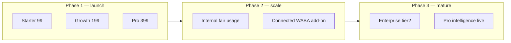

# CartFlow Packages & Pricing Foundation Audit v1

**Date (UTC):** 2026-06-07  
**Phase:** Product packaging and pricing audit only — **no billing, no payment gateways, no subscription logic, no code changes**  
**Commit message:** `cartflow packages pricing foundation audit`  
**Status:** Definitive commercial packaging reference before billing implementation

**Builds on:** [SYSTEM_SUMMARY.md](SYSTEM_SUMMARY.md), [cartflow_whatsapp_production_reality_phase1_architecture_audit_v1.md](cartflow_whatsapp_production_reality_phase1_architecture_audit_v1.md), [cartflow_whatsapp_template_library_foundation_audit_v1.md](cartflow_whatsapp_template_library_foundation_audit_v1.md), [merchant_production_readiness_path_v1.md](merchant_production_readiness_path_v1.md)

**Explicitly out of scope:** Stripe, Moyasar, checkout, pricing page code, subscription enforcement, feature flags in application code.

---

## Executive summary

CartFlow has finalized a **three-tier, feature-based SaaS packaging model** priced in **SAR** with monthly and annual billing cycles. The structure aligns well with the **actual product surface** already built (widget → reason capture → WhatsApp recovery → dashboard lifecycle) and creates a credible **Growth** anchor tier for VIP and multi-message capabilities that exist in code today.

**Verdict:** The package ladder is **strategically sound for Zid/Salla SMB merchants** with clear upgrade hooks. The working price points are **market-plausible** but carry **margin risk** on Starter/Growth if CartFlow continues to bear managed WhatsApp sender costs (Phase 1 Model C). **Pro** is correctly positioned as a future-intelligence tier but is **under-specified for near-term conversion** until concrete Pro-only capabilities ship.

**Overall recommendation:** **Approve structure and working prices for foundation** with documented guardrails (internal fair usage, Starter single-message clarity, Pro roadmap commitments) before any billing build.

---

## Part A — Approved package reference (frozen input)

### A.1 Pricing model

| Dimension | Decision |
|-----------|----------|
| Billing cycles | Monthly + Annual |
| Pricing type | **Feature-based** — no message quotas, no recovery quotas, no visible usage limits |
| Fair usage | May exist **internally** for cost/abuse protection — **not marketed** |
| Currency | SAR (Saudi Riyal) |

### A.2 Price table (working version)

| Package | Monthly | Annual | Effective monthly (annual) | Annual discount |
|---------|---------|--------|---------------------------|-----------------|
| **Starter** | 99 SAR | 990 SAR | ~82.5 SAR | ~17% (2 months free) |
| **Growth** (Most Popular) | 199 SAR | 1,990 SAR | ~165.8 SAR | ~17% |
| **Pro** | 399 SAR | 3,990 SAR | ~332.5 SAR | ~17% |

**Price ladder ratios:** Starter : Growth : Pro = **1 : 2.01 : 4.03** (monthly). Clean doubling pattern aids comprehension.

### A.3 Feature matrix

| Capability | Starter | Growth | Pro |
|------------|:-------:|:------:|:---:|
| Widget | ✓ | ✓ | ✓ |
| Reason Capture | ✓ | ✓ | ✓ |
| WhatsApp Recovery | ✓ | ✓ | ✓ |
| Dashboard | ✓ | ✓ | ✓ |
| Recovery Timeline | ✓ | ✓ | ✓ |
| Basic Analytics | ✓ | ✓ | ✓ |
| Default Templates | ✓ | ✓ | ✓ |
| Recommended Timing | ✓ | ✓ | ✓ |
| Mobile-First Experience | ✓ | ✓ | ✓ |
| VIP Detection | — | ✓ | ✓ |
| VIP Alerts | — | ✓ | ✓ |
| Multi Message | — | ✓ | ✓ |
| Per-Reason Templates | — | ✓ | ✓ |
| Per-Reason Timing | — | ✓ | ✓ |
| Advanced Analytics | — | ✓ | ✓ |
| Recovery Insights | — | ✓ | ✓ |
| Merchant Controls | — | ✓ | ✓ |
| Advanced Message Logic | — | — | ✓ |
| Advanced Recovery Controls | — | — | ✓ |
| Operational Insights | — | — | ✓ |
| Early Access Features | — | — | ✓ |
| Future Product Intelligence | — | — | ✓ |
| Future Offer Intelligence | — | — | ✓ |
| Future Operational Intelligence | — | — | ✓ |
| **Support** | Standard | Priority | Highest Priority |

---

## Part B — Product-to-package mapping (validation)

Maps approved marketing features to **existing CartFlow capabilities** (read-only validation — no gating implemented).

| Marketing feature | Product reality today | Natural tier |
|-------------------|----------------------|--------------|
| Widget | V2 layered widget (`cartflow_widget_runtime/*`) | Starter |
| Reason Capture | `POST /api/cartflow/reason`, widget flows | Starter |
| WhatsApp Recovery | `send_whatsapp()`, recovery schedule, templates | Starter |
| Dashboard | `/dashboard/*`, normal-carts, lifecycle | Starter |
| Recovery Timeline | `CartRecoveryLog`, lifecycle states, attempt display | Starter |
| Basic Analytics | `GET /api/cartflow/analytics`, dashboard KPIs | Starter |
| Default Templates | `recovery_message_templates.py`, store defaults | Starter |
| Recommended Timing | `trigger_template_ui_defaults`, global delay settings | Starter |
| Mobile-First Experience | RTL dashboard, lazy mobile UX | Starter (all tiers) |
| VIP Detection | `is_vip_cart`, `vip_cart_threshold` | **Growth** |
| VIP Alerts | `vip_merchant_alert.py`, merchant WhatsApp alert | **Growth** |
| Multi Message | `recovery_multi_message.py`, slot scheduling | **Growth** |
| Per-Reason Templates | `reason_templates_json`, per-reason enable/text | **Growth** |
| Per-Reason Timing | `get_recovery_delay(reason_tag)` | **Growth** |
| Advanced Analytics | Deeper dashboard/ops signals (partial today) | Growth |
| Recovery Insights | Reason funnel, recovery outcome views (emerging) | Growth |
| Merchant Controls | Recovery settings, template toggles, VIP prefs | Growth |
| Advanced Message Logic | Continuation engine, purchase-truth blocks (partial) | **Pro (future gate)** |
| Advanced Recovery Controls | Archive, lifecycle overrides, ops controls | **Pro (future gate)** |
| Operational Insights | Admin/merchant ops cards | **Pro (future gate)** |
| Future * Intelligence | Not shipped | **Pro (placeholder)** |

**Validation result:** Growth-tier features correspond to **differentiated, high-value code paths** already in production. Starter tier correctly excludes VIP lane and multi-slot recovery — the two strongest operational differentiators. **No major feature is misplaced** relative to merchant perceived value.

**Gap:** Today all features are **available without package enforcement**. This audit defines commercial intent only; billing phase must add entitlement checks without changing recovery/widget behavior prematurely.

---

## Part C — Audit findings (10 review areas)

### C.1 Package differentiation

**Assessment:** **Strong**

| Strength | Detail |
|----------|--------|
| Clear core vs premium split | Starter = complete recovery loop; Growth = optimization + high-value carts |
| VIP as Growth gate | Aligns with merchant psychology — high AOV stores self-select into Growth |
| Multi-message as Growth gate | Second/follow-up messages are tangible upgrade value |
| Pro as innovation tier | Avoids cluttering Growth with unreleased AI/intelligence promises |

| Weakness | Detail |
|----------|--------|
| Starter "WhatsApp Recovery" breadth | Must clarify **single-message / default timing** vs Growth multi-message — otherwise Starter feels identical post-setup |
| "Default Templates" vs "Per-Reason Templates" | Naming overlap may confuse; Starter should explicitly mean **CartFlow-approved defaults, limited customization** |
| Pro differentiation today | Most Pro bullets are **future** — Pro is a **commitment tier**, not a current feature bundle |

**Risk:** Merchants on Starter who discover VIP/multi-message in UI (pre-gating) may feel misled. **Mitigation:** Entitlement UX before public pricing page.

---

### C.2 Upgrade incentives

**Assessment:** **Strong for Starter → Growth; Moderate for Growth → Pro**

| Upgrade path | Primary hook | Strength |
|--------------|--------------|----------|
| Starter → Growth | VIP alerts on high-value abandons + multi-message recovery + per-reason control | **High** — direct revenue impact for stores with AOV ≥ ~500–1000 SAR |
| Starter → Growth | Priority support | Moderate — matters after first production incident |
| Growth → Pro | Early access + future intelligence | **Low near-term** until Pro features ship |
| Any → Annual | ~17% savings | Standard; should be marketed as «شهرين مجاناً» |

**Recommended adjustment:** Publish a **single-sentence upgrade trigger** on Growth marketing: *«عندما تتجاوز قيمة السلة VIP أو تحتاج أكثر من رسالة متابعة — Growth»*. Makes the 2× price jump legible.

---

### C.3 Growth package attractiveness ("Most Popular")

**Assessment:** **Strong positioning**

Growth at **199 SAR/month** sits in the **psychological sweet spot** for Saudi SMB e-commerce:

- Below typical «serious tool» threshold (~300+ SAR) while signaling professionalism
- **2× Starter** feels intentional, not arbitrary
- Bundles the **two most differentiated CartFlow capabilities** (VIP + multi-message) that competitors often lack or charge add-ons for
- "Most Popular" badge is credible if target ICP is **active Zid/Salla stores with regular abandon volume**, not micro-stores testing widgets

| Risk | Mitigation |
|------|------------|
| Growth becomes default trial tier | Offer Starter trial or limited Starter onboarding — preserve upsell path |
| Stores without high AOV never use VIP | Emphasize multi-message + per-reason timing as Growth value even without VIP threshold |

---

### C.4 Feature placement

**Assessment:** **Approved with minor clarifications**

| Decision | Rationale |
|----------|-----------|
| VIP in Growth, not Starter | VIP is operational complexity + merchant alert cost; wrong for smallest merchants |
| Multi-message in Growth | Strong monetization of recovery depth without blocking basic recovery |
| Per-reason templates/timing in Growth | Matches `reason_templates_json` + `get_recovery_delay` — natural premium |
| Basic analytics in Starter | Needed to prove ROI; gating entirely would hurt activation |
| Pro intelligence features isolated | Prevents over-promising in Growth; preserves upsell narrative |

**Recommended adjustments:**

1. **Starter:** Explicitly document «**رسالة متابعة واحدة افتراضية**» (single default recovery message path).
2. **Growth:** Rename internally to «**Full Recovery Control**» in sales collateral — clearer than feature list alone.
3. **Pro:** Add **one near-term concrete feature** at launch (e.g. «Operational Insights dashboard v1» or «Advanced recovery pause rules») so Pro is sellable before AI roadmap lands.

---

### C.5 Future scalability

**Assessment:** **Good structural foundation**

| Scalable element | Why it works |
|------------------|--------------|
| Feature-based tiers | Add capabilities without renegotiating quotas |
| No visible usage limits | Avoids bill shock; simplifies Arabic marketing |
| Pro as intelligence bucket | Room for AI/offer/ops modules without new tier explosion |
| Three tiers only | Reduces choice paralysis vs 4–5 tier grids common in app marketplaces |

| Scalability risk | Detail |
|------------------|--------|
| No usage dimension | At scale, **10× message volume** stores cost same as 1× — margin compression |
| Future tier pressure | Enterprise merchants may demand **Model A connected WABA** (Phase 2 WhatsApp) as separate add-on or Enterprise tier |
| Salla + Zid parity | Package must stay **platform-agnostic** in copy; connection mechanics differ |

**Recommended adjustment:** Reserve **internal fair usage policy** document (not public) tied to WhatsApp sender cost before 100+ active merchants on managed sender (per Phase 1 cost model).

---

### C.6 Saudi market suitability

**Assessment:** **Strong fit**

| Factor | Fit |
|--------|-----|
| SAR pricing | Local currency builds trust; avoids USD friction on Zid/Salla merchant mental models |
| WhatsApp-centric recovery | Matches Saudi customer communication norm |
| Price points | 99 / 199 / 399 SAR align with SMB SaaS bands on regional app stores (marketing tools, chat widgets, loyalty apps) |
| Annual prepay | Common in Saudi B2B; 990 / 1990 / 3990 are clean numbers |
| RTL / mobile-first | Already product strength — supports «Mobile-First Experience» claim across tiers |
| VAT | Audit assumes **prices may be VAT-exclusive** — confirm 15% VAT display before public launch (legal/compliance, not product) |

| Weakness | Detail |
|----------|--------|
| Micro-merchant sensitivity | 99 SAR/month may feel high for stores with <50 abandons/month until ROI story is proven |
| Seasonality | Ramadan / White Friday spikes increase recovery volume — internal fair usage becomes more important |

---

### C.7 Zid / Salla merchant suitability

**Assessment:** **Strong for Growth tier; Starter viable as entry**

| Segment | Likely tier | Rationale |
|---------|-------------|-----------|
| New Zid store, testing abandon recovery | Starter | Widget + one recovery message + dashboard proof |
| Established Zid store, 200+ orders/month | **Growth** | VIP threshold meaningful; multi-message improves conversion |
| Multi-branch / high AOV fashion, electronics | Growth → Pro | VIP alerts + future intelligence |
| Salla merchant (when integrated) | Same ladder | Packaging is platform-agnostic; onboarding differs |

| Zid-specific strength | CartFlow already has Zid OAuth, cart sync, purchase truth — packaging sells **outcomes** merchants on Zid understand (سلات متروكة، واتساب، استرجاع) |

| Risk | Detail |
|------|--------|
| Zid app marketplace comparison | Competing apps may undercut on price with narrower features |
| Setup friction | Stores still need widget embed + WhatsApp readiness — **Starter must not promise «zero setup»** |
| VIP threshold unset | Merchants must configure threshold (documented in production gates) — Growth value requires onboarding nudge |

---

### C.8 Risks of underpricing

**Assessment:** **Material risk on Starter and Growth if WhatsApp cost stays bundled**

| Risk | Severity | Detail |
|------|----------|--------|
| WhatsApp conversation cost absorption | **High** | Phase 1 Model C — CartFlow bears Meta/Twilio variable cost per merchant message |
| Unlimited recovery sends | **High** | Feature-based = no cap on messages per abandon or per month |
| Support load at 99 SAR | **Medium** | Standard support on Starter with full WhatsApp recovery may exceed revenue on noisy merchants |
| Race to bottom vs competitors | **Medium** | Cutting Starter below 99 SAR trains market to devalue WhatsApp recovery |
| Growth at 199 with VIP alerts | **Medium** | Merchant alert + customer recovery on high-AOV carts = multiple messages per cart |

**Quantitative sanity check (illustrative, not financial model):**

- If blended WhatsApp cost ≈ 0.15–0.40 SAR per utility/marketing conversation (Meta Saudi tariffs vary)
- Store with 200 abandons/month × 2 messages ≈ 400 conversations ≈ **60–160 SAR variable cost**
- **Starter at 99 SAR** leaves **thin margin** before infra, support, and development — acceptable only at low volume or with fair usage backstop

**Recommended adjustments:**

1. **Do not reduce Starter below 99 SAR** without usage guardrails.
2. Maintain **internal fair usage** trigger (e.g. abnormal message volume review) before billing goes live.
3. Revisit **Growth at 199 SAR** after Meta production cutover when real conversation costs are measured for 30 days.
4. Consider **annual-only discount depth** instead of monthly price cuts if conversion pressure appears.

---

### C.9 Risks of overpricing

**Assessment:** **Moderate risk on Starter; lower on Growth**

| Risk | Severity | Detail |
|------|----------|--------|
| Starter at 99 vs free/cheap widgets | **Medium** | Merchants may compare to free Zid theme snippets without recovery depth |
| Pro at 399 with mostly future features | **High** | Hard to sell until Pro delivers tangible exclusives |
| 2× step to Growth | **Low–Medium** | Justified if VIP/multi-message value is demonstrated in onboarding |
| Annual 3,990 Pro | **Medium** | Commitment without proven Pro ROI |

**Recommended adjustments:**

1. Lead marketing with **Growth (199 SAR)** as hero — «Most Popular» is correct.
2. Position Starter as **«ابدأ واسترجع أول سلّة»** — outcome-framed, not feature-framed.
3. **Delay aggressive Pro promotion** until at least one Pro-exclusive capability ships.
4. Optional future lever: **14-day Growth trial** (commercial decision, not implementation here) — avoids Starter price objection while preserving ladder.

---

### C.10 Long-term sustainability

**Assessment:** **Sustainable if cost and Pro roadmap are managed**

| Sustainability pillar | Status |
|-----------------------|--------|
| Revenue recurs monthly/annually | ✓ Standard SaaS |
| Feature ladder matches COGS drivers | 🟡 WhatsApp variable cost not reflected in tiers — acceptable at early scale only |
| Growth as revenue core | ✓ Likely majority of paying merchants |
| Pro as ARPU expansion | 🟡 Requires product delivery |
| No quota marketing | ✓ Simplifies churn narrative |
| Platform expansion (Salla, others) | ✓ Packaging scales |

**Long-term scenarios:**

**Recommended adjustments for sustainability:**

| # | Adjustment | Priority |
|---|------------|----------|
| 1 | Measure WhatsApp COGS per merchant tier for 90 days post Meta production | **P0** |
| 2 | Document internal fair usage before public launch | **P0** |
| 3 | Ship **one concrete Pro feature** within 2 quarters of billing launch | **P1** |
| 4 | Evaluate **Connected WABA** as Pro add-on or Enterprise (reduces CartFlow sender cost) | **P1** |
| 5 | Keep annual discount at ~17% — do not deepen without margin proof | **P2** |

---

## Part D — Consolidated SWOT

### Strengths

- Three-tier ladder maps cleanly to **built product capabilities**
- **Growth** tier bundles highest-differentiation features (VIP + multi-message + per-reason control)
- **Feature-based, no quotas** — simple Arabic marketing, low churn from bill shock
- **SAR pricing** with clean annual numbers suits Saudi SMB and Zid/Salla ICP
- **2× price steps** between tiers are easy to explain
- Mobile-first and WhatsApp recovery align with regional merchant expectations

### Weaknesses

- **Pro tier is mostly aspirational** today — weak near-term conversion
- **Starter vs Growth** boundary needs sharper single-message vs multi-message messaging
- No billing entitlements exist yet — gap between approved packaging and runtime
- **Advanced Analytics / Recovery Insights** on Growth are not fully mature in product

### Risks

- **Underpricing + unlimited messages** compresses margin when CartFlow bears WhatsApp sender cost
- **Overpricing Starter** vs simpler/cheaper marketplace apps slows acquisition
- **Pre-gating leakage** — all features currently available without package checks
- **Pro buyer regret** if intelligence features delayed
- Seasonal traffic spikes without internal fair usage

### Recommended adjustments (summary)

| Area | Recommendation | Urgency |
|------|----------------|---------|
| Starter positioning | Clarify **single default recovery message** and default timing only | Before pricing page |
| Growth positioning | Hero tier; emphasize VIP + multi-message + per-reason control | Marketing now |
| Pro positioning | Add **one shipped exclusive** before hard Pro push; keep future AI labeled «قريباً» | Before billing |
| Pricing levels | **Hold 99 / 199 / 399** working prices; revisit after WhatsApp COGS data | Post Meta prod |
| Fair usage | Internal policy only; not marketed | Before scale |
| Annual | Market as **2 months free** (~17% off) | Marketing now |
| Entitlements | Plan feature flags separately from this audit — no recovery/widget changes in billing v1 design | Engineering later |

---

## Part E — Acceptance checklist

Foundation audit is **complete** when:

- [x] Three approved packages documented with feature matrix
- [x] Pricing model (monthly + annual, feature-based, no quotas) validated
- [x] Working prices (99 / 199 / 399 SAR) audited for under/over pricing risk
- [x] Ten review areas addressed with strengths, weaknesses, risks, adjustments
- [x] Product mapping to existing CartFlow capabilities validated
- [x] Zid/Salla and Saudi market fit assessed
- [x] Long-term sustainability scenarios documented
- [ ] Billing implementation (explicitly deferred)
- [ ] Payment gateway selection (explicitly deferred)
- [ ] Pricing page / checkout (explicitly deferred)

---

## Part F — What happens next (not in this audit)

| Phase | Deliverable | Owner |
|-------|-------------|-------|
| Commercial v1.1 | Internal fair usage policy draft | Product + Ops |
| Commercial v1.2 | Starter/Growth marketing copy with clarified boundaries | Product |
| Billing v1 | Entitlement model + subscription schema (no Stripe/Moyasar in scope doc) | Engineering |
| Payments v1 | Gateway selection (Moyasar likely for SAR) | Business + Engineering |
| Pricing surface | Landing/pricing page | Marketing + Engineering |

**Regression safety:** This audit does not modify recovery logic, widget flow, WhatsApp sending, dashboard behavior, or any application code.

---

**End of audit.** Approved package structure and working prices are validated for foundation use; implement billing only after entitlement design references this document.
