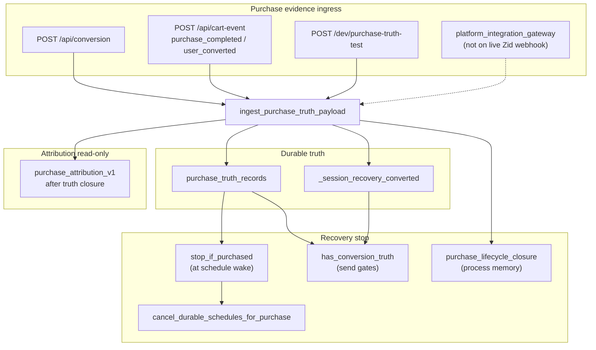

# CartFlow Purchase Truth Audit v1

**Date (UTC):** 2026-05-19  
**Scope:** Read-only audit of purchase detection, durable evidence, lifecycle precedence, and recovery stop.  
**Commit message:** `docs: add purchase truth audit v1`

**No runtime, recovery, dashboard, queue, widget, or WhatsApp behavior changes in this deliverable.**

Related prior docs: `docs/cartflow_integration_foundation_audit_v1.md`, `docs/cartflow_lifecycle_truth_audit_v1.md`, `docs/audit_lifecycle_truth_completion_v1.md`, `docs/cartflow_lifecycle_truth_v1_examples.md`.

---

## Executive summary

CartFlow has a **deliberate durable purchase layer** (`purchase_truth_records` via `services/cartflow_purchase_truth.py`) and a **unified read path** (`has_conversion_truth` in `services/cartflow_session_truth.py`) used at recovery wake and send gates.

**Verdict: PARTIAL**

| Use case | Verdict |
|----------|---------|
| Storefront / demo with `POST /api/conversion` or cart-event purchase flags | **Production-viable** for stopping recovery after verified ingest |
| Durable proof + restart survival | **YES** when `purchase_truth_records` row exists |
| Platform order webhooks (Zid live route) | **NOT READY** — webhook does not ingest purchase truth |
| Platform gateway (`order_paid`) | **Implemented in code, not on live HTTP** |
| WhatsApp reply classified as PURCHASE | **PARTIAL** — lifecycle closure; not always durable purchase truth |
| Recovered revenue attribution | **PARTIAL** — confidence model after truth closure; not legal/financial proof of causality |

---

## 1. Current purchase sources of truth

### 1.1 Primary durable store — `purchase_truth_records`

| Field | Role |
|-------|------|
| `recovery_key` | Unique key (`store_slug:session_id`) |
| `purchase_detected` | Boolean gate |
| `purchase_time` | Evidence timestamp |
| `purchase_source` | e.g. `purchase_completed`, `order_paid`, `event=…` |
| `order_id`, `store_slug`, `session_id`, `cart_id`, `customer_phone` | Correlation / audit |
| `evidence_detail` | Short proof string |

**Module:** `services/cartflow_purchase_truth.py`  
**Model:** `models.PurchaseTruthRecord`  
**Schema guard:** `schema_purchase_truth.ensure_purchase_truth_schema`

**Ingest API:** `record_purchase()` → memory mirror + DB upsert → lifecycle closure hook → cancel durable schedules → `[PURCHASE DETECTED]` / `[PURCHASE STOP]` logs.

**Idempotency:** Second ingest for same `recovery_key` skips duplicate `[PURCHASE DETECTED]` but still reconciles schedules/flags.

---

### 1.2 HTTP — `POST /api/conversion`

**Location:** `main.py` `api_conversion` (~L10071)

**Contract:**

- Requires `store_slug`, `session_id`
- Requires **verified evidence** (one of): `purchase_completed`, `order_paid`, `checkout_completed`, `order_created` (must be `true`), or `event` / `purchase_event` in accepted set, or `user_converted=true`
- Calls `ingest_purchase_truth_payload()` → durable row + stop path

**Role:** Primary **merchant/storefront** conversion endpoint (demo checkout, integrations that POST explicitly).

**Not automatic** for Zid/Salla/Shopify unless something external calls this URL with the same `session_id` the widget used.

---

### 1.3 Cart events — `POST /api/cart-event`

**Location:** `main.py` misc branch (~L10033–L10038)

Triggers `_mark_user_converted_for_payload(payload)` when:

- `user_converted === true`, or
- `event === "user_converted"`, or
- `purchase_completed === true`

That helper **prefers** `ingest_purchase_truth_payload()`; on failure falls back to **in-memory only** `_session_recovery_converted[recovery_key]`.

**Role:** Widget / tracking scripts can report conversion without a separate `/api/conversion` call **if** payload includes evidence flags.

---

### 1.4 Platform integration gateway (code path, not live Zid webhook)

**Module:** `services/platform_integration_gateway.py`

- Normalized events `order_paid`, `order_created`, `checkout_completed`, etc. → `normalized_event_to_core_payload()` sets flags (e.g. `order_paid=true`)
- Routes to `_route_purchase_truth()` → `ingest_purchase_truth_payload()`
- **Tests:** `tests/test_integrations_foundation_v1.py::test_order_paid_routes_to_purchase_truth`

**Adapters:** `integrations/adapters/zid.py` (and salla/shopify) — `normalize_event()` returns **`None`** (scaffold).

**Live `POST /webhook/zid`:** Signature verify → `RecoveryEvent` log → `upsert_abandoned_cart_from_payload` only — **does not** call gateway or purchase truth (`main.py` ~L15939–L15975).

---

### 1.5 Widget / browser inferred state (non-durable alone)

| Signal | Location | Durable? |
|--------|----------|----------|
| `sessionStorage` / converted flags | `cartflow_return_tracker.js`, widget triggers | **No** — suppresses client abandon/return until server ingest |
| Trigger block reason `purchase_completed` | `cartflow_widget_runtime/cartflow_widget_triggers.js` | **No** — UX guard only |
| Demo COD | `cartflow_demo_panel.js` → `POST /api/conversion` with `purchase_completed` | **Yes** after server ingest |

**Source of truth rule:** Client “converted” is **hint**; recovery stop requires server path above.

---

### 1.6 Inferred / parallel purchase state (not a second durable store)

| Layer | Module | Notes |
|-------|--------|-------|
| Session cache | `main._session_recovery_converted` | Fast path; rehydrated from DB on miss |
| Session truth read | `cartflow_session_truth.has_conversion_truth` | cache → `purchase_truth_records` → `CartRecoveryLog.status=stopped_converted` |
| Lifecycle closure memory | `purchase_lifecycle_closure._closed_keys` | **Process-local**; docstring forbids using as durable purchase substitute |
| Behavioral terminal | `cf_behavioral` `lifecycle_terminal_state=closed_purchase` | Merge on closure; supports continuation skip |
| Dashboard / phase | `lifecycle_purchased_evidence`, `recovery_state=converted`, `AbandonedCart.status=recovered` | **Derived** for UI/KPI; not the ingest owner |
| Reply intent PURCHASE | `reply_intent_handling` → `record_purchase_lifecycle_closure_from_reply_intent` | Stops automation; **does not** call `record_purchase()` unless separate ingest |

---

### 1.7 Dev / ops inspection (retained)

| Endpoint / tool | Purpose |
|-----------------|--------|
| `GET /api/dashboard/summary?activation_inspect=1` | Activation debug (unrelated to purchase) |
| `GET /dev/purchase-truth-status` | Read `has_purchase` / `purchase_context` |
| `POST /dev/purchase-truth-test` | Inject evidence (dev) |
| `scripts/inspect_activation_state.py` | Ops helper (activation inspect) |

---

## 2. Lifecycle precedence

### 2.1 Canonical evaluator (shadow / documentation owner)

**Module:** `services/cartflow_lifecycle_truth.py` — `evaluate_lifecycle_truth()`

**Documented order:**

```text
purchase > reply > return > waiting > send
```

(with `cancelled`, `vip_manual`, `failed` at defined tiers below purchase or between tiers per code comments)

**Purchase tier** (`_purchase_evidence`):

1. Caller `purchased=True` (often from `_is_user_converted`)
2. Log/phase/blocker hints: `stopped_converted`, `purchase_completed`, `stopped_purchase`, `recovery_complete`, `converted`
3. **`has_purchase(recovery_key)`** on `purchase_truth_records`

### 2.2 Recovery execution precedence

**At schedule wake** (`_run_recovery_sequence_after_cart_abandoned_impl`):

1. `stop_if_purchased()` — durable `has_purchase` → cancel schedules + session converted + lifecycle sync
2. `block_recovery_if_purchase_lifecycle_closed()` — process-local / session closure set

**During send / anti-spam paths:** `_is_user_converted(recovery_key)` → `has_conversion_truth()` (durable chain).

**Foundation module comment** (`cartflow_purchase_truth.py` header):  
`purchase > reply > return_to_site > delay > send`

### 2.3 Verified against product ask

| Rule | Implemented? | Evidence |
|------|--------------|----------|
| purchase > reply | **YES** | `evaluate_lifecycle_truth` tier 1 before tier 2 |
| reply > return | **YES** | Tier 2 before tier 3 |
| return > scheduled/send | **YES** | Return before delay/send; delay only if `lifecycle_delay_scheduling_only` |
| purchase > send | **YES** | `stop_if_purchased` before send; `_is_user_converted` in send gates |

**Caveat:** Legacy `lifecycle_intelligence` may still label differently; shadow mode logs `[LIFECYCLE TRUTH MISMATCH]` at observe points only.

---

## 3. Failure scenarios

### 3.1 Customer purchases after schedule, before send

| Phase | Behavior |
|-------|----------|
| Schedule created | `RecoverySchedule` due_at in future |
| Purchase ingested before wake | `record_purchase` / ingest → schedules cancelled (`cancel_durable_schedules_for_purchase`), `stop_if_purchased` returns true at wake |
| Purchase **not** ingested before wake | Send may proceed; depends on `_is_user_converted` at send time |

**Risk:** **PARTIAL** — race if purchase happens on platform but evidence only arrives after first send attempt, and no widget/conversion POST yet.

**Mitigation in code:** Wake-time `stop_if_purchased`; post-send conversion stops **tail** steps when `stopped_converted` logged (see recovery sequence tests).

---

### 3.2 Purchase arrives late

| After ingest | Effect |
|--------------|--------|
| Durable row written | `has_purchase` / `has_conversion_truth` true after restart |
| Session cache rehydrated | `[SESSION TRUTH REHYDRATED]` from DB |

**Risk:** Messages already sent remain sent; attribution may classify as `likely_recovery` / `assisted` vs `confirmed` depending on timestamps (`purchase_attribution_v1` 72h window).

---

### 3.3 Duplicate purchase events

| Mechanism | Effect |
|-----------|--------|
| `purchase_truth_records.recovery_key` UNIQUE | Upsert same row |
| `record_purchase` `already = has_purchase` | Skips duplicate `[PURCHASE DETECTED]` log |
| Gateway idempotency | `_mark_seen(idem)` skips duplicate platform events (gateway only) |
| `/api/conversion` | Re-ingest safe via upsert |

**Gap:** Duplicate **different** evidence shapes (e.g. `order_created` then `order_paid`) still one row — last write wins on fields.

---

### 3.4 Purchase from platform but not widget

| Path today | Result |
|------------|--------|
| Live Zid webhook | Cart upsert only — **no purchase truth** |
| Future gateway + adapter | Would ingest if `session_id` / `recovery_key` aligns |
| External POST `/api/conversion` | Works if operator wires platform order → same `session_id` |

**Risk:** **NOT READY** for platform-only confirmation without integration wiring.

**Session alignment risk:** Gateway may synthesize `session_id` as `platform:{platform}:{customer_id}` when cart id missing — may **not** match widget `store_slug:browser_session` → `has_purchase` miss.

---

### 3.5 Widget thinks abandoned; platform says paid

| Surface | Typical state |
|---------|----------------|
| Widget / abandon flow | `cart_abandoned` scheduled |
| Platform | Order paid (not ingested) |
| DB purchase truth | Empty |
| Recovery | **May continue** until evidence ingest |

**Mitigation:** Merchant must connect conversion POST, cart-event `purchase_completed`, or future gateway. Client-side converted flag alone does not write DB.

---

### 3.6 WhatsApp reply “I bought it” (PURCHASE intent)

| Step | Durable purchase row? |
|------|------------------------|
| `record_purchase_lifecycle_closure_from_reply_intent` | **Often NO** — closure + session flags |
| `has_conversion_truth` fallback | Only if `stopped_converted` log exists or cache set |

**Risk:** Reply-based purchase is **behavioral stop**, not verified commerce evidence unless paired with order/conversion ingest.

---

### 3.7 Weak evidence: `order_created`

`extract_purchase_evidence` treats `order_created=true` like purchase truth (same as `order_paid`).

**Risk:** May close recovery before payment capture on some platforms — product/policy choice, not double-entry bookkeeping.

---

## 4. Durable evidence — what CartFlow can prove

### 4.1 Prove purchase happened

| Evidence type | Provable? | How |
|---------------|-----------|-----|
| Verified flags ingested to `purchase_truth_records` | **YES** | Row + `purchase_context()` + dev status endpoint |
| `/api/conversion` audit | **YES** | Response includes `recovery_key`, `purchase_truth_source` |
| Platform webhook (Zid live) | **NO** | Not wired |
| Widget-only converted flag | **NO** (alone) | Browser state only |

**Logs:** `[PURCHASE DETECTED]`, `[PURCHASE SOURCE]`, `[PURCHASE TRUTH]`, `[ACTIVATION STATE]` (inspect), `[SESSION TRUTH DB FALLBACK]`.

---

### 4.2 Prove purchase stopped recovery

| Mechanism | Provable? | How |
|-----------|-----------|-----|
| Schedule cancel | **YES** | `RecoverySchedule.status=cancelled`, `last_error` may contain `purchase_truth_stop` |
| Wake abort | **YES** | `[PURCHASE STOP]` + no send logs after truth |
| Lifecycle closed | **PARTIAL** | `[PURCHASE LIFECYCLE CLOSED]` stdout/log; memory set not durable alone |
| `has_conversion_truth` at later gate | **YES** | DB-backed after ingest |

**Tests:** `tests/test_cartflow_purchase_truth_foundation_v1.py` (purchase stops future recovery).

---

### 4.3 Prove recovered revenue attribution

**Module:** `services/purchase_attribution_v1.py` — runs from `apply_purchase_truth_lifecycle_closure` after verified truth.

| Level | Meaning |
|-------|---------|
| `confirmed_recovery` | Purchase after send within window + reply/click signals |
| `likely_recovery` | Time window + send |
| `assisted_recovery` | Weaker influence |
| `organic_or_unknown` | Outside window or no send |

**Provable?** **PARTIAL**

- CartFlow can document **influence hypothesis** with evidence list in attribution decision logs.
- Not **absolute causality** (module header states this explicitly).
- KPI “recovered revenue” on dashboard uses projection queries (`_merchant_month_window_projection`, recovered carts) — related but not identical to attribution row.

**Persistence:** `_persist_attribution_event_readonly` (best-effort event row) — not a merchant-facing ledger.

---

## 5. Architecture diagram (current production path)



---

## 6. Gaps and recommendations (documentation only)

| Gap | Severity | Recommendation (future, out of scope v1) |
|-----|----------|----------------------------------------|
| Zid webhook → no purchase truth | High | Route paid orders through gateway or call ingest from webhook mapper |
| Adapter `normalize_event` = None | High | Implement Zid order_paid normalization |
| `recovery_key` mismatch platform vs widget | High | Explicit cart/session linking table |
| Reply PURCHASE without truth row | Medium | Optionally call `record_purchase` with `source=customer_reply_purchase` + human review flag |
| `order_created` as purchase | Medium | Product policy: require `order_paid` for production merchants |
| `purchase_lifecycle_closure` memory-only | Medium | Already mitigated by `has_conversion_truth` DB path when truth ingested |
| Attribution ≠ financial truth | Low | Keep dashboard copy at “influence” not “invoice” |

---

## 7. Verdict

### **PARTIAL**

**READY enough for:**

- Embedded widget + explicit conversion API merchants
- Durable stop after `purchase_truth_records` ingest
- Restart-safe purchase check at recovery wake (`stop_if_purchased` + session truth DB fallback)
- Documented lifecycle precedence in `evaluate_lifecycle_truth` and purchase foundation

**NOT READY enough for:**

- Platform-native purchase truth without additional wiring
- Single unified proof for all “purchase-like” stops (reply vs order vs conversion)
- Strong recovered-revenue **causality** claims without attribution caveats

**Upgrade to READY when (product definition):**

1. Live platform `order_paid` (or paid-equivalent) ingests into `purchase_truth_records` with stable `recovery_key` linkage.  
2. Reply PURCHASE either ingests durable truth or is excluded from “verified purchase” metrics.  
3. Merchant-facing docs state evidence sources and attribution limits (this document + integration audit).

---

## 8. Code index (quick reference)

| Concern | File / symbol |
|---------|----------------|
| Durable ingest | `services/cartflow_purchase_truth.record_purchase` |
| Evidence extract | `services/cartflow_purchase_truth.extract_purchase_evidence` |
| Facade | `services/purchase_truth.ingest_purchase_truth_payload` |
| Conversion API | `main.api_conversion` |
| Cart-event convert | `main._mark_user_converted_for_payload` |
| Read truth | `services/cartflow_session_truth.has_conversion_truth` |
| Wake stop | `main._run_recovery_sequence_after_cart_abandoned_impl` → `stop_if_purchased` |
| Lifecycle precedence | `services/cartflow_lifecycle_truth.evaluate_lifecycle_truth` |
| Merchant precedence helpers | `services/cartflow_merchant_lifecycle_precedence` |
| Attribution | `services/purchase_attribution_v1.run_purchase_attribution_after_truth_closure` |
| Platform route (future) | `services/platform_integration_gateway._route_purchase_truth` |
| Live Zid webhook | `main.zid_webhook` (no purchase ingest today) |
