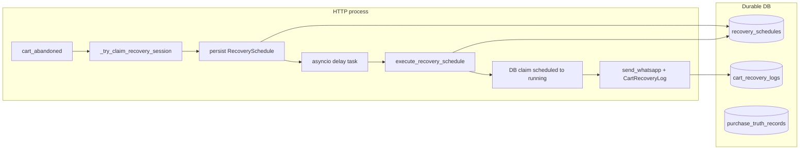

# CartFlow Queue / Worker Maturity Audit v1

**Date (UTC):** 2026-05-19  
**Type:** Read-only audit — no Redis, Celery, queue refactors, or runtime changes.  
**Commit:** `docs: add queue worker maturity audit v1`  
**Related:** `docs/cartflow_queue_worker_readiness.md`, `docs/cartflow_queue_worker_runtime_rules.md`, `services/cartflow_queue_readiness.py`, `services/recovery_restart_survival.py`

---

## Executive verdict

| Question | Verdict |
|----------|---------|
| Can CartFlow survive **one API process**, restarts, and moderate delayed recovery? | **PASS** (with ops tuning) |
| Can it survive **multiple Uvicorn workers** on one DB without discipline? | **PARTIAL** — DB claim + WA idempotency prevent most double sends; memory guards and per-worker startup scans do not |
| Can it survive **50 / 100 / 500 stores** at current architecture? | **50–100: PARTIAL** · **500: FAIL** without dedicated scheduler + back-pressure |
| Ready to add Redis/Celery **without** fixing gaps first? | **FAIL** — would duplicate three execution drivers unless one leader + queue ack design |

**Overall maturity:** **PARTIAL** — strong **durable schedule + DB claim + log idempotency** stack for single-scheduler deployments; **not** a horizontally scaled multi-worker recovery engine yet.

---

## Part 1 — Current async boundaries

There is **no external job queue**. Work is owned by the **FastAPI/Uvicorn process event loop** plus **durable `recovery_schedules` rows** polled on startup / optional DB scanner.

| Domain | Runtime owner | Trigger / source | Persistence | Async mechanism |
|--------|---------------|------------------|-------------|-----------------|
| **Delay** | `services/recovery_delay_dispatcher.dispatch_recovery_schedule` | `asyncio.create_task` after abandon; startup **future rearm** (`rearm_one_future_scheduled_recovery`) | `RecoverySchedule.due_at`, `effective_delay_seconds`, `context_json` | `await asyncio.sleep` until `due_at`; DB session released before sleep (`db_session_lifecycle`) |
| **Recovery execute** | `services/recovery_execution_boundary.execute_recovery_schedule` | After delay finishes, resume scan, or DB due scanner | Row `scheduled` → `running` → terminal | `asyncio.create_task` wrapping boundary (resume path) |
| **Recovery schedule (HTTP)** | `main.handle_cart_abandoned` → `_run_recovery_dispatch_cart_abandoned*` | Widget `POST /api/cart-event` (`cart_abandoned`) | `persist_recovery_schedule_durable` before/at dispatch | `create_task` per session / per multi-slot |
| **WhatsApp send (recovery)** | `main.send_whatsapp` / `services/whatsapp_send` | Recovery sequence after gates | `CartRecoveryLog` (`queued`, `sent_real`, `mock_sent`, `whatsapp_failed`) | Optional `services/whatsapp_queue` in-process worker |
| **WhatsApp queue worker** | `services/whatsapp_queue.start_whatsapp_queue_worker` | Startup (`main._startup_whatsapp_queue`) | Logs + inflight map (process-local) | Per-loop `asyncio.Queue` |
| **Purchase truth** | `services/purchase_truth.ingest_purchase_truth` | `/api/conversion`, cart-event flags, Zid webhook (v2), reply PURCHASE claim | `purchase_truth_records` | **Inline** on request path |
| **Lifecycle closure** | `services/lifecycle_closure_records_v1` | Hook on terminal `CartRecoveryLog` + schedule cancel | `lifecycle_closure_records` | Inline after log persist |
| **Inbound WhatsApp (reply)** | `main.whatsapp_webhook` → `reply_intent_handling` | Twilio/Meta POST `/webhook/whatsapp` | Behavioral + logs + optional purchase claim | Request handler (sync/async route) |
| **Delivery callbacks** | `routes/whatsapp_delivery_webhook` → `ingest_twilio_status_callback` | Twilio POST `/webhook/whatsapp/status` | `whatsapp_delivery_truth` by `MessageSid` | Inline; **no recovery dispatch** |
| **Zid / platform webhooks** | `main.zid_webhook` (+ gateway scaffold) | POST `/webhook/zid` | `RecoveryEvent` log, `AbandonedCart` upsert; purchase ingest when paid | Inline HTTP |
| **Platform gateway (future)** | `services/platform_integration_gateway` | Normalized events (tests/dev) | In-process idempotency key set + burst dedupe | Inline / thread pool for abandon |
| **Return-to-site** | `main.api_cart_event` / behavioral merge | Widget `user_returned_to_site` | `AbandonedCart` / `cf_behavioral`, `returned_to_site` log | Inline |
| **Restart resume** | `recovery_restart_survival.run_recovery_resume_scan_async` | **Every** startup (default) | Scans `recovery_schedules` | Async scan; `max_dispatch=25` |
| **DB due scanner (optional)** | `recovery_db_due_scanner` + loop | `CARTFLOW_DB_DUE_SCANNER_ENABLED` (default off in loop) | Same table as delay | Poll `due_at <= now`, limit 25 |

**Critical boundary rule:** Only **one** active driver should execute a given `(recovery_key, step, multi_slot_index)` row — today that is enforced **after** the row exists, via `claim_recovery_schedule_execution`, not at HTTP abandon time.



---

## Part 2 — Worker safety

| Capability | Verdict | Evidence |
|------------|---------|----------|
| **Duplicate prevention (send)** | **PASS** | `recovery_whatsapp_idempotency` blocks second `sent_real`/`mock_sent`/`queued` per step (`_IDEMPOTENCY_BLOCK_STATUSES`); `cartflow_duplicate_guard` inflight TTL (~6s) same process |
| **Duplicate prevention (schedule task)** | **PARTIAL** | `_try_claim_recovery_session` + `_session_recovery_started` — **process-local** (`main`); DB upsert one row per `(recovery_key, step, slot)` but two workers can each spawn delay tasks before claim |
| **Idempotency (restart)** | **PASS** | WA idempotency reads `CartRecoveryLog`; purchase `has_purchase`; closure `get_durable_closure`; schedule terminal set `_TERMINAL` |
| **Inflight claims** | **PARTIAL** | DB `scheduled→running` UPDATE count=1 (`claim_recovery_schedule_execution`); memory inflight for WA same process only |
| **Restart survival** | **PASS** | Resume scan + future rearm; `evaluate_resume_safety`; session truth DB fallback; tests `test_recovery_restart_survival.py` |
| **Terminal states** | **PASS** | `_TERMINAL` blocks re-claim; `finalize_recovery_schedule_durable`; log→schedule mapping; stale `running` repair (`CARTFLOW_RECOVERY_RUNNING_STALE_SECONDS`, default 600s) |
| **Ordering (multi-message)** | **PARTIAL** | Per-slot tasks + step index; assumes single scheduler or lucky claim races |
| **Provider side-effect safety** | **PARTIAL** | Idempotency before Twilio; failures (`whatsapp_failed`) **not** in block set — retries allowed by design |

---

## Part 3 — Multi-worker risks

Assume **Worker A** and **Worker B** share one PostgreSQL/SQLite DB.

| Risk question | Answer | Safeguard | Verdict |
|---------------|--------|-----------|---------|
| **Can two workers send the same recovery?** | Unlikely **same step** after first log | `claim_recovery_schedule_execution` + `check_whatsapp_recovery_send_idempotency` | **PARTIAL** — race window before first log row |
| **Can restart replay tasks?** | Due rows re-dispatched; in-flight asyncio tasks **lost** | Resume scan + rearm; claim idempotent | **PASS** for due work; **PARTIAL** for duplicate scan load |
| **Can schedule race?** | Yes — dual asyncio sleep + startup scan + optional DB scanner | First `scheduled→running` wins; others `claim_race_lost` / `already_running` | **PARTIAL** |
| **Can both pass abandon gate?** | Yes | `_try_claim_recovery_session` not shared | **FAIL** cross-worker without ops |
| **Can both run startup resume?** | Yes (default) | Each claims different rows or loses race | **PARTIAL** — wasted CPU, not usually double send |

**Evidence logs:** `[RECOVERY CLAIMED]`, `[RECOVERY CLAIM SKIPPED] reason=claim_race_lost`, `[WA IDEMPOTENCY HIT]`, `[CARTFLOW DUPLICATE]`.

**Ops minimum (no code):** One scheduler per DB — `CARTFLOW_RECOVERY_RESUME_ON_STARTUP=0` on all but one replica (`docs/cartflow_queue_worker_runtime_rules.md`).

---

## Part 4 — Provider retries

| Source | Retry behavior | Current safeguard | Verdict |
|--------|----------------|-------------------|---------|
| **Twilio send API** | App may retry via recovery path / WA queue `MAX_WA_SEND_ATTEMPTS` | Idempotency on success statuses; failed sends not blocked | **PARTIAL** |
| **Twilio status callbacks** | Provider may POST duplicate status events | Upsert by `MessageSid` in `whatsapp_delivery_truth_v1`; does not re-run recovery | **PASS** for delivery truth |
| **Twilio inbound reply** | Duplicate webhook deliveries possible | `cartflow_reply_intent_engine._inbound_duplicate_recent`; continuation dedupe | **PARTIAL** |
| **Zid webhook** | Platform may retry HTTP | Signature verify (`verify_webhook_signature`); no global event-id dedupe table | **PARTIAL** — cart upsert idempotent by `zid_cart_id`; purchase ingest upserts truth |
| **Platform gateway** | Future adapter retries | `build_idempotency_key` + in-process `_seen_external_events` (cap 5000, **not durable**) | **PARTIAL** / **FAIL** across restart |
| **HTTP client retries** | Browser/widget burst | `should_process_cart_event_burst` (optional path); schedule/send guards | **PARTIAL** |

**Duplicate callback risk to recovery:** Inbound **status** webhooks do **not** call recovery. Inbound **reply** webhooks can trigger continuation/reply intent — mitigated by reply dedupe + purchase/closure writes, not a distributed lock.

---

## Part 5 — Queue pressure (estimate)

No queue depth metric — pressure appears as **DB rows**, **asyncio tasks**, and **HTTP latency**.

| Scale | Abandons / due (order of magnitude) | First bottleneck | Why |
|-------|--------------------------------------|------------------|-----|
| **50 stores** | Low–moderate concurrent due | **Unlikely failure** | Single worker + `max_dispatch=25` keeps startup/repair bounded |
| **100 stores** | Moderate; peaks at business hours | **PARTIAL — DB + event loop** | Many concurrent `asyncio` delay tasks; `CartRecoveryLog` growth; resume scan cap delays backlog drain |
| **500 stores** | High concurrent due / minute | **FAIL — throughput** | No worker pool; no lease queue; triple driver (sleep + startup + scanner); API process bound to HTTP + recovery |

| Subsystem | 50 stores | 100 stores | 500 stores |
|-----------|-----------|------------|------------|
| **DB (`recovery_schedules`, logs)** | OK | Growing index pressure | **First hard limit** — row scan, log writes, connection pool |
| **Delay (asyncio sleep)** | OK | Many tasks in one loop | Task count + timer fairness |
| **Worker (process)** | OK | CPU on resume storms | ** Saturated** |
| **Callbacks (webhooks)** | OK | Inline on same process | Webhook latency competes with recovery |
| **Logs (`CartRecoveryLog`)** | OK | Admin/query cost | Storage + write amplification |

**Estimate:** At **500 stores** without a dedicated scheduler, expect **due backlog**, slow `max_dispatch=25` drain, and operator-visible `[RECOVERY STALE DETECTED]` / `needs_review` — not silent duplicate sends if idempotency holds.

---

## Part 6 — Recovery storms

**Scenario:** Many recoveries become due the same minute (campaign, shared delay template, restart after outage).

| Mechanism | Behavior |
|-----------|----------|
| **Startup resume** | `run_recovery_resume_scan_async(max_dispatch=25)` — only **25** due rows dispatched per scan |
| **Stale repair first** | `repair_stale_running_recovery_schedules` runs before dispatch — reduces stuck `running` noise |
| **Per-row claim** | Parallel tasks still compete; losers log `claim_race_lost` |
| **WA queue** | Serializes provider sends per event loop — backlog in queue, not unbounded threads |
| **Inflight / duplicate guard** | Short TTL blocks overlapping sends **same process** |
| **No global rate limit** | No store-level or provider-level storm throttle beyond Twilio account limits |

**Verdict:** **PARTIAL** — storms **degrade latency** and drain slowly; **unlikely** to mass-double-send if DB idempotency paths run. **FAIL** for sub-minute SLA at high due counts without external queue + worker pool.

---

## Part 7 — Source-of-truth conflicts

When signals disagree, effective precedence for **stopping recovery** and **merchant-facing summary**:

| Store | Role | Wins when |
|-------|------|-----------|
| **`purchase_truth_records`** | Durable purchase evidence | **Highest** — `has_purchase` / `stop_if_purchased` cancels schedules |
| **`lifecycle_closure_records`** | Durable “why ended” | Explains terminal outcome; purchase rank 8 > reply > return (`lifecycle_closure_records_v1`) |
| **`RecoverySchedule.status`** | Execution state machine | **Operational** truth for “will run again?” — terminal rows block claim |
| **`CartRecoveryLog.status`** | Send/attempt audit trail | **Historical** — may show `queued` while purchase/closure says done; idempotency reads logs |
| **Session memory** (`_session_recovery_*`) | Fast path same process | **Lowest cross-worker** — bypassed on resume via `resume_from_durable_schedule` + DB fallbacks |
| **Dashboard / merchant lifecycle** | Presentation | Reads `has_purchase`, closure, logs — purchase + closure override noisy `queued` |
| **Admin diagnostics** | Support read model | `has_purchase` + `lifecycle_closure` in context; purchase overrides queued log issue |

**Lifecycle evaluator (shadow):** `cartflow_lifecycle_truth` — `purchase > reply > return > waiting > send` (observation; does not drive send).

**Who wins example (queued + purchase):** **Purchase truth** stops execution; dashboard should show **purchased**; logs may still contain `queued` for support in collapsed/history views.

---

## Priority backlog (no fixes in v1)

| Priority | Gap | Impact | Suggested direction (future) |
|----------|-----|--------|------------------------------|
| **P0** | Multiple workers with default **resume-on-startup** | Duplicate dispatch attempts, load amplification | Single scheduler role or `CARTFLOW_RECOVERY_RESUME_ON_STARTUP=0` on replicas |
| **P0** | No distributed **job queue / lease** | Cannot safely scale recovery workers horizontally | Dedicated worker + ack after `execute_recovery_schedule` |
| **P1** | Pre-delay **memory** claims (`_try_claim_recovery_session`) | Two workers → two delay tasks per session | Insert `scheduled` row **before** `create_task`; reject duplicate upsert |
| **P1** | Triple driver: asyncio sleep + startup scan + DB scanner | Races until claim; ops confusion | One active driver per environment |
| **P1** | Platform gateway idempotency **in-memory only** | Restart duplicates external events | Durable `external_event_id` table |
| **P2** | `max_dispatch=25` cap | Large due backlogs after outage | Configurable batch + metrics |
| **P2** | `recovery_session_phone` cache process-local | Extra DB resolve on cold worker | Always resolve phone from DB in worker path |
| **P2** | `cart_recovery_logs` volume at 500 stores | Ops/DB cost | Archival + indexes (ops) |

---

## Verification references

```bash
python -m pytest tests/test_queue_worker_maturity_audit_v1.py tests/test_recovery_restart_survival.py tests/test_recovery_execution_boundary.py tests/test_cartflow_queue_readiness_verification.py tests/test_cartflow_duplicate_prevention.py -q
```

**Manual grep (production logs):**

```text
[RECOVERY CLAIMED]
[RECOVERY CLAIM SKIPPED]
[WA IDEMPOTENCY HIT]
[RECOVERY STALE DETECTED]
[PURCHASE STOP]
[CARTFLOW DUPLICATE]
[RECOVERY SCHEDULER OWNER]
```

---

## Document control

| Item | Value |
|------|--------|
| Runtime changes | **None** |
| New infrastructure | **None** |
| Authoritative future worker entry | `execute_recovery_schedule(schedule_id=…, source=…)` |
| Registry metadata | `services/cartflow_queue_readiness.py` |
