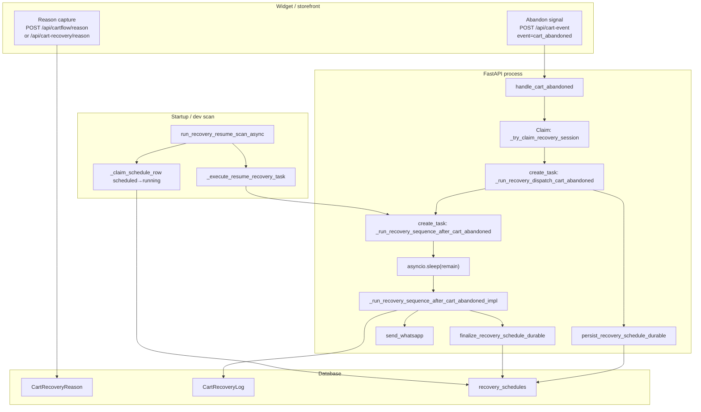

# CartFlow — Queue / Worker Readiness Audit (Reliability Program v1, Part 2)

**Date (UTC):** 2026-05-19  
**Status:** Documentation / audit only — **no runtime, schema, or infrastructure changes** in this deliverable.  
**Baseline verified before this audit:** store context isolation, unified delay source, `RecoverySchedule` persistence, restart survival + resume finalize, end-to-end WhatsApp recovery on demo.

---

## 1. Purpose

Prepare the **delayed recovery runtime** for a future **real queue + worker** model without changing current production behavior today. This document traces the live path, lists **in-process ownership**, catalogs **queue-safety risks**, and defines **idempotency / claiming / terminal rules** that a worker implementation must satisfy before Redis, Celery, RQ, or separate worker processes are introduced.

---

## 2. Current runtime model

### 2.1 Execution substrate

| Layer | What runs today | Process assumption |
|--------|------------------|-------------------|
| **HTTP (FastAPI)** | `POST /api/cart-event`, `POST /api/cartflow/reason`, dashboards | One or more Uvicorn workers; **no cross-process recovery coordination** except DB |
| **In-process asyncio** | `asyncio.create_task(...)` + `asyncio.sleep(delay_seconds)` | **Single process memory** holds duplicate guards and “already scheduled” flags |
| **Durable schedule (DB)** | `recovery_schedules` via `services/recovery_restart_survival.py` | Survives restart; **resume scan** on startup re-dispatches due rows |
| **WhatsApp delivery** | `send_whatsapp()` in `services/whatsapp_send.py` (Twilio); separate `services/whatsapp_queue.py` worker for **other** queued sends | Recovery path calls `send_whatsapp` **inline inside** the recovery coroutine after delay |

There is **no** recovery job queue today. Delay is implemented as **sleep inside a fire-and-forget task** on the same process that handled `cart-event`, with a **parallel** durable row for restart survival.

### 2.2 Identity keys

| Key | Format / source | Used for |
|-----|------------------|----------|
| **`recovery_key`** | `{store_slug}:{session_id}` (`main._recovery_key_from_payload`) | Session-scoped recovery, in-memory dicts, durable schedule upsert |
| **`RecoverySchedule` uniqueness** | `(recovery_key, step, multi_slot_index)` | One durable row per slot / sequential step |
| **`store_slug` (canonical)** | First segment of `recovery_key`; enforced in runtime via `services/recovery_store_context.py` | Store row, templates, delay, phone — must match widget slug |

### 2.3 Dual delay paths (critical for queue design)

For a normal (non-VIP) abandon with reason + phone:

1. **In-process:** `handle_cart_abandoned` → `_try_claim_recovery_session` → `asyncio.create_task(_run_recovery_dispatch_cart_abandoned)` → (optional reason poll) → `_persist_durable_recovery_schedule` + `asyncio.create_task(_run_recovery_sequence_after_cart_abandoned)` with `remain = delay - elapsed`.
2. **Durable:** Same flow writes/updates `recovery_schedules` with `due_at = now + remain` **before** the sleep task runs.

After **process restart**, the in-process task is gone; **startup** runs `run_recovery_resume_scan_async`:
- **Due rows** (`due_at <= now`): `resume_one_schedule` → `execute_recovery_schedule(source=resume_scan)`.
- **Future rows** (`due_at > now`, `scheduled`): `rearm_one_future_scheduled_recovery` → `spawn_recovery_schedule_dispatch` with preserved `due_at` (logs `[RECOVERY FUTURE REARM CHECK|REARMED|SKIPPED]`); waits until `due_at`, then `execute_recovery_schedule` via `[DELAY FINISHED]`.
The live path uses the same boundary after `[DELAY FINISHED]`.

**Queue implication:** A worker must treat **either** the asyncio task **or** the durable row as the single source of execution — never both actively driving send for the same `(recovery_key, step)` without distributed claiming.

---

## 3. End-to-end path trace

### 3.1 Widget reason capture

| Step | Location | Notes |
|------|----------|--------|
| User selects hesitation reason | `static/cartflow_widget_runtime/*` (V2) or `static/cartflow_widget.js` (legacy) | UI only |
| Persist reason | `POST /api/cartflow/reason` (`routes/cartflow.py`) or `POST /api/cart-recovery/reason` | Writes `CartRecoveryReason`; may call `record_recovery_customer_phone` |
| Re-arm after reason | `main._schedule_normal_recovery_after_cart_recovery_reason_saved` | If abandon previously returned `waiting_for_reason`, synthesizes `cart_abandoned` payload and continues scheduling |

**Queue note:** Reason can arrive **after** abandon (`waiting_for_reason`). Worker jobs must load reason from DB (`CartRecoveryReason`), not assume it was present at job enqueue time.

### 3.2 Phone save

| Step | Location | Notes |
|------|----------|--------|
| Phone on abandon payload | `handle_cart_abandoned` | `record_recovery_customer_phone` when `phone` on payload |
| Phone after resolve | `commit_normal_recovery_phone_after_resolved` | During schedule preflight / send path |
| In-memory phone cache | `services/recovery_session_phone.py` | **Process-local**; not queue-safe alone |

**Queue note:** Worker must resolve phone from DB + session tables (`_resolve_cartflow_recovery_phone`), not from in-memory cache on another worker.

### 3.3 Schedule creation (HTTP)

| Step | Function | Guard |
|------|----------|--------|
| VIP branch | `handle_cart_abandoned` → `_activate_vip_manual_cart_handling` | No normal delayed WA recovery |
| Missing reason | `waiting_for_reason` + pending flag | No task until reason saved |
| Missing phone | `waiting_for_phone` + pending flag | No task until phone available |
| Duplicate schedule | `_try_claim_recovery_session` | In-memory `_session_recovery_started` |
| Already sent (memory) | `_session_recovery_sent` | Skips re-schedule |
| Multi-message | `_schedule_recovery_multi_slots` | One `create_task` + one durable row **per slot** |
| Single-message | `_run_recovery_dispatch_cart_abandoned` → delay_poll | One dispatch task then one delay task |

**Durable write:** `main._persist_durable_recovery_schedule` → `persist_recovery_schedule_durable` (upsert `status=scheduled`, `due_at`, `context_json` snapshot).

### 3.4 Delay scheduling (in-process)

| Step | Location | Behavior |
|------|----------|----------|
| Timing resolution | `services/recovery_multi_message.resolve_recovery_schedule_timing`, `main._resolve_single_message_schedule_timing` | Unified `effective_delay_seconds` + `source` |
| Logs | `services/recovery_delay_unified` | `[RECOVERY DELAY RESOLVED|SCHEDULED]`, `[TEMPLATE TIMING USED]` |
| Sleep | `services/recovery_delay_dispatcher.dispatch_recovery_schedule` | `release_db_before_async_wait()` then `await` delay until `due_at`; then `execute_recovery_schedule` |
| DB session | `services/db_session_lifecycle` | Scoped session per task; released before long sleep |

### 3.5 Restart resume

| Step | Location | Behavior |
|------|----------|----------|
| Trigger | `@app.on_event("startup")` → `run_recovery_resume_scan_async(max_dispatch=25)` | Env: `CARTFLOW_RECOVERY_RESUME_ON_STARTUP` (default on) |
| Stale running | `reconcile_stale_running_schedules` | `running` older than `CARTFLOW_RECOVERY_RUNNING_STALE_SECONDS` (default 600s) → `failed_resume_stale` |
| Due query | `status=scheduled` AND `due_at <= now` | Ordered by `due_at`, capped by `max_dispatch` |
| Pre-send safety | `evaluate_resume_safety` | purchase/return/already_sent/store mismatch/template disabled/legacy fallback |
| Claim | `_claim_schedule_row` | **Optimistic:** `UPDATE ... WHERE status=scheduled` → `running` |
| Execute | `_execute_resume_recovery_task` | Sets `resume_from_durable_schedule`; **finally** infers terminal status |
| Dev verify | `GET /dev/recovery-restart-survival-verify?action=simulate_restart_scan` | Same scan path |

### 3.6 Recovery execution (post-delay)

| Step | Location | Notes |
|------|----------|--------|
| Store bind | `_bind_recovery_runtime_store_identity` | Canonical slug from `recovery_key` |
| Duplicate (session) | `_session_recovery_logged` / multi / seq maps | **Bypass logged guard when `resume_from_durable_schedule`** |
| Gates | `should_send_whatsapp`, anti-spam, attempt limits, template disabled | Many early `return`s; only some call `_finalize_durable_recovery_schedule` today |
| Send | `try_begin_outbound_whatsapp_inflight` then `send_whatsapp` | In-process TTL ~6s |
| Success path | `_persist_cart_recovery_log` (`mock_sent` / failures) | Authoritative for “already sent” checks |
| Sequential follow-up | Second `create_task` + new `RecoverySchedule` row for step 2 | Nested delay |

### 3.7 WhatsApp send

| Step | Location | Notes |
|------|----------|--------|
| Provider | `services/whatsapp_send.send_whatsapp` | Twilio; dev trace via `ENV=development` |
| Logs | `[WA SENT]`, `[WA FAILED]`, `[SKIP WA]` (conditions in impl) | Used for ops verification |
| Queue worker (separate) | `services/whatsapp_queue.start_whatsapp_queue_worker` | Started on same app startup; **not** the recovery delay queue |

### 3.8 Terminal status update (`recovery_schedules`)

| Status | When set |
|--------|----------|
| `scheduled` | `persist_recovery_schedule_durable` on arm |
| `running` | `_claim_schedule_row` on resume dispatch |
| `completed` | Successful send path in impl **or** resume infer sees `mock_sent`/`sent_real` log |
| `skipped_resume_unsafe` | `evaluate_resume_safety` fail, delay gate skip (impl), or skip-like log on resume infer |
| `failed_resume` | Resume task exception or exit without terminal log |
| `failed_resume_stale` | `reconcile_stale_running_schedules` |
| `cancelled` / `needs_review` | Reserved / partial use |

**Important:** Normal in-process completion calls `_finalize_durable_recovery_schedule(..., completed)` at end of impl. Early exits often **do not** update durable row unless resume wrapper or specific branches (e.g. delay gate) finalize.

---

## 4. In-process async ownership inventory

All **`asyncio.create_task`** call sites tied to delayed recovery (file: `main.py` unless noted):

| # | Caller | Task target | Owns |
|---|--------|-------------|------|
| 1 | `_schedule_recovery_multi_slots` | `_run_recovery_sequence_after_cart_abandoned` per slot | Per-slot sleep + send |
| 2 | `_run_recovery_sequence_after_cart_abandoned_impl` (sequential follow-up) | `_run_recovery_sequence_after_cart_abandoned` step 2+ | Second delay |
| 3 | `_run_recovery_dispatch_cart_abandoned_impl` (delay_poll) | `_run_recovery_sequence_after_cart_abandoned` | Primary single-message delay |
| 4 | `handle_cart_abandoned` / `_execute_cart_abandon_recovery_schedule_continue` | `_run_recovery_dispatch_cart_abandoned` | Reason poll + arm delay task |
| 5 | `services/recovery_restart_survival.resume_one_schedule` | `_execute_resume_recovery_task` | Resume after restart |

**Background delay sleeps:** `asyncio.sleep` in:

- `_run_recovery_sequence_after_cart_abandoned_impl` (main delay),
- `_run_recovery_dispatch_cart_abandoned_impl` (reason tag poll loop),
- sequential / multi-slot remain calculation.

**Startup resume scanner:**

- `main._startup_whatsapp_queue` → `run_recovery_resume_scan_async` (same event as WhatsApp queue worker start).

**Process-only state** (`main.py`, guarded by `_recovery_session_lock`):

- `_session_recovery_started`, `_session_recovery_logged`, `_session_recovery_sent`, `_session_recovery_send_count`, `_session_recovery_converted`, `_session_recovery_returned`, multi-slot maps, flow armed / delay wait timestamps.

**Process-only duplicate TTL** (`services/cartflow_duplicate_guard.py`):

- `_inflight_send`, cart-event throttle maps — **threading.Lock**, not shared across workers.

**Request-scoped cache** (`services/cart_event_request_scope.py`):

- Store row cache during `POST /api/cart-event` — **must not** be assumed on a worker thread.

---

## 5. Worker-safety risks (pre-queue)

| Risk | Description | Current mitigation | Gap for multi-worker |
|------|-------------|-------------------|----------------------|
| **Duplicate WA send** | Two workers or task+resume both send same step | `_cart_recovery_log_has_successful_send_for_step`, `try_begin_outbound_whatsapp_inflight` (in-process TTL), `evaluate_resume_safety` | Inflight guard is **not** distributed; DB log check is **eventually** consistent |
| **Schedule picked twice** | Two resume scans or two app instances claim same row | `_claim_schedule_row` (single-row `UPDATE WHERE scheduled`) | Safe **if** only one resume dispatcher runs per DB; multiple nodes need same claim pattern |
| **Dual execution (task + resume)** | Live process sleeps while DB row becomes due → resume may also run | Resume sets `resume_from_durable_schedule`; duplicate session guard bypassed for resume | **Risk** if both complete: need **single executor** rule per schedule id |
| **Process dies mid-send** | Row `running`, WA may or may not have been sent | `reconcile_stale_running_schedules`; infer from `CartRecoveryLog` on resume | Worker must **re-check log** before resend; stale ≠ auto-retry send without guards |
| **Stale `running`** | Crash after claim | `failed_resume_stale` after timeout | Good; queue worker should reuse same policy |
| **Retry after provider failure** | `whatsapp_failed` log, no automatic queue retry | Manual / new abandon only | Queue design needs explicit **retry job** with max attempts |
| **Store context mismatch** | Wrong `Store` row vs `recovery_key` slug | `evaluate_resume_safety`, `_bind_recovery_runtime_store_identity` | Worker must load store by **canonical slug**, never latest-id fallback |
| **Phone / template / delay mismatch** | Stale snapshot in `context_json` vs live DB | Resume passes `schedule_timing` + `recovery_context` snapshot | Re-resolve timing at send time (impl already re-reads store for gate); document **snapshot vs live** policy |
| **Terminal status overwrite** | `finalize_recovery_schedule_durable` on completed row | Upsert skips terminal overwrite in `persist` only; `finalize` sets status unconditionally | Worker must **only finalize if `running`** (resume helper does); avoid downgrading `completed` |
| **In-memory converted/returned** | `_session_recovery_*` flags | Lost on restart; DB/reason paths used on resume | Worker **must not** rely on memory; use DB + `evaluate_resume_safety` |
| **Reason-after-abandon race** | `waiting_for_reason` then reason POST | `_schedule_normal_recovery_after_cart_recovery_reason_saved` | Job payload must include `store_slug`, `session_id`, `cart_id` |
| **Multi-slot partial completion** | Per-index verified set in memory | `_session_recovery_multi_verified_indexes` | Per-slot durable rows help; worker needs per-slot idempotency |

---

## 6. Required idempotency rules (for future workers)

1. **Send idempotency key:** `(store_slug, session_id, cart_id, step)` aligned with `CartRecoveryLog.step` and `RecoverySchedule.step`.
2. **At-most-once WhatsApp:** Before provider call, check `CartRecoveryLog` for `status IN ('mock_sent','sent_real')` for that step; optionally insert a **claim row** or use `UPDATE ... WHERE status=queued` pattern.
3. **Schedule claim:** Exactly one worker may transition `scheduled → running` per row id (current SQL update pattern).
4. **Running → terminal:** Exactly one terminal transition per row; prefer conditional `UPDATE WHERE status=running`.
5. **Do not re-arm** if `evaluate_resume_safety` would fail (converted, returned, already_sent, template disabled).
6. **Recovery key immutability:** Jobs must carry `recovery_key` and never substitute “latest Store.id”.
7. **Context snapshot:** Treat `context_json` as **hint**; re-validate store slug, safety, and phone at execution time.
8. **Multi-slot:** One job per `(recovery_key, multi_slot_index)`; never merge slots into one send.

---

## 7. Required locking / claiming behavior

| Stage | Recommended behavior (matches current direction) |
|-------|--------------------------------------------------|
| **Enqueue** | Insert/upsert `recovery_schedules` with `status=scheduled`, `due_at` — **no** `create_task` in worker-only world |
| **Poll due jobs** | `SELECT ... WHERE status='scheduled' AND due_at<=now ORDER BY due_at LIMIT N FOR UPDATE SKIP LOCKED` (Postgres) or equivalent |
| **Claim** | Same as `_claim_schedule_row`: atomic update scheduled→running |
| **Execute** | Run send pipeline once; write `CartRecoveryLog` before marking completed |
| **Release** | running→{completed, skipped_resume_unsafe, failed_resume} |
| **Stale** | Background reconciler: running older than T → failed_resume_stale |
| **In-flight send** | Replace process dict with DB or Redis lock keyed `recovery_key:step` with TTL ≥ provider timeout |

**Current in-process claim (reference):** `services/recovery_restart_survival._claim_schedule_row`.

---

## 8. Required terminal statuses

Use existing vocabulary where possible:

| Status | Meaning | Worker may set when |
|--------|---------|---------------------|
| `scheduled` | Waiting for `due_at` | Enqueue only |
| `running` | Claimed, execution in progress | Claim only |
| `completed` | Send succeeded or accepted as done | Log shows sent + guards passed |
| `skipped_resume_unsafe` | Business guard blocked send | Mirrors evaluate_resume_safety / skip logs |
| `failed_resume` | Execution error or ambiguous exit | Exception or no log after run |
| `failed_resume_stale` | Claimed too long | Reconciler only |
| `cancelled` | Explicit cancel (future) | Merchant/admin action |

**Do not** mark `completed` without verifying send outcome or intentional skip policy.

---

## 9. WhatsApp send safety rules (unchanged logic, worker-facing)

1. Run **`evaluate_resume_safety`** (or equivalent checks) **after** claim, **before** provider.
2. Resolve phone via **`_resolve_cartflow_recovery_phone`** — no stale test numbers in production paths.
3. Respect **`reason_template_blocks_recovery_whatsapp`** for the **canonical** store row.
4. Apply **`should_send_whatsapp`** with **`effective_delay_seconds`** from unified timing (`recovery_context.schedule_timing` / `resolve_recovery_schedule_timing`).
5. Honor **user_returned**, **purchase_completed**, **user_rejected_help**, **merchant phone match** blocks.
6. Use **distributed** inflight lock before `send_whatsapp` (today: `try_begin_outbound_whatsapp_inflight`).
7. Persist **`CartRecoveryLog`** before finalizing schedule to `completed`.
8. **Never** force-push `completed` on stale `running` without checking logs (current infer logic).

---

## 10. Migration plan: in-process async → real queue

### Phase 0 — Today (baseline)

- Keep `asyncio.create_task` + `RecoverySchedule` dual path for zero-downtime reliability.
- Resume scan on startup; dev endpoint for scan simulation.

### Phase 1 — Worker-ready semantics (no new infra)

- [x] **Manual DB due scanner (Part 9):** `services/recovery_db_due_scanner.py` — `scan_due_recovery_schedules(limit, source="db_due_scanner")` finds `scheduled` rows with `due_at <= now`, runs stale `running` repair, evaluates resume safety, then `await execute_recovery_schedule(schedule_id, source)` (claim + boundary unchanged). Logs `[DB DUE SCANNER START|FOUND|DISPATCH|SKIPPED|DONE]`. Verify with `python scripts/db_due_scanner_verify.py`.
- [x] **Automatic DB due scanner loop (Part 11):** `services/recovery_db_due_scanner_loop.py` — periodic `scan_due_recovery_schedules(source=db_due_scanner_loop)` when `CARTFLOW_DB_DUE_SCANNER_ENABLED=true` (default off); interval `CARTFLOW_DB_DUE_SCANNER_INTERVAL_SECONDS` (default 30, min 5). Logs `[DB DUE SCANNER LOOP STARTED|TICK|SKIPPED|ERROR]`. Sequential ticks (no overlap). Asyncio delay + startup resume/future re-arm unchanged.
- [ ] Document and test: **only resume OR task** executes per schedule row (feature flag to disable in-process sleep when durable row exists — **future code**, not in this audit).
- [ ] Ensure every exit path from execution updates `recovery_schedules` (or delegate to resume wrapper pattern for all dispatches).
- [ ] Move inflight send lock to DB/Redis-compatible implementation behind same API as `try_begin_outbound_whatsapp_inflight`.

### Phase 2 — Queue producer (API only)

- [ ] On arm: **only** write `recovery_schedules` (no `create_task`).
- [ ] API returns `recovery_scheduled: true` with `schedule_id` / `due_at`.
- [ ] Keep read paths and dashboards unchanged.

### Phase 3 — Queue consumer (worker process)

- [ ] Worker polls due rows with DB claiming.
- [ ] Worker runs extracted “impl” pipeline: store bind → gates → send → log → finalize.
- [ ] Horizontal scale: N workers with `SKIP LOCKED` + claim.
- [ ] Disable startup resume in API processes (`CARTFLOW_RECOVERY_RESUME_ON_STARTUP=0`); enable dedicated scheduler service.

### Phase 4 — Hardening

- [ ] Metrics: claim rate, stale running, skip reasons, send latency.
- [ ] Dead-letter / `needs_review` for repeated `failed_resume`.
- [ ] Explicit retry policy for `whatsapp_failed` with capped attempts.

---

## 11. What must NOT change yet (this program phase)

- **No** Redis, Celery, RQ, SQS, or separate worker deployment.
- **No** change to `POST /api/cart-event` response shape or scheduling side effects.
- **No** change to `send_whatsapp` / Twilio integration / message bodies.
- **No** change to decision engine / VIP manual path / widget JS.
- **No** dashboard or `recovery-settings` API behavior.
- **No** schema migration unless a future phase proves insufficient (current `recovery_schedules` + `CartRecoveryLog` are adequate for v1 queue design).
- **Do not** remove in-process `asyncio` tasks until Phase 2+ is live behind a flag.

---

## 12. Verification checklist (this deliverable)

| Check | Expected |
|-------|----------|
| App starts | Unchanged — no code paths modified |
| `POST /api/cart-event` abandon | Still schedules via existing tasks + durable row |
| Resume scan | Still runs on startup when env enabled |
| WhatsApp recovery | Still via `send_whatsapp` in delay task |
| New file only | `docs/cartflow_queue_worker_readiness.md` |
| Dependencies | No queue packages added |

---

## 13. Key file reference

| Area | Files |
|------|--------|
| Abandon entry | `main.handle_cart_abandoned`, `main._execute_cart_abandon_recovery_schedule_continue` |
| Dispatch / delay_poll | `main._run_recovery_dispatch_cart_abandoned_impl`, `main._schedule_recovery_multi_slots` |
| Delay + send | `main._run_recovery_sequence_after_cart_abandoned_impl` |
| Durable schedule | `services/recovery_restart_survival.py`, `main._persist_durable_recovery_schedule` |
| Store isolation | `services/recovery_store_context.py`, `services/recovery_store_lookup.py` |
| Delay unification | `services/recovery_delay_unified.py`, `services/recovery_multi_message.py` |
| Duplicate guards | `services/cartflow_duplicate_guard.py`, `main._try_claim_recovery_session` |
| Reason / phone | `routes/cartflow.py`, `services/recovery_session_phone.py`, `services/normal_recovery_phone_persist.py` |
| Models | `models.RecoverySchedule`, `models.CartRecoveryLog`, `models.CartRecoveryReason` |
| Tests | `tests/test_recovery_restart_survival.py`, `tests/test_recovery_store_context_isolation.py`, `tests/test_recovery_delay_unified.py` |
| Dev ops | `GET /dev/recovery-restart-survival-verify`, `GET /dev/store-template-debug` |
| DB due scanner (manual) | `services/recovery_db_due_scanner.py`, `scripts/db_due_scanner_verify.py` |

---

## 14. Summary

CartFlow delayed recovery is **reliable across restarts** because `recovery_schedules` + resume scan + terminal finalize exist, but execution is still **fundamentally in-process**: asyncio sleeps and session-scoped dicts are not worker-safe. A real queue must **replace sleep with `due_at` polling**, **replace memory guards with DB claims**, and enforce **single execution per schedule row** while preserving the proven safety stack (`evaluate_resume_safety`, canonical store slug, unified delay, log-based send idempotency). This document is the gate for Part 3 (queue introduction) without altering today's production behavior.
