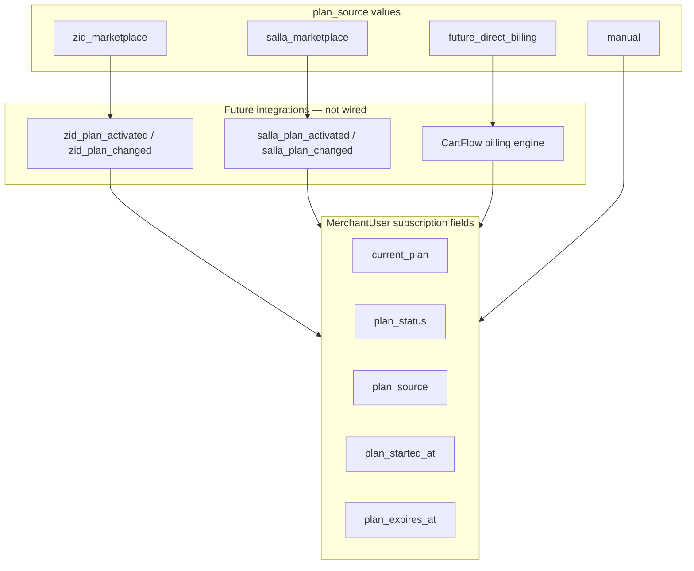

# CartFlow SaaS Foundation Phase 1 — Marketplace-First Plan System Audit

**Date (UTC):** 2026-06-07  
**Phase:** Subscription foundation — plan ownership, entitlements, marketplace readiness  
**Commit message:** `cartflow packages pricing foundation audit` *(implementation commit uses SaaS foundation message)*  
**Status:** Implemented architecture reference

**Builds on:** [cartflow_packages_pricing_foundation_audit_v1.md](cartflow_packages_pricing_foundation_audit_v1.md), [SYSTEM_SUMMARY.md](SYSTEM_SUMMARY.md)

**Explicitly not implemented:** Moyasar, HyperPay, Stripe, checkout, subscription charging, auto-renewal, invoices, payment pages, upgrade/downgrade UI, Zid/Salla billing webhooks.

---

## Executive summary

Phase 1 delivers a **marketplace-first subscription foundation** that supports future billing via **either** marketplace-managed plans **or** CartFlow direct billing — without hardcoding either model.

| Layer | Module | Purpose |
|-------|--------|---------|
| Canonical plans | `services/cartflow_plans_v1.py` | Starter / Growth / Pro + entitlement sets |
| Subscription state | `MerchantUser` columns + `services/merchant_subscription_v1.py` | `current_plan`, `plan_status`, `plan_source`, dates |
| Feature gates | `services/cartflow_entitlements_v1.py` | `has_feature()`, `is_starter()`, `is_growth()`, `is_pro()` |
| Schema | `schema_merchant_subscription.py` | Idempotent DDL on `merchant_users` |
| Dashboard | `GET /api/merchant/subscription` + `merchant_subscription.js` | Read-only current plan card |
| Marketplace prep | `MARKETPLACE_PLAN_EVENT_TYPES` + `preview_marketplace_plan_event()` | Event vocabulary only |

**Regression safety:** `CARTFLOW_PLAN_ENTITLEMENTS_ENFORCE` defaults **off** — all features remain allowed until ops enables enforcement. Orphan stores (no `merchant_user_id`) stay permissive.

---

## Part A — Billing ownership model (dual-path ready)

| `plan_source` | Meaning (future) |
|---------------|------------------|
| `manual` | Ops/admin assignment; default for signup |
| `zid_marketplace` | Plan from Zid App Marketplace subscription |
| `salla_marketplace` | Plan from Salla App Marketplace subscription |
| `future_direct_billing` | CartFlow-owned billing (Moyasar/Stripe/etc.) |

No source implies a specific payment processor — only **who assigns the plan**.

---

## Part B — Canonical plan layer

**Single source of truth:** `services/cartflow_plans_v1.py`

| Plan ID | Label | Entitlement count |
|---------|-------|-------------------|
| `starter` | Starter | 5 base features |
| `growth` | Growth | Starter + 9 Growth features |
| `pro` | Pro | Growth + 6 Pro features |

Entitlements align with [cartflow_packages_pricing_foundation_audit_v1.md](cartflow_packages_pricing_foundation_audit_v1.md).

---

## Part C — Merchant subscription state

**Storage:** `merchant_users` table (account-level — one subscription per merchant login)

| Field | Type | Default |
|-------|------|---------|
| `current_plan` | `VARCHAR(32)` | `starter` |
| `plan_status` | `VARCHAR(32)` | `active` |
| `plan_source` | `VARCHAR(32)` | `manual` |
| `plan_started_at` | `DATETIME` | `NULL` |
| `plan_expires_at` | `DATETIME` | `NULL` |

**API read:** `GET /api/merchant/subscription` → `{ ok, subscription: { ... read_only: true } }`

---

## Part D — Entitlements and feature gates

**Central module:** `services/cartflow_entitlements_v1.py`

| Helper | Behavior |
|--------|----------|
| `has_feature(subject, feature)` | `MerchantUser` or `Store` → bool |
| `is_starter(subject)` | True when plan is Starter (enforcement on only) |
| `is_growth(subject)` | True when plan is Growth |
| `is_pro(subject)` | True when plan is Pro |
| `is_at_least_growth(subject)` | Tier rank helper |
| `is_at_least_pro(subject)` | Tier rank helper |

**Enforcement gate:** `CARTFLOW_PLAN_ENTITLEMENTS_ENFORCE=1` — off by default.

**Phase 1 rule:** Do **not** wire `has_feature()` into recovery, VIP, WhatsApp, or widget paths until marketplace billing is live and merchants are migrated.

---

## Part E — Dashboard (read-only)

**Location:** `#page-settings` → card «الباقة الحالية»

**Displays:** plan label (Starter/Growth/Pro), source (Manual/Zid/Salla), status, start/expiry dates

**Does not display:** upgrade buttons, payment links, invoice history

**Script:** `static/merchant_subscription.js`

---

## Part F — Marketplace event vocabulary (architecture only)

Registered event types in `merchant_subscription_v1.MARKETPLACE_PLAN_EVENT_TYPES`:

| Event | Expected future use |
|-------|---------------------|
| `zid_plan_activated` | First marketplace subscription active |
| `zid_plan_changed` | Upgrade/downgrade/cancel from Zid |
| `salla_plan_activated` | First Salla marketplace subscription |
| `salla_plan_changed` | Plan change from Salla |

**Stub:** `preview_marketplace_plan_event(event_type, payload)` — validates type, logs, returns `architecture_ready_no_integration`. Does **not** mutate DB.

**Future wiring (Phase 2+):**

1. Webhook route per marketplace
2. Verify marketplace signature
3. Map payload plan slug → `normalize_plan_id()`
4. Set `plan_source` from `marketplace_plan_event_source_for_type()`
5. Update `plan_started_at` / `plan_expires_at` from marketplace period
6. Enable `CARTFLOW_PLAN_ENTITLEMENTS_ENFORCE` per merchant cohort

---

## Part G — Regression safety checklist

| Area | Status |
|------|--------|
| Widget | Unchanged — no `has_feature` in widget path |
| Recovery | Unchanged |
| VIP | Unchanged |
| WhatsApp send | Unchanged |
| Dashboard carts | Unchanged |
| Store identity | Unchanged |
| Purchase truth | Unchanged |
| Lifecycle | Unchanged |
| Onboarding | Unchanged — new signups get `starter` / `manual` / `active` defaults |
| Feature gates default | Permissive (enforcement off) |

**Tests:** `tests/test_cartflow_plans_entitlements_v1.py`

---

## Part H — Implementation map

| Artifact | Path |
|----------|------|
| Plan registry | `services/cartflow_plans_v1.py` |
| Entitlements | `services/cartflow_entitlements_v1.py` |
| Subscription service | `services/merchant_subscription_v1.py` |
| DDL | `schema_merchant_subscription.py` |
| ORM | `models.MerchantUser` subscription columns |
| API | `GET /api/merchant/subscription` in `main.py` |
| Dashboard UI | `templates/merchant_app.html` + `static/merchant_subscription.js` |
| Audit (this doc) | `docs/cartflow_saas_foundation_phase1_marketplace_plan_system_audit_v1.md` |

---

## Part I — Next phases (not in scope)

| Phase | Deliverable |
|-------|-------------|
| 2a | Zid marketplace webhook → `apply_marketplace_plan_event` (real mutation) |
| 2b | Salla marketplace webhook |
| 2c | Admin manual plan assignment UI |
| 3 | Wire `has_feature()` into VIP / multi-message / per-reason settings |
| 4 | Direct billing adapter (`future_direct_billing`) |
| 5 | Enable `CARTFLOW_PLAN_ENTITLEMENTS_ENFORCE` in production |

---

**End of audit.**
