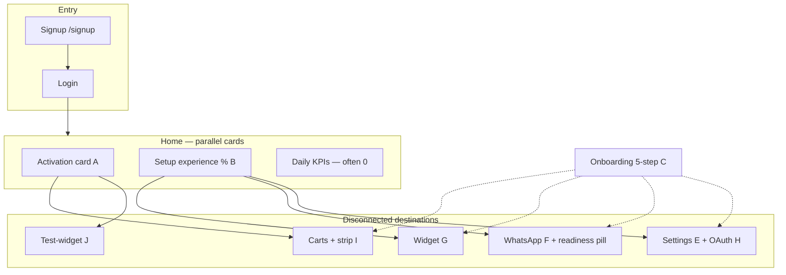
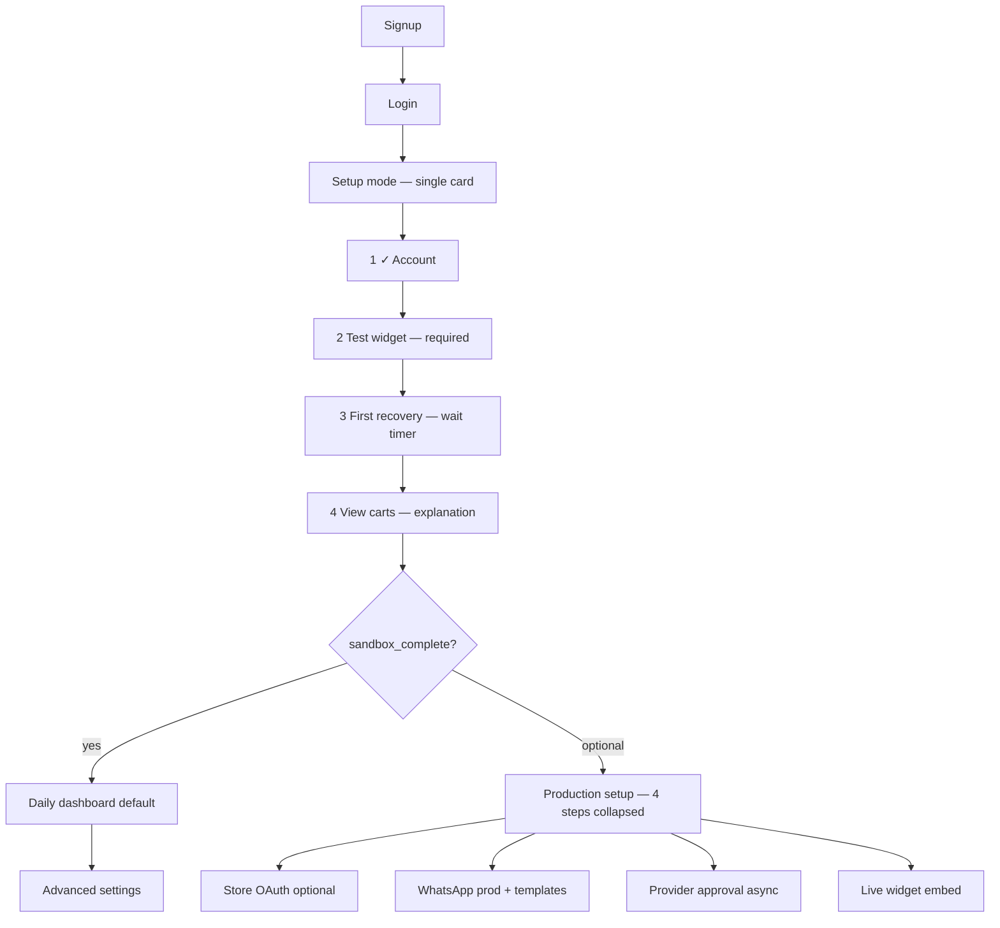

# CartFlow Setup Unification Audit v1

**Date (UTC):** 2026-05-19  
**Scope:** Read-only — map **all** merchant setup surfaces, judge whether they can merge into **one guided path**, and estimate founder-hour impact. **No** runtime changes.  
**Commit message:** `docs: add setup unification audit v1`

**Related:** `docs/cartflow_merchant_experience_audit_v1.md`, `docs/cartflow_founder_hours_reduction_v2.md`, `docs/cartflow_first_merchant_launch_checklist_v1.md`.

---

## Executive answer

| Question | Answer |
|----------|--------|
| **Can setup surfaces become ONE guided path?** | **Yes** — logically and technically; today they are **three parallel narratives** over the same store truth. |
| **Should daily dashboard stay separate?** | **Yes** — KPIs, carts, messages remain **Daily** after `activation_working` or `first_whatsapp_sent`. |
| **Unification without code today?** | **Partial** — founders can enforce playbook order; product still renders multiple cards. |
| **Estimated founder-hour reduction if unified (P0 product)** | **~25–45 min** per first sandbox merchant (**~90–150 min → ~50–90 min** on-call) |

---

## Part 1 — Map of current setup surfaces

### 1.1 Surface inventory

| # | Surface (merchant-visible) | DOM / route | Backend builder | Primary completion rules |
|---|---------------------------|-------------|-----------------|--------------------------|
| **A** | **Activation card** | `#ma-activation-root` on `page-home` | `merchant_activation_v1` + `merchant_dashboard_home_stage_v1` | Milestones: `first_cart`, `first_reason`, `first_scheduled`, `first_message`; layout prominent/compact/hidden |
| **B** | **Setup experience (% + checklist)** | `#ma-setup-experience-root` on `page-home` | `merchant_setup_experience_v1` ← `merchant_production_readiness_path_v1` | 4 merchant steps; `readiness_percent`; `remaining_setup_count`; production-oriented |
| **C** | **Onboarding 5-step (guided flow)** | Embedded in API / optional checklist HTML via `setupStepsHtml` | `merchant_onboarding_v1` | account → store (**OAuth + recovery_on**) → whatsapp → widget → test_ready |
| **D** | **Home → إعداد المتجر** | Sidebar `data-home-nav="setup"` | Same lazy summary payload | Focuses home on setup panel (B) |
| **E** | **Settings — حساب والمتجر** | `#settings` / `goTo('settings')` | `merchant_store_connection_v1` + recovery-settings | Zid OAuth `access_token`; store slug; recovery toggles |
| **F** | **WhatsApp setup** | `#whatsapp` | `merchant_whatsapp_settings` + `merchant_whatsapp_readiness_ui` | Number, `whatsapp_recovery_enabled`, templates JSON; readiness pill in topbar |
| **G** | **Widget setup** | `#widget` | recovery-settings / widget flags | `cartflow_widget_enabled`, embed snippet (`widget_loader.js`, `data-store`) |
| **H** | **OAuth (Zid)** | In-settings connect CTA | `GET /api/merchant/store-connection/zid/connect` → `/auth/callback` | Not a separate page; gates onboarding **store** step |
| **I** | **Carts onboarding strip** | `merchant_normal_carts_dashboard.html` `ref-onboarding` | `onboarding_visibility` from readiness | Blocking titles, sandbox notice — **third** setup hint on **السلال** |
| **J** | **Test path** | `/dashboard/test-widget` → `/demo/store?store_slug=…` | `merchant_activation_v1` | Scoped demo; not listed as a formal step in B or C |
| **K** | **Activation status API** | `GET /api/merchant/activation-status` | `build_merchant_activation_api_payload` | JSON for tools; duplicates A+C payload |

**Data spine (single source, multiple lenses):**

```text
evaluate_onboarding_readiness (cartflow_onboarding_readiness)
        ├─► merchant_onboarding_v1 (5 steps, stricter store/oauth)
        ├─► merchant_activation_v1 (milestones, test URL)
        ├─► merchant_onboarding_reality_v1 → production_readiness_path_v1
        │         └─► merchant_setup_experience_v1 (4 steps, %)
        └─► merchant_dashboard_home_stage_v1 (which cards show)
```

### 1.2 How surfaces appear together (today)

On **first login** (`home_stage=activation`), merchant typically sees **at once**:

1. **Activation card (A)** — *«تفعيل سريع — أول نجاح»* + **فتح متجر الاختبار**  
2. **Setup experience (B)** — *«متجرك قريب من التشغيل الكامل»* + **X / 4 مكتمل** + collapsible checklist (production-leaning steps)  
3. **Month summary + KPIs** — zeros (reads as “broken”) — **Daily** content mixed into setup phase  
4. Optional **home alerts** from `BLOCKER_COPY`  

After first send, layout may move to **activated** (A compact, B hidden via `hide_setup_card`) or still show B if production path incomplete.

**Settings (E–G)** are **destination pages** for incomplete steps — not a wizard; merchant must know which tab to open.

### 1.3 Rule conflicts (why fragmentation hurts)

| Topic | Onboarding 5-step (C) | Setup experience (B) | Activation (A) |
|-------|-------------------------|------------------------|----------------|
| **Store “done”** | OAuth `access_token` + `recovery_enabled` | “ربط المتجر وتفعيل الاسترجاع” (many internal codes) | Not required for milestones |
| **First success** | `test_ready` = cart **or** scheduled **or** sent | Step 4 “اختبار الإرسال” needs delivery-truth codes | **Test-widget** + milestones |
| **WhatsApp** | Number + flags (+ provider in non-sandbox) | “ربط واتساب **الإنتاج**” + “اعتماد الرسائل” | Hint: sandbox message OK |
| **Widget** | `widget_installed` flag | Part of store_basics codes | Implicit via test store |

Merchant can be **“working”** in A (mock send) while B shows **33%** and C stuck on **store** — classic support call.

---

## Part 2 — Can this become ONE guided setup path?

### Verdict: **YES** (recommended), with two phases

| Phase | Goal | Steps (single ordered path) | Surfaces replaced |
|-------|------|------------------------------|-------------------|
| **Sandbox setup** | First proof in &lt;1 session | 1 Account ✓ → 2 **Test widget** (J) → 3 **First recovery** → 4 **Understand result** (carts) | A + C test paths merged; B hidden until sandbox done |
| **Production setup** | Real WhatsApp + live embed | 5 Store/OAuth (optional branch) → 6 WhatsApp number + templates (F) → 7 Provider approval (async) → 8 Live widget (G) → 9 Verify delivery | B production steps only; no duplicate % on home |

**Technical feasibility (no architecture change):**

- One builder can **wrap** existing evaluators: `evaluate_onboarding_readiness` + `evaluate_merchant_onboarding_reality` → single `MerchantSetupPath` DTO.  
- UI: one `ma-setup-unified-root`; retire parallel innerHTML from A+B or demote A to **status chip** inside unified card.  
- **OAuth (H)** becomes step 5a **optional** (“للمزامنة مع زد”) not blocker for step 2 test.  
- **Do not merge** ops admin readiness (`/admin/*`) — stays Admin.

**What blocks “one click unify” today:** separate JS renderers (`applyMerchantActivation`, `applyMerchantSetupExperience`), different step counts (5 vs 4 vs 4 milestones), and production path codes leaking into merchant % before first mock send.

---

## Part 3 — Classification: Daily / Setup / Advanced / Admin

### 3.1 What **stays** — Daily dashboard

| Element | Location | When visible |
|---------|----------|--------------|
| KPI grid (سلال اليوم، مستردة، واتساب) | `page-home` | Always after setup complete; during setup show **muted** or below fold |
| Month summary | `page-home` | Same |
| **السلال** tabs (all / intervention / waiting / completed / VIP) | Top nav + sidebar | Primary operational surface |
| **التواصل → الرسائل** | Comms | Message history |
| Operational alerts (non-setup) | `ma-home-alerts-root` | Delivery issues, VIP — not OAuth reminders |

**Principle:** Daily = **what happened** and **what needs action today** — no % complete, no “ربط واتساب الإنتاج” before first mock send.

### 3.2 What **moves** — Setup (single home mode)

Consolidate into **Setup** until `setup_phase=sandbox_complete`:

| Current surface | Moves to unified Setup |
|-----------------|------------------------|
| A Activation card | Step status + primary CTA (test-widget) |
| B Setup experience % | One progress bar (same math, one label) |
| C Onboarding 5-step | Single checklist (reordered) |
| D Home «إعداد المتجر» | Default home tab while incomplete |
| I Carts onboarding strip | Inline on step “view result” only — not permanent strip |
| J Test-widget | **Step 2** deep link (required) |
| E Settings store basics | Step branch (OAuth optional) |
| F WhatsApp (sandbox subset) | Number + templates only in sandbox; prod steps gated |
| G Widget (live) | **Production setup** step 8 — not day-1 |

**Settings (E–G)** remain as **detail panels** opened from setup steps — not separate competing checklists on home.

### 3.3 What **becomes** — Advanced

| Feature | Today | After unification |
|---------|-------|-------------------|
| Recovery delay / attempts / multi-message | `#settings` / recovery-settings | **Advanced → تواصل** or “إعدادات متقدمة” |
| Exit intent copy | exit-intent-settings | Advanced |
| Trigger templates editor | trigger-templates | Advanced |
| VIP threshold & manual alerts | VIP tab + vip settings | Advanced |
| `whatsapp_provider_mode` display | WhatsApp tab | Advanced (read-only + help) |
| Production provider approval tracking | Setup experience steps 2–3 | **Advanced → Production** subsection (collapsed until sandbox done) |
| Platform env (`PRODUCTION_MODE`, Twilio) | Ops only | **Admin** (never merchant setup checklist) |

### 3.4 What stays **Admin** (unchanged)

| Surface | Audience |
|---------|----------|
| `/admin/support-diagnostics` | CartFlow ops |
| `/dev/recovery-health` | Ops |
| `merchant_onboarding` admin card | Ops dashboard |
| `cartflow_production_readiness` report | Ops |

---

## Part 4 — Current flow vs ideal flow

### 4.1 Current flow (as implemented)



**Merchant mental model today:** “Which card is real?” → founder explains.

### 4.2 Ideal flow (one guided path)



**Home layout rules (ideal):**

| `setup_phase` | Home shows |
|---------------|------------|
| `sandbox_incomplete` | Unified setup card only + minimal KPI ghost text |
| `sandbox_complete` | Daily KPIs + compact setup chip (“إكمال الإنتاج”) |
| `production_complete` | Daily only; setup hidden |

---

## Part 5 — Top confusion points (setup-specific)

| Rank | Confusion | Surfaces involved | Founder minutes lost |
|------|-----------|-------------------|----------------------|
| **1** | Two progress indicators (**milestones** vs **% مكتمل**) disagree | A + B | **12–20** |
| **2** | **Production WhatsApp** steps shown before sandbox proof | B (steps 2–3) vs A (mock OK) | **10–18** |
| **3** | **OAuth required** in C while **test-widget** works without token | C + H vs J | **15–30** |
| **4** | **Widget “enabled”** in DB vs paste snippet on Zid | C + G vs J | **10–25** |
| **5** | **Carts strip** adds third setup message on different tab | I vs home cards | **5–10** |

**Total addressable by unification (sandbox session):** **~52–103 min** → realistic **~25–45 min** saved after P0 (merchant still does work; founder stops reconciling narratives).

---

## Part 6 — Estimated founder-hours reduction

| Scenario | Today (v2 audit) | After unified Setup (P0 product) | After P0 + P1 |
|----------|------------------|----------------------------------|---------------|
| **Sandbox first merchant (on-call)** | **90–150 min** | **50–90 min** | **40–70 min** |
| **Production first merchant** | **6–12 h** | **5–10 h** (clearer prod subsection) | **4–8 h** |
| **Merchant #2+ sandbox** | **60–90 min** | **30–45 min** | **25–40 min** |

**Mechanism of savings:**

| Mechanism | Min saved |
|-----------|-----------|
| Single “current step” (no reconciling A/B/C) | 12–20 |
| Sandbox-before-OAuth ordering | 15–30 |
| Test-widget as step 2 (not hidden in competing CTAs) | 8–15 |
| Production steps hidden until sandbox complete | 10–18 |
| Remove carts strip duplication | 5–10 |

**30–60 min founder sandbox target:** Achievable for **repeat merchants** only after unified Setup + pre-staged env (`cartflow_founder_hours_reduction_v2.md`).

---

## Part 7 — Unification roadmap (P0 / P1 / P2) — documentation only

### P0 — One path, sandbox-first (highest ROI)

| ID | Change | Surfaces merged |
|----|--------|-----------------|
| **P0-1** | Single `MerchantSetupPath` DTO in `/api/dashboard/summary` | B + C + A → one `steps[]` |
| **P0-2** | One home card renderer; hide B when A active | Home |
| **P0-3** | Phase gate: production steps locked until `first_whatsapp_sent` | B |
| **P0-4** | OAuth = optional branch with copy | C, H, E |
| **P0-5** | Test-widget = step 2 with timer copy | A, J |
| **P0-6** | Remove or gate carts strip I until sandbox incomplete | I |

### P1 — Daily vs Setup chrome split

| ID | Change |
|----|--------|
| **P1-1** | `ma-onboarding-focus` returns: hide KPI/month until sandbox complete |
| **P1-2** | Top nav badge: “إعداد: 2/4” instead of second home card |
| **P1-3** | Settings tabs opened as step detail only |
| **P1-4** | WhatsApp readiness pill reflects **sandbox vs prod** mode |

### P2 — Advanced shelf + scale

| ID | Change |
|----|--------|
| **P2-1** | “إعدادات متقدمة” nav section |
| **P2-2** | Deprecate `GET /api/merchant/activation-status` as duplicate of summary |
| **P2-3** | Per-merchant setup state persistence for support |

---

## Part 8 — Verdict summary

| Dimension | Verdict |
|-----------|---------|
| **Unification possible?** | **PASS** (design) / **FAIL** (current UX — 3+ narratives) |
| **Daily dashboard separate?** | **PASS** — must remain after sandbox proof |
| **Setup consolidation** | **PARTIAL** today — playbook-only; **PASS** after P0 |
| **Advanced separation** | **FAIL** today — power settings mixed in Setup tabs |
| **Founder hour reduction** | **~25–45 min** sandbox (P0); production needs provider productization (P2) |

**Honest recommendation:** Treat **Merchant Setup Unification** as the **next merchant UX P0** — bigger impact than landing copy for onboarded-first merchants, and directly attacks experience audit **#3** (three setup progress UIs).

---

## Appendix — File reference (implementers)

| Concern | Module / asset |
|---------|----------------|
| Activation | `services/merchant_activation_v1.py`, `static/merchant_dashboard_lazy.js` |
| Setup % | `services/merchant_setup_experience_v1.py`, `merchant_production_readiness_path_v1.py` |
| 5-step onboarding | `services/merchant_onboarding_v1.py` |
| Home layout | `services/merchant_dashboard_home_stage_v1.py` |
| OAuth | `services/merchant_store_connection_v1.py`, `main.py` `/auth/callback` |
| WhatsApp UI | `templates/partials/whatsapp_readiness_card.html`, `#whatsapp` in `merchant_app.html` |
| Widget | `#widget`, `general_settings` embed |
| Summary API | `main.py` `GET /api/dashboard/summary` |
| Test path | `main.py` `GET /dashboard/test-widget` |

---

## Document control

| Item | Value |
|------|--------|
| Runtime changes | **None** |
