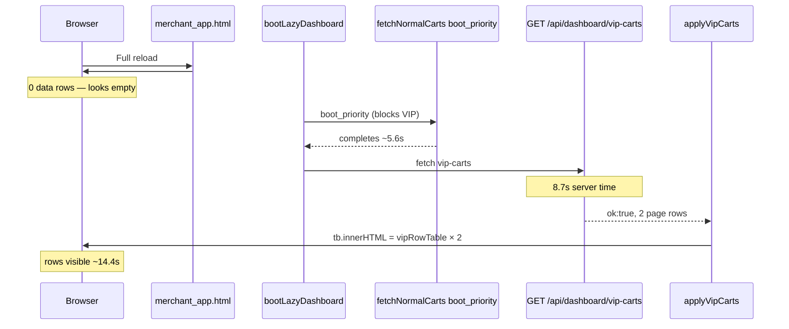

# VIP Disappearing Rows — Root-Cause Audit (read-only)

**Date (UTC):** 2026-06-06  
**Environment:** `https://smartreplyai.net` (production only — no localhost)  
**Scope:** Audit only — **no fixes, retries, or fallbacks applied**

---

## Executive summary

Production reproduction proves that **existing VIP rows do not vanish because the API returns empty data** in the captured run. After refresh, rows disappear from the DOM **before any VIP API response** because:

1. Full page reload replaces `#ma-tbody-vip-page` with the **lazy-shell skeleton** (`…`).
2. `bootLazyDashboard()` **defers** the VIP fetch until `fetchNormalCarts("boot_priority")` finishes.
3. The VIP endpoint is slow (~8.7s in this run), so the table stays at **0 data rows** for **~14.4s**.

Merchants perceive this as “my VIP carts disappeared.” Rows return when `applyVipCarts()` finally runs — matching “sometimes rows return later / another refresh required.”

A **secondary, code-proven path** paints a **permanent** empty state when the API returns `ok: true` with `merchant_vip_page_rows: []` (e.g. VIP threshold unset or DB read failure). That path was **not triggered** in this production capture but is the only client line that writes the «لا توجد سلال VIP نشطة» empty row.

---

## 1. Production reproduction

### Flow

| Step | Evidence |
|------|----------|
| Signup merchant, VIP threshold 500, create 1299 SAR cart | `scripts/_vip_disappearing_rows_audit_out/setup/after_vip_cart_widget.png` |
| **Before refresh:** 2 VIP rows visible | `01_before_refresh_rows_visible.png` |
| **Browser refresh** on `#vip` | `reload_ms: 1950` |
| **After refresh:** skeleton only → rows at ~14.4s | `02_after_refresh_final.png`, DOM timeline below |

**Auth (audit merchant):** `cf.vip.audit.86126877c1@smartreplyai.net` (ephemeral signup for this audit)

### Screenshots

| File | State |
|------|--------|
| `scripts/_vip_disappearing_rows_audit_out/01_before_refresh_rows_visible.png` | 2 rows (1299 + 10000 ريال) |
| `scripts/_vip_disappearing_rows_audit_out/02_after_refresh_final.png` | Final state after 20s poll (2 rows restored) |

---

## 2. API response when the table looks empty

During the **empty-looking window** (polls 0–98, ~1.9s–14.3s after reload), **no VIP dashboard fetch had completed yet** in the instrumented client hook. The isolated API probe **after** the window still returned full data.

### When DOM had 0 data rows (skeleton phase)

No completed `/api/dashboard/vip-carts` response from the boot fetch yet. Template skeleton only.

### First completed VIP fetch (boot chain)

```json
{
  "ok": true,
  "merchant_vip_page_rows": [ /* 2 rows */ ],
  "merchant_nav_badge_vip": 2,
  "merchant_vip_threshold_configured": true,
  "merchant_vip_alert_state_ar": "سلال VIP نشطة: 2",
  "dashboard_partial": null
}
```

| Field | Value |
|-------|--------|
| Row count | **2** |
| `ok` | **true** |
| `dashboard_partial` | **null** (absent) |
| `dashboard_timeout` | **absent** |
| Fetch duration | **8713 ms** |
| HTTP status | **200** |

Full payload: `scripts/_vip_disappearing_rows_audit_out/vip_disappearing_rows_audit.json` → `phase.after_refresh.vip_fetches_on_reload[1].payload`

### Isolated API after refresh (independent `fetch`)

Same: `row_count: 2`, `ok: true`, `dashboard_partial: null`.

**Conclusion:** In this reproduction, the empty table is **not** caused by an empty API payload. It is caused by **deferred + slow fetch** while the DOM shows the boot skeleton.

---

## 3. When does disappearance happen?

| Phase | Verdict | Evidence |
|-------|---------|----------|
| Before API response | **YES — primary cause** | DOM timeline: `rows: 0`, `skel: true`, `empty_vip: false` for polls 0–98 (~14.3s); `vip_fetch_start` at ~5.6s; `vip_fetch_done` at ~14.3s |
| During render (`applyVipCarts`) | Rows appear **in same poll** as fetch completes | Poll 99 at `14451.6ms`: `rows: 2`, `skel: false` |
| After render | No overwrite in this run | Both network VIP responses had `row_count: 2`; no third fetch |
| Later request overwrites valid state | **Not observed** | Only 2 VIP fetches on reload; `refreshCoreSections` (which also fetches VIP) is **never called** in the repo |

`empty_seen_at_ms: null` — the «لا توجد سلال VIP نشطة» string from `vipPageEmptyHtml()` **never appeared** during the 20s observation window.

---

## 4. VIP fetch log (instrumented)

Client hook (`scripts/_vip_disappearing_rows_audit.py` → `VIP_FETCH_HOOK`):

| Event | Timestamp (perf) | Detail |
|-------|------------------|--------|
| `vip_fetch_start` | `t0 ≈ 5622 ms` after reload | `GET /api/dashboard/vip-carts` |
| `vip_fetch_done` | `duration_ms: 8713` | `status: 200`, `row_count: 2`, `ok: true` |
| DOM snapshot `after_vip_fetch_done` | same ms | `data_row_filtered: 0`, `has_skel: true` ( **`applyVipCarts` not run yet** — snapshot is inside fetch wrapper before `.then(applyVipCarts)`) |
| Render applied | ~`14451 ms` poll | `rows: 2`, `has_amount: true` |
| Render cleared (empty message) | **not observed** | `empty_vip: false` entire timeline |

Network sequence on reload:

1. `GET /api/dashboard/vip-carts?_audit_before=…` — audit probe, 2 rows (parallel to page boot)
2. `GET /api/dashboard/vip-carts` — boot deferred fetch, 2 rows, **8713 ms**

---

## 5. Request sequence (refresh → empty-looking → rows back)



---

## 6. Exact code path that removes rows

### A) Primary (proven in production) — refresh wipes DOM; VIP paint delayed

| # | File | Function / location | What happens |
|---|------|---------------------|--------------|
| 1 | `templates/merchant_app.html` | `#ma-tbody-vip-page` **line 421** | On reload, server renders skeleton: `<tr class="ma-dash-skel-row">…</tr>` — **previous rows gone** |
| 2 | `static/merchant_dashboard_lazy.js` | `bootLazyDashboard` **lines 3345–3356** | `fetchNormalCarts("boot_priority").finally(...)` — VIP fetch **does not start** until normal-carts boot completes |
| 3 | `static/merchant_dashboard_lazy.js` | `bootLazyDashboard` **lines 3356–3361** | VIP `fetch` → `applyVipCarts` |
| 4 | `static/merchant_dashboard_lazy.js` | `applyVipCarts` **lines 2862–2863** | **Restores** rows: `tb.innerHTML = pr.map(vipRowTable).join("")` |

**Gap between steps 1 and 4** = user-visible “disappeared” window (**~14.4s** this run).

Unlike normal carts, VIP has **no** `hydrateNormalCartsCache()` / sessionStorage stale-while-revalidate — refresh always starts from skeleton.

### B) Secondary (code-proven, not triggered this run) — API returns empty rows

| File | Function | Lines | Condition |
|------|----------|-------|-----------|
| `static/merchant_dashboard_lazy.js` | `applyVipCarts` | **2858–2860** | `if (!pr.length) tb.innerHTML = vipPageEmptyHtml()` |
| `main.py` | `_vip_priority_alert_rows_for_lc_clause` | **14101–14104** | `vip_th is None` → `return []` |
| `main.py` | `_api_json_dashboard_vip_carts` | **19951–19953** | DB exception → `vip_raw = []` |

Empty-state HTML text: «لا توجد سلال VIP نشطة تحتاج تدخلك الآن» (`vipPageEmptyHtml`, lines 2803–2810).

### C) Error path

| File | Function | Lines | Condition |
|------|----------|-------|-----------|
| `static/merchant_dashboard_lazy.js` | `applyVipCarts` | **2832–2834** | `!d.ok` → `applyVipCartsFailed()` |
| `static/merchant_dashboard_lazy.js` | `applyVipCartsFailed` | **2822–2823** | `tb.innerHTML = vipPageErrorHtml()` |

---

## 7. Root cause statement

| Item | Value |
|------|--------|
| **Root cause (primary)** | Full page refresh resets VIP tbody to lazy skeleton; VIP data fetch is **deferred behind normal-carts boot** and **slow**; no VIP client-side cache — table shows zero data rows until `applyVipCarts` runs |
| **Root cause (intermittent permanent empty)** | If API returns `ok: true` + `merchant_vip_page_rows: []`, `applyVipCarts` **line 2859–2860** replaces table with empty-state HTML (threshold unset or backend empty list) |
| **File** | `static/merchant_dashboard_lazy.js` (primary deferral: `bootLazyDashboard`; empty paint: `applyVipCarts`) |
| **Function** | `bootLazyDashboard` (deferral), `applyVipCarts` (render / clear) |
| **Exact line responsible for clearing to empty message** | **2859–2860** (`tb.innerHTML = vipPageEmptyHtml()`) |
| **Exact lines responsible for delayed restore** | **3346–3361** (defer VIP until `boot_priority` completes), **2862–2863** (paint rows) |
| **Template line responsible for post-refresh wipe** | `templates/merchant_app.html` **421** |

---

## 8. Why “sometimes another refresh” helps

- **Slow path:** If the merchant navigates away or assumes failure before ~14s, a second refresh may hit a faster normal-carts boot + VIP response.
- **Threshold race (secondary):** If settings/threshold are not loaded when VIP query runs, backend returns `[]` → empty-state HTML until a later fetch sees threshold + carts.
- **No VIP refetch on refresh token:** `checkRefreshState` only schedules `scheduleNormalCartsTokenRefetch` — VIP is **not** auto-refetched on token change (unlike normal carts).

---

## 9. Artifacts

| Artifact | Path |
|----------|------|
| Full JSON report | `scripts/_vip_disappearing_rows_audit_out/vip_disappearing_rows_audit.json` |
| Audit script (read-only) | `scripts/_vip_disappearing_rows_audit.py` |
| Before screenshot | `scripts/_vip_disappearing_rows_audit_out/01_before_refresh_rows_visible.png` |
| After screenshot | `scripts/_vip_disappearing_rows_audit_out/02_after_refresh_final.png` |

---

## 10. Out of scope (per task)

No code patches, retries, or fallbacks were added. Recommended fix directions are intentionally omitted; this document is evidence-only.
