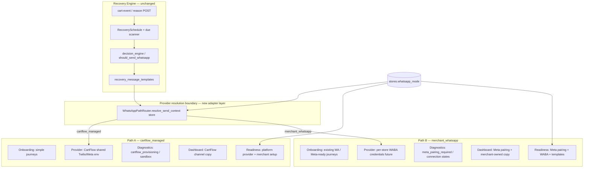

# CartFlow — WhatsApp Dual Architecture V1

**Date (UTC):** 2026-06-30  
**Status:** Architecture design (no recovery-engine changes)  
**Builds on:** `merchant_whatsapp_mode_v1.py`, `merchant_whatsapp_onboarding_journeys_v1.py`, `merchant_whatsapp_journey_execution_v1.py`, `merchant_whatsapp_readiness_presentation_v1.py`, Phase 1 WhatsApp mode audit

---

## Executive summary

CartFlow supports two **mutually exclusive WhatsApp paths**. Each path owns its own readiness, diagnostics, onboarding, sending provider, and dashboard messaging. The **recovery engine** (scheduling, delays, templates, lifecycle, Purchase Truth) stays unchanged — it calls a thin **provider resolution boundary** only at send time.

| Path | Key | Merchant mental model |
|------|-----|------------------------|
| **A — CartFlow Shared WhatsApp** | `cartflow_managed` | CartFlow sends from a shared production channel; merchant configures recovery only |
| **B — Merchant-Owned WhatsApp** | `merchant_whatsapp` | Customer messages come from the merchant's own WhatsApp Business / WABA identity |

**Default for new stores:** Path A.  
**Existing stores:** remain compatible via inferred path + preserved fields (see §8).

---

## Design principles

1. **Recovery engine is path-agnostic** — `should_send_whatsapp()`, `RecoverySchedule`, multi-message, VIP lane, idempotency, and Purchase Truth gates are untouched.
2. **Path is explicit** — `stores.whatsapp_mode` is the single path selector (`cartflow_managed` | `merchant_whatsapp`).
3. **Journey ≠ path** — onboarding journey (`whatsapp_onboarding_journey`) describes *how* the merchant set up their number; path describes *who* sends. They compose but do not collapse.
4. **Journey completion ≠ sending readiness** — already enforced in `merchant_whatsapp_journey_execution_v1.py`; dual architecture extends this to path-specific sending readiness.
5. **Honest merchant copy** — each path shows its own pending reasons, next actions, and blockers; no cross-path leakage (e.g. Path B must not show CartFlow provisioning when Meta pairing is the blocker).
6. **Switchable later** — changing path preserves merchant settings; path-specific connection state is re-evaluated, not deleted.

---

## Architecture overview



**Send flow (only change at the edge):**

```
recovery engine decides message + phone
    → WhatsAppPathRouter.resolve_send_context(store)
    → PathAProvider | PathBProvider (implements shared SendAdapter contract)
    → existing delivery truth hooks (unchanged interface)
```

---

## Path definitions

### Path A — CartFlow Shared WhatsApp (`cartflow_managed`)

| Dimension | Behavior |
|-----------|----------|
| **Sender identity** | CartFlow-operated WhatsApp number(s) — platform `TWILIO_*` / future shared Meta WABA |
| **Merchant configures** | Recovery toggle, delays, templates, optional display number for VIP/alerts |
| **Merchant does not configure** | WABA, Meta Business Manager, webhooks, provider tokens |
| **Production readiness** | Platform `whatsapp_configured` + `provider_ready` + merchant number saved + recovery enabled |
| **Typical pending reasons** | `cartflow_provisioning` (ops/env), sandbox notice (non-production env) |
| **Onboarding journeys** | `no_whatsapp_business`, `new_number`, default guided path |
| **Dashboard tone** | «CartFlow يتولى الإرسال» — no Meta terminology in default UX |

### Path B — Merchant-Owned WhatsApp (`merchant_whatsapp`)

| Dimension | Behavior |
|-----------|----------|
| **Sender identity** | Merchant's WhatsApp Business number / WABA |
| **Merchant configures** | Number, Meta Business Platform pairing, future Embedded Signup / token storage |
| **Production readiness** | Journey complete **and** Meta coexistence / WABA connection **and** template policy satisfied |
| **Typical pending reasons** | `meta_pairing_required`, `connection_action_required`, `template_approval_pending` |
| **Onboarding journeys** | `existing_whatsapp_business`, `meta_ready` |
| **Dashboard tone** | «واتساب المتجر» — explicit Meta pairing steps when sending not ready |

---

## Six independent layers (V1 contract)

Each path implements the same **interface shape**; implementations differ.

### 1. Readiness (`evaluate_whatsapp_path_readiness`)

| | Path A | Path B |
|---|--------|--------|
| **Module (target)** | `services/whatsapp_path_a_readiness_v1.py` | `services/whatsapp_path_b_readiness_v1.py` |
| **Facade** | `services/whatsapp_dual_readiness_v1.py` → dispatches on `whatsapp_mode` |
| **Merchant setup complete** | number + `whatsapp_recovery_enabled` | same |
| **Sending ready** | platform provider ready | merchant WABA + Meta pairing + delivery truth |
| **Output keys** | `path`, `merchant_setup_ready`, `sending_ready`, `readiness_overall`, `dimensions[]` | same shape |

Existing `evaluate_whatsapp_connection_readiness()` becomes the **Path B–leaning** evaluator today; V1 refactor wraps it behind the facade without changing recovery flags.

**Rule:** `readiness_overall = ready` only when **both** merchant setup and path-specific sending gates pass.

### 2. Diagnostics (`build_whatsapp_path_diagnostics`)

| | Path A | Path B |
|---|--------|--------|
| **Purpose** | Explain why «واتساب جاهز» is ✗ under shared channel | Explain Meta pairing / WABA / template blockers |
| **Pending reason enum** | `cartflow_provisioning`, `sandbox_mode_active`, `platform_provider_issue` | `meta_pairing_required`, `waba_not_connected`, `template_not_approved` |
| **Admin surface** | `/admin/whatsapp` row + ops env flags | same row + merchant connection state |
| **Merchant surface** | checklist dimension notes (read-only) | checklist + Meta pairing instruction block |

Existing `merchant_whatsapp_readiness_diagnostic_v1.py` gains a `path` discriminator; conditions traced per path, not mixed.

### 3. Onboarding (`build_whatsapp_path_onboarding`)

| | Path A | Path B |
|---|--------|--------|
| **Journey options shown** | `no_whatsapp_business`, `new_number` (recommended subset) | `existing_whatsapp_business`, `meta_ready`, `new_number` |
| **Completion criteria** | number saved + recovery enabled (unchanged) | same for CartFlow-side setup; Meta steps are **sending** readiness, not journey |
| **Path switch CTA** | «استخدام واتساب CartFlow المشترك» | «استخدام واتساب المتجر» |

Existing `merchant_whatsapp_onboarding_journeys_v1.py` filters `_JOURNEY_OPTIONS` by path; journey persistence fields unchanged.

### 4. Sending provider (`WhatsAppPathRouter` + adapters)

| | Path A | Path B |
|---|--------|--------|
| **Provider key** | `cartflow_shared_twilio` → future `cartflow_shared_meta` | `merchant_waba_meta` |
| **Credentials scope** | Platform env only | Per-store record (future `store_whatsapp_provider_config`) |
| **Recovery send entry** | `send_whatsapp()` resolves adapter from store | same function, different adapter |
| **VIP / merchant alerts** | Platform sender; VIP destination = merchant phone | Merchant sender; VIP may share merchant number |

**Hard boundary:** `services/whatsapp_send.py` adds only:

```python
def _resolve_send_adapter(store):
    from services.whatsapp_path_router_v1 import resolve_send_adapter
    return resolve_send_adapter(store)
```

Adapters implement `SendAdapter.send(to, body, *, store, context) -> SendResult`. Recovery queue, retry, and logging call sites unchanged.

**V1 scope:** router returns today's Twilio/mock behavior for Path A; Path B returns explicit `not_configured` until per-store Meta adapter lands — dashboard already communicates this honestly.

### 5. Dashboard messaging (`build_whatsapp_path_presentation`)

| Section | Path A copy | Path B copy |
|---------|-------------|-------------|
| **Mode line** | «متابعة العملاء عبر واتساب CartFlow» | «متابعة العملاء عبر واتساب المتجر» |
| **حالة المسار** | Journey badge (shared) | Journey badge (shared) |
| **حالة الإرسال** | «قيد التجهيز بواسطة CartFlow» / «جاهزة للإرسال» | «واتساب لم يُربط بمنصة الأعمال بعد» / Meta steps |
| **الخطوة التالية** | CartFlow provisioning / sandbox notice | Business Platform connect steps |
| **Forbidden cross-path** | No Meta pairing UI on Path A | No «قيد التجهيز بواسطة CartFlow» when only Meta pairing blocks |

Existing `merchant_whatsapp_readiness_presentation_v1.py` splits into path-specific builders merged by facade; recent `meta_pairing_required` fix becomes Path B canonical behavior.

### 6. Path switching (`apply_whatsapp_path_switch`)

**Trigger:** merchant selects mode in Advanced Options or explicit «تغيير مسار الإرسال» flow.

| Action | Behavior |
|--------|----------|
| **Persist** | `stores.whatsapp_mode` |
| **Preserve** | `store_whatsapp_number`, `whatsapp_recovery_enabled`, templates, journey key + status, recovery settings |
| **Re-evaluate** | connection readiness, presentation, pending_reason (immediate) |
| **Do not auto-clear** | number, journey, recovery toggle |
| **Safety copy** | existing `JOURNEY_CHANGE_SAFETY_AR` extended: «قد تتغير خطوات الإرسال حسب المسار الجديد» |
| **Sending in flight** | no interruption — adapter resolved per job at send time |

**Switch matrix (V1):**

| From → To | Merchant impact |
|-----------|-----------------|
| A → B | Sending may stop until Meta pairing complete; dashboard switches to Path B messaging |
| B → A | Meta steps hidden; sending resumes when platform channel ready |
| Same path | no-op |

---

## Data model (V1)

### Existing fields (unchanged)

| Field | Role |
|-------|------|
| `whatsapp_mode` | Path selector (`cartflow_managed` \| `merchant_whatsapp`) |
| `whatsapp_onboarding_journey` | Onboarding sub-path |
| `whatsapp_onboarding_journey_status` | Journey execution state |
| `store_whatsapp_number` | Merchant display / VIP / Path B sender number |
| `whatsapp_recovery_enabled` | Merchant toggle |
| `whatsapp_provider_mode` | Ops/testing sandbox label — **not** path selector |

### New fields (Phase 2+ — documented now, not required for V1 presentation)

| Field | Path | Purpose |
|-------|------|---------|
| `whatsapp_path_switched_at` | both | Audit / support |
| `whatsapp_path_previous` | both | Rollback visibility |
| `store_whatsapp_provider_config` (JSON) | B | Encrypted WABA phone_number_id, waba_id, token ref |
| `whatsapp_meta_pairing_status` | B | `not_started` \| `pending` \| `connected` \| `expired` |

V1 can ship **facade + presentation + diagnostics split** without new columns; Path B sending adapter waits on `store_whatsapp_provider_config`.

---

## Backward compatibility

### Existing production stores

| Store signal | Inferred path | Notes |
|--------------|---------------|-------|
| `whatsapp_mode` null / missing | `cartflow_managed` | DDL default already set |
| `whatsapp_mode = merchant_whatsapp` | Path B | Advanced opt-in preserved |
| `journey = existing_whatsapp_business` + any mode | Journey unchanged | Presentation follows **mode**, not journey alone |
| Stores with number + recovery, sandbox env | Path A or B per mode | Sandbox notice is path-aware but env-driven |

**Migration rule:** no bulk rewrite. `normalize_whatsapp_mode()` continues to default null → `cartflow_managed`.

**Regression guard:** stores that completed journey before dual architecture see the same journey badge; only **sending** panel copy changes to match path (fixes coexistence mismatch already shipped in `meta_pairing_required`).

---

## Admin & ops visibility

`/admin/whatsapp` columns gain explicit **Path** (already `whatsapp_mode_label_ar`) and **Path readiness** split:

| Column | Source |
|--------|--------|
| Path | `whatsapp_mode_label_ar` |
| Merchant setup | journey status + number present |
| Sending readiness | path facade `sending_ready` |
| Pending reason | path facade `pending_reason` |
| Provider | path adapter key (read-only) |

Ops diagnostics (`merchant_whatsapp_readiness_diagnostic_v1`) accept `?path=` override for support.

---

## Explicit non-goals (V1 design)

| Area | Status |
|------|--------|
| Recovery engine / scheduler / due scanner | **No changes** |
| Purchase Truth / lifecycle authority | **No changes** |
| Provider env vars (Twilio platform) | **No changes** |
| Template runtime resolution | **No changes** |
| Billing / entitlements enforcement | **No changes** |
| Embedded Signup UI | Future (Path B Phase 2) |
| Per-store Meta token storage | Future (Path B Phase 2) |

---

## Module map (target layout)

```
services/
  whatsapp_dual_readiness_v1.py       # facade: dispatch by whatsapp_mode
  whatsapp_path_router_v1.py          # resolve_send_adapter(store)
  whatsapp_path_a_readiness_v1.py     # Path A readiness + diagnostics + presentation
  whatsapp_path_b_readiness_v1.py     # Path B (wraps connection_readiness + meta pairing)
  whatsapp_path_a_presentation_v1.py
  whatsapp_path_b_presentation_v1.py
  whatsapp_send_adapters/
    cartflow_shared_twilio_v1.py      # Path A — wraps existing send_whatsapp_real/mock
    merchant_waba_meta_v1.py          # Path B — stub until credentials exist
  merchant_whatsapp_mode_v1.py        # existing — path constants + normalize
  merchant_whatsapp_onboarding_journeys_v1.py  # filter journeys by path
  merchant_whatsapp_readiness_presentation_v1.py  # thin merge → path builders
```

---

## Implementation phases

| Phase | Deliverable | Touches recovery? |
|-------|-------------|-------------------|
| **V1.0 (design + presentation)** | This doc; path-aware presentation/diagnostics/onboarding filter; admin path column | No |
| **V1.1 (router stub)** | `WhatsAppPathRouter` returns Path A adapter only; Path B returns structured not-ready | Edge only |
| **V1.2 (Path B send)** | Per-store Meta adapter behind router | Edge only |
| **V1.3 (Path A Meta shared)** | Shared WABA sender for Path A | Edge only |

---

## Acceptance criteria (V1.0 presentation)

For a store on **Path B** with `existing_whatsapp_business`, journey complete, sending not ready:

1. حالة المسار: ✓ مكتمل  
2. حالة الإرسال: Meta-not-linked copy (not CartFlow provisioning)  
3. الخطوة التالية: Business Platform instruction  
4. `pending_reason = meta_pairing_required`  
5. No «قيد التجهيز بواسطة CartFlow»  
6. No «لا يوجد إجراء مطلوب منك حالياً» when sending not ready  

For a store on **Path A**, same merchant setup, platform not provisioned:

1. Journey complete badge unchanged  
2. حالة الإرسال: «قيد التجهيز بواسطة CartFlow»  
3. `pending_reason = cartflow_provisioning`  
4. No Meta pairing block  

Path switch re-renders the correct set within one settings save + dashboard refresh.

---

## Related documents

- `docs/cartflow_whatsapp_production_strategy_phase1_whatsapp_mode_architecture_audit_v1.md`
- `docs/cartflow_whatsapp_journey_completion_readiness_separation_v1.md`
- `docs/cartflow_whatsapp_readiness_merchant_presentation_v1.md`
- `docs/cartflow_whatsapp_production_reality_phase1_architecture_audit_v1.md`

---

**End of design.**
