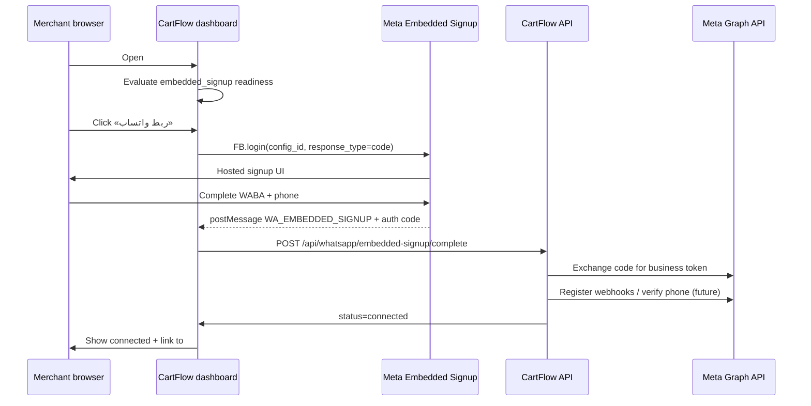
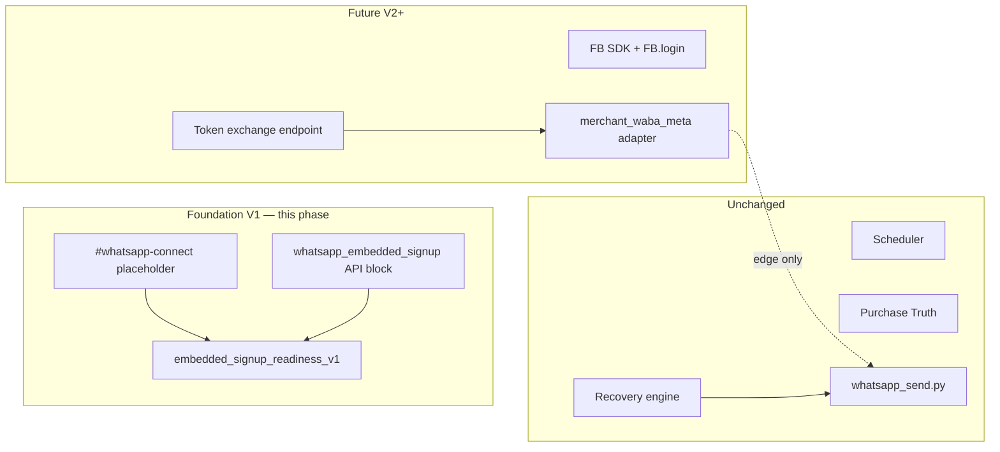

# CartFlow — WhatsApp Embedded Signup Foundation V1

**Date (UTC):** 2026-06-30  
**Status:** Architecture + foundation (no send / scheduler / recovery / Purchase Truth changes)  
**Path:** B — Merchant-Owned WhatsApp (`merchant_whatsapp`)  
**Builds on:** [cartflow_whatsapp_dual_architecture_v1.md](cartflow_whatsapp_dual_architecture_v1.md)

---

## Executive summary

Embedded Signup is Meta’s **one-click onboarding** flow for Tech Providers and Solution Partners. CartFlow V1 prepares the **architecture**, **readiness states**, and a **placeholder merchant route** (`/dashboard#whatsapp-connect`) without enabling token exchange, Cloud API send, or recovery-path changes.

| Deliverable | Status |
|-------------|--------|
| Meta flow research + required assets | This document §2–3 |
| Readiness states (`not_started` … `failed`) | `merchant_whatsapp_embedded_signup_readiness_v1.py` |
| Placeholder dashboard route | `#whatsapp-connect` + `merchant_whatsapp_connect.js` |
| API block (read-only) | `whatsapp_embedded_signup` in recovery-settings |
| Production sending | **Unchanged** |
| Recovery engine / scheduler / Purchase Truth | **Unchanged** |

---

## Part 1 — Meta Embedded Signup flow (research summary)

**Source:** [Meta Embedded Signup Implementation (v4)](https://developers.facebook.com/docs/whatsapp/embedded-signup/implementation/) (updated Jun 2026).

### 1.1 What Embedded Signup does

1. Merchant clicks **Login with Facebook** on CartFlow (`#whatsapp-connect`).
2. Meta JavaScript SDK opens Facebook Login for Business with a **Configuration ID**.
3. Merchant completes WABA / phone setup in Meta’s hosted UI (desktop + mobile).
4. On success, Meta returns to the spawning window:
   - **`WA_EMBEDDED_SIGNUP` message event** — `waba_id`, `phone_number_id`, `business_id`, optional asset IDs
   - **`FB.login` callback** — exchangeable **`code`** (TTL **30 seconds**)
5. CartFlow server exchanges `code` → **business access token** (server-to-server only).
6. CartFlow completes onboarding API calls (Tech Provider vs Solution Partner paths differ).
7. **`account_update` webhook** fires when customer completes flow (backup / audit).

**Deprecation note:** Embedded Signup v2/v3 deprecated **2026-10-15** — CartFlow targets **v4** (configuration-driven, Facebook Login for Business).

### 1.2 CartFlow pre-requisites (platform / ops)

| Prerequisite | Detail |
|--------------|--------|
| Meta program | **Tech Provider** (recommended for CartFlow SaaS) or Solution Partner |
| Business verification | Meta Business Portfolio verified |
| App Review | **Advanced access** to `whatsapp_business_messaging` + `whatsapp_business_management` |
| SSL | HTTPS on all Embedded Signup host domains |
| Webhooks | App subscribed to **`account_update`**; messages field for future send |
| Domain allowlist | `smartreplyai.net` (+ staging) in Client OAuth **Allowed domains** and **Valid OAuth redirect URIs** |

### 1.3 Merchant flow (future — one-click)



**V1 stops before `POST /api/whatsapp/embedded-signup/complete`** — placeholder UI only.

---

## Part 2 — Required Meta assets

### 2.1 App ID (`META_WHATSAPP_APP_ID` / `WHATSAPP_APP_ID`)

| Attribute | Detail |
|-----------|--------|
| **What** | Facebook / Meta app identifier |
| **Where** | App Dashboard → Settings → Basic |
| **CartFlow use** | `FB.init({ appId })` on connect page |
| **Storage** | Platform env only — **never** exposed to merchant API |
| **Existing** | Partial — platform `WHATSAPP_*` env used for admin Meta probe |

### 2.2 Configuration ID (`META_WHATSAPP_CONFIGURATION_ID`)

| Attribute | Detail |
|-----------|--------|
| **What** | Facebook Login for Business configuration ID |
| **Where** | App Dashboard → Facebook Login for Business → **Configurations** |
| **How to create** | Template: *WhatsApp Embedded Signup Configuration With 60 Expiration Token* **or** custom → login variation **WhatsApp Embedded Signup** |
| **CartFlow use** | `FB.login({ config_id, response_type: 'code', override_default_response_type: true })` |
| **Storage** | Platform env only |

### 2.3 App Secret (`META_WHATSAPP_APP_SECRET`)

| Attribute | Detail |
|-----------|--------|
| **What** | Server-side secret for OAuth code exchange |
| **Where** | App Dashboard → Settings → Basic → App Secret |
| **CartFlow use** | `GET /oauth/access_token` server-to-server only |
| **Storage** | Platform env / secrets manager — never client |

### 2.4 WABA permissions (App Review + Configuration)

| Permission | Required | Purpose |
|------------|----------|---------|
| `whatsapp_business_messaging` | **Yes** (Advanced) | Send/receive on behalf of onboarded merchants |
| `whatsapp_business_management` | **Yes** (Advanced) | WABA settings, templates, phone assets |
| `business_management` | Solution Partner LoC sharing | CartFlow as **Tech Provider** uses **business tokens** per merchant — LoC optional |

**Configuration rule:** Select only assets the merchant flow needs (typically **WhatsApp account** + Cloud API). Extra assets (Catalogs, Ads) increase abandonment.

### 2.5 System user requirements

| Role | CartFlow model | System user |
|------|----------------|-------------|
| **Tech Provider** | **Target for CartFlow** | Business tokens per onboarded merchant; **no** CartFlow system user on merchant WABA for routine send |
| **Solution Partner** | Alternative | System user with `business_management` + Admin/Financial Editor on CartFlow portfolio; shares line of credit |

**CartFlow V1 assumption:** Tech Provider path — each merchant grants access via Embedded Signup; CartFlow stores **per-store business token** (encrypted, future column `store_whatsapp_provider_config`).

**System user (CartFlow internal ops only):**

- Admin access on CartFlow’s **own** WABA (Path A shared sender, future)
- Used for template management / shared channel — **not** merchant Path B tokens

Reference: [Manage System Users](https://developers.facebook.com/docs/whatsapp/embedded-signup/manage-accounts/system-users/)

### 2.6 Additional platform env (future phases)

| Variable | Phase | Purpose |
|----------|-------|---------|
| `META_GRAPH_API_VERSION` | V2 | e.g. `v25.0` for SDK init |
| `META_WHATSAPP_WEBHOOK_VERIFY_TOKEN` | V2 | Webhook verification (exists for admin webhook) |
| `META_EMBEDDED_SIGNUP_ENABLED` | V2 | Feature flag — launch button live |

---

## Part 3 — CartFlow architecture

### 3.1 Layer boundaries



### 3.2 Readiness states (V1 contract)

| State | Key | Meaning | Merchant sees |
|-------|-----|---------|---------------|
| Not started | `not_started` | Path B selected; connect not attempted | «لم يبدأ الربط» + CTA to connect page |
| Pairing required | `pairing_required` | Setup in progress / Meta app pairing pending | «يلزم إكمال الربط» + manual Meta steps until SDK live |
| Connected | `connected` | WABA + phone_number_id stored; token valid | «متصل» |
| Failed | `failed` | Signup abandoned with error or token exchange failed | «فشل الربط» + retry |

**Module:** `services/merchant_whatsapp_embedded_signup_readiness_v1.py`

**Derivation (V1):**

| Condition | State |
|-----------|-------|
| `whatsapp_mode != merchant_whatsapp` | `not_started`, `applicable=false` |
| Persisted `whatsapp_embedded_signup_status=failed` | `failed` |
| Persisted `connected` or `waba_id` + `phone_number_id` | `connected` |
| Meta pairing needed (existing presentation signals) | `pairing_required` |
| Else Path B | `not_started` |

**Persistence (foundation):** optional `stores.whatsapp_embedded_signup_status` — idempotent DDL; not written by V1 UI.

### 3.3 API surface (read-only V1)

Merged into `GET /api/recovery-settings`:

```json
{
  "whatsapp_embedded_signup": {
    "applicable": true,
    "status": "pairing_required",
    "status_ar": "يلزم إكمال الربط",
    "next_action_ar": "...",
    "connect_href": "/dashboard#whatsapp-connect",
    "launch_ready": true,
    "foundation_only": true,
    "evidence": ["whatsapp_mode=merchant_whatsapp", "..."]
  }
}
```

**No POST handlers in V1** — no token ingestion.

### 3.4 Dashboard routes

| Route | Page ID | Purpose |
|-------|---------|---------|
| `/dashboard#whatsapp` | `page-whatsapp` | Existing channel settings + readiness |
| `/dashboard#whatsapp-connect` | `page-whatsapp-connect` | **Placeholder** Embedded Signup shell |

**Redirect alias (optional):** `/dashboard/whatsapp-connect` → `/dashboard#whatsapp-connect`

### 3.5 Future onboarding flow (V2–V4)

| Step | Actor | Action |
|------|-------|--------|
| 1 | Merchant | Select **Merchant WhatsApp** on `#whatsapp` |
| 2 | System | Readiness → `not_started`, CTA → `#whatsapp-connect` |
| 3 | Merchant | Click «ربط واتساب» → `FB.login` |
| 4 | Browser | `postMessage` → forward `waba_id`, `phone_number_id` to API |
| 5 | Browser | Forward `code` to API within 30s |
| 6 | API | Exchange code; encrypt store token; set `status=connected` |
| 7 | API | Subscribe WABA webhooks; verify display name |
| 8 | `#whatsapp` | Sending readiness re-evaluates; Path B adapter enabled |
| 9 | Recovery | **Unchanged** — `WhatsAppPathRouter` selects merchant adapter |

**Coexistence flow:** Meta supports `FINISH_WHATSAPP_BUSINESS_APP_ONBOARDING` for merchants with existing WhatsApp Business app — aligns with `existing_whatsapp_business` journey and manual pairing copy until SDK replaces app steps.

---

## Part 4 — Explicit non-goals (V1)

| Area | Status |
|------|--------|
| `FB.login` / Meta SDK load | Placeholder button disabled |
| OAuth code exchange | Not implemented |
| Per-store token storage | Documented only |
| `whatsapp_send.py` / queue | **No changes** |
| Recovery scheduler / due scanner | **No changes** |
| Purchase Truth | **No changes** |
| Provider platform env | **No changes** |
| App Review / Tech Provider enrollment | Ops task — documented in §2 |

---

## Part 5 — Implementation map

| Artifact | Path |
|----------|------|
| Readiness states | `services/merchant_whatsapp_embedded_signup_readiness_v1.py` |
| API merge | `services/merchant_whatsapp_settings.py` |
| Connect placeholder UI | `templates/merchant_app.html` `#page-whatsapp-connect` |
| Connect JS | `static/merchant_whatsapp_connect.js` |
| Hash route | `static/merchant_app.js` `#whatsapp-connect` |
| Redirect | `routes/merchant_pages.py` `/dashboard/whatsapp-connect` |
| Tests | `tests/test_merchant_whatsapp_embedded_signup_readiness_v1.py` |
| Design | This document |

---

## Part 6 — Ops checklist (before V2 launch)

- [ ] Register CartFlow as Meta **Tech Provider**
- [ ] Complete business verification + App Review (both WhatsApp permissions, Advanced)
- [ ] Create Facebook Login for Business **Configuration** (Embedded Signup v4)
- [ ] Copy **App ID**, **Configuration ID**, **App Secret** to Railway secrets
- [ ] Add `smartreplyai.net` to OAuth allowed domains + redirect URIs
- [ ] Subscribe **`account_update`** webhook
- [ ] Document merchant billing step (merchant adds payment method to WABA — Tech Provider requirement)

---

## Related documents

- [cartflow_whatsapp_dual_architecture_v1.md](cartflow_whatsapp_dual_architecture_v1.md)
- [cartflow_whatsapp_production_strategy_phase1_whatsapp_mode_architecture_audit_v1.md](cartflow_whatsapp_production_strategy_phase1_whatsapp_mode_architecture_audit_v1.md)
- [Meta Embedded Signup Implementation](https://developers.facebook.com/docs/whatsapp/embedded-signup/implementation/)
- [Become a Tech Provider](https://developers.facebook.com/docs/whatsapp/solution-providers/get-started-for-tech-providers/)

---

**End of document.**
