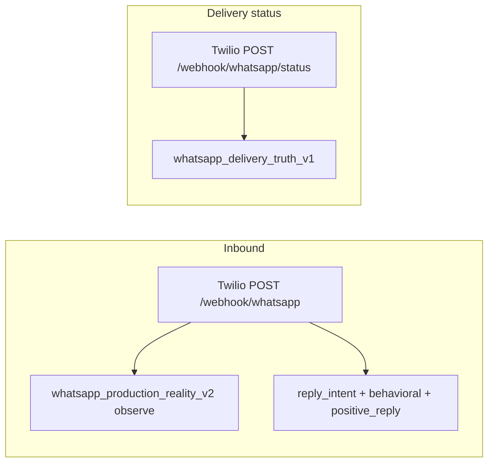
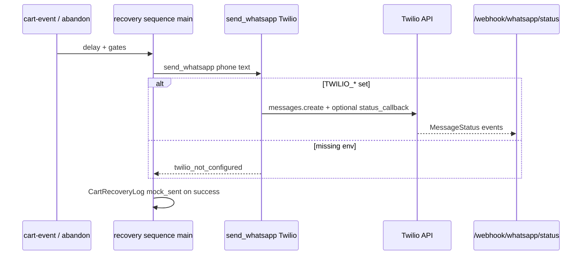

# CartFlow WhatsApp Production Readiness Audit v1

**Date (UTC):** 2026-05-19  
**Scope:** Read-only inspection. **No** changes to recovery, widget, lifecycle, dashboard, queues, providers, or runtime.  
**Commit message:** `docs: add whatsapp production readiness audit v1`

**Related docs:** [whatsapp_production_reality_v1.md](whatsapp_production_reality_v1.md), [whatsapp_production_reality_v2.md](whatsapp_production_reality_v2.md), [whatsapp_delivery_truth_v1.md](whatsapp_delivery_truth_v1.md), [audit_merchant_onboarding_reality_v1.md](audit_merchant_onboarding_reality_v1.md), [cartflow_integration_foundation_audit_v1.md](cartflow_integration_foundation_audit_v1.md), [cartflow_purchase_truth_audit_v1.md](cartflow_purchase_truth_audit_v1.md).

---

## Executive summary

| Verdict | **PARTIAL** |
|---------|-------------|
| **Safe today** | Internal demo, Twilio sandbox (joined recipients), mock-style logging when Twilio absent, inbound reply → continuation, delivery truth when status callback is configured. |
| **Not ready** | Arbitrary merchants at scale without ops-run provider setup, Meta-approved templates for business-initiated recovery, per-merchant WABA/credentials, and aligned send/log semantics. |

**Shortest path to first production merchant:** see [Part 6](#part-6--verdict).

---

## Part 1 — Current provider inventory

### Summary table

| Capability | Twilio | Meta Cloud API | Classification |
|------------|--------|----------------|----------------|
| **Recovery outbound (primary)** | `services/whatsapp_send.py` → `Client.messages.create` | Not on recovery path | Twilio: **production viable** (with env + WABA/sandbox discipline). Meta recovery: **testing only** (not implemented). |
| **CTA / manual cart send** | Not used | `main.send_whatsapp_message` → Graph `interactive` / `cta_url` | **Partial** — separate env (`WHATSAPP_API_TOKEN`, `WHATSAPP_PHONE_ID`); not unified with Twilio recovery. |
| **Readiness / reporting** | `get_twilio_readiness()` | `get_meta_readiness()` (`ready: false`, `meta_path_not_active`) | Meta: **testing only** (stub). |
| **Sandbox path** | Twilio sandbox number + recipient join; `recovery_uses_real_whatsapp()` false when `PRODUCTION_MODE` off | N/A for recovery | **Testing only** for reported “sandbox”; see send-path caveat below. |
| **Production path** | `PRODUCTION_MODE` + `TWILIO_*` → `recovery_uses_real_whatsapp()` true; real Twilio send | Env may be set but unused for recovery | **Production viable** (platform env, single sender). |
| **Inbound webhook** | `POST /webhook/whatsapp` (Twilio form: `Body`, `From`) | No dedicated Meta inbound route for Cloud | Twilio: **production viable**. Meta inbound: **not present**. |
| **Delivery status webhook** | `POST /webhook/whatsapp/status` → `whatsapp_delivery_truth_v1` | Normalizer placeholder for Meta | **Partial** — implemented for Twilio; requires public callback URL. |
| **Send flow (recovery)** | Sync `send_whatsapp()` from `main._run_recovery_sequence_after_cart_abandoned_impl` | — | **Production viable** with ops gates; **partial** truth labeling (`mock_sent` always on main path success). |
| **Send flow (queue)** | `whatsapp_queue.py` — `use_real` → `send_whatsapp_real` / mock; worker started at startup | — | **Partial** — `enqueue_recovery_and_wait` used in tests only; primary path is sync, not queue. |

### Twilio — paths and wiring

| Path | Entry | Gate | Persisted status |
|------|-------|------|------------------|
| **Testing / reported sandbox** | Same `send_whatsapp()` | Onboarding/readiness: `recovery_uses_real_whatsapp()` false without `PRODUCTION_MODE` | Main recovery success → **`mock_sent`** always (even if Twilio API succeeded) |
| **Production (platform)** | Same `send_whatsapp()` | Twilio env must be complete or API returns `twilio_not_configured` | Main recovery → **`mock_sent`**; VIP neutral path may log Twilio `status` or **`sent_real`**; queue worker → **`sent_real`** if `use_real` |
| **Status callback** | `resolve_twilio_status_callback_url()` on `messages.create` | `TWILIO_STATUS_CALLBACK_URL` or `CARTFLOW_PUBLIC_BASE_URL` + `/webhook/whatsapp/status` | `whatsapp_delivery_truth` table |

**Important audit finding (read-only):** `send_whatsapp()` does **not** check `PRODUCTION_MODE`. If `TWILIO_*` is set, the Twilio API is invoked regardless of `recovery_uses_real_whatsapp()`. Readiness flags and merchant `whatsapp_provider_mode` describe intent; they do not hard-block the sync recovery send path.

### Meta Cloud API — paths

| Path | Module | Role | Classification |
|------|--------|------|----------------|
| Graph interactive send | `main.send_whatsapp_message` | `POST /api/carts/{id}/send` manual/demo CTA | **Partial** — production-viable only if Meta token + `phone_number_id` configured; not merchant-scoped; not recovery templates. |
| Recovery | — | No Graph send module | **Testing only** (placeholder readiness) |

### Webhook receive

- Inbound does **not** run recovery sends or lifecycle transitions by itself; it feeds reply/behavioral layers (`main.py` ~L154–189).
- Status webhook does **not** run recovery/queue/attribution (`routes/whatsapp_delivery_webhook.py`).

### Send flow (recovery)

---

## Part 2 — Merchant onboarding reality

**Can a merchant go live self-serve?** **No** for full production WhatsApp. **Yes** for dashboard setup (widget, templates, recovery toggles, provider mode labels).

### What a merchant actually needs (platform + provider)

| Requirement | Who does it | In product today |
|-------------|-------------|------------------|
| **Zid store connected** | Merchant OAuth | Yes — `evaluate_onboarding_readiness` → `store_connected` |
| **Widget + recovery enabled** | Merchant dashboard | Yes — self-serve |
| **Local recovery templates** (`reason_templates_json`, etc.) | Merchant | Yes — not Meta template IDs |
| **WhatsApp Business Platform (WABA)** | Merchant + Meta | **Not** self-serve in CartFlow; required for real API at scale |
| **Meta Business verification** | Merchant + Meta | Outside app; blocks production sender |
| **Approved message templates** | Merchant/Ops in Meta or Twilio console | **No** sync/approval in app; local JSON ≠ approved |
| **Phone number** (production sender or Twilio-hosted) | Ops / BSP | Platform `TWILIO_WHATSAPP_FROM` — not per-merchant in runtime |
| **Sandbox recipient join** | Merchant/tester | Manual Twilio sandbox keyword — ops support |
| **Phone migration** (consumer app → Cloud API) | Merchant + Meta | Documented gap in v1 reality audit; no wizard |
| **Public HTTPS + status callback** | Ops/deploy | `CARTFLOW_PUBLIC_BASE_URL` / `TWILIO_STATUS_CALLBACK_URL` — not merchant UI |
| **`PRODUCTION_MODE` on server** | Ops | Env — not merchant toggle |

### Actual sequence (recommended runbook)

1. **Merchant:** Connect Zid → install widget → enable WhatsApp recovery → configure delays and Arabic templates → add `store_whatsapp_number` / support URL.
2. **Ops:** Create/link WABA (Meta) or Twilio WhatsApp sender; complete business verification and display name.
3. **Ops/Merchant:** Submit and get **approved** WhatsApp templates matching recovery copy (variables, AR locale).
4. **Ops:** Set `PRODUCTION_MODE=true`, `TWILIO_ACCOUNT_SID`, `TWILIO_AUTH_TOKEN`, `TWILIO_WHATSAPP_FROM` (or plan Meta primary path — not implemented for recovery).
5. **Ops:** Set `CARTFLOW_PUBLIC_BASE_URL` (or explicit `TWILIO_STATUS_CALLBACK_URL`) so delivery truth can advance past `accepted_by_provider`.
6. **Ops:** Configure Twilio inbound URL → `POST /webhook/whatsapp`; status callback → `POST /webhook/whatsapp/status`.
7. **Test:** Abandon cart with real phone (sandbox: join sandbox first) → verify `[WA SENT]`, `[WA DELIVERY TRUTH]`, inbound reply, `[MERCHANT READINESS] level=production_ready` (readiness does not prove deliverability alone).
8. **Merchant:** Wire purchase proof (`POST /api/conversion` or future order webhook) so recovery stops after buy.

**Dashboard `whatsapp_provider_mode` (sandbox / test / production):** persisted on `Store`; **display and onboarding inference only** — does not select provider account or gate `send_whatsapp()`.

---

## Part 3 — Failure map

| Failure mode | Typical cause | System behavior | Severity |
|--------------|---------------|-----------------|----------|
| **Twilio not configured** | Missing `TWILIO_*` | `twilio_not_configured`; log `whatsapp_failed` | **P0** (no send) |
| **PRODUCTION_MODE / readiness mismatch** | Creds set but ops think “sandbox” | Real Twilio calls may still occur; logs may show `mock_sent` | **P0** (ops/trust) |
| **Sandbox not joined** | Recipient not in Twilio sandbox | Error 63016-class → `sandbox_recipient_not_joined` | **P0** (test), **P1** (onboarding) |
| **Template not approved** | Business-initiated message outside session | Provider reject 63013/63014 → `template_not_approved` | **P0** (first outbound recovery) |
| **24-hour window** | Recovery after 24h without inbound | Provider reject; v2 logs `template_required` only — **no send block** | **P0** (policy/compliance) |
| **Invalid / wrong credentials** | Bad SID/token | Auth errors → `provider_auth_failed` | **P0** |
| **Webhook unreachable** | Firewall, wrong URL | Inbound replies lost; delivery truth stuck at `accepted_by_provider` | **P1** |
| **Status callback missing** | No public base URL | No `delivered_to_customer` in DB | **P1** |
| **Provider rate limits** | Volume / tier | `provider_rate_limited`; queue retries (worker path) | **P1** |
| **Quality rating / restricted WABA** | Meta policy | Sends fail or throttle — classified generically | **P1** |
| **Banned / invalid number** | Customer opt-out, bad E.164 | `provider_rejected` / undelivered | **P2** |
| **User rejected help** | Widget flag | `user_rejected_help` — blocked before send | **P2** (correct) |
| **Operational pause** | Admin control | `operational_control_blocks_whatsapp_send` | **P2** (correct) |
| **Assuming `mock_sent` = mock** | Labeling | May hide real Twilio sends in ops reports | **P1** (visibility) |
| **Attribution uses send log as delivery** | Legacy assumptions | Mitigated in docs: attribution must not use `queued` alone | **P1** |

---

## Part 4 — Operational burden (honest estimate)

Assumes **current architecture**: platform-level Twilio, ops-led go-live, Arabic template support, no per-merchant provider OAuth.

| Scale | Initial onboarding (per merchant) | Steady-state (per month, blended) | Dominant tickets |
|-------|-----------------------------------|-----------------------------------|------------------|
| **50 merchants** | **~2–4 hrs ops** each (WABA/template/callback verification) → **100–200 hrs** one-time | **~0.3–0.8 FTE** support (≈15–40 hrs/month) | “Message not received”, sandbox join, template rejected, callback URL |
| **100 merchants** | **~200–400 hrs** one-time | **~0.6–1.5 FTE** (≈30–80 hrs/month) | Same + quality rating, duplicate sends investigation, readiness vs reality confusion |

**Drivers:**

- **No self-serve provider connect** → every go-live touches ops ([audit_merchant_onboarding_reality_v1.md](audit_merchant_onboarding_reality_v1.md)).
- **Template approval** is external; expect **1–3 day** Meta latency per template set.
- **Delivery disputes** need status callback + admin log literacy (`[WA DELIVERY TRUTH]`).
- **Admin health** uses “latest store” patterns in places — multi-tenant ops friction at scale ([audit_merchant_onboarding_reality_v1.md](audit_merchant_onboarding_reality_v1.md) P0 #5).

**Without** template router enforcement, P0 template/window failures convert to **support load**, not automatic merchant-facing blockers.

---

## Part 5 — Recovery proof

Can the system prove each stage for recovery ROI and merchant trust?

| Stage | Evidence in code | Strength | Notes |
|-------|------------------|----------|-------|
| **Message sent** | `CartRecoveryLog` `mock_sent` / `sent_real`; Twilio `sid`; `[WA SENT]` | **Strong** for attempt; **partial** for provider truth label on main path (`mock_sent` always) |
| **Delivered** | `whatsapp_delivery_truth` via `/webhook/whatsapp/status`; `truth_level=delivered_to_customer` | **Partial** — only with callback configured; attribution hook `customer_delivered_for_attribution_future` exists but **v1 attribution does not require delivery** |
| **Read** | Mapped in `whatsapp_delivery_truth_v1` (`read_by_customer`) | **Weak** — stored if provider sends; not merchant-facing proof |
| **Replied** | `POST /webhook/whatsapp` → `whatsapp_positive_reply`, `MerchantFollowupAction`, milestones `first_reply_received` | **Strong** for positive-keyword path; not full NLP |
| **Converted** | `purchase_truth_records` / `POST /api/conversion` — **not** WhatsApp-derived | **Partial** — lifecycle may close on reply intent; durable purchase is separate ([cartflow_purchase_truth_audit_v1.md](cartflow_purchase_truth_audit_v1.md)) |

**Overall recovery proof chain:** **Partial** — good for sent/reply ops; weak for delivered/read as product claims; conversion requires explicit purchase ingest.

---

## Part 6 — Verdict

### Verdict: **PARTIAL**

| Criterion | Status |
|-----------|--------|
| Provider send exists (Twilio) | Yes |
| Production gating documented | Partial (env vs actual send mismatch on sync path) |
| Meta recovery | No |
| Template compliance | Not enforced |
| Per-merchant WhatsApp ownership | No |
| Delivery truth | Additive, callback-dependent |
| Merchant self-serve go-live | No |
| Recovery proof end-to-end | Partial |

### Shortest path to **first production merchant**

1. **Pick one pilot merchant** with WABA ready (or Twilio production sender already approved).
2. **Ops (day 0):** `PRODUCTION_MODE=true`, production `TWILIO_*`, `CARTFLOW_PUBLIC_BASE_URL`, verify `GET /webhook/whatsapp` + `POST /webhook/whatsapp/status` from Twilio console.
3. **Templates (day 0–3):** Register Arabic recovery templates with Meta/Twilio matching live `reason_templates_json` text; do not rely on freeform first message for cold abandon.
4. **Merchant (day 1):** Zid connect, widget live, phone capture, templates filled, `whatsapp_recovery_enabled`.
5. **Test (day 1–2):** One real abandon → confirm `[WA SENT]` + sid + `[WA DELIVERY TRUTH] delivered` + optional inbound reply; confirm `[MERCHANT READINESS] level=production_ready` only after callbacks and templates are real.
6. **Purchase stop (day 2):** Ensure `POST /api/conversion` (or agreed integration) fires on checkout so recovery stops with durable truth.
7. **Runbook:** Document that dashboard “production” mode ≠ server env; treat `mock_sent` on main path as “send attempted” until log semantics are aligned in a future change (out of scope for this audit).

### Phased hardening (documentation reference only)

| Phase | Outcome |
|-------|---------|
| 0 | Pilot on Twilio production + ops runbook (now) |
| 1 | Template catalog + pre-send approval gate |
| 2 | Enforce 24h window / template router (v2 logs → v3 block) |
| 3 | Align `CartRecoveryLog` status with `recovery_uses_real_whatsapp()` + delivery truth |
| 4 | Per-merchant provider settings + self-serve connect |
| 5 | Meta Cloud recovery adapter (optional) |

---

## Code map (inspection references)

| Area | Location |
|------|----------|
| Twilio send | `services/whatsapp_send.py` |
| Meta CTA send | `main.send_whatsapp_message`, `POST /api/carts/<id>/send` |
| Inbound | `main.py` `POST /webhook/whatsapp` |
| Delivery status | `routes/whatsapp_delivery_webhook.py`, `services/whatsapp_delivery_truth_v1.py` |
| Provider readiness | `services/cartflow_provider_readiness.py` |
| Window/template logs | `services/whatsapp_production_reality_v2.py` |
| Merchant settings | `services/merchant_whatsapp_settings.py` |
| Onboarding | `services/merchant_onboarding_reality_v1.py`, `services/cartflow_onboarding_readiness.py` |
| Queue (alternate) | `services/whatsapp_queue.py` |
| Positive reply | `services/whatsapp_positive_reply.py` |

---

*Inspection-only audit. Behavior described reflects repository state at v1 authoring; verify against deployed env before merchant contracts.*
