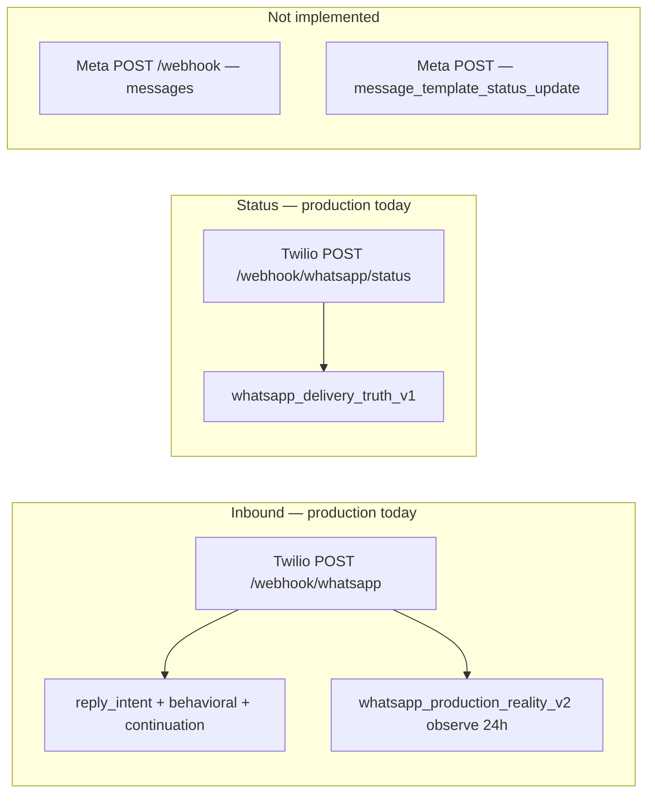

# CartFlow WhatsApp Production Reality — Phase 1.5 Production Sender Strategy Audit

**Date (UTC):** 2026-06-07  
**Phase:** Decision-making only — **no implementation, no provider migration, no refactoring, no production cutover**  
**Commit message:** `whatsapp production reality phase 1.5 production sender strategy audit`  
**Builds on:** [cartflow_whatsapp_production_reality_phase1_architecture_audit_v1.md](cartflow_whatsapp_production_reality_phase1_architecture_audit_v1.md)

---

## Executive summary

Phase 1 defined **what** CartFlow must become (hybrid business model, template library, delivery truth, message classes). Phase 1.5 resolves **who sends** in production.

**The unresolved risk:** CartFlow’s recovery/VIP/continuation stack is implemented against **Twilio APIs**, while production WhatsApp policy, templates, WABA ownership, and merchant-connected senders are **Meta-native**. Twilio Sandbox proved delivery logic but created **false operational failures** (error 63015). Building production architecture on Twilio Production without a Meta-aligned target would require a **second full migration** when Model A (merchant WABA) ships.

**Final recommendation:**

| Role | Provider |
|------|----------|
| **Development / staging** | **Twilio Sandbox** (or mock) — retain for engineer testing only |
| **Primary production sender** | **Meta Cloud API (WhatsApp Business Platform)** on CartFlow-owned WABA |
| **Twilio Production** | **Not the production architecture target** — no new investment; optional **short bridge** only if migration sequencing requires weeks of overlap |
| **Other BSP** | **Not recommended** for CartFlow at current stage — adds vendor without reducing Meta dependency |

**Production sender architecture:** **Meta-direct send + Meta webhooks**, with a thin **provider adapter layer** (designed in Phase 2, not built in this phase) so Twilio Sandbox remains a dev backend behind the same interface during migration.

**Phase 1 merchant launch:** **Yes — merchants do not need to understand WABA.** CartFlow operates Model C (managed WABA) invisible to the merchant; merchant only configures destination numbers and copy.

---

## Part A — Current state audit

### 1. Current Twilio usage

| Surface | Location | Role today |
|---------|----------|------------|
| **Outbound send** | `services/whatsapp_send.py` → `twilio_messages_create()` | Customer recovery, VIP merchant alerts, continuation auto-replies |
| **Credentials** | `TWILIO_ACCOUNT_SID`, `TWILIO_AUTH_TOKEN`, `TWILIO_WHATSAPP_FROM` | Platform-level; single sender |
| **Activation gate** | `recovery_uses_real_whatsapp()` = `PRODUCTION_MODE` + env complete | Readiness label; send still hits Twilio if env set regardless of mode in some paths |
| **Inbound** | `POST /webhook/whatsapp` | Twilio form fields (`Body`, `From`) — reply intent, behavioral recovery, continuation, 24h window observe |
| **Status callbacks** | `POST /webhook/whatsapp/status` → `ingest_twilio_status_callback()` | Delivery truth persistence |
| **VIP delivery poll** | `vip_operational_truth_v1.poll_twilio_vip_alert_delivery_truth()` | Synchronous Twilio `messages.fetch()` up to 30s |
| **Readiness / failure class** | `cartflow_provider_readiness.py` | `sandbox_recipient_not_joined`, `provider_not_configured`, etc. |
| **Queue (alternate)** | `whatsapp_queue.py` | Worker path; not primary production recovery |

**Twilio Sandbox vs Production (operational reality):**

| Environment | `TWILIO_WHATSAPP_FROM` | Recipient constraint | CartFlow evidence |
|-------------|------------------------|----------------------|-------------------|
| **Sandbox** | Twilio sandbox number | Recipient must join sandbox | Production VIP audit: error **63015** — false failure after logic proved correct |
| **Production Twilio** | Approved WhatsApp sender on WABA (via Twilio) | Any opted-in / valid WA user per Meta rules | Not deployed on smartreplyai.net today; code-ready |

---

### 2. Current Meta usage

| Surface | Location | Role today |
|---------|----------|------------|
| **Manual dashboard send** | `main.send_whatsapp_message()` → Graph API v17 | `POST /api/carts/{id}/send` — interactive `cta_url` only |
| **Credentials** | `WHATSAPP_API_TOKEN`, `WHATSAPP_PHONE_ID`, `WHATSAPP_API_URL` | Platform-level; separate from Twilio |
| **Readiness** | `get_meta_readiness()` | **`ready: false`**, `meta_path_not_active` |
| **Inbound** | — | **No Meta Cloud inbound webhook** wired to CartFlow |
| **Delivery truth** | — | **None** for Meta sends |
| **Templates** | — | **No** Meta template name/ID layer in recovery |

Meta is a **partial second stack**, not an alternate production path for recovery.

---

### 3. Current webhook paths



| Webhook | Provider | Purpose | Migration risk if staying Twilio-only |
|---------|----------|---------|--------------------------------------|
| `/webhook/whatsapp` | Twilio | Inbound customer replies | Must duplicate for Meta or proxy through Twilio |
| `/webhook/whatsapp/status` | Twilio | Delivery/read/failed | Meta has parallel `messages` status fields |
| Meta Cloud inbound | Meta | Required for native WABA 24h window | **High rework** if not planned |
| Meta template status | Meta | Template approval visibility | **Not available** through Twilio-only freeform path |

---

### 4. Current template paths

| Layer | What exists | Provider alignment |
|-------|-------------|-------------------|
| **Local copy** | `Store.reason_templates_json`, `template_*`, `recovery_message_templates.py` | Merchant-editable Arabic freeform |
| **24h gate** | `whatsapp_production_reality_v2.enforce_whatsapp_template_window_before_send()` | Meta policy modeled; **no provider template ID** |
| **Send payload** | Twilio `messages.create({ body })` | Freeform — blocked outside 24h unless ops flag |
| **Meta CTA** | Fixed interactive structure in `send_whatsapp_message()` | Meta-native shape but isolated route |
| **VIP / merchant** | `build_vip_merchant_alert_body()` etc. | Freeform via Twilio |

**Migration risk:** Template library in Phase 1 assumes **Meta-approved template names/IDs**. Today’s Twilio freeform body path does not map to that library without a send-layer rewrite regardless of Twilio vs Meta — but **Meta-direct is the natural target** for template submission and approval sync.

---

### 5. Current delivery-truth paths

| Path | Mechanism | Coverage |
|------|-----------|----------|
| Send acceptance | `record_provider_acceptance_from_send()` on Twilio SID | All Twilio sends |
| Async truth | Twilio status webhook → `whatsapp_delivery_truth` table | When callback URL configured |
| VIP poll | `poll_twilio_vip_alert_delivery_truth()` | VIP merchant alerts only |
| Dashboard | `_merchant_message_delivery_truth_map()` | Message modal |
| Meta manual send | — | **No truth row** |

**States mapped today:** `accepted_by_provider` → `sent_to_network` → `delivered_to_customer` → `read_by_customer` / `failed_delivery` (Twilio `MessageStatus` normalization in `normalize_twilio_message_status()`).

**Known bug class (fixed in VIP closure):** rank ordering must not treat `failed_delivery` as delivered — provider-agnostic lesson applies to Meta normalizer too.

---

### 6. Current onboarding assumptions

| Assumption | Reality | Dev-only vs production |
|------------|---------|------------------------|
| Merchant connects Twilio | **False** — platform env only | Ops-managed |
| Merchant connects Meta WABA | **False** | Future Model A |
| `Store.whatsapp_provider_mode` controls send path | **False** — display/persist only | Misleading for merchants |
| `store_whatsapp_number` is send-from identity | **False** — VIP **destination** only | Onboarding copy must clarify |
| Sandbox join required for testing | **True** | **Dev-only** constraint |
| Self-serve production WhatsApp go-live | **False** | Documented in readiness audits |
| Templates in dashboard = Meta-approved | **False** | **Migration risk** — merchant expectation gap |

---

### Classification summary

| Component | Development-only | Production-capable (with ops) | Future migration risk |
|-----------|------------------|-------------------------------|------------------------|
| Twilio Sandbox | ✓ Primary dev | ✗ False failures in prod | **High** if used as prod sender |
| Twilio Production API integration | Dev/staging possible | ✓ If WABA approved via Twilio | **High** — second migration to Meta-direct for Model A |
| Twilio inbound/status webhooks | ✓ | ✓ under Twilio prod | Medium — parallel Meta webhooks needed |
| Meta `send_whatsapp_message` | Demo/manual | Partial (one route) | Medium — divergent from recovery |
| Local freeform templates | Dev/demo | ✗ Outside 24h without Meta templates | **High** — must become template ID layer |
| `whatsapp_delivery_truth_v1` | — | ✓ Twilio today | Low if provider-normalized (already designed) |
| Dual outbound stacks | — | ✗ Operational drift | **Critical** — must unify |

---

## Part B — Provider options

### Option A — Twilio Production

Twilio as production WhatsApp BSP: approved sender, `messages.create`, status callbacks — **not** sandbox.

| Criterion | Assessment |
|-----------|------------|
| **Implementation complexity (CartFlow)** | **Lowest near-term** — already integrated for recovery, VIP, continuation, webhooks, delivery truth |
| **Merchant onboarding complexity** | **Low for Model C** (CartFlow owns one Twilio sender) — merchant never touches provider |
| **WABA compatibility** | **Indirect** — Twilio holds/partners WABA; CartFlow sees Twilio API not Meta Graph |
| **Template management** | **Split** — Twilio Content API and/or Meta templates via Twilio; not aligned with current freeform code |
| **Delivery truth visibility** | **Good** — already wired; SID lifecycle familiar to team |
| **Cost** | Twilio per-message **+** Meta conversation fees (passed through) — **double layer** |
| **Scalability** | Good to ~high volume on single sender; multi-tenant merchant WABA requires Twilio subaccounts or Messaging Services |
| **Operational risk** | Twilio outage = full WhatsApp outage; sandbox/prod confusion (proven) |
| **Vendor lock-in** | **High** — API shape, webhooks, SIDs, Twilio-specific failure codes throughout codebase |
| **Future maintenance** | Every Meta policy change filtered through Twilio docs + CartFlow Twilio adapter **forever**; Model A (merchant WABA) requires Twilio Connect / subaccounts — **non-trivial** |

**Verdict:** Fastest **short-term** production cutover; **worst long-term** foundation for WABA-native hybrid strategy.

---

### Option B — Meta Cloud API (direct)

CartFlow integrates Graph API `/{phone-number-id}/messages` as primary send; WABA owned by CartFlow (Phase 1) or merchant (Phase 2).

| Criterion | Assessment |
|-----------|------------|
| **Implementation complexity (CartFlow)** | **Medium-high** — new send adapter, Meta inbound webhook, template CRUD/sync, token lifecycle; **but** one-time |
| **Merchant onboarding complexity** | **Low for Model C** (invisible WABA); **Medium for Model A** (Embedded Signup — industry standard) |
| **WABA compatibility** | **Native** — this is the platform owner’s API |
| **Template management** | **Native** — create/submit/approve templates; webhook on status; maps 1:1 to Phase 1 template library |
| **Delivery truth visibility** | **Excellent** — `messages` webhook fields: sent, delivered, read, failed + error codes; template quality rating |
| **Cost** | Meta conversation pricing **direct** — no Twilio markup; ops cost shifts to CartFlow Meta BM admin |
| **Scalability** | **Best for hybrid** — one CartFlow WABA (Phase 1); many merchant WABAs via embedded signup (Phase 2) |
| **Operational risk** | Meta policy/template rejection is primary failure mode — visible early with template status webhook |
| **Vendor lock-in** | **Low to Meta (unavoidable)** — WhatsApp **is** Meta; no second vendor tax |
| **Future maintenance** | Single policy source; BSP abstraction optional later |

**Verdict:** **Highest near-term engineering cost; lowest long-term rework** — aligns with Phase 1 architecture and Saudi merchant scale.

---

### Option C — Other BSP (360dialog, MessageBird, Vonage, etc.)

| Criterion | Assessment |
|-----------|------------|
| **Implementation complexity** | **High** — new vendor SDK + webhooks; none in codebase |
| **Merchant onboarding** | Varies; often Meta passthrough with BSP UI |
| **WABA compatibility** | Indirect (same as Twilio class) |
| **Template management** | BSP-dependent — still Meta underneath |
| **Delivery truth** | BSP-specific — rebuild normalizers |
| **Cost** | BSP fee **+** Meta |
| **Scalability** | Comparable to Twilio if BSP is mature |
| **Operational risk** | **Third** party in critical path |
| **Vendor lock-in** | **High** — smallest community in CartFlow team context |
| **Future maintenance** | **Worst ratio** — pay for BSP without removing Meta dependency |

**Verdict:** **Not recommended** at CartFlow’s stage. Adds vendor surface without solving WABA ownership question.

---

### Option comparison matrix

| Criterion | Twilio Production | Meta Cloud API | Other BSP |
|-----------|-------------------|----------------|-----------|
| Near-term ship speed | ★★★★★ | ★★★ | ★★ |
| Long-term rework risk | ★ (high rework) | ★★★★★ | ★★ |
| Model C fit | ★★★★ | ★★★★★ | ★★★ |
| Model A fit | ★★ | ★★★★★ | ★★★ |
| Template library fit | ★★ | ★★★★★ | ★★★ |
| Delivery truth | ★★★★ | ★★★★★ | ★★★ |
| Cost efficiency at scale | ★★ | ★★★★ | ★★ |
| **Recommended** | Dev bridge only | **Primary production** | Decline |

---

## Part C — CartFlow business model impact

### Model C — CartFlow managed sender

| Provider | Support | Notes |
|----------|---------|-------|
| **Meta Cloud API** | **Best** | CartFlow registers one WABA + display number; all merchants send from CartFlow identity (co-brand in template variables) |
| **Twilio Production** | Good | One Twilio sender; hides Meta from merchant — but CartFlow still pays Twilio tax and Model A becomes harder |
| **Other BSP** | OK | Same as Twilio class with less existing code |

**Migration complexity Model C → Model A (same merchant):** Low on Meta-direct (add merchant `phone_number_id` to store row). High on Twilio (subaccount or re-provision sender per merchant).

---

### Model A — Merchant-owned WABA

| Provider | Support | Notes |
|----------|---------|-------|
| **Meta Cloud API** | **Best** | Embedded Signup → store `waba_id`, `phone_number_id`, token — standard SaaS pattern |
| **Twilio Production** | Weak | Twilio Multi-Tenant / Connect possible but non-standard for Saudi SMB dashboard UX |
| **Other BSP** | Medium | Some offer embedded signup wrappers — still extra vendor |

**Migration complexity:** Model C → Model A per merchant is **incremental on Meta** (flip store from platform sender to merchant sender in adapter). On Twilio, often **re-onboard sender** per merchant.

---

### Model D — Hybrid (Phase 1 recommendation from Phase 1 audit)

| Phase | Business model | Best provider |
|-------|----------------|---------------|
| **Launch** | Model C managed | **Meta Cloud API** — CartFlow WABA |
| **Upgrade** | Model A connected | **Meta Cloud API** — merchant WABA |
| **Dev/test** | Engineers + demos | **Twilio Sandbox** or mock behind adapter |

**Long-term operational cost:** Meta-direct minimizes **per-message markup** and **dual-stack ops**. Twilio Production as permanent production layer adds **ongoing cost + migration debt** without removing Meta from the critical path.

---

## Part D — WABA strategy

### Phase 1 — How CartFlow launches (Model C)

**CartFlow-owned assets (ops, not merchant):**

| Meta asset | Purpose |
|------------|---------|
| Meta Business Manager (CartFlow) | Owner of WABA |
| WhatsApp Business Account (WABA) | Single production WABA for managed sending |
| Phone number | Registered WhatsApp sender (CartFlow brand or co-brand) |
| System user / permanent token | Server-side Graph API send |
| Approved message templates | One set per template library key (Arabic) |
| Webhook app subscription | Inbound messages + message status + template status |

**Merchant-facing requirements (Phase 1):**

| Required | Not required |
|----------|--------------|
| Enable WhatsApp recovery toggle | Meta Business Manager access |
| Save merchant WhatsApp number (VIP destination) | WABA verification |
| Configure recovery copy variables in dashboard | Template submission to Meta |
| Customer phone from widget | Understanding “WABA”, “template approval”, sandbox join |

**Answer: Can Phase 1 launch without merchants understanding WABA?**

**Yes.** Merchant interacts only with CartFlow dashboard settings. CartFlow ops/onboarding team owns WABA verification, template approval, webhook URLs, and token rotation. Merchant sees readiness states: «جاري تجهيز واتساب» → «جاهز للإرسال».

---

### Phase 2 — Merchant connects own WABA (Model A)

| Step | Merchant effort | CartFlow effort |
|------|-----------------|-----------------|
| Embedded Signup OAuth | Grant WhatsApp Business access in flow | Meta app + signup configuration |
| Phone number on WABA | Use existing or register | Validate via Graph API |
| Template sync | Review pre-approved CartFlow template pack | Submit templates to merchant WABA or shared template library |
| Webhook routing | None (CartFlow app receives on merchant WABA) | Per-WABA webhook subscription |
| Go-live | Toggle «استخدام رقم متجري» | Flip store `sender_mode=merchant_waba` in adapter |

**Approval requirements:** Meta Business verification for merchant; template category compliance (utility/marketing); opt-in evidence for marketing templates.

**Friction:** Higher than Phase 1 — acceptable for merchants who require **branded sender** (enterprise / established brands).

---

## Part E — Delivery truth strategy

### State comparison

| State | Twilio Production | Meta Cloud API | CartFlow need |
|-------|-------------------|----------------|---------------|
| **Queued** | `queued`, `accepted` | `accepted` / pending | Log only |
| **Sent** | `sent`, `sending` | `sent` (to WhatsApp) | Timeline |
| **Delivered** | `delivered` | `delivered` | **VIP success**, attribution hook |
| **Read** | `read` | `read` | Engagement signal |
| **Failed** | `failed`, `undelivered` + ErrorCode | `failed` + `errors[]` | Admin ops + merchant copy |

### Webhook richness

| Capability | Twilio | Meta |
|------------|--------|------|
| Delivery callbacks | ✓ Status webhook (wired) | ✓ `messages` webhook — **not wired** |
| Read receipts | ✓ | ✓ |
| Failure error codes | ✓ e.g. 63015 sandbox | ✓ e.g. template paused, quality rating |
| Template status events | Limited | ✓ `message_template_status_update` |
| Inbound for 24h window | ✓ (wired) | ✓ required for Meta-native window |
| Troubleshooting | Twilio console + Meta via Twilio | Meta WhatsApp Manager direct |

### Reliability

Both are production-grade when webhooks are configured with HTTPS, signature verification, and idempotent persistence (CartFlow already has `persist_delivery_truth()` pattern).

**Meta advantage:** Template rejection and quality rating surface **before** send failures spike — Twilio freeform path hides this until send time.

### Admin Operations visibility

Phase 1 audit’s **WhatsApp Delivery Health** grid is **provider-normalized** — implement once with Meta as canonical normalizer; Twilio normalizer remains for dev/sandbox.

**Recommendation:** **Meta Cloud API provides strongest production truth** for CartFlow’s needs (template lifecycle + delivery + inbound in one platform). Retain Twilio normalizer for sandbox/dev only.

---

## Part F — Cost and scale analysis

*Architecture impact focus — not price quotes (Meta/Twilio tariffs change).*

### Cost structure comparison

| Cost layer | Twilio Production | Meta Cloud API direct |
|------------|-------------------|----------------------|
| Conversation fees | Meta fee **+ Twilio markup** | Meta fee only |
| Template management | Ops + possible Twilio Content fees | Ops + Meta (no middle tier) |
| Phone number | Via Twilio | Via Meta / BSP partner |
| Engineering | Low now, **high later** (Model A) | **High now**, low later |
| Support | Debug Twilio + Meta | Debug Meta only |

### Scale scenarios — operational impact

| Merchants | Messages/mo (indicative) | Twilio Production architecture | Meta Cloud API architecture |
|-----------|--------------------------|--------------------------------|-----------------------------|
| **10** | Low thousands | Works; ops manages one sender; Twilio tax negligible but **sandbox confusion risk** | Works; CartFlow WABA; minimal support |
| **100** | Tens of thousands | Single sender **brand limit** — all merchants share CartFlow identity; Model A painful | Managed sender OK; begin Model A offers for key accounts |
| **500** | High volume | Twilio account limits, rate limits, **support load on Twilio-specific errors** | WABA quality rating monitoring critical; template volume management |
| **1000** | Very high | **Must** shard senders or subaccounts — Twilio multi-tenant complexity | Platform WABA + merchant WABAs on Meta; horizontal by WABA |

### Support burden

| Issue type | Twilio Production | Meta direct |
|------------|---------------------|-------------|
| Sandbox join (63015) | **High** if sandbox leaks to prod | N/A in prod |
| Template rejected | Opaque until send | **Webhook before send** |
| Merchant wants own number | Hard | **Embedded Signup** |
| Delivery failure | Twilio console | WhatsApp Manager + Graph |
| Dual-stack confusion | **Critical today** | Resolved by single stack |

### Scaling concerns

1. **Shared sender reputation** — at 100+ merchants on Model C, one quality rating affects all; Meta direct enables monitoring per WABA.
2. **Template library versioning** — Meta webhook sync required at scale regardless of provider; native on Meta.
3. **Conversation billing attribution** — store-level metering needs `store_slug` on truth rows (already partially modeled).
4. **Twilio as permanent prod layer** — at 500+ merchants, Model A migration becomes **multi-quarter rework**.

---

## Part G — Recommendation

### 1. Should Twilio remain?

| Role | Decision |
|------|----------|
| **Development only?** | **Yes** — Twilio Sandbox (and mock) for engineer testing, CI, and demos where Meta prod credentials are restricted |
| **Production provider?** | **No** — not the architectural target for customer recovery, VIP, or continuation in production |
| **Fallback provider?** | **Optional, time-boxed** — if Phase 2 migration needs overlap, Twilio Production may run **in parallel for ≤ one release cycle** behind feature flag; not documented as supported merchant path |

### 2. Should Meta Cloud API become?

| Role | Decision |
|------|----------|
| **Primary production provider?** | **Yes** — all production outbound and inbound for WhatsApp |
| **Secondary provider?** | No — avoid dual production stacks |
| **Future-only provider?** | **No** — it is the **immediate** production target, not a deferred phase |

### 3. What production sender architecture should CartFlow adopt?

```
┌─────────────────────────────────────────────────────────────┐
│                    CartFlow WhatsApp Layer                     │
│  (message classes, templates, gates, delivery truth, ops)   │
└───────────────────────────┬─────────────────────────────────┘
                            │
              ┌─────────────▼─────────────┐
              │   Provider Adapter (v1)    │
              │   normalize send + webhooks  │
              └─────────────┬───────────────┘
                            │
         ┌──────────────────┼──────────────────┐
         │                  │                  │
         ▼                  ▼                  ▼
   Meta Cloud API    Twilio Sandbox      Mock
   (PRODUCTION)      (DEV/STAGING)       (TESTS)
```

**Production sender identity:**

| Model | WABA owner | Send credential |
|-------|------------|-----------------|
| **Model C (Phase 1)** | CartFlow | CartFlow `phone_number_id` + system token |
| **Model A (Phase 2)** | Merchant | Merchant `phone_number_id` via Embedded Signup |

**Unify immediately in documentation:** deprecate `send_whatsapp_message()` Meta orphan path — fold into same adapter when implemented.

### 4. What architecture minimizes future rework?

**Meta Cloud API direct + provider adapter + existing delivery truth normalization.**

Preserves:

- Phase 1 template library → Meta template IDs
- Phase 1 message classification → unchanged
- `whatsapp_delivery_truth_v1` → add Meta normalizer (placeholder exists)
- VIP operational truth → same truth table, Meta SIDs
- Model D hybrid → incremental store-level sender selection

Avoids:

- Twilio Production template/content investment
- Permanent dual-stack (`send_whatsapp` Twilio + `send_whatsapp_message` Meta)
- Merchant confusion from sandbox in production environments

---

## Part H — Decision output

### Final recommendation

**Adopt Meta Cloud API on a CartFlow-owned WABA as the sole production WhatsApp sender platform. Retain Twilio Sandbox strictly for development and staging. Do not invest in Twilio Production as the long-term architecture.**

### Rationale

1. **VIP closure proved logic; sandbox proved environment risk** — error 63015 is not an application bug; production must not share sandbox failure semantics.
2. **Phase 1 architecture already assumes Meta templates and WABA** — Twilio freeform is a dev shortcut, not the target.
3. **Model D hybrid requires merchant WABA connection** — Meta Embedded Signup is the industry path; Twilio multi-tenant is a detour.
4. **Delivery truth + Admin Ops + template approval** are richer on Meta direct.
5. **Cost and scale** — removing Twilio markup and duplicate integration reduces long-term ops burden at 100+ merchants.

### Risks

| Risk | Mitigation |
|------|------------|
| Migration engineering effort | Provider adapter; phased cutover; Twilio sandbox stays for tests |
| Meta template approval delays | Pre-submit Arabic template pack before merchant launch; ops playbook |
| Shared WABA quality rating (Model C) | Monitor quality score; plan Model A for high-volume merchants |
| Token / credential security | System user tokens in secrets manager; rotation runbook |
| Short-term regression during migration | Feature flag; parallel truth logging; no merchant cutover until device-delivered proof |

### Tradeoffs

| Gain | Sacrifice |
|------|-----------|
| Single production stack | Near-term dev effort to build Meta adapter |
| Native Model A path | Twilio Production “quick win” foregone |
| Template compliance visibility | Ops must own Meta BM admin |
| Lower long-term cost | CartFlow bears Meta conversation cost on Model C |

### Migration path (decision-only — not executed in this phase)

| Step | Phase | Action |
|------|-------|--------|
| **0** | Now | Freeze Twilio Production expansion; document Meta as target (this audit) |
| **1** | Phase 2 implementation | Register CartFlow production WABA + templates in Meta BM |
| **2** | Phase 2 | Implement `ProviderAdapter` — Meta send + Meta webhooks (inbound + status + template) |
| **3** | Phase 2 | Wire adapter to existing recovery/VIP/continuation **without behavior change** |
| **4** | Phase 2 | Map template library keys → Meta template names |
| **5** | Phase 2 | Production cutover with device-delivered proof (VIP + customer recovery) |
| **6** | Phase 2 | Retire Twilio from production env vars; keep sandbox for dev |
| **7** | Phase 3 | Embedded Signup for Model A merchants |

**No Twilio Production cutover** unless Step 2–4 slip critically — if used as bridge, time-box to 90 days max.

### Recommended next implementation phase

**Phase 2: Meta Production Sender Foundation (implementation)** — scoped as:

1. CartFlow production WABA provisioning (ops runbook, not merchant UI)
2. Provider adapter interface + Meta implementation
3. Meta inbound + status + template status webhooks → existing delivery truth
4. Template ID layer for recovery + VIP_ALERT
5. Production cutover checklist with device-delivered acceptance tests
6. Admin Delivery Health grid (from Phase 1 audit)

**Out of scope for Phase 2 start:** merchant Embedded Signup (Phase 3), customer recovery behavior changes, RecoverySchedule/delay changes.

---

## Decision log (frozen)

| ID | Decision |
|----|----------|
| PS-1 | Twilio Sandbox = **dev/staging only** |
| PS-2 | Twilio Production = **not production architecture target** |
| PS-3 | Meta Cloud API = **primary production provider** |
| PS-4 | Other BSP = **declined** at current stage |
| PS-5 | Phase 1 launch = **Model C without merchant WABA knowledge** |
| PS-6 | Phase 2 merchant path = **Meta Embedded Signup (Model A)** |
| PS-7 | Unify orphan Meta manual send into adapter when built |
| PS-8 | **No implementation in Phase 1.5** |

---

## Appendix — Evidence references

| Evidence | Source |
|----------|--------|
| Twilio sandbox false failure 63015 | `docs/cartflow_vip_operational_truth_closure_v1.md`, production audit report |
| Dual stack inventory | `docs/cartflow_whatsapp_production_reality_phase1_architecture_audit_v1.md` |
| Meta path inactive | `services/cartflow_provider_readiness.py` `get_meta_readiness()` |
| Twilio webhooks wired | `routes/whatsapp_delivery_webhook.py`, `main.py` `/webhook/whatsapp` |
| Phase 1 hybrid model | Phase 1 audit Part B |

---

*End of Phase 1.5 audit. No code changes authorized by this document.*
