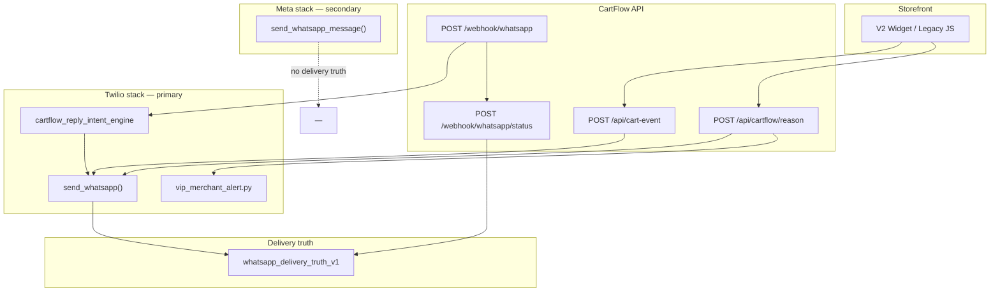

# CartFlow WhatsApp Production Reality — Phase 1 Architecture & Decision Audit

**Date (UTC):** 2026-06-07  
**Phase:** Decision and architecture only — **no implementation, no refactors, no behavior changes**  
**Commit message:** `whatsapp production reality phase 1 architecture audit`  
**Status:** Definitive reference for all future WhatsApp work  

**Builds on:** [whatsapp_production_reality_v1.md](whatsapp_production_reality_v1.md), [whatsapp_production_reality_v2.md](whatsapp_production_reality_v2.md), [whatsapp_delivery_truth_v1.md](whatsapp_delivery_truth_v1.md), [cartflow_whatsapp_production_readiness_audit_v1.md](cartflow_whatsapp_production_readiness_audit_v1.md), [cartflow_vip_operational_truth_closure_v1.md](cartflow_vip_operational_truth_closure_v1.md)

---

## Executive summary

CartFlow has **proven** customer recovery, VIP merchant alerts, template runtime resolution, delivery tracing, and Twilio sandbox boundary visibility. WhatsApp is no longer a test feature — it is a **core production dependency**.

The codebase today runs **two outbound stacks** (Twilio recovery/VIP/continuation vs Meta manual CTA), **platform-level credentials only**, **freeform merchant-editable copy** (not provider template IDs), and **partial delivery truth** (Twilio callbacks + VIP poll; Meta path uncovered).

**Recommended primary production model:** **Model D — Hybrid**, with **Phase 1 default = CartFlow-managed sender (Model C)** and **Phase 2 upgrade = merchant-owned WABA (Model A)** for merchants who require branded sender identity.

**Recommended implementation order** is at the end (Part J).

---

## Part A — Current WhatsApp inventory

### Architecture snapshot (today)



---

### 1. Customer recovery messages

| Attribute | Detail |
|-----------|--------|
| **Entry points** | `POST /api/cart-event` → `handle_cart_abandoned()` → `_run_recovery_sequence_after_cart_abandoned_impl()` (`main.py`); `POST /api/cartflow/reason` → `_schedule_normal_recovery_after_cart_recovery_reason_saved()` |
| **Trigger** | Cart abandon after reason saved; `RecoverySchedule.due_at` fires after configured delay |
| **Destination** | Customer phone (`CartRecoveryReason.customer_phone`, `AbandonedCart.customer_phone`) |
| **Provider** | Twilio via `send_whatsapp()` when `TWILIO_*` set; mock when not |
| **Message source** | `resolve_recovery_whatsapp_message_with_reason_templates()` → `Store.reason_templates_json` / `template_*` columns → `recovery_message_templates.py` defaults |
| **Gates** | VIP short-circuit, purchase truth, idempotency, `should_send_whatsapp()`, 24h template enforcement (`whatsapp_production_reality_v2`), operational control, user-rejected-help |
| **Limitations** | Sync inline send (queue worker exists but not primary path). Freeform text blocked outside 24h without `CARTFLOW_WHATSAPP_PROVIDER_TEMPLATES_APPROVED=1`. No Meta template IDs. Platform sender only. `CartRecoveryLog.status` = `sent_real` on Twilio SID (acceptance, not device delivery). |

**Multi-message path:** `services/recovery_multi_message.py` — per-reason `message_count`, stage delays from `reason_templates_json`.

---

### 2. VIP merchant alerts

| Attribute | Detail |
|-----------|--------|
| **Entry points** | Auto: `_send_vip_merchant_auto_alert()` after VIP lane entry; Manual: `POST /api/dashboard/vip-cart/{id}/merchant-alert`; Phone capture: `POST /api/cartflow/reason` (`vip_phone_capture`) |
| **Trigger** | VIP threshold crossed; merchant button click; customer phone saved in VIP flow |
| **Destination** | Merchant — `resolve_vip_alert_destination()`: `store_whatsapp_number` → `whatsapp_support_url` → `CARTFLOW_VIP_ALERT_DESTINATION` |
| **Provider** | Twilio (`reason_tag=vip_merchant_alert` / `vip_phone_capture_merchant`) |
| **Delivery truth** | Post-send poll (`poll_twilio_vip_alert_delivery_truth`) + Twilio status webhook; statuses `vip_merchant_alert_*` (isolated from customer `sent_count`) |
| **Limitations** | Merchant destination ≠ send-from identity (platform Twilio `from`). Sandbox error 63015 visible when recipient not joined. Phone-capture path has no delivery poll. Requires `vip_notify_enabled`. |

---

### 3. Merchant notifications

CartFlow does **not** operate a general outbound WhatsApp notification bus to merchants. Merchant-facing signals are mostly **in-dashboard**:

| Flow | Entry | Transport | Limitation |
|------|-------|-----------|------------|
| Positive customer reply queue | `whatsapp_positive_reply.py` ← inbound webhook | Dashboard `MerchantFollowupAction` only | Merchant must open dashboard |
| Reply intent audit | `reply_intent_handling.py` | Logs only | No push notification |
| VIP notify preference | `merchant_vip_settings.py` | Config gate for auto-alert | Not a message channel |

**Future gap:** operational alerts (setup failures, template rejected, delivery health) have no WhatsApp channel today.

---

### 4. Manual contact actions

| Action | Entry | Destination | Provider | Limitation |
|--------|-------|-------------|----------|------------|
| VIP manual contact | `GET /api/dashboard/vip-cart/{id}/manual-contact` | Customer via `wa.me` link | **None (browser)** | Merchant-initiated; no server send |
| Assist handoff | `cartflow_widget_flows.js` → `POST /api/cartflow/assist-handoff` | Merchant via `window.open(whatsapp_url)` | **None (browser)** | Audit-only; no recovery schedule |
| Dashboard manual send | `POST /api/carts/{id}/send` | Customer | **Meta Graph API** | Separate stack; no delivery truth; not recovery templates |
| VIP offer preset copy | `vip_offer_manual_contact_whatsapp_body()` | Pre-filled wa.me text | **None** | Optional copy only |

---

### 5. Continuation layer messages

| Attribute | Detail |
|-----------|--------|
| **Entry point** | Inbound `POST /webhook/whatsapp` → `behavioral_recovery/inbound_whatsapp.py` → `process_continuation_after_customer_reply()` |
| **Trigger** | Customer replies after recovery message sent; not VIP; not purchase-closed |
| **Destination** | Customer |
| **Provider** | Twilio (`reason_tag=continuation`) |
| **Decision** | `decide_continuation()` + `continuation_stabilization_v1` + cooldown/dedup env vars |
| **Limitations** | Subject to 24h template gate (not merchant-only bypass). Lighter logging than recovery sends. Blocked by operational control pause. |

---

### 6. Delivery status tracking

| Layer | Location | Coverage |
|-------|----------|----------|
| **Persistence** | `whatsapp_delivery_truth_v1.py` → `whatsapp_delivery_truth` table | Twilio SID-keyed truth levels |
| **Truth levels** | `accepted_by_provider` → `sent_to_network` → `delivered_to_customer` → `read_by_customer` / `failed_delivery` | Rank-based advance |
| **Status webhook** | `POST /webhook/whatsapp/status` | Requires public `status_callback` URL on send |
| **Send-time record** | `record_provider_acceptance_from_send()` in `send_whatsapp()` | Acceptance only |
| **VIP poll** | `vip_operational_truth_v1.poll_twilio_vip_alert_delivery_truth()` | Up to 30s synchronous poll |
| **Dashboard** | `_merchant_message_delivery_truth_map()` | Message modal timeline |

**Limitations:** Meta manual sends have **no** delivery truth row. Meta normalizer is placeholder. Without webhook URL, truth stops at acceptance. `CartRecoveryLog.sent_real` ≠ delivered.

---

### 7. Twilio dependencies

| Component | Role |
|-----------|------|
| `services/whatsapp_send.py` | Primary outbound |
| `services/provider_send_timeout_v1.py` | Client + timeout |
| `TWILIO_ACCOUNT_SID`, `TWILIO_AUTH_TOKEN`, `TWILIO_WHATSAPP_FROM` | Platform credentials |
| `TWILIO_STATUS_CALLBACK_URL` / `CARTFLOW_PUBLIC_BASE_URL` | Delivery callbacks |
| `POST /webhook/whatsapp` | Inbound (Twilio form fields) |
| `recovery_uses_real_whatsapp()` | `PRODUCTION_MODE` + env completeness |

**Limitations:** Single platform sender. Sandbox vs production is ops-managed. No per-merchant Twilio subaccount in product UI. `Store.whatsapp_provider_mode` is display/persist only on send path.

---

### 8. Meta dependencies

| Component | Role |
|-----------|------|
| `main.send_whatsapp_message()` | Graph API v17 interactive `cta_url` |
| `WHATSAPP_API_TOKEN`, `WHATSAPP_PHONE_ID` | Platform credentials |
| `get_meta_readiness()` | Stub — `ready: false`, `meta_path_not_active` |

**Limitations:** Used **only** for `POST /api/carts/{id}/send`. No WABA OAuth, no template IDs, no inbound Meta webhook, no delivery truth, no recovery integration.

---

### 9. Existing templates (local copy, not provider IDs)

| Library | File | Keys |
|---------|------|------|
| Reason defaults | `recovery_message_templates.py` | `price`, `shipping`, `quality`, `delivery`, `warranty`, `other` |
| Store overrides | `Store.template_*` columns | Same keys |
| Multi-message | `Store.reason_templates_json` | Per-reason `messages[]`, delays, `message_count` |
| Trigger templates | `Store.trigger_templates_json` | Stage-based copy |
| Legacy coupon | `whatsapp_recovery.py` | Hardcoded codes (superseded) |
| VIP merchant | `vip_merchant_alert.py` | Alert body builders |
| Continuation | `cartflow_reply_intent_engine.py` | Dynamic per intent |
| Meta CTA | `main.py` | Fixed interactive button structure |

**24h enforcement:** `whatsapp_production_reality_v2.enforce_whatsapp_template_window_before_send()` — bypass for `vip_merchant_alert`, `vip_phone_capture_merchant`.

**Critical gap:** Local JSON copy ≠ Meta-approved template names. Production business-initiated sends require provider template IDs not present in code.

---

### 10. Existing provider logic

| Module | Responsibility |
|--------|----------------|
| `whatsapp_send.py` | Send router, gates, Twilio create, truth acceptance record |
| `whatsapp_production_reality_v2.py` | 24h window, template decision logs, store readiness signals |
| `cartflow_provider_readiness.py` | Twilio/Meta readiness, failure classification |
| `recovery_whatsapp_idempotency.py` | Duplicate send prevention |
| `whatsapp_queue.py` | Alternate worker path (tests/alternate; not primary production) |
| `operational_control_v1.py` | Pause sends by store/reason |
| `vip_operational_truth_v1.py` | Merchant alert lane isolation + delivery poll |

---

## Part B — Merchant connection model

### Model comparison

| Criterion | A: Merchant owns WABA | B: WA Business → guided WABA | C: CartFlow managed | D: Hybrid |
|-----------|----------------------|-------------------------------|---------------------|-----------|
| **Advantages** | Branded sender; merchant pays Meta directly; clearest compliance ownership | Familiar merchant entry; CartFlow guides conversion | Fastest go-live; lowest merchant friction; unified ops | Best of C now + A later |
| **Disadvantages** | High onboarding friction; per-merchant template approval; BSP complexity | Still requires Meta verification; support heavy | Single sender branding limits; CartFlow bears cost/risk | Two code paths to maintain (managed + connected) |
| **Onboarding complexity** | High (Meta Business Manager, WABA, templates) | Medium–High | Low (phone number + dashboard settings) | Low → Medium (upgrade path) |
| **Merchant adoption friction** | High | Medium | **Lowest** | Low default, optional upgrade |
| **Operational cost (CartFlow)** | Low per merchant (infra only) | Medium (guided setup) | **High** (sender, templates, delivery ops) | Medium |
| **Scalability** | Excellent at scale | Good | Limited by shared sender policy | Good |
| **Support burden** | Merchant + Meta issues | CartFlow guides Meta | **CartFlow owns all delivery failures** | Tiered |

### Current state mapping

CartFlow **already operates Model C** for recovery/VIP/continuation (platform Twilio credentials, merchant phone as destination only for VIP alerts). Meta manual send is a **partial second stack** without integration.

### Recommendation: **Model D — Hybrid**

| Phase | Default | Who sends | Merchant sees |
|-------|---------|-----------|---------------|
| **Production Phase 1** | **Model C** (managed) | CartFlow production WABA/Twilio sender | CartFlow-branded or co-branded recovery messages; merchant WhatsApp number as VIP **destination** only |
| **Production Phase 2** | **Model A** (connected WABA) | Merchant WABA via CartFlow BSP/embedded signup | Merchant-branded sender; CartFlow orchestrates templates |

**Reject as primary:** Model B alone — it is a **onboarding UX pattern** inside Model D, not a separate architecture.

**Decision rule:** New merchants launch on **managed sender** until CartFlow implements connected WABA self-serve. Enterprise merchants may skip to connected WABA when available.

---

## Part C — Template strategy

### Design principles

1. **CartFlow owns compliance** — template structure, Meta category, approval workflow, versioning.
2. **Merchants own copy within bounds** — editable variables, tone presets, not arbitrary freeform outside 24h window.
3. **One internal library → one provider template ID** — map at send time.
4. **Reason mapping is canonical** — widget tags normalize to library keys (existing `canonical_reason_template_key()` pattern).

### Proposed template library

| Internal key | Meta category (typical) | Use case | Merchant-editable variables |
|--------------|-------------------------|----------|----------------------------|
| `PRICE_TEMPLATE` | Marketing / Utility | Recovery — price objection | `{{store_name}}`, `{{cart_value}}`, `{{checkout_link}}` |
| `QUALITY_TEMPLATE` | Marketing / Utility | Recovery — quality | same + optional `{{product_name}}` |
| `SHIPPING_TEMPLATE` | Utility | Recovery — shipping cost | `{{shipping_summary}}`, `{{checkout_link}}` |
| `DELIVERY_TEMPLATE` | Utility | Recovery — delivery time | `{{delivery_estimate}}` |
| `WARRANTY_TEMPLATE` | Utility | Recovery — warranty | `{{warranty_summary}}` |
| `OTHER_TEMPLATE` | Marketing | Generic hesitation | `{{store_name}}`, `{{checkout_link}}` |
| `RECOVERY_REMINDER_TEMPLATE` | Marketing | Follow-up slot 2+ | `{{attempt_n}}`, `{{checkout_link}}` |
| `CONTINUATION_TEMPLATE` | Utility | Post-reply auto-reply | `{{short_reply}}` (CartFlow-controlled list) |
| `VIP_ALERT_TEMPLATE` | Utility | Merchant high-value cart alert | `{{cart_value}}`, `{{dashboard_link}}` |
| `VIP_PHONE_CAPTURE_TEMPLATE` | Utility | Merchant alert with customer phone | `{{cart_value}}`, `{{customer_phone}}` |
| `MERCHANT_SETUP_ALERT_TEMPLATE` | Utility | Onboarding/ops (future) | `{{issue}}`, `{{fix_link}}` |

### What merchants edit vs CartFlow controls

| Merchant may edit | CartFlow controls |
|-------------------|-------------------|
| Variable values within approved templates (discount %, store name display, offer text slots) | Template body structure submitted to Meta |
| Enable/disable per reason | Meta category, language, approval status |
| Tone preset (friendly/formal) mapped to approved variants | Template versioning and rollback |
| Recovery timing (delays, attempt count) | Which template key fires per reason + slot |
| VIP threshold and notify toggle | VIP_ALERT template binding |

### Variable model

```
TemplateDefinition
  key: PRICE_TEMPLATE
  provider_template_name: cartflow_recovery_price_v3_ar
  variables: [store_name, cart_value, checkout_link]
  merchant_overrides: { store_name: "متجر X" }  // optional
  version: 3
  status: approved | pending | rejected
```

**Resolution order at send time:**

1. Provider-approved template ID for `key` + `version`
2. Merge merchant overrides + runtime context (cart, session, store)
3. If outside 24h and no approved template → **block send** with classified failure (not silent freeform)

### Versioning

- Internal semver per template key (`cartflow_recovery_price_v3_ar`).
- Meta submission creates new provider name; old version retired after migration window.
- `Store.template_version_pin` optional for enterprise stability.
- Dashboard shows: «قالب Meta: معتمد v3» / «بانتظار الموافقة».

---

## Part D — Message classification

### Class taxonomy

| Class | Subclass | Owner | Template required outside 24h | Delivery truth | Dashboard reporting |
|-------|----------|-------|------------------------------|----------------|---------------------|
| **Customer** | `recovery_first` | CartFlow orchestration | **Yes** (provider template) | Required | Sent count, lifecycle, timeline |
| **Customer** | `recovery_reminder` | CartFlow orchestration | **Yes** | Required | Attempt N of M |
| **Customer** | `continuation` | CartFlow reply engine | Yes (or inside 24h freeform) | Required | Behavioral state |
| **Merchant** | `vip_alert` | CartFlow VIP lane | Yes (utility template recommended) | Required (device truth) | VIP settings + ops |
| **Merchant** | `vip_phone_capture` | CartFlow VIP lane | Yes | Required | VIP dashboard |
| **Merchant** | `operational_alert` | CartFlow ops (future) | Yes | Required | Admin ops only |
| **Merchant** | `setup_alert` | CartFlow onboarding (future) | Yes | Optional | Onboarding checklist |
| **Manual** | `merchant_wa_me` | Merchant browser | N/A | N/A | VIP manual contact only |
| **Manual** | `dashboard_meta_cta` | Legacy Meta path | Yes (interactive) | Should add | Deprecate or unify |

### Isolation rules (preserve existing truth)

- Merchant alert logs **must never** increment customer `sent_count` (already enforced in `vip_operational_truth_v1`).
- Customer recovery logs **must never** use merchant alert reason tags.
- Continuation messages **must not** trigger recovery attempt counters.
- Each class writes to `CartRecoveryLog` with distinct `reason_tag` + status namespace.

---

## Part E — Delivery truth

### Production delivery truth model

| State | Meaning | Source | Customer recovery | VIP alert | Merchant ops alert |
|-------|---------|--------|-------------------|-----------|-------------------|
| **Queued** | Accepted by provider API | Send response | ✓ | ✓ | ✓ |
| **Sent** | Handed to WhatsApp network | Twilio/Meta webhook | ✓ | ✓ | ✓ |
| **Delivered** | Device received | Status callback | ✓ (attribution-ready) | ✓ (**business success**) | ✓ |
| **Read** | Opened | Status callback | ✓ (engagement signal) | Optional | Optional |
| **Failed** | Undelivered / sandbox / invalid | Callback or poll | ✓ | ✓ (**business failure**) | ✓ |

### Source of truth

| Layer | Authority |
|-------|-----------|
| **Provider webhook** | Primary — `ingest_twilio_status_callback()` / future Meta equivalent |
| **Send-time acceptance** | Secondary — `record_provider_acceptance_from_send()` only |
| **Synchronous poll** | Supplement for VIP merchant alerts (already implemented) |
| **CartRecoveryLog.status** | Operational record — must align with truth level, not replace it |
| **`whatsapp_delivery_truth` table** | Canonical SID-level truth for all Twilio sends |

### Webhook requirements

| Requirement | Detail |
|-------------|--------|
| Public HTTPS | `CARTFLOW_PUBLIC_BASE_URL/webhook/whatsapp/status` |
| Twilio | `status_callback` on every `messages.create` |
| Meta (future) | Cloud API webhook for `messages` + `message_template_status_update` |
| Idempotency | `persist_delivery_truth()` rank advance only |
| Isolation | Webhooks **do not** trigger recovery sends or lifecycle mutations |

### Persistence requirements

Extend existing schema additively:

- `message_class` (recovery / continuation / vip_alert / …)
- `store_slug`, `session_id`, `cart_id`, `recovery_key`
- `destination_phone_normalized`
- `failure_class` from `cartflow_provider_readiness.classify_provider_failure()`

### Dashboard visibility

| Surface | Shows |
|---------|-------|
| Normal cart card | Customer delivery state (not merchant VIP alerts) |
| VIP cart card | Merchant alert delivery state + destination |
| Message detail modal | Full timeline (existing `_build_message_delivery_timeline`) |
| Admin ops (future) | Cross-store delivery health grid |
| Merchant settings | Readiness: `production_ready` / `partial` / `sandbox_only` |

**Success definition (VIP):** `delivered_to_device=true` — not SID, not `sent_real`, not provider acceptance alone.

---

## Part F — Onboarding reality

### Case 1 — Merchant already has WABA

| Step | Merchant effort | CartFlow effort |
|------|-----------------|-----------------|
| Connect WABA (OAuth / BSP token) | Grant access in Meta Business Manager | Build embedded signup + token storage |
| Verify phone number display | Confirm sender | Validate via Meta API |
| Map templates | Review Arabic copy in dashboard | Submit/link approved templates |
| Test inbound webhook | Send test message to bot number | Verify 24h window + reply routing |
| Go live toggle | Enable WhatsApp recovery | Flip store readiness to `production_ready` |

**Operational requirement:** Meta-approved templates for each active reason before business-initiated recovery outside demo.

---

### Case 2 — Merchant has WhatsApp Business app only

| Step | Merchant effort | CartFlow effort |
|------|-----------------|-----------------|
| Guided WABA creation | Follow CartFlow checklist (Meta verification) | Documentation + support playbook |
| Migrate from app-only to API | Register business, verify domain | Cannot automate fully — hand-hold |
| Connect to CartFlow managed sender **or** own WABA | Choose hybrid default (managed) | Provision platform sender immediately |
| Configure destination numbers | Enter merchant WhatsApp for VIP alerts | Validate E.164 |
| Template preview | Edit variables in dashboard | CartFlow-managed Meta submission |

**Recommendation:** Default to **managed sender** for this segment; offer WABA upgrade later.

---

### Case 3 — Merchant has no WhatsApp setup

| Step | Merchant effort | CartFlow effort |
|------|-----------------|-----------------|
| Sign up | Normal CartFlow signup | — |
| Enable recovery in dashboard | Toggle + enter support WhatsApp URL/number | Persist settings |
| VIP destination | Save merchant phone | `resolve_vip_alert_destination` |
| Customer recovery | None (CartFlow sends from platform sender) | Managed WABA sends to customers |
| Manual contact | Use VIP `wa.me` when customer phone exists | Client-side only |

**Lowest friction path:** Model C managed sender — merchant never touches Meta.

---

### Onboarding UX integration (future, not this phase)

Map to existing `merchant_onboarding_journey_v2` + `whatsapp_production_reality_v2` readiness:

```
WhatsApp step checklist:
  ☐ Merchant destination number saved (VIP)
  ☐ Customer recovery enabled
  ☐ Templates configured (local)
  ☐ Provider connected (platform)
  ☐ Delivery callbacks verified
  ☐ Test message delivered (device proof)
```

---

## Part G — Cost model

### Cost categories

| Category | Typical payer | Notes |
|----------|---------------|-------|
| **Meta conversation charges** | Merchant (Model A) or CartFlow (Model C) | Utility vs marketing pricing; Saudi rates vary by Meta tariff |
| **Twilio message fees** | CartFlow (today) | Passthrough + margin if bundled |
| **Template submission / BSP fees** | CartFlow | One-time + per-template Meta review |
| **Inbound webhook infra** | CartFlow | Minimal at current scale |
| **Delivery poll (VIP)** | CartFlow | Twilio API reads — keep short poll window |
| **Support / ops** | CartFlow | Failed delivery investigation, sandbox joins, template rejections |

### Indicative structure (not financial quote)

| Volume tier | Managed (Model C) | Connected WABA (Model A) |
|-------------|-------------------|--------------------------|
| 0–500 conv/mo | Included in starter package | Merchant pays Meta; CartFlow platform fee |
| 500–5k conv/mo | Usage band on package | Lower CartFlow fee; merchant Meta bill |
| Enterprise | Custom | Custom + dedicated sender |

### Pricing package implications

| Package feature | Cost driver |
|-----------------|-------------|
| WhatsApp recovery included | CartFlow bears Model C Meta + Twilio until connected |
| VIP merchant alerts | Low volume; utility templates; include in all VIP tiers |
| Extra recovery attempts | Linear with conversation count |
| Connected WABA upgrade | Reduce CartFlow message cost exposure; increase setup fee |

**Decision:** Bundle **managed WhatsApp** into core CartFlow pricing for Phase 1; meter usage before scale inflection (~100 active merchants on shared sender).

---

## Part H — Admin operations design

### WhatsApp Delivery Health (future Admin Operations section)

**Purpose:** Ops visibility before merchants report «لم يصلني التنبيه».

#### Grid columns

| Column | Source |
|--------|--------|
| Store | `store_slug`, merchant name |
| Message class | recovery / vip_alert / continuation |
| Destination | Normalized phone |
| Provider | twilio / meta |
| SID | `message_sid` |
| Delivery state | `truth_level` |
| Failure reason | `provider_error` + `failure_class` |
| Suggested fix | Rule engine (below) |
| Last event | `last_event_time` |

#### Failure → suggested fix mapping

| Failure class | Suggested fix (Arabic ops copy) |
|---------------|--------------------------------|
| `sandbox_recipient_not_joined` | «انضمام رقم التاجر إلى Twilio Sandbox أو التبديل إلى مرسل إنتاج» |
| `invalid_phone` | «تصحيح رقم واتساب في إعدادات المتجر» |
| `template_not_approved` | «إرسال القالب إلى Meta للموافقة — الإرسال الحر ممنوع خارج 24 ساعة» |
| `template_rejected` | «مراجعة نص القالب وإعادة التقديم» |
| `provider_not_configured` | «ضبط TWILIO_* / PRODUCTION_MODE على الخادم» |
| `provider_timeout` | «إعادة المحاولة — تحقق من Twilio status» |
| `delivery_failure` | «فحص حظر الرقم / جودة القالب / حالة WABA» |
| `outside_24h_no_template` | «تفعيل قالب Meta معتمد أو انتظار رد العميل» |

#### Integration with existing admin

Extend `services/admin_operational_health.py` `_whatsapp_card()` — today shows platform snapshot from `whatsapp_production_reality_v2`. Phase 2 adds per-store delivery failure rollups (24h window).

**Alert thresholds:**

- \>5 `failed_delivery` per store per hour → Critical
- Sandbox sender in production `PRODUCTION_MODE` → Warning
- Missing status callback URL → Warning

---

## Part I — Mobile-first review

CartFlow’s mobile-first direction: **WhatsApp is the core journey**, hesitation > exit intent, short flows > complex flows, speed > visual complexity.

### Alignment

| Principle | WhatsApp architecture alignment |
|-----------|--------------------------------|
| **WhatsApp as core journey** | Recovery + continuation + VIP alerts all route through WhatsApp — correct strategic bet. Managed sender lowers merchant setup friction on mobile merchants. |
| **Hesitation > exit intent** | Widget captures reason + phone on hesitation path → feeds recovery templates. Template library should prioritize **short Arabic messages** (≤320 chars first slot). |
| **Short flows > complex flows** | VIP manual contact via `wa.me` avoids server round-trip — good for merchant mobile action. Continuation auto-replies should stay single-message, not multi-step chatbots. |
| **Speed > visual complexity** | Sync recovery send acceptable for v1; queue worker deferral is secondary. Delivery poll for VIP capped at 30s — do not block cart API on longer polls. |

### Conflicts and resolutions

| Conflict | Resolution |
|----------|------------|
| Dashboard-heavy merchant notifications vs mobile merchant | Phase 2: optional WhatsApp ops alerts to merchant for VIP + delivery failures (MERCHANT_SETUP_ALERT_TEMPLATE) |
| Meta interactive CTA path vs Twilio text | **Unify on Twilio** for recovery; deprecate Meta manual send or wrap in same delivery truth |
| Template enforcement blocks sends outside 24h vs merchant expects instant recovery | Clear dashboard copy: «الإرسال بعد الموافقة على قالب Meta»; inside-24h freeform still allowed |
| Long multi-message sequences vs mobile attention | Cap visible attempts at 2–3; keep delays merchant-configurable but recommend mobile-friendly timings (30m–2h first slot) |
| VIP alert requires device proof vs merchant on phone | VIP alert **is** the mobile-first merchant action — delivery truth must show delivered on merchant phone, not dashboard badge alone |

**Verdict:** Architecture decisions **support** mobile-first when Model C managed sender + short templates + VIP device delivery truth are prioritized. **Conflict** exists only where dashboard replaces WhatsApp for merchant awareness — address in Phase 2 merchant ops alerts.

---

## Part J — Deliverables summary & recommended implementation order

### Deliverables (this document)

| # | Deliverable | Location |
|---|-------------|----------|
| 1 | Architecture document | This file |
| 2 | Recommended production model | **Model D Hybrid** — Phase 1 **Model C managed**, Phase 2 **Model A connected WABA** |
| 3 | Template strategy | Part C — internal library → Meta provider IDs, merchant variables only |
| 4 | Delivery truth strategy | Part E — webhook-primary, extend `whatsapp_delivery_truth`, class-aware |
| 5 | Onboarding strategy | Part F — three merchant cases mapped to managed default |
| 6 | Cost model | Part G — CartFlow bears Model C until scale; package bundling |
| 7 | Admin Operations design | Part H — delivery health grid + failure → fix mapping |
| 8 | Mobile-first review | Part I — aligned with noted conflicts |
| 9 | Implementation order | Below |

### Recommended implementation order (Phase 2+ — not started)

| Order | Initiative | Rationale | Depends on |
|-------|------------|-----------|------------|
| **1** | **Production sender migration** | Exit Twilio sandbox; fix 63015 class failures | Ops + env |
| **2** | **Unify outbound stack** | Deprecate or wrap Meta `send_whatsapp_message` into Twilio + shared truth | #1 |
| **3** | **Provider template ID layer** | Map library keys → Meta-approved templates; enforce outside 24h | #1, #2 |
| **4** | **Delivery truth by message class** | Extend persistence + dashboard for all classes | #2 |
| **5** | **Admin WhatsApp Delivery Health** | Ops visibility before merchant tickets | #4 |
| **6** | **Managed sender hardening** | Rate limits, sender reputation, conversation billing hooks | #1–#3 |
| **7** | **Connected WABA self-serve (Model A)** | Enterprise / branded sender upgrade | #3, #6 |
| **8** | **Merchant ops WhatsApp alerts** | Mobile-first merchant notification for VIP failures | #4, #5 |

**Explicitly out of scope for Phase 2 planning until order 1–3 complete:** customer recovery behavior changes, RecoverySchedule changes, delay engine changes, widget flow changes, purchase truth changes.

---

## Decision log (frozen for Phase 1)

| Decision | Choice | Rationale |
|----------|--------|-----------|
| Primary connection model | **Hybrid (C → A)** | Matches current platform sender + future merchant branding |
| Single outbound provider (target) | **Twilio wrapping Meta WABA** or direct Meta Cloud — **one stack** | Eliminate dual-stack drift |
| Template ownership | **CartFlow submits; merchant edits variables** | Meta compliance + merchant personalization |
| Delivery success (VIP) | **Device delivered** | Production audit proved acceptance ≠ receipt |
| Customer sent_count | **Exclude merchant alert logs** | Already enforced — preserve in all future work |
| Phase 1 implementation | **None** | This document only |

---

## Appendix — Key file index

| Path | Role |
|------|------|
| `services/whatsapp_send.py` | Twilio send + gates |
| `services/whatsapp_delivery_truth_v1.py` | Delivery truth persistence |
| `services/whatsapp_production_reality_v2.py` | 24h window + readiness |
| `services/vip_merchant_alert.py` | VIP merchant alerts |
| `services/vip_operational_truth_v1.py` | VIP lane isolation + poll |
| `services/cartflow_reply_intent_engine.py` | Continuation |
| `services/recovery_message_templates.py` | Local template copy |
| `services/reason_template_recovery.py` | reason_templates_json |
| `services/cartflow_provider_readiness.py` | Readiness + failure classes |
| `routes/whatsapp_delivery_webhook.py` | Status callbacks |
| `main.py` | Orchestration, webhooks, Meta send |

---

*End of Phase 1 audit. No code changes authorized by this document.*
