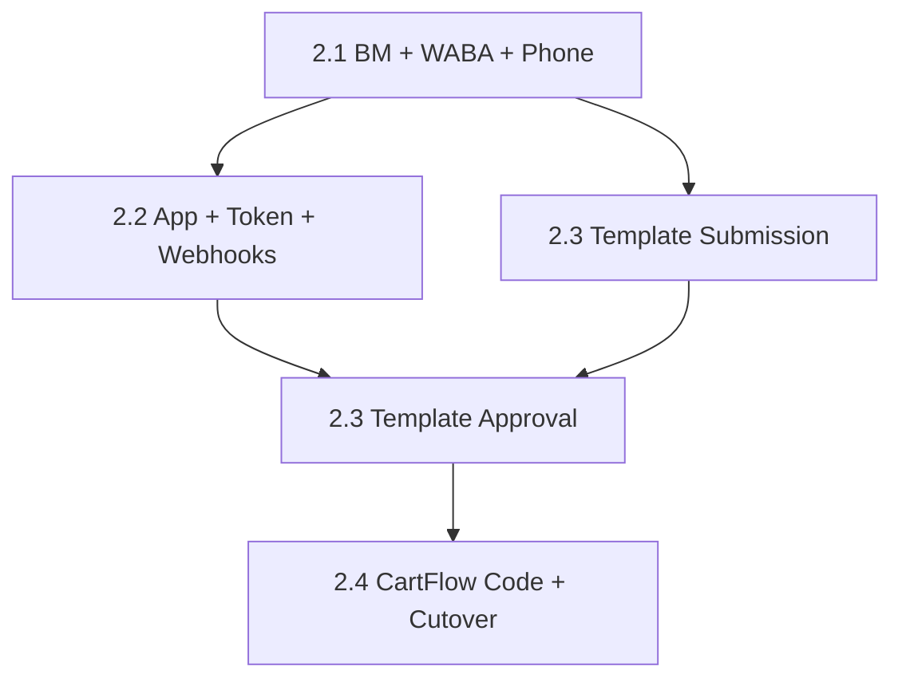

# CartFlow WhatsApp Production Reality — Phase 2.0 Meta Production Readiness Audit

**Date (UTC):** 2026-06-07  
**Phase:** Audit only — **no implementation, no Meta integration code, no provider migration, no template creation, no webhook setup, no Meta Business Manager actions**  
**Commit message:** `whatsapp production reality phase 2.0 meta production readiness audit`  

**Approved strategy (Phase 1 / 1.5):** Meta Cloud API = primary production provider; Twilio Sandbox = dev/test only; CartFlow Managed WABA (Model C) = Phase 1 launch; Merchant-Owned WABA = future; Mobile First = core principle.

**Builds on:** [cartflow_whatsapp_production_reality_phase1_architecture_audit_v1.md](cartflow_whatsapp_production_reality_phase1_architecture_audit_v1.md), [cartflow_whatsapp_production_reality_phase1_5_production_sender_strategy_audit_v1.md](cartflow_whatsapp_production_reality_phase1_5_production_sender_strategy_audit_v1.md)

---

## Executive summary

CartFlow is **not Meta Cloud API production-ready today**. Application code has a **partial, inactive Meta send stub** (`send_whatsapp_message`) and **no** WABA, Meta app wiring, Meta webhooks, template ID layer, or system-user token management. Production traffic runs on **Twilio** (currently sandbox-capable on smartreplyai.net).

**Known business context (not verified in Meta consoles during this audit):**

- A **dedicated CartFlow phone number** exists.
- **WhatsApp Business App** is in use on that number.
- Number was **purchased for CartFlow**.
- **No evidence of WABA / Cloud API onboarding** yet.

**Overall readiness:** **MISSING** for Meta production send — with **PARTIAL** code hooks and **PARTIAL** production infrastructure (HTTPS host, Twilio webhooks) that can be **reused conceptually** for Meta webhooks after Meta-side setup.

**Critical path before any CartFlow Meta code:** Meta Business Manager → business verification → WABA → register/migrate phone → Meta app + system user token → webhook subscription → template approval.

---

## Audit methodology and limits

| Source | What this audit can prove |
|--------|---------------------------|
| **Codebase / docs** | Env var names, stub paths, Twilio vs Meta split, delivery truth schema |
| **Production logs / prior audits** | Twilio sandbox on smartreplyai.net; VIP delivery logic proven |
| **User-provided context** | Dedicated number + Business App; no WABA yet |
| **Meta Business Manager** | **Not accessed** — BM/WABA/verification status marked **UNVERIFIED — ops must confirm** |

Every Meta asset row uses: **READY** / **PARTIAL** / **MISSING** / **UNVERIFIED (ops)**.

---

## Part A — Current Meta readiness inventory

### 1. Meta Business Manager

| Status | **UNVERIFIED (ops)** — assumed required, not confirmed in this audit |
| Production ready? | **No** until CartFlow legal entity BM exists and owns the WABA |
| Evidence | No BM ID, no `meta_business_id` in env, schema, or docs |
| Gap | Create or designate CartFlow Meta Business Manager; link legal entity (CartFlow company) |

---

### 2. Meta Business Portfolio

| Status | **UNVERIFIED (ops)** |
| Production ready? | **No** |
| Notes | Required for multi-app / partner structures; CartFlow may use single BM + single app initially — portfolio optional at launch but recommended for scale |

---

### 3. Business Verification

| Status | **MISSING** (for production WhatsApp sending at scale) |
| Production ready? | **No** |
| Evidence | No verification status in app; prior audits list as external ops requirement |
| Gap | Submit business documents in Meta Business Settings; required for higher limits, display name, template throughput |

---

### 4. Meta App

| Status | **PARTIAL** |
| Production ready? | **No** |
| Evidence | `main.send_whatsapp_message()` expects `WHATSAPP_API_TOKEN` + `WHATSAPP_PHONE_ID`; `get_meta_readiness()` checks `META_WHATSAPP_TOKEN` / `WHATSAPP_CLOUD_API_TOKEN` — **`ready: false`**, `meta_path_not_active` |
| Gap | Create Meta Developer app; add **WhatsApp** product; link to CartFlow WABA; production app review if needed for advanced permissions |

---

### 5. WhatsApp Manager (Meta UI)

| Status | **UNVERIFIED (ops)** — likely accessible only via Business App today, not Cloud API manager |
| Production ready? | **No** for API orchestration |
| Gap | After WABA creation, WhatsApp Manager becomes control plane for templates, phone numbers, insights |

---

### 6. WABA (WhatsApp Business Account)

| Status | **MISSING** per stated context |
| Production ready? | **No** |
| Evidence | No `waba_id` in codebase; Phase 1.5 assumes CartFlow-owned WABA not yet provisioned |
| Gap | Create WABA under CartFlow BM; set display name; accept WhatsApp Business Platform terms |

---

### 7. Phone number registration (Cloud API)

| Status | **MISSING** for Cloud API |
| Production ready? | **No** |
| Evidence | Dedicated number on **WhatsApp Business App** ≠ registered **`phone_number_id`** on WABA for Graph API |
| Gap | Migrate or register CartFlow dedicated number on WABA; obtain `phone_number_id` |

---

### 8. Cloud API access

| Status | **PARTIAL** (code path only) |
| Production ready? | **No** |
| Evidence | Graph send in `main.py` (~L13418); not used for recovery/VIP; not documented in `.env.example` |
| Gap | Enable Cloud API on Meta app; assign WABA; generate permanent token |

---

### 9. System User

| Status | **MISSING** |
| Production ready? | **No** |
| Evidence | No system user ID, no token rotation runbook in repo |
| Gap | Create system user in BM; assign WABA + app assets; generate **non-expiring** token (stored in secrets manager) |

---

### 10. Access tokens

| Status | **PARTIAL** |
| Production ready? | **No** |
| Evidence | Env vars referenced: `WHATSAPP_API_TOKEN`, `WHATSAPP_PHONE_ID`, `WHATSAPP_API_URL`, `META_WHATSAPP_TOKEN`, `WHATSAPP_CLOUD_API_TOKEN` — **not in `.env.example`**; production deployment uses Twilio vars only |
| Gap | Single canonical env set for Meta production; remove duplicate token env names in implementation phase |

---

### 11. Webhook configuration (Meta)

| Status | **MISSING** |
| Production ready? | **No** |
| Evidence | `POST /webhook/whatsapp` and `/webhook/whatsapp/status` are **Twilio-shaped**; `routes/whatsapp_delivery_webhook.py` header says "future Meta"; no Meta verify token, no Graph webhook subscription |
| Partial reuse | Public HTTPS host (`smartreplyai.net`) exists — **infrastructure PARTIAL** for Meta callback URL |
| Gap | Meta app webhook URL + verify token; subscribe to `messages`, message status, template status |

---

### 12. Template approval capability

| Status | **MISSING** (Meta-side) / **PARTIAL** (CartFlow local copy) |
| Production ready? | **No** |
| Evidence | Merchant `reason_templates_json` + `template_*` columns; `CARTFLOW_WHATSAPP_PROVIDER_TEMPLATES_APPROVED` ops flag; **no** Meta template IDs, no `message_template_status_update` webhook |
| Gap | Submit template pack in WhatsApp Manager; sync approval status before production business-initiated sends |

---

### Inventory summary table

| # | Asset | Exists? | Production ready? |
|---|-------|---------|-------------------|
| 1 | Meta Business Manager | UNVERIFIED | No |
| 2 | Business Portfolio | UNVERIFIED | No |
| 3 | Business Verification | MISSING | No |
| 4 | Meta App | PARTIAL | No |
| 5 | WhatsApp Manager | UNVERIFIED | No |
| 6 | WABA | MISSING | No |
| 7 | Phone (Cloud API) | MISSING | No |
| 8 | Cloud API access | PARTIAL (code) | No |
| 9 | System User | MISSING | No |
| 10 | Access tokens | PARTIAL (env refs) | No |
| 11 | Meta webhooks | MISSING | No |
| 12 | Template approval | MISSING (Meta) | No |

---

## Part B — Phone number readiness

### Current known state

| Fact | Implication |
|------|-------------|
| Dedicated CartFlow number | Strong candidate for **single production sender** (Model C) |
| WhatsApp Business App active | Number is **registered for app messaging**, not necessarily API |
| Purchased for CartFlow | Ownership clear for BM/WABA registration |
| No WABA onboarding yet | **Cloud API send impossible** until migration/registration completes |

### 1. Can this number be migrated to WABA?

**Yes, in principle** — Meta supports moving a number from WhatsApp Business App to **WhatsApp Business Platform (Cloud API)** on a WABA, subject to Meta eligibility rules (country, number type, not already on another WABA, etc.).

**CartFlow audit conclusion:** **Migration is the recommended path** for the existing dedicated number rather than purchasing a second number — avoids split identity and merchant confusion.

**UNVERIFIED:** Exact number country, carrier, and current Meta registration state must be confirmed in WhatsApp Manager / Business App settings by ops.

---

### 2. Prerequisites

| Prerequisite | Status |
|--------------|--------|
| Meta Business Manager for CartFlow | UNVERIFIED |
| Business verification (often required for production tier) | MISSING |
| WABA created under BM | MISSING |
| Meta app with WhatsApp product | PARTIAL |
| Accept Platform Terms + pricing | MISSING |
| Number not active on another BSP/WABA | UNVERIFIED |
| OTP / SMS verification during registration | Ops step |

---

### 3. Risks

| Risk | Impact | Mitigation |
|------|--------|------------|
| **Downtime during migration** | Brief loss of Business App messaging on number | Schedule maintenance window; communicate internally |
| **Migration rejection** | Number ineligible (region, landline, already linked) | Pre-check in Meta docs; backup new number plan |
| **Dual use** | Same number on App + API simultaneously | **Not allowed** — complete migration before API send |
| **Display name rejection** | Delayed production send | Submit «CartFlow» / co-brand early; have fallback display name |
| **Quality rating cold start** | New WABA limits | Start with utility templates; monitor quality |
| **Twilio sandbox confusion** | Ops tests wrong provider | Freeze Twilio as dev-only (Phase 1.5 decision) |

---

### 4. Does current usage create migration restrictions?

| Current usage | Restriction |
|---------------|-------------|
| WhatsApp Business App manual messaging | Must **migrate off app** to Cloud API for server sends from same number |
| Twilio sandbox sends to merchant VIP destination | **Independent** — merchant phone as VIP destination unaffected |
| Twilio using platform sender (not CartFlow dedicated number) | **No conflict** with CartFlow number migration |
| Merchant `store_whatsapp_number` as VIP destination | Not the CartFlow sender number — **no migration needed** for merchant destinations |

**Conclusion:** Current Twilio sandbox usage does **not** block CartFlow dedicated number → WABA migration. Business App on that number **does** require formal migration before Graph API send from that number.

---

### 5. Exact steps required (ops sequence — not executed in this audit)

1. **Inventory number** — E.164, country, current Business App profile name.
2. **Create / open CartFlow Meta Business Manager.**
3. **Complete business verification** (legal name, address, website).
4. **Create WABA** under BM; set display name and category.
5. **Create Meta Developer app**; add WhatsApp product; link WABA.
6. **Initiate phone migration** (Business App → Cloud API) **or** add phone to WABA per Meta wizard.
7. **Verify OTP** on dedicated number.
8. **Record `phone_number_id` and WABA ID** in ops secrets (not repo).
9. **Create system user** + permanent token with `whatsapp_business_messaging`, `whatsapp_business_management`.
10. **Configure webhooks** on app → `https://smartreplyai.net/...` (path TBD in Phase 2.4 implementation).
11. **Submit initial template pack** (utility/marketing as appropriate).
12. **Test send** to internal device — **device delivered proof** before CartFlow cutover.

---

### Recommended handling strategy

| Strategy | Recommendation |
|----------|----------------|
| **Primary** | **Migrate existing dedicated number** to CartFlow WABA (Model C sender) |
| **Avoid** | Buying a second production number unless migration fails |
| **Twilio** | Keep sandbox number for dev; do **not** register CartFlow dedicated number on Twilio Production |
| **VIP destinations** | Keep merchant phones as **destinations only** — unchanged |

### Migration sequence

```
BM + verification → WABA → Meta app → migrate phone → system user token
    → webhooks (Meta) → templates approved → CartFlow adapter (Phase 2.4 code)
```

### Rollback considerations

| Rollback scenario | Action |
|-------------------|--------|
| Migration fails mid-way | Do not enable CartFlow Meta send; remain on Twilio sandbox for dev only |
| Template rejections block launch | Delay production cutover; use approved subset (VIP_ALERT + one recovery template) |
| Webhook misconfiguration | Meta sends fail silently for status — keep Twilio dev path; fix verify token before retry |
| Post-cutover critical failure | Operational Control pause WA; revert env to Twilio sandbox for staging only — **not** merchant production |

---

## Part C — Meta business requirements

### What Meta requires (production WhatsApp sender)

| Requirement | Meta expectation | CartFlow today |
|-------------|------------------|----------------|
| **Business verification** | Verified business in BM | **MISSING** |
| **Business information** | Legal name, address, country, vertical | **UNVERIFIED** — smartreplyai.net exists; legal entity docs not in repo |
| **Legal** | Accept WhatsApp Business Platform Terms | **MISSING** (ops) |
| **Website** | Functional business website | **PARTIAL** — `https://smartreplyai.net` production site |
| **Privacy policy** | Public privacy policy URL | **UNVERIFIED** — must confirm linked on site / Meta app |
| **Support** | Customer support contact (email/phone) | **UNVERIFIED** — merchant support flows exist in product; Meta listing separate |
| **Domain** | Domain verification for Meta app (recommended) | **UNVERIFIED** — may require DNS TXT for `smartreplyai.net` |
| **Display name** | Approved sender name visible to users | **MISSING** until WABA |
| **Opt-in evidence** | For marketing templates — customer consent | **PARTIAL** — widget reason capture = conversational opt-in path; document for Meta template category choice |

### What CartFlow already has

- Production web app and merchant dashboard (`smartreplyai.net`)
- Public HTTPS (required for webhooks)
- Arabic-first product copy and template editing UX (local, not Meta-approved)
- Merchant onboarding and readiness cards (`merchant_whatsapp_readiness_ui.py`, `whatsapp_production_reality_v2`)
- Operational control pause (`operational_control_v1`)
- Delivery truth persistence layer (`whatsapp_delivery_truth_v1`) — provider-normalized, Meta-ready **schema-wise**
- Zid OAuth / merchant identity (store connection — separate from WhatsApp)

### What CartFlow still lacks

- Verified Meta Business Manager ownership chain
- WABA + production `phone_number_id`
- Meta app production configuration + system user token
- Meta webhook endpoints (verify + ingest)
- Meta-approved template catalog
- Privacy policy / data processing disclosure **explicitly mapped** to WhatsApp messaging (ops/legal)
- Merchant-facing copy that WhatsApp sends come from **CartFlow sender** (Model C) — avoid implying merchant owns API when they do not

---

## Part D — Cloud API readiness

### App requirements

| Requirement | Status |
|-------------|--------|
| Meta Developer account | UNVERIFIED |
| App type suitable for WhatsApp (Business) | MISSING |
| WhatsApp product added to app | MISSING |
| App linked to CartFlow WABA | MISSING |
| Redirect URIs for future Embedded Signup (Model A) | MISSING — not needed for Phase 1 launch |
| App Mode: Live (not Development only) | MISSING |

### Token requirements

| Requirement | Status |
|-------------|--------|
| System user permanent token | MISSING |
| Token scopes: `whatsapp_business_messaging`, `whatsapp_business_management` | MISSING |
| Secrets storage (not git) | PARTIAL — `.env` pattern exists for Twilio; Meta vars undocumented in `.env.example` |
| Token rotation runbook | MISSING |

### Permission requirements

| Permission | Needed for | Status |
|------------|------------|--------|
| Send messages | Recovery, VIP, continuation | MISSING |
| Read templates | Template sync | MISSING |
| Manage webhooks | Delivery truth | MISSING |
| Embedded Signup (future) | Model A merchant WABA | MISSING |

### Webhook requirements

| Event (Meta) | CartFlow need | Status |
|--------------|---------------|--------|
| `messages` (inbound) | 24h window, reply intent, continuation | **MISSING** — Twilio inbound only today |
| `messages` (status: sent, delivered, read, failed) | Delivery truth | **MISSING** — Twilio status webhook exists separately |
| `message_template_status_update` | Template approval sync | **MISSING** |
| Verify token challenge | Meta webhook setup | **MISSING** |
| HTTPS TLS | Hosting | **READY** (smartreplyai.net) |

**Recommended Meta webhook URL (future implementation):** separate path from Twilio to avoid payload collision — e.g. `/webhook/whatsapp/meta` (decision only; **not created in this audit**).

### Operational requirements

| Requirement | Status |
|-------------|--------|
| Public stable base URL | **READY** — `CARTFLOW_PUBLIC_BASE_URL` pattern |
| Idempotent webhook processing | **PARTIAL** — `persist_delivery_truth()` exists |
| Signature verification (Meta `X-Hub-Signature-256`) | **MISSING** |
| Ops runbook for Meta errors | **PARTIAL** — failure classes in `cartflow_provider_readiness.py` |
| Monitoring / Admin Delivery Health | **PARTIAL** — admin WhatsApp card reads Twilio readiness today |

### Cloud API readiness verdict

| Area | READY | PARTIAL | MISSING |
|------|-------|---------|---------|
| Graph send code | | ✓ orphan path | |
| Recovery on Meta | | | ✓ |
| Tokens / system user | | | ✓ |
| Meta webhooks | | HTTPS host | ✓ handlers |
| Delivery truth schema | | ✓ Twilio wired | Meta normalizer |
| Env documentation | | | ✓ Meta in `.env.example` |

---

## Part E — Template readiness

### Meta assets required before template approval

| Asset | Required? | Status |
|-------|-----------|--------|
| WABA | Yes | MISSING |
| Verified business (often) | Yes for volume | MISSING |
| WhatsApp Business Account display name | Yes | MISSING |
| Template authoring in WhatsApp Manager | Yes | MISSING |
| Sample media (if templates use headers) | Per template | N/A until designed |
| Locale (Arabic `ar`) | Yes for CartFlow | Planned |
| Category per template (utility vs marketing) | Yes | Must be chosen per template — affects pricing and rules |

### Planned CartFlow template categories — readiness assessment

| Internal key | Meta category (recommended) | Pre-approval blockers | CartFlow local copy ready? |
|--------------|----------------------------|------------------------|----------------------------|
| `PRICE_TEMPLATE` | Marketing or Utility* | WABA + BM verification | ✓ local `template_price` |
| `QUALITY_TEMPLATE` | Marketing / Utility | Same | ✓ `template_quality` |
| `SHIPPING_TEMPLATE` | Utility | Same | ✓ `template_shipping` |
| `DELIVERY_TEMPLATE` | Utility | Same | ✓ `template_delivery` |
| `WARRANTY_TEMPLATE` | Utility | Same | ✓ `template_warranty` |
| `RECOVERY_REMINDER_TEMPLATE` | Marketing | Same + opt-in narrative | ✓ multi-slot messages |
| `CONTINUATION_TEMPLATE` | Utility (session context) | Same; often session message inside 24h | ✓ engine copy (dynamic — **high scrutiny**) |
| `VIP_ALERT_TEMPLATE` | Utility | Same | ✓ `build_vip_merchant_alert_body` |
| `MERCHANT_ALERT_TEMPLATE` | Utility | Same | ✓ phone capture alert body |
| `MERCHANT_SETUP_ALERT_TEMPLATE` | Utility | Future ops | ✗ not built |

\*Category choice requires legal/ops review — marketing vs utility affects Meta approval and conversation pricing.

### Template readiness verdict

| Layer | Status |
|-------|--------|
| **Meta template objects** | **MISSING** — none submitted |
| **CartFlow internal library mapping** | **PARTIAL** — Phase 1 doc defines keys; code uses freeform text |
| **Variable placeholder alignment** | **MISSING** — local `{free text}` ≠ Meta `{{1}}` schema |
| **Approval sync webhook** | **MISSING** |
| **Send-time template ID resolution** | **MISSING** |

**No template creation in this audit** — readiness is **not ready** for Meta production business-initiated recovery until WABA exists and at least one utility template is **APPROVED**.

---

## Part F — Delivery truth readiness

### Required states (Meta)

| State | Meta source | CartFlow today |
|-------|-------------|----------------|
| **Queued / Accepted** | Send API response `messages[].id` | Twilio `record_provider_acceptance_from_send` ✓ |
| **Sent** | Status webhook `sent` | Twilio normalizer ✓ |
| **Delivered** | Status webhook `delivered` | Twilio ✓; VIP poll ✓ |
| **Read** | Status webhook `read` | Twilio ✓ |
| **Failed** | Status webhook `failed` + errors | Twilio ✓; error 63015 class proven |

### Required webhook events (Meta — future)

| Subscription field | Purpose |
|--------------------|---------|
| `messages` | Inbound + status updates |
| `message_template_status_update` | Template approved/rejected/paused |

### Required persistence (already partially exists)

| Field | Table / module | Meta-ready? |
|-------|----------------|-------------|
| `message_sid` / Graph message id | `whatsapp_delivery_truth` | ✓ extend |
| `truth_level` | same | ✓ add Meta normalizer |
| `provider_error` | same | ✓ |
| `store_slug`, `session_id`, `cart_id` | same | ✓ populate on Meta send |
| `message_class` | **MISSING column** | Phase 2.4 implementation |

### Dependencies

```
Meta WABA + phone_number_id
    → Meta app webhooks configured
        → Meta normalizer in whatsapp_delivery_truth_v1
            → VIP + recovery writes same table
                → Admin Delivery Health grid
```

### Delivery truth readiness verdict

| Component | Status |
|-----------|--------|
| Persistence schema | **PARTIAL** — Twilio populated |
| Meta webhook ingest | **MISSING** |
| Meta normalizer | **PLACEHOLDER** only |
| Inbound for 24h window on Meta | **MISSING** |
| End-to-end Meta delivered proof | **MISSING** |

---

## Part G — Gap analysis

### Master gap table

| ID | Requirement | Status | Criticality | Impl order |
|----|-------------|--------|-------------|------------|
| G1 | Meta Business Manager (CartFlow) | UNVERIFIED | **P0** | 1 |
| G2 | Business verification | MISSING | **P0** | 2 |
| G3 | WABA creation | MISSING | **P0** | 3 |
| G4 | Dedicated phone → Cloud API registration | MISSING | **P0** | 4 |
| G5 | Meta Developer app + WhatsApp product | PARTIAL | **P0** | 5 |
| G6 | System user + permanent token | MISSING | **P0** | 6 |
| G7 | Meta webhook URL + verify token + subscriptions | MISSING | **P0** | 7 |
| G8 | Template pack submitted + approved | MISSING | **P0** | 8 |
| G9 | Privacy policy / website / support listing for Meta | UNVERIFIED | **P0** | 2 (parallel legal) |
| G10 | Canonical Meta env vars + secrets runbook | PARTIAL | **P1** | 9 |
| G11 | Provider adapter (Meta send) | MISSING | **P1** | 10 (Phase 2.4 code) |
| G12 | Meta inbound webhook handler | MISSING | **P1** | 11 |
| G13 | Meta delivery status normalizer | PARTIAL | **P1** | 12 |
| G14 | Template ID layer in send path | MISSING | **P1** | 13 |
| G15 | Unify / deprecate orphan `send_whatsapp_message` | PARTIAL | **P2** | 14 |
| G16 | Admin Delivery Health for Meta failures | PARTIAL | **P2** | 15 |
| G17 | Embedded Signup (Model A) | MISSING | **P3** | Future |
| G18 | `.env.example` Meta documentation | MISSING | **P2** | 9 |

### READY (today)

| Item |
|------|
| Production HTTPS host (`smartreplyai.net`) |
| Twilio delivery truth pipeline (reference implementation for Meta) |
| VIP delivery device-truth requirements documented |
| Local template copy / reason mapping UX |
| Operational pause controls |
| Phase 1 / 1.5 architectural decisions frozen |
| Mobile-first product principles in widget |

### PARTIAL (today)

| Item |
|------|
| Meta Graph send (`send_whatsapp_message` — manual route only) |
| Meta readiness stub (`get_meta_readiness`) |
| Delivery truth schema (Twilio-only normalizer active) |
| 24h window observation (Twilio inbound only) |
| Admin WhatsApp health card (Twilio-weighted) |
| Env/secrets pattern (Twilio documented) |

### MISSING (today)

| Item |
|------|
| CartFlow WABA |
| Cloud API registered phone / `phone_number_id` |
| Business verification |
| System user token |
| Meta webhooks |
| Meta-approved templates |
| Meta-primary recovery/VIP send path |
| Template approval sync |
| Provider adapter |

---

## Part H — Recommended execution order

**Sequential by default** — avoid parallel Meta ops + code cutover until G1–G8 complete.

### Phase 2.1 — Meta business foundation (ops only)

**Goal:** Legal entity represented in Meta; WABA exists; phone registered on WABA.

| Step | Action | Owner |
|------|--------|-------|
| 2.1.1 | Confirm/create CartFlow Meta Business Manager | Ops/founder |
| 2.1.2 | Complete business verification | Ops/legal |
| 2.1.3 | Confirm privacy policy + website + support contacts on Meta checklist | Legal/ops |
| 2.1.4 | Create WABA; set display name | Ops |
| 2.1.5 | Migrate dedicated CartFlow number from Business App → Cloud API | Ops |
| 2.1.6 | Record `waba_id`, `phone_number_id` in secrets vault | Ops |

**Exit criteria:** WhatsApp Manager shows number **Connected** to Cloud API; test message from Meta UI optional.

**No CartFlow code changes.**

---

### Phase 2.2 — Meta app, token, webhook infrastructure (ops + infra)

**Goal:** Meta app can authenticate server sends and receive webhooks at CartFlow host.

| Step | Action | Owner |
|------|--------|-------|
| 2.2.1 | Create Meta app; add WhatsApp product; link WABA | Ops |
| 2.2.2 | Create system user; assign assets; generate permanent token | Ops |
| 2.2.3 | Store `WHATSAPP_CLOUD_API_TOKEN`, `WHATSAPP_PHONE_NUMBER_ID`, `WABA_ID`, `META_APP_SECRET`, `META_WEBHOOK_VERIFY_TOKEN` in production secrets | Ops |
| 2.2.4 | Register webhook callback URL on Meta app (path reserved in runbook) | Ops + infra |
| 2.2.5 | Subscribe to `messages` + `message_template_status_update` | Ops |
| 2.2.6 | Verify webhook challenge reaches production host | Ops |

**Exit criteria:** Meta webhook dashboard shows **verified**; test inbound/status events received in logs (manual curl / Meta test button) — may require minimal **stub endpoint** in Phase 2.4; **defer code if ops can use Meta's test only**.

**No recovery/VIP send migration yet.**

---

### Phase 2.3 — Template pack approval (ops)

**Goal:** Minimum approved templates for launch.

| Step | Action | Owner |
|------|--------|-------|
| 2.3.1 | Map Phase 1 template keys → Meta template bodies (Arabic) with `{{variables}}` | Ops + product |
| 2.3.2 | Submit **VIP_ALERT** + **one recovery utility template** first (smallest launch set) | Ops |
| 2.3.3 | Submit remaining recovery templates | Ops |
| 2.3.4 | Document approved template names + IDs in ops registry | Ops |
| 2.3.5 | Set `CARTFLOW_WHATSAPP_PROVIDER_TEMPLATES_APPROVED=1` only after Meta approval | Ops |

**Exit criteria:** At least **VIP_ALERT** + **PRICE or OTHER recovery** template status = **APPROVED** in WhatsApp Manager.

**No CartFlow send path cutover yet.**

---

### Phase 2.4 — CartFlow implementation (code — next development phase)

**Goal:** Meta-primary send + delivery truth + template ID layer — **not part of this audit**.

| Step | Action | Depends on |
|------|--------|------------|
| 2.4.1 | Provider adapter interface + Meta implementation | 2.2, 2.3 |
| 2.4.2 | Meta webhook routes + signature verify + normalizers | 2.2 |
| 2.4.3 | Wire recovery/VIP/continuation to adapter | 2.3 |
| 2.4.4 | Template ID resolution layer | 2.3 |
| 2.4.5 | Device-delivered production proof (VIP + customer) | All above |
| 2.4.6 | Deprecate Twilio from production env; retain sandbox dev | 2.4.5 |
| 2.4.7 | Admin Delivery Health Meta columns | 2.4.2 |

**Exit criteria:** Production cart → Meta send → webhook **delivered** → merchant/customer device screenshot.

---

### Dependency diagram



---

## Part I — Mobile-first review

| Mobile-first principle | Meta readiness alignment |
|------------------------|--------------------------|
| **Merchant complexity minimized** | ✓ Phase 2.1–2.3 are **ops-only** — merchant never sees WABA, tokens, or webhooks |
| **WhatsApp remains core journey** | ✓ Model C keeps customer recovery + VIP on WhatsApp; Meta is transport only |
| **Onboarding friction minimized** | ✓ Merchant dashboard unchanged until readiness = «جاهز»; no Embedded Signup in Phase 2.1–2.3 |
| **Hesitation > exit intent** | ✓ Template pack must stay **short Arabic** — ops submission must match mobile-readable length |
| **Speed > visual complexity** | ⚠ Meta template approval adds **calendar days** — merchant-visible «pending WhatsApp» state required to avoid support tickets |
| **VIP = merchant mobile action** | ✓ `VIP_ALERT_TEMPLATE` first in 2.3 — matches merchant phone as primary success surface |

### Conflicts

| Conflict | Resolution |
|----------|------------|
| Business verification delays launch | Show honest readiness in dashboard; do not enable recovery send until approved |
| Marketing vs utility template categories | Prefer **utility** where possible for recovery/VIP ops alerts — lower friction and cost |
| Long template approval vs fast merchant signup | **Gate** WhatsApp recovery send separately from store signup success |

---

## Part J — Deliverables checklist

| # | Deliverable | Location in doc |
|---|-------------|-----------------|
| 1 | Meta readiness report | Part A |
| 2 | Gap analysis | Part G |
| 3 | Missing requirements list | Parts A, C, G |
| 4 | Phone migration assessment | Part B |
| 5 | Cloud API readiness assessment | Part D |
| 6 | Template readiness assessment | Part E |
| 7 | Delivery truth readiness assessment | Part F |
| 8 | Recommended execution order | Part H (2.1 → 2.4) |
| 9 | Mobile-first review | Part I |

---

## Decision log (frozen — Phase 2.0)

| ID | Decision |
|----|----------|
| MR-1 | CartFlow is **NOT** Meta production-ready until G1–G8 complete |
| MR-2 | **Migrate dedicated CartFlow number** to WABA (recommended) |
| MR-3 | **Do not** invest in Twilio Production sender registration for CartFlow number |
| MR-4 | Phase 2.1–2.3 = **ops only**; Phase 2.4 = **first code phase** |
| MR-5 | Minimum template launch set: **VIP_ALERT + one recovery template** |
| MR-6 | Meta webhooks should use **dedicated URL path** (not Twilio payload on same handler) |
| MR-7 | **No Meta setup actions performed in this audit** |

---

## Appendix — Codebase evidence index

| Evidence | Path |
|----------|------|
| Meta send stub | `main.py` `send_whatsapp_message()` |
| Meta readiness placeholder | `services/cartflow_provider_readiness.py` `get_meta_readiness()` |
| Twilio primary send | `services/whatsapp_send.py` |
| Twilio status webhook | `routes/whatsapp_delivery_webhook.py` |
| Delivery truth | `services/whatsapp_delivery_truth_v1.py` |
| Env example (Twilio only) | `.env.example` |
| VIP sandbox failure | `docs/cartflow_vip_operational_truth_closure_v1.md` |
| Phase 1.5 sender decision | `docs/cartflow_whatsapp_production_reality_phase1_5_production_sender_strategy_audit_v1.md` |

---

*End of Phase 2.0 audit. No code changes. Ops must verify UNVERIFIED items in Meta Business Manager before Phase 2.1 begins.*
