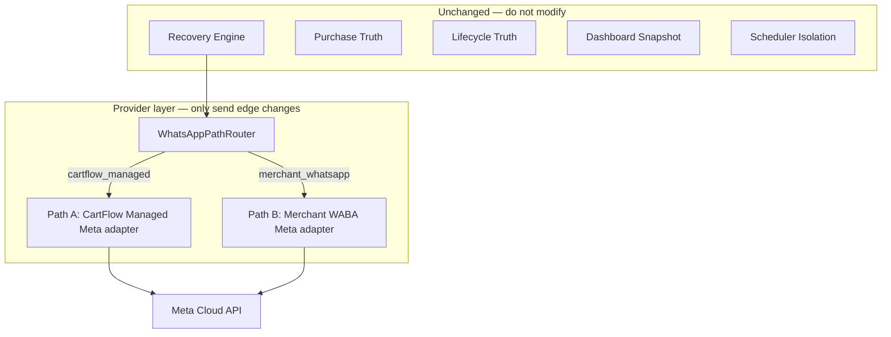

# CartFlow — WhatsApp Production Reality V1

**Date (UTC):** 2026-06-30  
**Status:** Design and decision only — **no Meta API implementation, no send/recovery/dashboard/scheduler changes**  
**Purpose:** Define the real production WhatsApp operating model before any new sending logic is built.  
**Supersedes as single entry point:** consolidates prior audits into one launch decision (`whatsapp_production_reality_v1.md`, Phase 1 / 1.5 / 2.0, dual architecture, template library, embedded signup foundation).

**Related (read-only references):**

| Document | Role |
|----------|------|
| [cartflow_whatsapp_dual_architecture_v1.md](cartflow_whatsapp_dual_architecture_v1.md) | Two-path model (`cartflow_managed` / `merchant_whatsapp`) |
| [cartflow_whatsapp_production_reality_phase1_5_production_sender_strategy_audit_v1.md](cartflow_whatsapp_production_reality_phase1_5_production_sender_strategy_audit_v1.md) | Sender provider decision |
| [cartflow_whatsapp_template_library_foundation_audit_v1.md](cartflow_whatsapp_template_library_foundation_audit_v1.md) | 8-key template library |
| [cartflow_whatsapp_embedded_signup_foundation_v1.md](cartflow_whatsapp_embedded_signup_foundation_v1.md) | Path B onboarding research |
| [whatsapp_production_reality_v2.md](whatsapp_production_reality_v2.md) | 24h window observation (today) |

---

## Executive verdict

| Question | Answer |
|----------|--------|
| **What should CartFlow launch with?** | **Model D Hybrid — Day 1 defaults to Model C (CartFlow Managed)** on a **CartFlow-owned Meta Cloud API WABA**, with merchants configuring recovery copy and toggles only. |
| **Day-1 sender** | **One shared CartFlow production number** (single WABA / `phone_number_id` at launch). Number pooling is Phase 2 ops, not Day 1. |
| **Day-1 provider (target)** | **Meta Cloud API direct** — not Twilio Production, not a third-party BSP. |
| **Day-1 provider (code today)** | **Twilio** (`services/whatsapp_send.py`) + partial Meta stub (`main.send_whatsapp_message`). Migration to Meta is **provider-layer work only** — recovery engine unchanged. |
| **Phase 2** | **Model A (Merchant-Owned WABA)** via **Embedded Signup v4** (Tech Provider path). BSP onboarding is **not** the primary strategy. |
| **Merchant-facing default** | `whatsapp_mode = cartflow_managed` — merchant does **not** need WABA knowledge on Day 1. |



---

## 1. CartFlow Managed WhatsApp (`cartflow_managed`)

Path A — default for all new merchants. CartFlow operates the sender; the merchant configures recovery behavior only.

### 1.1 Which number sends messages?

| Attribute | Day-1 decision |
|-----------|----------------|
| **Sender number** | **One CartFlow-operated WhatsApp Business number** registered on CartFlow’s WABA |
| **Scope** | **Shared platform sender** — all `cartflow_managed` stores send from the same production `phone_number_id` |
| **Merchant `store_whatsapp_number`** | **Not the customer-facing sender** on Path A — used for VIP merchant alerts, display, and future Path B migration only |
| **Multi-number future** | **Phase 2 / Future** — optional per-region or per-tier number pool behind the same adapter interface |

**Code reality today:** `TWILIO_WHATSAPP_FROM` is a single platform env var; all recovery/VIP/continuation traffic uses it when `recovery_uses_real_whatsapp()` is true.

### 1.2 One shared number or multiple?

| Phase | Model |
|-------|-------|
| **Day 1** | **One shared CartFlow number** — simplest ops, fastest launch, clearest compliance ownership |
| **Phase 2** | Evaluate **small pool** (e.g. KSA-dedicated + fallback) if Meta tier / throughput requires it |
| **Future** | Per-merchant co-branding on shared sender (display name variables in templates) — not separate numbers unless enterprise |

**Risk of single sender:** shared reputation — one merchant’s complaint volume affects all. Mitigate with operational controls (`operational_control_v1`), send caps, and quality monitoring (Admin Delivery Health).

### 1.3 Provider: Meta Cloud API, BSP, or Twilio?

| Provider | Role in CartFlow model |
|----------|-------------------------|
| **Meta Cloud API (direct)** | **Primary production target** — CartFlow-owned WABA, system user token, Graph send, Meta webhooks |
| **Twilio Sandbox** | **Dev/staging only** — engineer testing, mock-adjacent validation; not merchant launch |
| **Twilio Production** | **Not the long-term architecture** — acceptable as a **short bridge** only if Meta cutover sequencing requires weeks of overlap |
| **Third-party BSP** | **Not recommended at current stage** — adds vendor without removing Meta dependency; revisit only for enterprise white-label |

**Why Meta-direct:** Recovery policy (templates, WABA, 24h window, delivery webhooks, template status) is Meta-native. Twilio proved delivery logic in sandbox but created false failures (e.g. error 63015) and does not eliminate the need for Meta template IDs at scale.

### 1.4 What does the customer see as sender?

| Surface | Day-1 (Path A) | Phase-2 (Path B) |
|---------|----------------|------------------|
| **WhatsApp chat header** | CartFlow production business display name (WABA profile — e.g. «CartFlow» or co-branded «CartFlow · {store_name}» via template variables, not separate number) | **Merchant’s business name** from their WABA |
| **Message body** | Merchant-editable **variables** inside CartFlow-approved templates (`{{store_name}}`, `{{checkout_link}}`, etc.) | Same template library; sender identity is merchant-branded |
| **Merchant dashboard copy** | «CartFlow يتولى الإرسال» — no Meta jargon on main path (V2/V3 UX) | «واتساب أعمالي» — merchant-branded sender |

**Day-1 honesty:** Customers see a **CartFlow-operated sender**, not the merchant’s personal WhatsApp number. Merchants must understand this in onboarding copy even if they never touch WABA settings.

### 1.5 Operational limits

| Limit type | Day-1 handling |
|------------|----------------|
| **Meta messaging tiers** | CartFlow WABA starts at Meta’s default tier; ops monitors quality rating and throughput |
| **Template-only outside 24h** | All business-initiated recovery sends use **approved Meta templates** — no production freeform (`enforce_whatsapp_template_window_before_send` already models this) |
| **Rate / burst** | Platform-level send rate governed by Meta + CartFlow ops pause (`operational_control_v1`) |
| **Opt-out / user rejected help** | Existing gates: `_blocked_send_whatsapp_if_user_rejected_help`, behavioral flags |
| **Sandbox** | Non-production env may use Twilio sandbox or mock — recipients must join sandbox; **not** merchant-facing production |
| **Shared sender fairness** | CartFlow bears responsibility for delivery failures, spam reports, and template quality across all managed merchants |
| **Cost** | CartFlow pays Meta conversation charges for Path A — must be reflected in SaaS pricing / fair-use policy (out of scope for this doc’s implementation) |

---

## 2. Merchant WhatsApp (`merchant_whatsapp`)

Path B — merchant-owned sender identity. **Not Day-1 default.**

### 2.1 How does the merchant connect?

| Method | Decision |
|--------|----------|
| **Embedded Signup v4** | **Primary Phase-2 onboarding** — one-click Meta hosted flow from `#whatsapp-connect` (Tech Provider path) |
| **Meta Business Platform (manual pairing)** | **Supported fallback / interim** — merchant connects existing WhatsApp Business app to Business Platform; dashboard already surfaces pairing steps in advanced settings |
| **BSP onboarding** | **Not primary** — only if a specific enterprise contract requires it |
| **Twilio subaccount per merchant** | **Rejected** — diverges from Meta-native template/WABA model |

**Today:** `#whatsapp-connect` is a **commercial placeholder**; token exchange and Graph onboarding API are **not implemented** (`cartflow_whatsapp_embedded_signup_foundation_v1.md`).

### 2.2 Embedded Signup flow (Phase 2 target)

1. Merchant selects **«واتساب أعمالي»** on `#whatsapp`.
2. Merchant opens `#whatsapp-connect` → **«متابعة الربط»** (when enabled).
3. Meta JS SDK + Configuration ID → hosted WABA / phone setup.
4. CartFlow receives `waba_id`, `phone_number_id`, exchangeable OAuth `code`.
5. CartFlow server stores encrypted credentials and registers webhooks.
6. Readiness moves to `connected`; Path B adapter becomes send-capable.

**Prerequisites (ops, not code):** Tech Provider enrollment, App Review (Advanced), business verification, `account_update` webhook, OAuth domain allowlist.

### 2.3 What data must CartFlow store?

| Field / blob | Path | Sensitivity | Phase |
|--------------|------|-------------|-------|
| `whatsapp_mode` | both | low | **Day 1** (exists) |
| `store_whatsapp_number` | both | PII | **Day 1** (exists) |
| `whatsapp_recovery_enabled` | both | low | **Day 1** (exists) |
| `whatsapp_embedded_signup_status` | B | low | **Day 1** (foundation column) |
| `whatsapp_waba_id` | B | business | Phase 2 |
| `whatsapp_phone_number_id` | B | business | Phase 2 |
| `whatsapp_meta_business_id` | B | business | Phase 2 |
| `store_whatsapp_provider_config` (JSON, encrypted) | B | **secret** — token ref, refresh metadata | Phase 2 |
| `whatsapp_meta_pairing_status` | B | low | Phase 2 |
| `whatsapp_path_switched_at` / `whatsapp_path_previous` | both | audit | Phase 2 |

**Never store in merchant API responses:** access tokens, app secret, system user token (platform env only).

---

## 3. Template ownership

### 3.1 Who owns templates?

| Owner | Responsibility |
|-------|----------------|
| **CartFlow** | Template **structure**, Meta **category**, **submission**, **approval tracking**, **versioning**, rollback |
| **Merchant** | **Variable values only** within approved templates (store name, offer text slots, checkout link target) — not freeform body outside 24h window |

### 3.2 CartFlow or merchant WABA templates?

| Path | Template account |
|------|------------------|
| **Path A (managed)** | Templates registered on **CartFlow WABA** — one library serves all managed merchants via variables |
| **Path B (merchant)** | Templates registered on **merchant WABA** — CartFlow submits on merchant’s behalf (Tech Provider) using the **same internal 8-key library** mapped to merchant-specific provider template IDs |

### 3.3 Templates needed for abandoned cart recovery

Frozen **8-key library** (`cartflow_whatsapp_template_library_foundation_audit_v1.md`):

| Internal key | Use |
|--------------|-----|
| `PRICE_TEMPLATE` | Price objection recovery |
| `SHIPPING_TEMPLATE` | Shipping cost / delay |
| `QUALITY_TEMPLATE` | Quality / hesitation / `other` |
| `DELIVERY_TEMPLATE` | Delivery time |
| `WARRANTY_TEMPLATE` | Warranty concern |
| `RECOVERY_REMINDER_TEMPLATE` | Follow-up slot ≥ 2 |
| `CONTINUATION_TEMPLATE` | Post-reply auto-response (bounded) |
| `VIP_ALERT_TEMPLATE` | Merchant high-value cart alert (not customer recovery) |

**Today:** Local copy in `Store.reason_templates_json` / `template_*` columns resolves to **freeform text** sent via Twilio — **not** Meta template IDs.

### 3.4 What happens if a template is rejected?

| Stage | Action |
|-------|--------|
| **Detection** | Meta `message_template_status_update` webhook (Phase 2 ops) + admin visibility |
| **Merchant impact** | Dashboard shows «بانتظار الموافقة» — **variables locked** for rejected key; sends for that key **blocked** at provider layer |
| **CartFlow ops** | Revise body, increment version, resubmit — **never expose rejected draft text** to merchants |
| **Fallback** | Use last **approved** version for same key; if none, block send class and surface honest readiness — **no silent freeform in production** |
| **Recovery engine** | Unchanged — it still resolves message intent; provider layer maps key → approved template ID or returns structured block |

---

## 4. Reply ownership

### 4.1 Who receives customer replies?

| Path | Inbound destination | Who “owns” the conversation |
|------|---------------------|-----------------------------|
| **Path A (managed)** | **CartFlow platform number** (Twilio today → Meta WABA target) | **CartFlow platform** receives webhook; merchant sees **derived state** in dashboard |
| **Path B (merchant)** | **Merchant’s WABA number** | **Merchant owns sender identity**; CartFlow still processes webhooks for recovery automation |

### 4.2 Merchant vs CartFlow vs both?

| Actor | Role |
|-------|------|
| **CartFlow** | Ingest inbound webhooks; 24h window observation; behavioral recovery; continuation auto-replies; positive-reply detection |
| **Merchant** | **Human follow-up** on interested customers; VIP operational response; manual `wa.me` / dashboard actions (not classified sends) |
| **Customer** | Replies to whichever number sent the last outbound message |

**Today’s inbound stack** (`POST /webhook/whatsapp` — Twilio):

- `whatsapp_production_reality_v2` — 24h window observe
- `behavioral_recovery/inbound_whatsapp.py` — interactive state + continuation
- `whatsapp_positive_reply.py` — positive intent → `MerchantFollowupAction`
- `reply_intent_handling.py` — intent classification

**Gap:** No Meta Cloud inbound webhook wired to recovery paths yet (`routes/meta_whatsapp_webhook.py` exists for storage/diagnostics — not full recovery parity).

### 4.3 How is merchant follow-up shown?

| Signal | Surface |
|--------|---------|
| `MerchantFollowupAction` status `needs_merchant_followup` | **Follow-up / intervention** cart tabs (`#followup`) |
| Behavioral / lifecycle state | Normal carts lifecycle column + next-action copy |
| Positive reply «نعم» etc. | Creates merchant action — **no auto-reply to customer** from positive-intent hook alone |
| VIP lane | Separate — inbound on VIP carts skipped for normal behavioral continuation |

**Day-1 rule:** CartFlow **automates recovery and bounded continuation**; merchant **owns high-intent human follow-up** surfaced in dashboard — not a shared WhatsApp inbox UI on Day 1.

---

## 5. 24-hour window strategy

Meta customer service window rules apply to both paths.

### 5.1 Which messages are templates?

| Scenario | Message type |
|----------|--------------|
| **First recovery send** after abandon (no recent inbound) | **Template required** — map to reason library key |
| **Follow-up slot ≥ 2** outside 24h | **`RECOVERY_REMINDER_TEMPLATE`** |
| **Outside 24h, unknown window** | **Template required** (conservative default in `whatsapp_production_reality_v2`) |
| **VIP merchant alert** | **`VIP_ALERT_TEMPLATE`** — merchant-only bypass of customer 24h gate (existing) |
| **Operational alerts** | Template (future library extension) |

### 5.2 Which messages are session replies?

| Scenario | Message type |
|----------|--------------|
| **Inside 24h** after customer inbound | **Session / freeform allowed** — continuation auto-replies, bounded by CartFlow policy |
| **Manual merchant reply via WhatsApp app** | **Out of CartFlow send path** — merchant’s own session (Path B) or not applicable (Path A — merchant should use dashboard) |

### 5.3 What happens after 24 hours?

| Condition | Behavior |
|-----------|----------|
| No customer inbound within 24h | Next outbound **must** use approved **template** — freeform blocked at provider layer |
| Customer replied within 24h | Window resets to `inside_24h` — continuation may use session messages per policy |
| Unknown history | Treat as **outside 24h** — template required |
| Template not approved | Send **blocked** with honest merchant readiness — not mock success |

**Today:** Window is **observed and enforced** on production Twilio path when `recovery_uses_real_whatsapp()`; Meta adapter must preserve the same gate at provider boundary.

---

## 6. Migration model

Merchant journey: **starts CartFlow Managed → optionally switches to Merchant WhatsApp.**

### 6.1 What is preserved?

| Data / behavior | On path switch |
|-----------------|----------------|
| `store_whatsapp_number` | **Preserved** |
| `whatsapp_recovery_enabled` | **Preserved** |
| Recovery delays / attempts | **Preserved** |
| Template variable preferences (`reason_templates_json`, `template_*`) | **Preserved** |
| Onboarding journey key + status | **Preserved** |
| `RecoverySchedule` / in-flight jobs | **Not interrupted** — adapter resolved per send at execution time |
| Cart lifecycle / Purchase Truth | **Unchanged** |
| Dashboard snapshot architecture | **Unchanged** |

### 6.2 What changes?

| Dimension | A → B | B → A |
|-----------|-------|-------|
| **Customer-facing sender** | CartFlow number → merchant WABA number | Merchant number → CartFlow number |
| **Readiness gates** | Meta pairing + Embedded Signup required | Platform provisioning only |
| **Template binding** | CartFlow WABA template IDs → merchant WABA template IDs (re-approval) | Reverse — managed library IDs |
| **Inbound webhook routing** | Platform → merchant WABA webhook | Merchant → platform webhook |
| **Dashboard UX** | Advanced Meta/connect surfaces appear | Meta surfaces hidden (V3 scrub on main path) |
| **Sending** | May **stop** until Path B connected | Resumes when platform channel ready |

### 6.3 What must not break?

| System | Guarantee |
|--------|-----------|
| Recovery Engine | Scheduling, idempotency, delay units, reason capture |
| Purchase Truth | Conversion / return attribution |
| Lifecycle Truth | Customer lifecycle states, archive/reopen |
| Dashboard Snapshot | No hot-path WhatsApp computation |
| Scheduler Isolation | Due scanner / resume scan ownership |
| VIP lane isolation | Merchant alerts ≠ customer recovery counts |
| Hot path enforcement | `CARTFLOW_DASHBOARD_SNAPSHOT_ENFORCE` guards |

**Switch copy (merchant):** «قد تتغير خطوات الإرسال حسب المسار الجديد» — sending may pause until new path is ready; no silent sender change without readiness truth.

---

## 7. Launch scope classification

| Item | Classification | Notes |
|------|----------------|-------|
| `whatsapp_mode = cartflow_managed` default | **Day 1** | Exists |
| Merchant mode selection UX (V2/V3) | **Day 1** | Presentation only — shipped |
| Recovery engine + scheduler | **Day 1** | Unchanged |
| Local template copy editing | **Day 1** | Exists — maps to variables pre-Meta |
| Twilio sandbox / mock dev path | **Day 1** | Dev only |
| **Meta Cloud API send adapter (Path A)** | **Day 1** | **Required before real merchant production cutover** |
| CartFlow-owned WABA + phone registration | **Day 1 (ops)** | Prerequisite to adapter |
| 8-key template Meta approval (Arabic primary) | **Day 1 (ops)** | Phase 2.3 in prior audits — blocks production freeform |
| Meta inbound webhook → recovery parity | **Day 1** | Required for 24h truth + replies on Meta path |
| Meta delivery truth webhooks | **Day 1** | Replace Twilio-only truth for production |
| Provider adapter layer (`WhatsAppPathRouter`) | **Day 1 (code)** | Thin edge — Path A only initially |
| `whatsapp_connect_page` commercial UI | **Day 1** | Shipped — connect action disabled until Phase 2 |
| Embedded Signup token exchange + connect | **Phase 2** | Path B onboarding |
| Per-store WABA credential storage | **Phase 2** | Encrypted config blob |
| Path B Meta send adapter | **Phase 2** | Merchant-branded sender |
| Merchant self-serve template approval visibility | **Phase 2** | Status in dashboard |
| Multi-number sender pool | **Phase 2** | Ops scaling |
| BSP / enterprise white-label | **Future** | Not launch scope |
| Merchant WhatsApp inbox UI | **Future** | Dashboard follow-up suffices initially |
| AI reply drafting | **Future** | Out of scope |
| Per-merchant Meta billing passthrough | **Future** | CartFlow pays on Path A Day 1 |

---

## 8. Risks

### 8.1 Operational

| Risk | Mitigation |
|------|------------|
| Single shared sender reputation | Quality monitoring, ops pause, merchant fair-use |
| CartFlow bears all Path A delivery failures | Admin Delivery Health, honest readiness, no fake «sent» |
| Meta ops lead time (BM, WABA, templates) | Execute ops track **before** code cutover (Phase 2.1–2.3) |
| Twilio/Meta dual stack during migration | Time-boxed bridge; single adapter interface |

### 8.2 Meta approval

| Risk | Mitigation |
|------|------------|
| Template rejection delays launch | Pre-submit library; version pinning; block sends per key |
| Marketing vs Utility category mismatch | CartFlow compliance owns category choice |
| Tech Provider App Review delay | Start enrollment early; Path A can launch on CartFlow WABA without Embedded Signup |

### 8.3 Template

| Risk | Mitigation |
|------|------------|
| Local JSON copy ≠ approved Meta body | Adapter maps key + variables — never send raw merchant freeform in production |
| Multi-message slots use ad-hoc text | Slot ≥ 2 must use `RECOVERY_REMINDER_TEMPLATE` only |

### 8.4 Sender reputation

| Risk | Mitigation |
|------|------------|
| High complaint rate on shared number | Operational controls, opt-out respect, send caps |
| Merchant expects their brand on Path A | Clear onboarding: CartFlow sender until Path B |

### 8.5 Reply handling

| Risk | Mitigation |
|------|------------|
| Inbound on wrong number after path switch | Re-evaluate readiness; document sender change |
| Meta inbound not wired | Complete webhook parity before Meta production send |
| Merchant misses follow-up | Dashboard `needs_merchant_followup` + notifications (future) |

### 8.6 Compliance

| Risk | Mitigation |
|------|------------|
| KSA / Meta commerce policy | CartFlow-owned template compliance review |
| PII in templates | Variables only; no raw card dumps in template bodies |
| Merchant Path B token storage | Encrypt at rest; never expose in API |

---

## 9. Architecture rules

### 9.1 Provider layer boundary

WhatsApp **must remain behind the provider layer**. The recovery engine produces **intent** (phone, message class, reason tag, recovery key); the provider layer produces **delivery** (template ID, provider message ID, acceptance, truth).

```
Recovery Engine → WhatsAppPathRouter.resolve_send_context(store)
               → SendAdapter.send(SendIntent)
               → MetaCloudAdapter | TwilioDevAdapter
               → delivery truth hooks (unchanged interface)
```

**Forbidden:** Meta Graph calls, Twilio SDK calls, or template ID resolution inside recovery scheduler, due scanner, lifecycle classifiers, or dashboard builders.

### 9.2 Explicit non-modification list

Do **not** modify as part of WhatsApp provider work:

| System | Module examples |
|--------|-----------------|
| Recovery Engine | `recovery_db_due_scanner`, `decision_engine`, `recovery_message_templates` resolution contract |
| Purchase Truth | purchase attribution, return detection |
| Lifecycle Truth | `customer_lifecycle_states_v1`, lifecycle authority |
| Dashboard Snapshot Architecture | `dashboard_snapshot_*`, hot-path guards |
| Scheduler Isolation | `recovery_process_role_v1`, due scanner loop ownership |
| Hot Path Enforcement | `dashboard_snapshot_enforcement_guard_v1` |

WhatsApp changes are **edge adapters**, **webhooks**, **readiness presentation**, and **ops configuration** only.

### 9.3 Mode vs journey

| Concept | Rule |
|---------|------|
| `whatsapp_mode` | **Who sends** (path selector) |
| `whatsapp_onboarding_journey` | **How merchant set up** (UX sub-path) |
| Presentation | Follows **mode**, not journey alone |

---

## 10. Required final output

### 10.1 Recommended Day-1 WhatsApp model

**CartFlow Managed (`cartflow_managed`) on CartFlow-owned Meta Cloud API WABA.**

| Dimension | Day-1 spec |
|-----------|------------|
| Sender | One shared CartFlow production number |
| Provider | Meta Cloud API direct (Twilio sandbox for dev only) |
| Merchant setup | Recovery toggle, delays, template variables, optional store phone for VIP alerts |
| Templates | CartFlow-owned 8-key library — Meta-approved before production cutover |
| Outbound | Template-only outside 24h; continuation inside 24h per policy |
| Inbound | Meta webhook → existing behavioral / follow-up hooks |
| Replies | Platform receives; merchant follows up via dashboard |
| UX | V3 merchant experience — no disconnected/Meta noise on managed path |

### 10.2 Recommended Phase-2 model

**Merchant WhatsApp (`merchant_whatsapp`) via Embedded Signup v4 (Tech Provider).**

| Dimension | Phase-2 spec |
|-----------|--------------|
| Sender | Merchant WABA / phone_number_id |
| Onboarding | `#whatsapp-connect` live Embedded Signup + encrypted credential storage |
| Templates | Same internal library — per-merchant WABA approval |
| Router | `WhatsAppPathRouter` selects Path B adapter when mode + readiness satisfied |
| Migration | Opt-in upgrade from managed; preserved settings; honest sending pause until connected |

### 10.3 Clear verdict — what should CartFlow launch with?

> **Launch with CartFlow Managed WhatsApp (Path A) on a CartFlow-owned Meta Cloud API number, using CartFlow-approved templates and a provider adapter at the send edge — while keeping the recovery engine, scheduler, lifecycle, Purchase Truth, and dashboard snapshot system completely unchanged.**
>
> **Do not launch production on Twilio Production as the architecture target.**
>
> **Do not require merchants to connect WABA on Day 1.**
>
> **Offer Merchant WhatsApp (Path B) as Phase 2 via Embedded Signup once Path A production send and template library are proven.**

---

## Appendix A — Current code vs target (reference)

| Capability | Today | Target Day 1 |
|------------|-------|--------------|
| Recovery send | Twilio freeform (`whatsapp_send.py`) | Meta template send via adapter |
| Manual cart send | Meta Graph stub (`main.send_whatsapp_message`) | Unified adapter |
| Inbound | Twilio `POST /webhook/whatsapp` | Meta webhook + parity |
| Delivery truth | Twilio status callback | Meta status events |
| Template IDs | None in send path | 8-key registry → provider ID |
| Path router | Not implemented — all stores use platform Twilio | `WhatsAppPathRouter` — Path A only |
| `merchant_whatsapp` mode | Presentation + readiness only | Phase 2 send |

---

## Appendix B — Ops sequence before production cutover

1. **Phase 2.1 (ops):** CartFlow Business Manager + WABA + register dedicated phone on Cloud API  
2. **Phase 2.2 (ops):** Meta app, system user token, webhook subscriptions (`messages`, template status)  
3. **Phase 2.3 (ops):** Submit and approve 8-key Arabic template library on CartFlow WABA  
4. **Phase 2.4 (code):** Provider adapter + Path A cutover + Meta inbound/delivery truth — **edge only**  
5. **Phase 3 (ops + code):** Embedded Signup + Path B adapter  

---

**End of document.**
