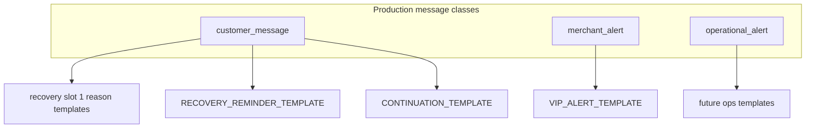

# CartFlow WhatsApp Production Reality — Template Library & Message Classification Foundation Audit

**Date (UTC):** 2026-06-07  
**Phase:** Decision and architecture only — **no Meta integration, no provider migration, no code changes**  
**Commit message:** `docs whatsapp template library foundation`  
**Status:** Definitive template library reference before Meta Phase 2.3 (template approval) and Phase 2.4 (code)

**Builds on:** [cartflow_whatsapp_production_reality_phase1_architecture_audit_v1.md](cartflow_whatsapp_production_reality_phase1_architecture_audit_v1.md), [cartflow_whatsapp_production_reality_phase1_5_production_sender_strategy_audit_v1.md](cartflow_whatsapp_production_reality_phase1_5_production_sender_strategy_audit_v1.md), [cartflow_whatsapp_production_reality_phase2_0_meta_production_readiness_audit_v1.md](cartflow_whatsapp_production_reality_phase2_0_meta_production_readiness_audit_v1.md), [whatsapp_delivery_truth_v1.md](whatsapp_delivery_truth_v1.md), [cartflow_vip_operational_truth_closure_v1.md](cartflow_vip_operational_truth_closure_v1.md)

**Regression safety:** This document does not modify recovery logic, widget flow, WhatsApp sending, or dashboard behavior.

---

## Executive summary

CartFlow must move from **merchant-editable freeform copy** (`reason_templates_json`, `template_*` columns) to a **provider-approved template library** before Meta Cloud API production cutover. This audit freezes the **eight canonical internal template keys**, the **three production message classes**, the **delivery truth lifecycle**, and **ownership boundaries** so ops (Phase 2.3) and engineering (Phase 2.4) can execute without re-litigating structure.

**Frozen decisions:**

| Decision | Value |
|----------|-------|
| Template library size | **8 keys** (see Part A) |
| Message classes | `customer_message`, `merchant_alert`, `operational_alert` |
| Delivery truth states | `queued` → `sent` → `delivered` → `read` → `failed` |
| Template approval owner | **CartFlow** (Meta submission, category, versioning) |
| Merchant edit scope | **Variables only** within approved templates |
| Production freeform | **Forbidden** outside 24h customer service window |

**Today vs target:** Runtime still resolves freeform text via `reason_template_recovery.py` and sends through Twilio sandbox. Target state maps each send to exactly one library key + approved provider template ID + merged variables. Gap closure is **Phase 2.3 (ops)** then **Phase 2.4 (adapter + send path)** — not this document.

---

## Part A — Template Library structure

### A.1 Design principles

1. **One internal key → one provider template name → one Meta approval record** per language variant.
2. **Reason tags normalize to library keys** — same pattern as `canonical_reason_template_key()` today, but keys use the `*_TEMPLATE` suffix in the library registry.
3. **Slot index selects variant, not freeform body** — multi-message recovery uses `RECOVERY_REMINDER_TEMPLATE` for attempt 2+, not ad-hoc merchant paragraphs.
4. **VIP lane is isolated** — `VIP_ALERT_TEMPLATE` never shares customer recovery counters or reason tags.
5. **Continuation is bounded** — `CONTINUATION_TEMPLATE` uses CartFlow-controlled reply slots, not merchant-authored bodies.

### A.2 Library registry (canonical)

| Internal key | Meta category (typical) | Message class | Primary trigger | Destination |
|--------------|-------------------------|---------------|-----------------|-------------|
| `PRICE_TEMPLATE` | Marketing / Utility | `customer_message` | Abandon reason `price*` | Customer phone |
| `SHIPPING_TEMPLATE` | Utility | `customer_message` | Abandon reason `shipping*` | Customer phone |
| `QUALITY_TEMPLATE` | Marketing / Utility | `customer_message` | Abandon reason `quality*` / `thinking` | Customer phone |
| `DELIVERY_TEMPLATE` | Utility | `customer_message` | Abandon reason `delivery*` | Customer phone |
| `WARRANTY_TEMPLATE` | Utility | `customer_message` | Abandon reason `warranty*` | Customer phone |
| `RECOVERY_REMINDER_TEMPLATE` | Marketing | `customer_message` | Recovery schedule slot ≥ 2 | Customer phone |
| `CONTINUATION_TEMPLATE` | Utility | `customer_message` | Inbound reply auto-response (inside policy) | Customer phone |
| `VIP_ALERT_TEMPLATE` | Utility | `merchant_alert` | VIP threshold cart detected | Merchant WhatsApp |

**Note on `other` / unmapped reasons:** Widget reason `other` maps operationally to **`QUALITY_TEMPLATE`** with generic hesitation variables until a dedicated key is approved in a future library revision. No ninth production template is authorized in this foundation.

### A.3 Per-template specification

Each entry below is the **CartFlow-owned body structure** submitted to Meta. Merchants never edit structure, category, or footer compliance text.

#### `VIP_ALERT_TEMPLATE`

| Field | Value |
|-------|-------|
| **Purpose** | Notify merchant of high-value abandoned cart requiring attention |
| **Class** | `merchant_alert` |
| **Runtime today** | `services/vip_merchant_alert.py` — bypasses customer 24h gate; logs `vip_merchant_alert_*` statuses |
| **Merchant variables** | `{{store_name}}`, `{{cart_value}}`, `{{cart_value_display}}`, `{{dashboard_link}}`, `{{customer_phone}}` (optional slot — omit component if empty) |
| **CartFlow-controlled** | Alert tone, compliance footer, dashboard URL pattern, threshold gating (`vip_notify_enabled`, `is_vip_cart`) |
| **Success criterion** | **Device delivery** (`delivered`), not provider acceptance alone |
| **Isolation** | Must not increment customer `sent_count`; must not use customer recovery reason tags |

**Example structure (Arabic, illustrative — final copy owned by CartFlow compliance):**

```
تنبيه CartFlow — سلّة VIP
المتجر: {{store_name}}
القيمة: {{cart_value_display}}
{{#customer_phone}}هاتف العميل: {{customer_phone}}{{/customer_phone}}
افتح لوحة التحكم: {{dashboard_link}}
```

---

#### `PRICE_TEMPLATE`

| Field | Value |
|-------|-------|
| **Purpose** | First recovery message for price / discount hesitation |
| **Class** | `customer_message` |
| **Reason mapping** | `canonical_reason_template_key` → `price` → `PRICE_TEMPLATE` |
| **Schedule slot** | Slot 1 (first outbound after delay) |
| **Merchant variables** | `{{store_name}}`, `{{cart_value_display}}`, `{{checkout_link}}`, `{{offer_line}}` (optional — e.g. discount % if merchant enabled) |
| **CartFlow-controlled** | Body paragraphs, CTA button label, Meta category, language, version |

---

#### `SHIPPING_TEMPLATE`

| Field | Value |
|-------|-------|
| **Purpose** | Recovery for shipping cost objection |
| **Class** | `customer_message` |
| **Reason mapping** | `shipping*` → `SHIPPING_TEMPLATE` |
| **Schedule slot** | Slot 1 |
| **Merchant variables** | `{{store_name}}`, `{{shipping_summary}}`, `{{checkout_link}}` |
| **CartFlow-controlled** | Structure, shipping disclaimer compliance |

---

#### `QUALITY_TEMPLATE`

| Field | Value |
|-------|-------|
| **Purpose** | Recovery for product quality / trust / generic hesitation (`thinking`, `other`) |
| **Class** | `customer_message` |
| **Reason mapping** | `quality*`, `thinking`, `other` → `QUALITY_TEMPLATE` |
| **Schedule slot** | Slot 1 |
| **Merchant variables** | `{{store_name}}`, `{{product_name}}` (optional), `{{checkout_link}}`, `{{trust_line}}` (optional preset) |
| **CartFlow-controlled** | Trust claims bounds — merchant cannot inject unapproved superlatives |

---

#### `DELIVERY_TEMPLATE`

| Field | Value |
|-------|-------|
| **Purpose** | Recovery for delivery time concern |
| **Class** | `customer_message` |
| **Reason mapping** | `delivery*` → `DELIVERY_TEMPLATE` |
| **Schedule slot** | Slot 1 |
| **Merchant variables** | `{{store_name}}`, `{{delivery_estimate}}`, `{{checkout_link}}` |
| **CartFlow-controlled** | Estimate phrasing template; block absolute delivery guarantees |

---

#### `WARRANTY_TEMPLATE`

| Field | Value |
|-------|-------|
| **Purpose** | Recovery for warranty / returns concern |
| **Class** | `customer_message` |
| **Reason mapping** | `warranty*` → `WARRANTY_TEMPLATE` |
| **Schedule slot** | Slot 1 |
| **Merchant variables** | `{{store_name}}`, `{{warranty_summary}}`, `{{checkout_link}}` |
| **CartFlow-controlled** | Legal disclaimer block |

---

#### `RECOVERY_REMINDER_TEMPLATE`

| Field | Value |
|-------|-------|
| **Purpose** | Follow-up recovery attempts (slot 2, 3, …) regardless of reason |
| **Class** | `customer_message` |
| **Reason mapping** | Not reason-specific — selected by `RecoverySchedule` attempt index ≥ 2 |
| **Schedule slot** | Slot ≥ 2 (`recovery_multi_message.py` multi-slot path) |
| **Merchant variables** | `{{store_name}}`, `{{checkout_link}}`, `{{attempt_n}}`, `{{attempt_total}}` |
| **CartFlow-controlled** | Reminder tone variants, spacing copy, attempt cap messaging |

**Rule:** Slot 1 always uses the reason-specific template (`PRICE_TEMPLATE`, etc.). Slot 2+ always uses `RECOVERY_REMINDER_TEMPLATE` — never a second freeform reason body.

---

#### `CONTINUATION_TEMPLATE`

| Field | Value |
|-------|-------|
| **Purpose** | Automated reply after customer inbound message (continuation engine) |
| **Class** | `customer_message` |
| **Trigger** | `cartflow_reply_intent_engine` / inbound webhook path |
| **24h window** | May use session freeform **only inside** verified 24h window; outside window **must** use this template |
| **Merchant variables** | `{{store_name}}`, `{{short_reply}}` — value from **CartFlow-approved preset list** only (not free text) |
| **CartFlow-controlled** | Preset catalog, intent → preset mapping, purchase-truth block rules |

**Rule:** Continuation must not increment recovery attempt counters or re-arm recovery schedules.

---

### A.4 Template definition schema (target registry)

Future implementation (Phase 2.4) should persist definitions in this shape. Document-only today.

```yaml
TemplateDefinition:
  key: PRICE_TEMPLATE                    # internal library key
  message_class: customer_message
  provider_template_name: cartflow_recovery_price_v3_ar
  provider_template_id: null           # Meta ID after Phase 2.3
  language: ar
  meta_category: MARKETING
  version: 3
  status: pending | approved | rejected | retired
  variables:
    - name: store_name
      merchant_editable: true
      max_length: 64
    - name: checkout_link
      merchant_editable: false         # runtime-generated
      source: runtime.checkout_url
  merchant_overrides_allowed: true       # values only, not structure
  freeform_fallback: forbidden           # production
```

### A.5 Reason tag → library key mapping

| Widget / log reason tag | `canonical_reason_template_key()` | Library key (slot 1) |
|-------------------------|-----------------------------------|----------------------|
| `price`, `price_high`, `price_discount_request` | `price` | `PRICE_TEMPLATE` |
| `shipping`, `shipping_delay`, `shipping_cost` | `shipping` | `SHIPPING_TEMPLATE` |
| `quality`, `quality_concern` | `quality` | `QUALITY_TEMPLATE` |
| `delivery`, `delivery_slow` | `delivery` | `DELIVERY_TEMPLATE` |
| `warranty`, `warranty_issue` | `warranty` | `WARRANTY_TEMPLATE` |
| `thinking` | `thinking` | `QUALITY_TEMPLATE` |
| `other`, `other_*` | `other` | `QUALITY_TEMPLATE` |
| *(schedule slot ≥ 2)* | — | `RECOVERY_REMINDER_TEMPLATE` |
| `vip_merchant_alert` | — | `VIP_ALERT_TEMPLATE` |
| continuation / inbound auto-reply | — | `CONTINUATION_TEMPLATE` |

### A.6 Versioning and approval workflow

| Stage | Owner | Action |
|-------|-------|--------|
| Draft body | CartFlow product + compliance | Write Arabic (primary) + English (optional) structure |
| Meta submission | CartFlow ops (Phase 2.3) | Submit via WABA; track `pending` |
| Approval | Meta | `approved` → bind `provider_template_id` |
| Merchant visibility | Dashboard (future) | Show status: «معتمد v3» / «بانتظار الموافقة» — variables editable only when `approved` |
| Rollout | CartFlow engineering (Phase 2.4) | Pin `version`; retire old provider name after migration window |
| Rejection | CartFlow ops | Revise body; increment version; never expose rejected text to merchants |

---

## Part B — Message classification

Production WhatsApp traffic is classified into **exactly three top-level classes**. Subtypes refine routing, logging, and dashboard reporting but must not blur class boundaries.

### B.1 Class taxonomy



| Class | Definition | Template library keys | Typical destination | Dashboard surface |
|-------|------------|----------------------|---------------------|-------------------|
| **`customer_message`** | Outbound to **end customer** for recovery or continuation | `PRICE_*`, `SHIPPING_*`, `QUALITY_*`, `DELIVERY_*`, `WARRANTY_*`, `RECOVERY_REMINDER_*`, `CONTINUATION_*` | Customer phone on cart | Normal carts, lifecycle, sent count |
| **`merchant_alert`** | Outbound to **merchant device** for operational awareness | `VIP_ALERT_TEMPLATE` | Store WhatsApp / support URL / ops fallback | VIP tab, ops delivery health |
| **`operational_alert`** | Outbound to **CartFlow ops or merchant** for platform/onboarding incidents | *(future keys — not in 8-template foundation)* | Ops numbers / merchant setup contact | Admin ops only |

### B.2 Class assignment rules

| Rule | Detail |
|------|--------|
| **Single class per send** | Every `send_whatsapp()` (or future Meta adapter) call carries `message_class` |
| **Customer recovery ≠ merchant alert** | VIP sends are always `merchant_alert`; never `customer_message` |
| **Continuation is customer_message** | But must not trigger recovery attempt increment |
| **Operational_alert is reserved** | Onboarding failures, provider outages, billing — future library extension; **no production sends** until template approved |
| **Manual merchant actions excluded** | `wa.me` links from dashboard are **not** classified sends — no delivery truth required |

### B.3 Logging and reason_tag namespace

Each class writes distinct operational records (today: `CartRecoveryLog`; future: unified outbound log).

| Class | `reason_tag` / status namespace | Counts toward customer `sent_count` |
|-------|--------------------------------|--------------------------------------|
| `customer_message` | `sent_real`, `recovery_*`, reason tags | **Yes** (when customer recovery) |
| `merchant_alert` | `vip_merchant_alert_*` | **No** (enforced in `vip_operational_truth_v1`) |
| `operational_alert` | `ops_alert_*` (future) | **No** |

### B.4 Template requirement by class

| Class | Outside 24h window | Inside 24h window |
|-------|-------------------|-------------------|
| `customer_message` | **Approved library template required** | Library template preferred; bounded session freeform allowed for continuation only |
| `merchant_alert` | **Approved library template required** (production) | Same — no freeform merchant alerts in production |
| `operational_alert` | **Approved library template required** | Same |

**Production block:** If `message_class = customer_message` and window = `outside_24h` and no approved template for resolved key → **classified failure** (`template_not_approved`), not silent downgrade to freeform.

---

## Part C — Delivery truth lifecycle

### C.1 Canonical state machine

All provider-backed sends (Twilio today, Meta Cloud API target) share one lifecycle:

```
queued → sent → delivered → read
                  ↘ failed
```

| State | Meaning | Business interpretation |
|-------|---------|-------------------------|
| **`queued`** | CartFlow accepted send; provider API returned message ID / queued status | Send pipeline success — **not** customer/merchant receipt |
| **`sent`** | Provider handed message to WhatsApp network | Network acceptance — still **not** device proof |
| **`delivered`** | Message reached recipient device | **Customer recovery:** attribution-eligible. **VIP alert:** **primary business success** |
| **`read`** | Recipient opened message (where supported) | Engagement signal; optional for merchant alerts |
| **`failed`** | Undelivered, invalid number, sandbox block, template rejection, etc. | **VIP alert:** **primary business failure**. Customer recovery: retry policy applies |

**Terminal states:** `delivered`, `read`, `failed` (with `read` strictly after `delivered` when both exist).

**Monotonic rank (already implemented for VIP):** `failed` > `read` > `delivered` > `sent` > `queued` — never downgrade truth on late callbacks.

### C.2 Source of truth by layer

| Layer | Authority | Module (today) |
|-------|-----------|----------------|
| **Primary** | Provider status webhook | `ingest_twilio_status_callback()` → `whatsapp_delivery_truth_v1` |
| **Secondary** | Send-time API acceptance | `record_provider_acceptance_from_send()` → sets `queued` / initial `sent` |
| **Supplement** | Synchronous poll (VIP merchant alerts) | `vip_merchant_alert` post-send poll |
| **Non-authoritative** | `CartRecoveryLog.status = sent_real` | Provider acceptance log — must not be displayed as «تم التسليم» |

### C.3 Class-specific success criteria

| Class | Minimum production success | Dashboard must show |
|-------|---------------------------|---------------------|
| `customer_message` | `delivered` for attribution; `sent` acceptable for «إرسال» with disclaimer | Attempt N/M + truth badge |
| `merchant_alert` | **`delivered` to merchant device** | VIP alert truth — not SID alone |
| `operational_alert` | `delivered` | Admin delivery health |

### C.4 Webhook requirements (Meta Phase 2.2+)

| Requirement | Detail |
|-------------|--------|
| Status events | Subscribe to `sent`, `delivered`, `read`, `failed` |
| Normalization | Map Meta statuses → canonical enum in `whatsapp_delivery_truth_v1` |
| Idempotency | Same SID/wamid + status → upsert, not duplicate log rows |
| Template sends | Bind truth record to `template_key` + `message_class` |

---

## Part D — Template ownership

### D.1 Ownership matrix

| Concern | CartFlow owns | Merchant owns |
|---------|---------------|---------------|
| Template body structure | ✓ | ✗ |
| Meta category & submission | ✓ | ✗ |
| Approval status & versioning | ✓ | ✗ (read-only visibility) |
| Language variants | ✓ | ✗ |
| Variable **values** (store name, offer line, summaries) | Default + bounds | ✓ within max_length / preset lists |
| Enable/disable per reason | Policy bounds | ✓ (disable recovery for reason — does not create new template) |
| Recovery timing (delay, attempts) | Caps / compliance | ✓ within caps |
| VIP threshold & notify toggle | Template binding | ✓ |
| Checkout / dashboard URLs | ✓ runtime generation | ✗ |
| Freeform production message body | ✗ **forbidden** | ✗ **forbidden** |

### D.2 No freeform production templates

| Context | Allowed today (pre-cutover) | Allowed in production target |
|---------|----------------------------|--------------------------------|
| Customer recovery outside 24h | Blocked unless env override | **Library template only** |
| Customer recovery slot 1 body | Merchant edits `reason_templates_json.messages[].text` | **Variables only** — body from approved template |
| Customer recovery slot 2+ | Merchant freeform per slot | **`RECOVERY_REMINDER_TEMPLATE` only** |
| VIP merchant alert | Freeform compose in `vip_merchant_alert.py` | **`VIP_ALERT_TEMPLATE` only** |
| Continuation reply | Engine-generated text | **`CONTINUATION_TEMPLATE` + presets** |
| Dashboard preview / simulation | Freeform preview OK | Must label «معاينة — ليس إرسال Meta» |

**Enforcement point (future Phase 2.4):** Send adapter resolves `template_key` → `provider_template_id` + components; reject if `status != approved`.

### D.3 Merchant dashboard contract (future)

Merchants see:

- Template name (Arabic label mapped from key)
- Approval status and version
- Editable variable fields with validation
- Non-editable preview of structure

Merchants do **not** see:

- Meta template ID submission UI
- Raw body editor for production sends
- Ability to create new template keys

---

## Part E — Current runtime vs foundation (gap reference)

Read-only inventory — **no changes in this phase**.

| Area | Current state | Foundation target |
|------|---------------|-------------------|
| Template source | `Store.reason_templates_json`, `template_*`, `recovery_message_templates.py` | Registry of 8 keys → Meta IDs |
| Send path | Twilio `send_whatsapp()` freeform body | Adapter: key + components |
| VIP alert | Freeform Arabic compose | `VIP_ALERT_TEMPLATE` |
| Meta | Stub `send_whatsapp_message()`; `get_meta_readiness() → ready: false` | Cloud API with library IDs |
| Delivery truth | Twilio wired; VIP poll | Same lifecycle enum + Meta normalizer |
| Classification | Implicit (VIP isolation in code) | Explicit `message_class` on every send |
| Gate | `CARTFLOW_WHATSAPP_PROVIDER_TEMPLATES_APPROVED=1` env flag | Per-template `status = approved` in registry |

---

## Part F — Execution order (after this audit)

This document completes the **architecture foundation** slot in the WhatsApp Production Reality sequence:

| Phase | Owner | Deliverable |
|-------|-------|-------------|
| **2.1** | Ops | BM verification, WABA, phone migration |
| **2.2** | Ops | Meta app, system user, webhooks |
| **2.3** | Ops | Submit and approve all 8 templates in Meta |
| **2.4** | Engineering | Provider adapter, registry, send-path cutover, dashboard variable UI |
| **2.5** | Engineering | Deprecate freeform production paths; migrate `reason_templates_json` → variable overrides |

**Explicitly out of scope for this audit:** Meta API integration, Twilio→Meta migration, code changes, dashboard UI changes, recovery logic changes.

---

## Part G — Acceptance checklist

Before marking template foundation **closed for implementation**:

- [ ] All 8 internal keys defined with variables and class assignment
- [ ] Message classes `customer_message`, `merchant_alert`, `operational_alert` documented with isolation rules
- [ ] Delivery lifecycle `queued → sent → delivered → read → failed` frozen
- [ ] CartFlow ownership of approval confirmed; merchant variables-only confirmed
- [ ] No freeform production templates confirmed
- [ ] Reason tag mapping table aligned with `canonical_reason_template_key()`
- [ ] VIP lane isolation preserved in classification rules
- [ ] Phase 2.3 ops can submit Meta templates from Part A specs without further architecture debate

---

## References (code — read only)

| Module | Relevance |
|--------|-----------|
| `services/reason_template_recovery.py` | `canonical_reason_template_key()` — mapping precursor |
| `services/recovery_multi_message.py` | Multi-slot scheduling → `RECOVERY_REMINDER_TEMPLATE` |
| `services/vip_merchant_alert.py` | Merchant alert send → `VIP_ALERT_TEMPLATE` |
| `services/vip_operational_truth_v1.py` | Class isolation, delivery poll |
| `services/whatsapp_delivery_truth_v1.py` | Truth state storage |
| `services/whatsapp_production_reality_v2.py` | 24h window + template gate logs |

---

**End of audit.** Next action: Phase 2.3 — CartFlow ops submits Part A templates to Meta WABA for approval.
