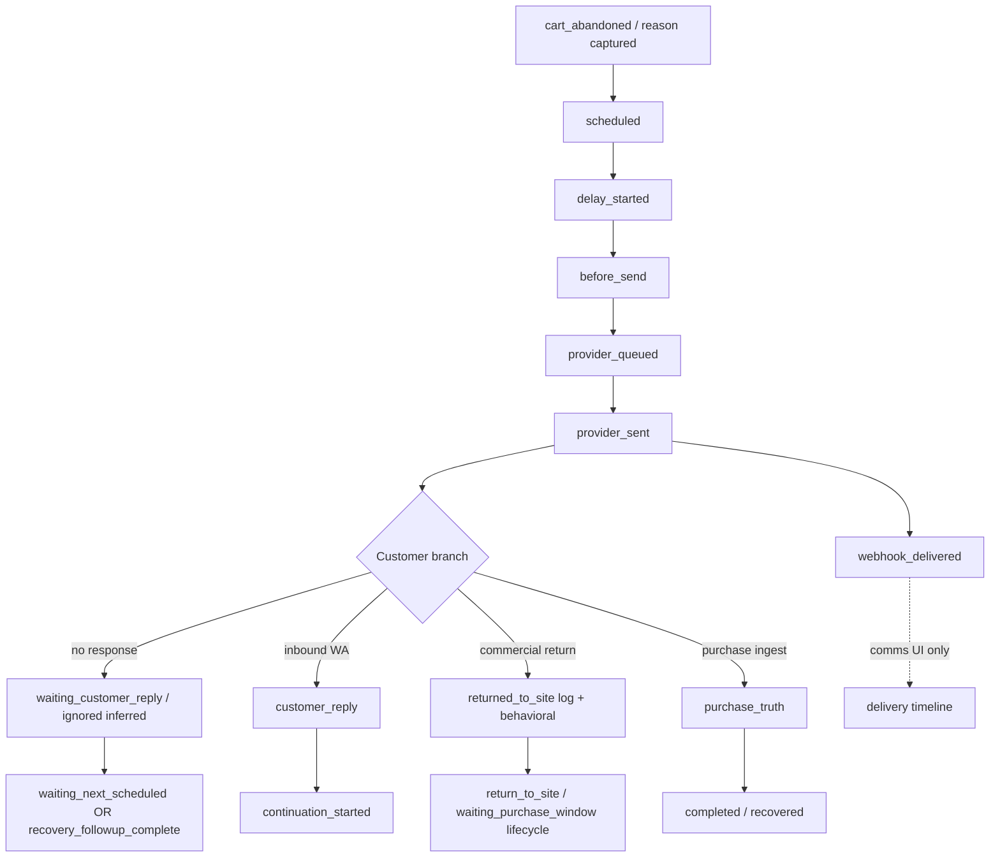

# CartFlow — Customer Movement Architecture Audit V1

**Date (UTC):** 2026-07-02  
**Status:** Read-only architecture and truth audit — no new tables, events, UI, or tracking  
**Question:** Before any Customer Movement layer, what signals already exist to answer *«What did the customer do after recovery began?»*

**Related audits:** `docs/cartflow_customer_activity_audit_v1.md`, `docs/cartflow_attention_bucket_semantic_audit_v1_report.md`, `docs/lifecycle_truth_contract.md`, `docs/source_of_truth_map.md` (if present).

---

## 0. Executive summary

CartFlow **already captures most post-send customer movement**, but truth is **fragmented across four durable layers** plus in-memory session caches:

| Layer | Role | Movement strength |
|-------|------|-------------------|
| **`PurchaseTruthRecord`** | Canonical purchase | Highest — stops recovery |
| **`RecoveryTruthTimelineEvent`** | Proven transitions (send, reply, continuation) | High for reply / continuation |
| **`CartRecoveryLog`** | Operational send/stop/skip statuses | High for return, send, ignore, fail |
| **`cf_behavioral`** (`AbandonedCart.raw_payload`) | Per-cart behavioral flags + counters | Medium — return/reply hints, passive revisits |
| **`LifecycleClosureRecord`** | Durable closure rank per `recovery_key` | Medium — reconciliation / attribution |
| **`MerchantFollowupAction`** | Positive inbound «نعم» | Narrow — follow-up tab only |
| **`RecoveryEvent`** | Secondary audit stream | Low — not merchant dashboard authority |

**Gaps:** No durable per-cart `widget_opened`, `session_seen`, `checkout_seen`, or `page_view` as first-class movement events. **Passive revisit** is stored lightly (`passive_return_visit_count`) and under-surfaced. **Ignored** is inferred from schedule/logs, not a discrete customer action.

**Recommendation:** A future movement layer should **not** duplicate writers. It should **summarize** existing authorities into a **Movement Snapshot** per `recovery_key`, with dashboard reading snapshots only — never scanning full timeline/log history.

---

## 1. STEP 1 — Existing signals inventory

Legend: **Persist** = where durable data lives; **Usage** = who reads it today.

### 1.1 Recovery message path (outbound)

| Signal | File(s) | Trigger | Persist | Usage |
|--------|---------|---------|---------|-------|
| **`scheduled`** | `recovery_restart_survival.py`, `recovery_truth_timeline_v1.py` | Recovery schedule materialized | `recovery_truth_timeline_events` | Lifecycle «بانتظار»; debug |
| **`delay_started`** | Timeline writer on delay arm | Scheduler delay begins | Timeline | Scheduling truth |
| **`before_send`** | `main._log_recovery_context_before_send` | Pre-send context log | Timeline | Debug / trace |
| **`provider_queued`** | `main._persist_cart_recovery_log` (`queued`) | Provider accept queue | Timeline + `cart_recovery_logs` | **Not** merchant «sent» alone |
| **`provider_sent`** | Successful WA send (`sent_real` / `mock_sent`) | Send completes | Timeline + `cart_recovery_logs` | `provider_send_proven()` gates reply/return lifecycle |
| **`webhook_delivered`** | `whatsapp_delivery_truth_v1.py` | Twilio status callback | Timeline + `whatsapp_delivery_truth` | Communication timeline UI — **not** lifecycle bucket |
| **`message_delivered`** | — | **Not a named signal** | Use `webhook_delivered` | Comms modal only |

### 1.2 Customer reply / engagement

| Signal | File(s) | Trigger | Persist | Usage |
|--------|---------|---------|---------|-------|
| **`customer_reply`** (timeline) | `recovery_transition_engine.apply_interactive_transition_from_customer_reply` | Inbound WA after prior send | Timeline `customer_reply` | Classifier reply proof; lifecycle `customer_reply` |
| **`customer_replied`** (behavioral) | Same + `inbound_whatsapp.py` | Inbound body + phone match | `cf_behavioral.customer_replied`, `last_customer_reply_*` | Phase `behavioral_replied`; send guards |
| **`customer_engaged`** (lifecycle) | `customer_lifecycle_states_v1.classify_*` | Reply + proven send + `continuation_started` | Derived state (not column) | Attention / engagement tab |
| **`continuation_started`** | `cartflow_reply_intent_engine.process_continuation_after_customer_reply` | Auto-continuation after reply | Timeline | Distinguishes engaged vs reply-only |
| **`continuation_sent`** | — | **Not used** | — | Use `continuation_started` |
| **`skipped_followup_customer_replied`** | Recovery skip path | Send blocked after reply | `cart_recovery_logs` | Blocker `customer_replied` |
| **Positive «نعم»** | `process_inbound_whatsapp_for_positive_intent` | Inbound intent | `merchant_followup_actions` | `#page-followup` rows |

### 1.3 Return / revisit / checkout intent

| Signal | File(s) | Trigger | Persist | Usage |
|--------|---------|---------|---------|-------|
| **`returned_to_site`** (log) | `main._persist_durable_return_to_site_evidence_from_payload` | Commercial return qualified on cart-event | `cart_recovery_logs.status` | Send stop; knowledge `recovery_returns`; closure mapping |
| **`user_returned_to_site`** | `behavioral_recovery/user_return.py`, return tracker | Commercial re-engagement POST | `cf_behavioral` | `_recovery_resolve_user_returned_for_send`; lifecycle `_return_to_site_detected` |
| **`customer_returned_to_site`** | `build_return_to_site_behavioral_patch` | Same | `cf_behavioral` | Dashboard track line; conversation extras |
| **`return_to_site`** (lifecycle) | `customer_lifecycle_states_v1` | Return detected after send, no reply precedence | Derived | Label «عاد العميل للموقع»; **sent** tab bucket |
| **`waiting_purchase_window`** | Same classifier | Return + pause window | Derived | Temporary pause copy; not terminal |
| **`passive_return_visit`** | `record_passive_return_visit_from_payload` | Non-commercial return tracker hit | `cf_behavioral.passive_return_visit_count` | Hint only — **does not** stop recovery |
| **`customer_returned`** (phase_key) | `main._normal_recovery_dashboard_phase_key` | Return evidence in logs/behavioral | Derived in API payload | Dashboard phase / coarse |
| **`user_returned`** (blocker) | `recovery_blocker_display` | Maps from log statuses | Display only | Blocker copy «توقفت: العميل عاد للموقع» |
| **`checkout_started` / `checkout_clicked` / `add_to_cart`** | `user_return.py` commercial classifier | Cart-event event names | Often → return path + behavioral | Treated as **commercial re-engagement**, not separate checkout table |
| **`page_view`** | Tests / misc cart-event | Client payload | May contribute to passive path | **Not** first-class merchant signal |
| **`session_seen`** | — | **Not found** | — | — |
| **`checkout_seen`** | — | **Not found** | — | — |

**Client ingress:** `static/cartflow_return_tracker.js` → `POST /api/cart-event` (`event_type: user_returned_to_site`); `static/cartflow_storefront_cart_bridge_core.js` → cart sync / abandon.

### 1.4 Purchase / conversion

| Signal | File(s) | Trigger | Persist | Usage |
|--------|---------|---------|---------|-------|
| **`purchase_truth` / `purchase_detected`** | `purchase_truth.py`, `cartflow_purchase_truth.py` | Verified ingest | `purchase_truth_records` | **Authoritative** purchase; lifecycle `completed`; send stop |
| **`conversion`** | `POST /api/conversion` | Checkout / COD / widget | → purchase truth | Same authority chain |
| **`user_converted` / `purchase_completed`** | Cart-event flags | Client / platform payload | → `ingest_purchase_truth_payload` | Same |
| **`stopped_converted`** | Purchase closure on recovery | Purchase ingest | `cart_recovery_logs` | Classifier recovered; closure record |
| **Zid order webhook** | `zid_webhook_purchase_v2.py` | Platform order | → purchase truth | Production purchase path |

### 1.5 Ignore / no-engagement (inferred)

| Signal | File(s) | Trigger | Persist | Usage |
|--------|---------|---------|---------|-------|
| **`ignored` / `waiting_customer_reply`** | Lifecycle + phase | Sent, no reply, schedule pending | Logs + lifecycle state | «بانتظار تفاعل العميل» — **inferred**, not customer click |
| **`skipped_attempt_limit`** | Recovery exhausted | Cap reached | `cart_recovery_logs` | Closure `max_attempts`; archived path |
| **`skipped_user_rejected_help`** | Customer negative intent | Inbound / widget | Logs + behavioral | Intervention / closure |
| **`recovery_followup_complete`** | Post-sequence window expired | No engagement after all sends | Lifecycle terminal | «انتهت متابعة CartFlow» |

### 1.6 Widget / storefront (weak persistence)

| Signal | File(s) | Trigger | Persist | Usage |
|--------|---------|---------|---------|-------|
| **`widget_opened` / `bubbleShown`** | `cartflow_widget_runtime/*` | UI show bubble | **Client session only** | Ops `Store.widget_last_beacon_json` — store-level, not per cart |
| **`widget_loaded`** | — | **Not found** | — | — |
| **Reason answered** | `POST /api/cart-recovery/reason` | Widget reason capture | `cart_recovery_reasons` | `reason_tag` on cart row — hesitation, not movement |
| **Hesitation / reason_tag** | Widget + reason API | Exit intent / reason click | `CartRecoveryReason`, cart payload | Pre-send context; knowledge hesitation distribution |

### 1.7 VIP / ops-only movement

| Signal | Usage |
|--------|-------|
| **`vip_manual_handling`** | VIP lane stop; separate dashboard |
| **Merchant alert logs** | VIP notify — not normal-cart movement |

---

## 2. STEP 2 — Movement event map

### 2.1 Canonical happy-path chain (normal recovery)



### 2.2 What exists vs inferred vs missing

| Movement question | Exists (durable) | Inferred only | Missing |
|-------------------|------------------|---------------|---------|
| Message sent | `provider_sent` timeline + log | — | — |
| Message delivered to device | `webhook_delivered`, `WhatsAppDeliveryTruth` | — | Merchant lifecycle bucket |
| Customer replied | Timeline `customer_reply` | Behavioral alone (downgraded for classifier) | Reply intent taxonomy on dashboard |
| System continued after reply | `continuation_started` | — | `continuation_sent` name unused |
| Customer returned (commercial) | Log `returned_to_site` + `cf_behavioral` | — | — |
| Customer revisited (passive) | `passive_return_visit_count` | Hint text | Dedicated lifecycle state |
| Customer reached checkout | Cart-event event names | Commercial return classifier | `checkout_seen` durable signal |
| Customer purchased | `purchase_truth_records` | — | — |
| Customer ignored | — | `waiting_customer_reply`, schedule, no timeline reply | Explicit `customer_ignored` event |
| Widget opened | — | Client `bubbleShown` | Per-cart durable open event |
| Session seen | — | — | **Missing** |
| Link clicked | `cf_behavioral.recovery_link_clicked` | Partial | Dashboard prominence |

### 2.3 Precedence rules (movement conflicts)

Documented in code — **must be preserved** in any future layer:

1. **Purchase** beats all (`has_purchase` / `purchase_truth`).
2. **Customer reply** beats **return** for lifecycle (`_return_to_site_detected` false if replied).
3. **Timeline reply** beats behavioral-only reply for classifier proof (`customer_reply_proven_for_dashboard`).
4. **Commercial return** stops sends; **passive revisit** does not.
5. **Return** is pause, not terminal completion (`waiting_purchase_window` ≠ `completed`).

---

## 3. STEP 3 — Source-of-truth map

| Merchant question | Source of truth | Secondary evidence | Not authoritative |
|-------------------|-----------------|--------------------|-------------------|
| Did the customer **purchase**? | `PurchaseTruthRecord` via `cartflow_purchase_truth.has_purchase(recovery_key)` | `AbandonedCart.status=recovered`, log `stopped_converted`, closure `purchase_completed` | Session cache alone, coarse without ingest |
| Did the customer **reply** on WhatsApp? | Timeline `customer_reply` on alias-expanded `recovery_key` | `cf_behavioral.customer_replied`, `MerchantFollowupAction.inbound_message` | Behavioral without timeline (classifier) |
| Did the system **continue** after reply? | Timeline `continuation_started` | Continuation send logs | `customer_engaged` label alone |
| Did the customer **return to site** (commercial)? | `CartRecoveryLog.returned_to_site` + `cf_behavioral.user_returned_to_site` | In-memory `_session_recovery_returned` (hot path) | Passive visit count |
| Did the customer **revisit later** (passive)? | `cf_behavioral.passive_return_visit_count`, `last_passive_return_visit_at` | Conversation hint | No single SoT row |
| Did the customer **reach checkout**? | **No dedicated SoT** | Cart-event commercial signals → return classifier; knowledge `checkout_signal_count` from timeline hints | — |
| Did the customer **ignore** messages? | **Inferred** | No `customer_reply` + sent proven + `waiting_customer_reply` / `waiting_next_scheduled` / exhausted logs | — |
| Did the customer **open the widget**? | **Not stored per cart** | Client state; store beacon JSON | — |
| Did the customer **hesitate** (reason)? | `CartRecoveryReason` + `reason_tag` on cart | Widget capture time | Not post-send movement |
| Was message **delivered**? | `WhatsAppDeliveryTruth` + timeline `webhook_delivered` | Provider callback payload | `provider_sent` ≠ delivered |
| What is **current movement state** for merchant? | `classify_customer_lifecycle_state_v1` (derived) | `merchant_cart_row_classifier` primary buckets | `RecoveryEvent` stream |

---

## 4. STEP 4 — Storage audit

### 4.1 Durable storage map

| Store | Table / field | Movement data | Append-only? | Indexed by |
|-------|---------------|---------------|--------------|------------|
| Purchase truth | `purchase_truth_records` | Purchase closure | Upsert per RK | `recovery_key` |
| Timeline | `recovery_truth_timeline_events` | Send, reply, continuation, delivery | **Yes** | `recovery_key`, `store_slug`, `status`, `created_at` |
| Recovery logs | `cart_recovery_logs` | Send, return, skip, fail, converted | **Yes** | `recovery_key`, `session_id`, `status`, `store_slug` |
| Behavioral | `abandoned_carts.raw_payload.cf_behavioral` | Return flags, reply preview, passive counts, link click | Merge update | Cart row (session/cart id) |
| Closure | `lifecycle_closure_records` | Ranked closure status per RK | Upsert with rank | `recovery_key` |
| Follow-up queue | `merchant_followup_actions` | Positive reply rows | Update status | `store_id`, phone |
| Delivery | `whatsapp_delivery_truth` | Per message SID | Update | `recovery_key`, `message_sid` |
| Reasons | `cart_recovery_reasons` | Pre-send hesitation | Insert | `session_id`, store |
| Carts | `abandoned_carts` | `status`, `recovered_at`, `cart_value` | Update | store, session, cart id |
| Audit | `recovery_events` | Webhook observe | Insert | store_id — **ops only** |

### 4.2 Temporary / hot-path storage

| Store | Location | Movement role | Risk |
|-------|----------|---------------|------|
| `_session_recovery_returned` | `main.py` in-memory | Fast return check before DB | Lost on restart; DB is durable backup |
| `_session_recovery_converted` | In-memory | Fast purchase gate | Rehydrates from purchase truth |
| `cart_event_request_scope` | Per-request cache | cart-event hot path | Request-scoped only |
| Dashboard snapshots | `dashboard_snapshots` JSON | Pre-built normal-carts payload | Movement **projected** at snapshot build, not raw events |

### 4.3 Read patterns

| Reader | Pattern | Scans historical events? |
|--------|---------|--------------------------|
| Normal-carts API | Batch: carts page + prefetch logs/timeline per alias keys | **Per active row** — bounded window (50+50), not full history |
| `build_merchant_cart_counter_totals` | Store-wide cart scan for counters | Lifecycle classify per cart — **no full timeline scan** |
| `knowledge_metrics_v1` | Monthly store rollup: logs + timeline in date range | **Yes** — admin/knowledge only |
| `GET /dev/recovery-truth` | Full timeline list per RK | **Yes** — diagnostics only |
| Messages / comms modal | Per-message delivery + matched inbound | Bounded by message list |
| Lifecycle attach | Merged `timeline_statuses` frozenset per row | Status **set**, not full event stream |

---

## 5. STEP 5 — Performance audit

### 5.1 Growth vectors (100 → 1,000 → 10,000 stores)

Assume average active recoveries per store per month; movement events are **per recovery_key**, not per store alone.

| Data | Growth | Dashboard risk | Notes |
|------|--------|----------------|-------|
| `recovery_truth_timeline_events` | **High** — 3–8 rows per active recovery typical | **Unsafe** to scan store-wide for merchant list | Already append-only; needs rollup/snapshot |
| `cart_recovery_logs` | **High** — multiple per send attempt | **Unsafe** for unbounded analytics queries | Knowledge layer scans monthly window |
| `purchase_truth_records` | Low — 1 per converted RK | Safe — indexed lookup | Authoritative, small |
| `cf_behavioral` JSON | Medium — 1 per cart row | Safe — read with cart row | Grows with `abandoned_carts` |
| `whatsapp_delivery_truth` | Medium — per outbound message | Safe for modal; not for movement summary | Comms layer |
| `merchant_followup_actions` | Low–medium | Safe — limited query (`limit 10`) | Engagement queue |
| Dashboard snapshots | Per store JSON blobs | Safe if rebuilt incrementally | Already caps normal-carts JSON |

### 5.2 Unsafe patterns (do not repeat at scale)

1. **Full timeline scan per dashboard page load** — current batch path uses **status sets**, not full history; keep it that way.
2. **Store-wide log aggregation on merchant hot path** — `knowledge_metrics_v1` pattern is acceptable for admin/monthly, not for `#carts` refresh.
3. **Re-deriving movement from 4 sources on every row without batch prefetch** — `normal_carts_dashboard_batch_v1` already batches; future movement must plug into batch reads.
4. **Unbounded `RecoveryEvent` queries** — audit stream only.

### 5.3 Events that should remain append-only

- Timeline transitions (`provider_sent`, `customer_reply`, `continuation_started`, `webhook_delivered`)
- `CartRecoveryLog` send/return/skip rows
- Purchase truth ingest (immutable truth row per RK)

### 5.4 Events that need rollups (future)

| Rollup candidate | Inputs | Consumer |
|------------------|--------|----------|
| **Movement summary per RK** | Latest timeline status set + key log statuses + behavioral flags + purchase flag | Merchant cart row |
| **Store movement counters** | Monthly aggregates (returns, replies, purchases) | Knowledge / home dashboard |
| **Passive revisit counter** | Already in behavioral — expose in summary, not raw events |

---

## 6. STEP 6 — Future architecture recommendation

### 6.1 Proposed layers (no implementation in this audit)

```
┌─────────────────────────────────────────────────────────┐
│  Merchant dashboard (reads summaries only)              │
└───────────────────────────┬─────────────────────────────┘
                            │
┌───────────────────────────▼─────────────────────────────┐
│  Movement Snapshot (per recovery_key, materialized)      │
│  - last_movement_at                                      │
│  - movement_phase: sent|replied|returned|purchased|... │
│  - flags: {replied, returned_commercial, purchased, ...}│
│  - source_revision / built_at                            │
└───────────────────────────┬─────────────────────────────┘
                            │ built from (read-only)
┌───────────────────────────▼─────────────────────────────┐
│  Movement Events (append-only, existing tables today)    │
│  timeline + logs + purchase_truth + cf_behavioral        │
└─────────────────────────────────────────────────────────┘
```

### 6.2 Four concepts

| Concept | Definition | Today |
|---------|------------|-------|
| **Movement Events** | Atomic proven transitions | Timeline + logs + purchase ingest + behavioral patches |
| **Movement Snapshot** | Denormalized per-RK view for reads | **Missing** — lifecycle + classifier approximate this at read time |
| **Movement Summary** | Store-period aggregates | `knowledge_metrics_v1` partial; counters use lifecycle buckets |
| **Dashboard consumption** | Merchant-visible truth | Lifecycle attach + conversation extras + follow-up queue |

### 6.3 Rules for future implementation

1. **Dashboard must never scan historical event tables store-wide** — only snapshot/summary + bounded active cart batch.
2. **Merchant UI reads summarized truth** — movement snapshot fields on normal-carts payload or slim snapshot allowlist.
3. **Historical events may grow indefinitely** — append-only writers unchanged; snapshot builder runs on ingest hooks or async materialization (similar to `dashboard_snapshot_v1`).
4. **Do not add parallel writers** — snapshot builder **observes** existing ingest paths (`record_recovery_truth_event`, `_persist_cart_recovery_log`, `ingest_purchase_truth`, behavioral merge).
5. **Preserve precedence** — purchase > reply > return; passive ≠ commercial return.
6. **Purchase / return / completed semantics** — movement layer is **downstream projection**; never override `PurchaseTruthRecord` or purchase lifecycle closure.

### 6.4 Suggested snapshot fields (illustrative)

```json
{
  "recovery_key": "store:session",
  "movement_phase": "customer_engaged",
  "flags": {
    "provider_sent": true,
    "customer_replied": true,
    "continuation_started": true,
    "returned_commercial": false,
    "passive_revisit_count": 2,
    "purchased": false
  },
  "last_movement_at": "2026-07-02T12:00:00Z",
  "sources": ["timeline", "behavioral", "logs"]
}
```

---

## 7. Missing signals (explicit gaps)

| Gap | Impact | Recommendation |
|-----|--------|----------------|
| **Per-cart widget open** | Cannot answer «did customer see widget?» post-abandon | Optional future event → behavioral or movement snapshot only |
| **`session_seen` / `checkout_seen`** | Checkout funnel opaque | Derive from cart-event commercial classifier or add single `checkout_reached` behavioral flag |
| **Explicit `customer_ignored`** | Merchant sees «waiting» not «ignored» | Keep inferred; optional summary flag |
| **`continuation_sent` naming** | Confusion | Document alias to `continuation_started` |
| **Passive revisit visibility** | Under-reported on dashboard | Surface `passive_return_visit_count` in movement snapshot |
| **Unified movement API** | Merchants reconcile 4 sources mentally | Movement snapshot on existing batch attach |

---

## 8. Key code references

| Area | Primary files |
|------|----------------|
| Cart-event ingress | `main.py` — `api_cart_event`, `_persist_durable_return_to_site_evidence_from_payload` |
| Return classification | `services/behavioral_recovery/user_return.py` |
| Reply handling | `services/recovery_transition_engine.py`, `services/cartflow_reply_intent_engine.py` |
| Timeline | `services/recovery_truth_timeline_v1.py` |
| Lifecycle projection | `services/customer_lifecycle_states_v1.py` |
| Purchase authority | `services/purchase_truth.py`, `services/cartflow_purchase_truth.py` |
| Behavioral store | `services/behavioral_recovery/state_store.py` |
| Dashboard batch reads | `services/normal_carts_dashboard_batch_v1.py`, `services/merchant_dashboard_recovery_resolve_v1.py` |
| Conversation hints | `services/recovery_conversation_tracker.py` |
| Knowledge rollups | `services/knowledge_metrics_v1.py` |
| Client return | `static/cartflow_return_tracker.js` |
| Client widget | `static/cartflow_widget_runtime/*` |

---

## 9. Non-goals (confirmed)

This audit did **not** build:

- Customer Movement UI  
- Customer Journey cards  
- Knowledge widgets  
- Timeline redesign  
- New tables or event writers  
- Additional tracking  

**Next step (out of scope):** Design `Movement Snapshot` materialization contract and hook points — only after product signs off on snapshot fields and merchant questions above.
