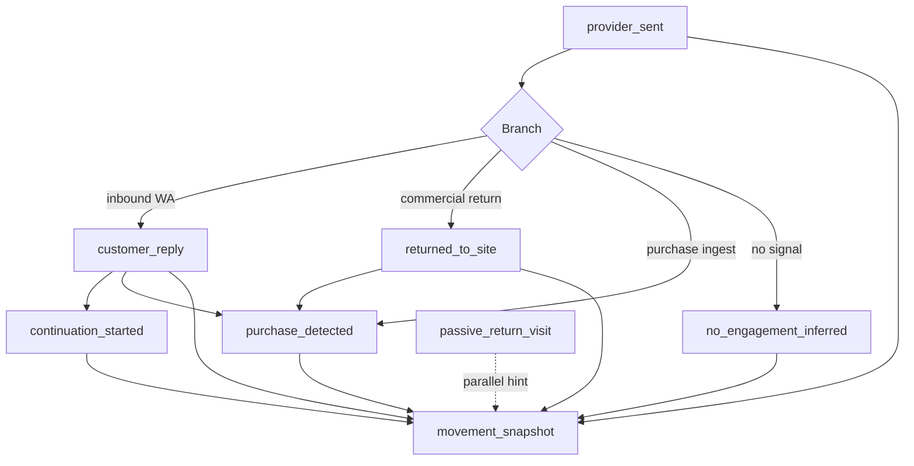

# CartFlow — Customer Movement Foundation v1 (Architecture Design)

**Date (UTC):** 2026-07-02  
**Status:** Design only — no UI, widgets, timeline redesign, new runtime writers, or schema migration in this phase  
**Builds on:** `docs/customer_movement_architecture_audit_v1.md`, `docs/lifecycle_truth_contract.md`, `docs/cartflow_operational_contracts_v1.md`

---

## 0. Purpose

CartFlow already captures purchase, reply, continuation, return, and lifecycle projection. **The gap is not more tracking** — it is **durable movement truth** that merchants can read without reconciling timeline + logs + behavioral JSON on every dashboard request.

This document defines:

1. **Movement questions** and one source of truth per question.  
2. **Movement events** that already exist (no new event taxonomy in v1).  
3. **`movement_snapshot`** — hot read model (one row per `recovery_key`).  
4. **`movement_summary`** — merchant-facing derived copy from snapshot only.  
5. **Hot/cold storage**, growth safety, and governance.

**Architectural principles (binding for v1 implementation):**

| # | Principle |
|---|-----------|
| 1 | Truth Before Intelligence |
| 2 | One Source Of Truth Per Question |
| 3 | Summarize Before Recompute |
| 4 | Archive Before Data Explodes |
| 5 | Dashboard Must Never Read History |
| 6 | Events Grow Forever |
| 7 | Hot Paths Must Stay Small |

---

## 1. STEP 1 — Movement questions

### 1.1 Primary merchant questions (post-send)

These are the questions a merchant asks after recovery has started (first `provider_sent` proven or equivalent).

| ID | Question (EN) | Question (AR) | Source of truth (v1) | Notes |
|----|---------------|---------------|----------------------|-------|
| **Q1** | Did we send a recovery message? | هل أُرسلت رسالة استرجاع؟ | **Movement snapshot** `message_sent` + `message_sent_at` | Materialized from timeline `provider_sent` or log `sent_real`/`mock_sent` |
| **Q2** | Did the customer reply? | هل ردّ العميل؟ | **Movement snapshot** `reply_received` + `reply_at` | Materialized from timeline `customer_reply` (authoritative); behavioral is corroboration only |
| **Q3** | Did the system continue after reply? | هل بدأ النظام متابعة بعد الرد؟ | **Movement snapshot** `continuation_started` + `continuation_at` | Timeline `continuation_started` |
| **Q4** | Did the customer return to the site (commercial)? | هل عاد العميل للموقع؟ | **Movement snapshot** `returned_to_site` + `returned_at` | Log `returned_to_site` + behavioral `user_returned_to_site`; **not** passive revisit alone |
| **Q5** | Did the customer purchase? | هل اشترى العميل؟ | **Purchase truth** → snapshot `purchase_detected` + `purchase_at` | `PurchaseTruthRecord` remains canonical; snapshot mirrors |
| **Q6** | What was the last customer activity? | ما آخر نشاط للعميل؟ | **Movement snapshot** `last_movement_type` + `last_movement_at` | Derived with precedence (§3.4) |
| **Q7** | What happened after the message? | ماذا حدث بعد الرسالة؟ | **Movement summary** `summary_lines_ar[]` | Derived from snapshot flags only — not raw events |
| **Q8** | Is the customer still active in recovery? | هل العميل ما زال نشطاً في المسار؟ | **Movement snapshot** `movement_active` | `false` when purchase or terminal closure; see §3.3 |
| **Q9** | Did the customer revisit passively? | هل عاد للتصفح دون إجراء واضح؟ | **Movement snapshot** `passive_revisit_count` + `last_passive_revisit_at` | From `cf_behavioral`; informational — does not stop recovery |
| **Q10** | Did the customer ignore us? | هل تجاهل العميل الرسائل؟ | **Inferred** — not a durable customer action in v1 | Snapshot flag `no_engagement_inferred` only when sent + no reply/return/purchase + sequence window rules met |

### 1.2 Explicit non-questions (out of movement v1 scope)

| Question | Why excluded |
|----------|--------------|
| Did the customer open the widget? | No per-cart durable signal today |
| Did the customer reach checkout? | No dedicated SoT; commercial cart-event path collapses into return |
| Why did the customer hesitate? | **Reason capture** (`CartRecoveryReason`) — pre-send, not post-send movement |

### 1.3 Question → authority quick reference

```
purchase?          → PurchaseTruthRecord (canonical) → movement_snapshot mirror
reply?             → movement_snapshot.reply_* (from timeline)
continuation?      → movement_snapshot.continuation_* (from timeline)
commercial return? → movement_snapshot.returned_* (from log + behavioral)
last activity?     → movement_snapshot.last_movement_*
after message?     → movement_summary (derived)
still active?      → movement_snapshot.movement_active
passive revisit?   → movement_snapshot.passive_revisit_*
ignored?           → movement_snapshot.no_engagement_inferred (inferred flag only)
```

**Lifecycle states** (`customer_lifecycle_states_v1`) remain the **recovery journey state machine** for filters and buckets. **Movement snapshot** answers **customer activity evidence** — complementary, not a replacement.

---

## 2. STEP 2 — Movement event model (existing events only)

v1 **does not introduce new event writers**. The materializer **observes** existing append paths.

### 2.1 Event catalog

| Event key | Writer (code path) | Persistence | Durability | Authority level |
|-----------|-------------------|-------------|------------|-----------------|
| **`scheduled`** | `recovery_restart_survival`, `record_recovery_truth_event` | `recovery_truth_timeline_events` | Append-only | Scheduling — not merchant movement |
| **`delay_started`** | Timeline on delay arm | Timeline | Append-only | Scheduling |
| **`before_send`** | `main._log_recovery_context_before_send` | Timeline | Append-only | Debug |
| **`provider_queued`** | `main._persist_cart_recovery_log` | Timeline + `cart_recovery_logs` | Append-only | Provider accept ≠ customer movement |
| **`provider_sent`** | Send success path | Timeline + `cart_recovery_logs` (`sent_real`/`mock_sent`) | Append-only | **Movement start gate** — enables Q1 |
| **`webhook_delivered`** | `whatsapp_delivery_truth_v1` | Timeline + `whatsapp_delivery_truth` | Append + update SID | Comms delivery — **not** movement bucket in v1 |
| **`customer_reply`** | `recovery_transition_engine.apply_interactive_transition_from_customer_reply` | Timeline | Append-only | **Authoritative reply** (Q2) |
| **`customer_replied`** (behavioral) | Same inbound path | `cf_behavioral` on `AbandonedCart` | Merge update | Corroboration; never overrides timeline absence |
| **`continuation_started`** | `cartflow_reply_intent_engine.process_continuation_after_customer_reply` | Timeline | Append-only | **Authoritative continuation** (Q3) |
| **`returned_to_site`** | `main._persist_durable_return_to_site_evidence_from_payload` | `cart_recovery_logs` | Append-only (debounced) | **Commercial return** (Q4) |
| **`user_returned_to_site`** | `behavioral_recovery/user_return.record_behavioral_user_return_from_payload` | `cf_behavioral` | Merge update | Corroboration for return |
| **`passive_return_visit`** | `record_passive_return_visit_from_payload` | `cf_behavioral` counters | Merge update | Q9 only |
| **`purchase_detected`** | `purchase_truth.ingest_purchase_truth*` | `purchase_truth_records` | Upsert per RK | **Highest authority** (Q5) |
| **`stopped_converted`** | Purchase closure hook | `cart_recovery_logs` | Append-only | Mirror into snapshot via purchase truth |
| **Skip / terminal logs** | Recovery engine | `cart_recovery_logs` | Append-only | Affects `movement_active`, not movement flags |

### 2.2 Event map (post-send movement)



### 2.3 Precedence when materializing snapshot (from existing product rules)

| Conflict | Winner | Rationale (existing code) |
|----------|--------|---------------------------|
| Purchase vs anything | **Purchase** | `has_purchase` stops recovery |
| Reply vs return | **Reply** | `_return_to_site_detected` false if replied |
| Commercial return vs passive | **Commercial** | Passive does not set `returned_to_site` |
| Timeline reply vs behavioral only | **Timeline** | `customer_reply_proven_for_dashboard` |

---

## 3. STEP 3 — `movement_snapshot` design

### 3.1 Table: `movement_snapshots` (proposed)

**Cardinality:** exactly **one row per `recovery_key`** (unique index).  
**Mutability:** row is **updated in place** by the materializer; underlying events remain **append-only**.  
**Versioning:** `movement_version` monotonic integer incremented on each successful apply.

```sql
-- Illustrative schema — implementation phase only
CREATE TABLE movement_snapshots (
  id                  INTEGER PRIMARY KEY,
  recovery_key        VARCHAR(512) NOT NULL UNIQUE,
  store_slug          VARCHAR(255) NOT NULL,
  session_id          VARCHAR(512),
  cart_id             VARCHAR(255),

  -- Last activity (denormalized)
  last_movement_type  VARCHAR(64) NOT NULL DEFAULT 'none',
  last_movement_at    TIMESTAMP WITH TIME ZONE,

  -- Message sent (recovery journey began for movement purposes)
  message_sent        BOOLEAN NOT NULL DEFAULT FALSE,
  message_sent_at     TIMESTAMP WITH TIME ZONE,

  -- Reply
  reply_received      BOOLEAN NOT NULL DEFAULT FALSE,
  reply_at            TIMESTAMP WITH TIME ZONE,

  -- Continuation
  continuation_started BOOLEAN NOT NULL DEFAULT FALSE,
  continuation_at     TIMESTAMP WITH TIME ZONE,

  -- Commercial return
  returned_to_site    BOOLEAN NOT NULL DEFAULT FALSE,
  returned_at         TIMESTAMP WITH TIME ZONE,

  -- Purchase (mirror of purchase truth)
  purchase_detected   BOOLEAN NOT NULL DEFAULT FALSE,
  purchase_at         TIMESTAMP WITH TIME ZONE,
  purchase_source     VARCHAR(128),

  -- Passive revisit (informational)
  passive_revisit_count INTEGER NOT NULL DEFAULT 0,
  last_passive_revisit_at TIMESTAMP WITH TIME ZONE,

  -- Inferred engagement
  no_engagement_inferred BOOLEAN NOT NULL DEFAULT FALSE,

  -- Activity gate
  movement_active     BOOLEAN NOT NULL DEFAULT TRUE,

  -- Provenance / ops
  movement_version    INTEGER NOT NULL DEFAULT 1,
  materialized_at     TIMESTAMP WITH TIME ZONE NOT NULL,
  source_revision     VARCHAR(128),  -- e.g. hash of contributing event ids or max timeline id

  created_at          TIMESTAMP WITH TIME ZONE NOT NULL,
  updated_at          TIMESTAMP WITH TIME ZONE NOT NULL
);

CREATE INDEX ix_movement_snapshots_store_slug ON movement_snapshots (store_slug);
CREATE INDEX ix_movement_snapshots_last_movement_at ON movement_snapshots (last_movement_at);
```

### 3.2 `last_movement_type` enum (v1)

| Value | Meaning |
|-------|---------|
| `none` | No post-send movement yet |
| `message_sent` | Send proven; awaiting customer |
| `customer_reply` | Reply received |
| `continuation_started` | System continued after reply |
| `returned_to_site` | Commercial return |
| `passive_revisit` | Last signal was passive only (informational) |
| `purchase_detected` | Purchase closed movement |
| `no_engagement` | Inferred ignore / sequence complete without engagement |

### 3.3 `movement_active` rules

`movement_active = false` when **any**:

- `purchase_detected = true`
- Terminal lifecycle closure applied (purchase closure rank wins)
- Recovery sequence exhausted with no re-open (optional mirror from lifecycle archive)

`movement_active = true` when message sent and purchase false and not terminal — even if customer returned (return is pause, not completion).

### 3.4 `last_movement_type` precedence (apply highest rank)

```
purchase_detected (8)
continuation_started (7)
customer_reply (6)
returned_to_site (5)
message_sent (4)
passive_revisit (3)
no_engagement (2)
none (1)
```

Timestamp for `last_movement_at` comes from the winning event’s authoritative timestamp.

### 3.5 Materialization contract

**Service (future):** `services/movement_snapshot_v1.py`

| Hook | When | Action |
|------|------|--------|
| After `record_recovery_truth_event` | Timeline write | Upsert snapshot fields for RK |
| After `_persist_cart_recovery_log` | Log write (sent/return/skip) | Upsert |
| After `ingest_purchase_truth` | Purchase | Upsert purchase mirror |
| After behavioral merge | `cf_behavioral` return/passive | Upsert passive/return corroboration |
| Async repair job | Stale `source_revision` | Rebuild from cold stores for RK |

**Rules:**

- Materializer is **read-only on cold stores during hot path** — it receives event payload from writer hook, not full table scan.
- **Idempotent:** same event replay does not regress `movement_version` incorrectly.
- **No new customer tracking** — only projects existing writes.
- Dashboard batch attach reads `movement_snapshots` by `recovery_key` IN (...) — **one query per page**.

### 3.6 Relationship to existing models

| Existing | Relationship |
|----------|--------------|
| `PurchaseTruthRecord` | Purchase fields on snapshot are **mirror**; purchase truth remains canonical for Q5 |
| `customer_lifecycle_state` | Lifecycle classifies journey; snapshot supplies **activity evidence** fields for summaries |
| `DashboardSnapshot` JSON | May embed slim movement fields per row in v2; v1 can join snapshot table in batch |

---

## 4. STEP 4 — `movement_summary` design

### 4.1 Definition

**Movement summary** is a **derived, read-only projection** for merchant copy. It is **never** computed from timeline/log scans at request time.

**Storage options (pick one at implementation):**

| Option | Pros | Cons |
|--------|------|------|
| **A. Computed at read from snapshot row** | No extra table; always consistent | Tiny CPU per row |
| **B. Cached columns on `movement_snapshots`** | Fastest dashboard | Must update on materialize |

**Recommendation:** Option **A** for v1 — pure function `build_movement_summary_ar(snapshot) -> MovementSummaryV1`.

### 4.2 Summary structure

```python
@dataclass
class MovementSummaryV1:
    headline_ar: str           # single line for compact UI (future)
    summary_lines_ar: list[str]  # ordered evidence bullets
    movement_phase_ar: str       # coarse phase label
    icons: list[str]             # optional ✓ prefixes
```

### 4.3 Line generation rules (derived from snapshot only)

| Snapshot condition | Summary line (AR) |
|--------------------|-------------------|
| `message_sent` | ✓ أُرسلت رسالة استرجاع. |
| `reply_received` | ✓ العميل ردّ. |
| `continuation_started` | ✓ بدأ النظام متابعة بعد الرد. |
| `returned_to_site` | ✓ عاد للموقع. |
| `passive_revisit_count > 0` (and not returned) | ✓ عاد للتصفح (زيارة سلبية). |
| `purchase_detected` | ✓ تم الشراء. |
| `no_engagement_inferred` | — بانتظار تفاعل العميل. |

**Ordering:** chronological by associated `_at` timestamps, then stable tie-break by precedence rank.

**Explicit exclusions (v1 copy rules):**

- Do **not** emit «تحتاج تدخل» from movement summary.  
- Do **not** imply manual action required unless a separate intervention layer says so.  
- «عاد للسلة» — use only when `recovery_return_context` / product page context is mirrored to snapshot in a **future** field (`returned_to_cart`); **not in v1** unless behavioral field is promoted.

### 4.4 Example

Snapshot:

```json
{
  "message_sent": true,
  "reply_received": true,
  "continuation_started": true,
  "returned_to_site": false,
  "purchase_detected": false,
  "last_movement_type": "continuation_started"
}
```

Summary lines:

```
✓ أُرسلت رسالة استرجاع.
✓ العميل ردّ.
✓ بدأ النظام متابعة بعد الرد.
```

---

## 5. STEP 5 — Hot / cold strategy

### 5.1 Layer diagram

```
┌─────────────────────────────────────────────────────────────┐
│  HOT — merchant & recovery gating reads                      │
│  movement_snapshots (1 row / recovery_key)                   │
│  purchase_truth_records (purchase authority)                 │
│  abandoned_carts (current cart row)                          │
└───────────────────────────┬─────────────────────────────────┘
                            │ materialized from (async/hook)
┌───────────────────────────▼─────────────────────────────────┐
│  COLD — append-only history (grow forever)                     │
│  recovery_truth_timeline_events                                │
│  cart_recovery_logs                                          │
│  cf_behavioral (merged JSON on cart)                         │
│  whatsapp_delivery_truth                                     │
│  recovery_events (audit only)                                  │
└─────────────────────────────────────────────────────────────┘
```

### 5.2 Read path rules

| Consumer | Allowed reads | Forbidden |
|----------|---------------|-----------|
| `GET /api/dashboard/normal-carts` | `movement_snapshots` batch by RK list | Full timeline scan per store |
| Lifecycle attach (transition) | Snapshot flags + existing lifecycle inputs | Re-derive reply from behavioral alone |
| Recovery send gate | Purchase truth + in-memory cache + **snapshot.returned** optional | Scan all logs for RK on every send |
| Knowledge / admin monthly | Cold tables in **date window** | N/A — not merchant hot path |
| Dev diagnostics | Full timeline | N/A |

### 5.3 Archive strategy (principle 4)

| Data | Archive policy |
|------|----------------|
| Timeline / logs | **Never delete** — append-only; index by `recovery_key`, `store_slug`, `created_at` |
| `movement_snapshots` | Keep for all active RKs; archive row when cart terminal + retention policy (future) |
| Purchase truth | Permanent per RK |
| Dashboard snapshots | Existing TTL + JSON cap — movement fields slim-encoded |

When cold data explodes, **snapshot row size stays O(1)** per recovery.

---

## 6. STEP 6 — Growth analysis

### 6.1 Assumptions

| Scale | Active stores | Avg active recoveries / store / month | Timeline rows / recovery | Log rows / recovery |
|-------|---------------|----------------------------------------|--------------------------|---------------------|
| **100** | 100 | 50 | 5 | 8 |
| **1,000** | 1,000 | 50 | 5 | 8 |
| **10,000** | 10,000 | 50 | 5 | 8 |

### 6.2 Projected row counts (monthly new cold events)

| Scale | Timeline rows / month | Log rows / month | Snapshot rows (stock) |
|-------|----------------------|------------------|-------------------------|
| 100 | ~25,000 | ~40,000 | ~5,000 active |
| 1,000 | ~250,000 | ~400,000 | ~50,000 active |
| 10,000 | ~2.5M | ~4M | ~500,000 active |

### 6.3 Impact on hot paths (with snapshot)

| Surface | Without snapshot (today) | With snapshot (target) |
|---------|------------------------|------------------------|
| Dashboard normal-carts | Batch timeline **status sets** per row (bounded) | **+1** `SELECT ... WHERE recovery_key IN (...)` |
| Merchant API latency | Dominated by cart batch + lifecycle | +O(page_size) snapshot lookup — indexed |
| Widget / cart-event | Unchanged | Unchanged — no snapshot read on storefront |
| Recovery execution | Log/timeline writes | +hook upsert snapshot (single row) |
| Scheduler | Unchanged | Unchanged |

### 6.4 Safety confirmation

| Risk | Mitigation |
|------|------------|
| Dashboard scans cold history | **Forbidden** by contract — snapshot-only reads |
| Movement growth slows widget | No snapshot on cart-event path |
| Movement growth slows scheduler | Materializer async or post-commit hook — no schedule change |
| Snapshot table bloat | One row per RK — linear with active recoveries, not events |
| Repair job overload | Per-RK rebuild; rate-limited backfill |

---

## 7. STEP 7 — Governance

### 7.1 Layer definitions

| Layer | Owns | Does not own |
|-------|------|--------------|
| **Movement Truth** | Existing event writers + purchase truth | Merchant copy, filters |
| **Movement Snapshot** | Per-RK durable flags and timestamps | Lifecycle state machine transitions |
| **Movement Summary** | Arabic lines from snapshot | Raw event interpretation at read time |
| **Dashboard consumption** | Join snapshot in batch; optional summary in payload | Timeline redesign, new cards |

### 7.2 Contracts

**C-MOV-1 — One SoT per question**  
Each question in §1.1 maps to exactly one field or mirror named in §1.3.

**C-MOV-2 — No history on dashboard hot path**  
`GET /api/dashboard/normal-carts` and summary APIs must not query `recovery_truth_timeline_events` or `cart_recovery_logs` **for movement display** once snapshot is wired. Lifecycle may still use batched status sets until cutover; cutover = snapshot mandatory.

**C-MOV-3 — Events append-only**  
Materializer never deletes timeline/log rows.

**C-MOV-4 — Purchase truth supremacy**  
`purchase_detected` on snapshot must match `PurchaseTruthRecord` when present.

**C-MOV-5 — Precedence immutable**  
Reply beats return; purchase beats all — matches `customer_lifecycle_states_v1` and audit §2.3.

**C-MOV-6 — Summary is derived**  
`movement_summary` functions accept `MovementSnapshotV1` only — no DB access.

**C-MOV-7 — Hot path budget**  
Snapshot upsert must complete in **< 50ms p95** or async queue; failure logs `[MOVEMENT SNAPSHOT]` without blocking send/reply/return writes.

### 7.3 Observability

| Log / metric | Purpose |
|--------------|---------|
| `[MOVEMENT SNAPSHOT] apply` | rk, version, last_movement_type, hook |
| `[MOVEMENT SNAPSHOT] lag` | `materialized_at` vs source event time |
| `movement_snapshot_repair_total` | Backfill counter |
| Dev `GET /dev/movement-snapshot?recovery_key=` | Read-only parity check vs cold |

### 7.4 Implementation phases (after design sign-off)

| Phase | Deliverable | Runtime risk |
|-------|-------------|--------------|
| **v1a** | Model + materializer hooks (shadow mode: write snapshot, dashboard ignores) | Low |
| **v1b** | Dashboard batch read snapshot; parity audit vs lifecycle | Low |
| **v1c** | Remove movement-related cold reads from dashboard display path | Medium — requires parity gate |
| **v1d** | `movement_summary` in API payload (still no new UI components) | Low |

---

## 8. Missing signals (deferred)

| Signal | v1 snapshot field | Future |
|--------|-------------------|--------|
| Widget opened | — | Optional behavioral promotion |
| Checkout reached | — | `checkout_reached` boolean from cart-event classifier |
| Returned to cart / product | — | `returned_to_cart` from `recovery_return_context` |
| Explicit ignored click | `no_engagement_inferred` only | Keep inferred |

---

## 9. Success criteria (this design phase)

| Criterion | Status |
|-----------|--------|
| Movement questions defined | §1 |
| Movement truth / events documented | §2 |
| Snapshot schema and rules defined | §3 |
| Summary derivation defined | §4 |
| Hot/cold split defined | §5 |
| Growth model safe for dashboard/widget/recovery | §6 |
| Governance contracts defined | §7 |
| No new runtime risk in **this** phase | Design doc only |

---

## 10. References

| Document / module | Role |
|-------------------|------|
| `docs/customer_movement_architecture_audit_v1.md` | As-is inventory |
| `services/recovery_truth_timeline_v1.py` | Timeline events |
| `services/purchase_truth.py` | Purchase authority |
| `services/customer_lifecycle_states_v1.py` | Journey states (parallel) |
| `services/dashboard_snapshot_v1.py` | Pattern for materialized reads |
| `services/normal_carts_dashboard_batch_v1.py` | Batch attach point |

---

*End of design — implementation requires schema migration, materializer service, parity tests, and operational contract update. No code in this phase.*
