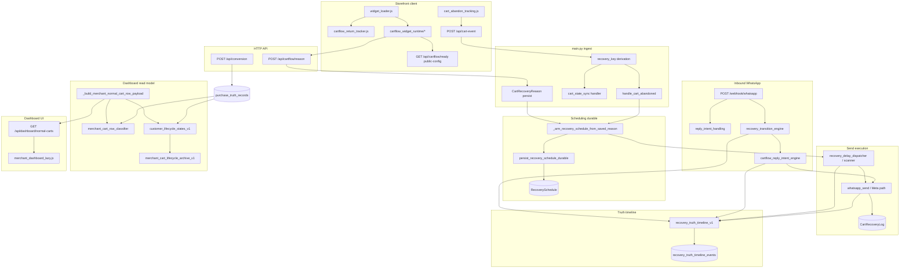

# CartFlow Dependency Map

**Date (UTC):** 2026-05-27  
**Scope:** Read-only architecture freeze — data/control flow from storefront to dashboard.

---

## End-to-end pipeline (merchant production path)



---

## Linear dependency chain (text)

```
Widget (V2 runtime + shared tracking)
    ↓
POST /api/cart-event          ← abandon, cart_state_sync, return signals
POST /api/cartflow/reason     ← objection tag; arms schedule (except handoff-only)
    ↓
handle_cart_abandoned / schedule persist
    ↓
RecoverySchedule + delay worker
    ↓
WhatsApp send → CartRecoveryLog + timeline (provider_sent)
    ↓
Inbound webhook → timeline (customer_reply, continuation_started)
    ↓
merchant_cart_row_classifier + customer_lifecycle_states_v1
    ↓
GET /api/dashboard/normal-carts
    ↓
merchant_dashboard_lazy.js (filters, chips, archive actions)
    ↓
POST /api/dashboard/cart-lifecycle/archive|reopen
```

---

## Parallel paths (same identity, different entry)

| Entry | Joins at | Notes |
|-------|----------|-------|
| `cartflow_return_tracker.js` | `POST /api/cart-event` | Return-to-site; throttled client-side |
| `POST /api/conversion` | `purchase_truth` + session converted cache | Demo checkout COD |
| Zid `POST /webhook/zid` | `purchase_truth` ingest | Production orders |
| `POST /api/cartflow/assist-handoff` | Audit log only | **Does not** schedule recovery |
| Merchant test `reset_demo` / identity contract | New `session_id`/`cart_id` | Isolated test lifecycles |

---

## Store slug coercion (identity boundary)

```
Browser payload.store
    ↓
coerce_cart_event_store_slug (merchant_test_widget_store_v1)
    ↓
Authenticated merchant zid (never demo/default when logged in)
    ↓
recovery_key store segment
```

Demo sandbox (`demo`, `demo2`) only when **no** merchant activation and public demo URLs.

---

## Session truth cache (side channel — not in main diagram)

```
has_sent_truth / has_conversion_truth
    ↓
_session_recovery_* dict (per process)
    ↓
fallback: CartRecoveryLog / purchase_truth_records
    ↓
rehydrate cache on DB hit
```

Used at **abandon gate** and **duplicate schedule** checks — must not override timeline for dashboard labels.

---

## Key modules by layer

| Layer | Primary files |
|-------|----------------|
| Widget | `static/widget_loader.js`, `static/cartflow_widget_runtime/*`, `static/cart_abandon_tracking.js`, `static/cartflow_return_tracker.js` |
| API routes | `main.py`, `routes/cartflow.py`, `routes/cart_recovery_reason.py` |
| Schedule | `main.py`, `services/recovery_restart_survival.py`, `services/recovery_delay_dispatcher.py` |
| Timeline | `services/recovery_truth_timeline_v1.py` |
| Classifier | `services/merchant_cart_row_classifier.py`, `services/customer_lifecycle_states_v1.py` |
| Archive | `services/merchant_cart_lifecycle_archive_v1.py` |
| Dashboard | `static/merchant_dashboard_lazy.js`, `main.py` dashboard routes |

---

## Debug shortcuts (read-only)

| Question | Endpoint / tool |
|----------|-----------------|
| Timeline for one lifecycle | `GET /dev/recovery-truth?recovery_key=` |
| Why row missing from dashboard | `GET /api/debug/cart-presence?recovery_key=` |
| Send chain divergence | `GET /api/debug/recovery-trace?recovery_key=` |
| Test-widget identity | `GET /dev/test-widget-identity-trace?store_slug=&session_id=` |
| Inclusion stages | `services/merchant_cart_presence_trace_v1.py` |
