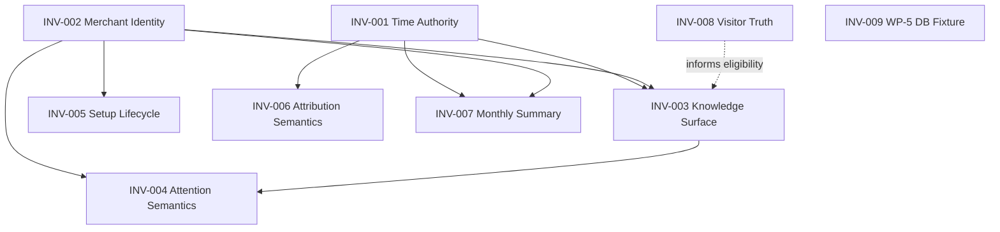

# Investigation Dependency Graph

**Framework:** Product Investigation Framework V1  
**Rule:** Never fix a child investigation before its parent investigations reach **Ready for Fix** (or an explicit Architecture Board waiver).

---

## Graph (parent → child)

```text
INV-001 Time Authority Drift
├── INV-003 Knowledge Surface Drift
│   └── INV-004 Attention Semantics Drift
├── INV-006 Attribution Semantics Drift
└── INV-007 Monthly Summary Materialisation Gap

INV-002 Merchant Identity Drift
├── INV-003 Knowledge Surface Drift
├── INV-004 Attention Semantics Drift
├── INV-005 Setup Lifecycle Drift
└── INV-007 Monthly Summary Materialisation Gap

INV-008 Visitor Truth Coverage Gap
└── (informs INV-003 eligibility taxonomy — soft dependency)

INV-009 WP-5 Cross-Surface Database Fixture Instability
└── (independent test-fixture investigation — not a Time Authority child)
```

### Mermaid



---

## Fix order (recommended)

| Wave | Investigations | Rationale |
|------|----------------|-----------|
| **Wave 0** | INV-001, INV-002 | Root authorities: clock + identity |
| **Wave 1** | INV-003, INV-005, INV-006, INV-007, INV-008 | Surfaces and derived models on correct authorities |
| **Wave 2** | INV-004 | Attention semantics after queues/Knowledge are honest |

---

## Hard constraints

1. Do **not** implement INV-004 copy gates as a substitute for INV-002 (empty because wrong store).
2. Do **not** implement INV-003 insight tweaks as a substitute for INV-001 (empty because wrong clock).
3. Do **not** “complete” INV-005 onboarding checkboxes to fake maturity.
4. INV-008 must not be “solved” by simulator injection of visitor conclusions.
5. Waivers require Architecture Board note on the child case file.

---

## Lab trust-audit alignment

| Parent first | Then |
|--------------|------|
| T2 → INV-001 | T8 framing via INV-008; Knowledge via INV-003 |
| T1 → INV-002 | T3/T4/T5 symptoms re-evaluated |
| T9 → INV-001 | Hybrid timestamps |
| T6 → INV-006 | After time co-occurrence is trusted |
| T7 → INV-007 | After store + time correct |
