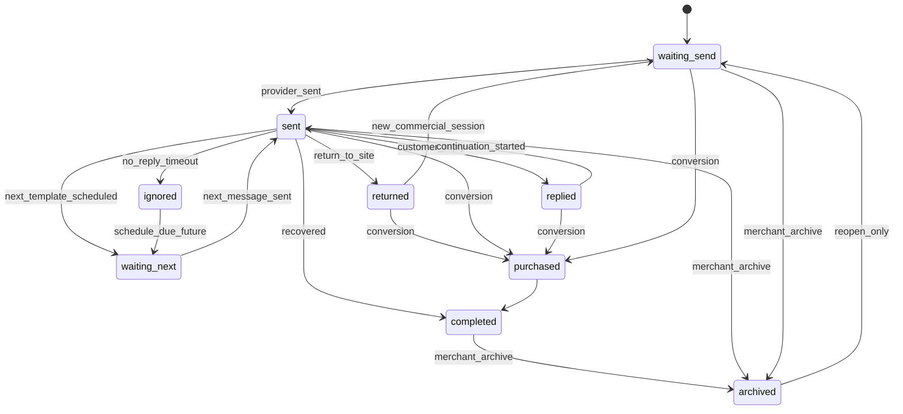

# CartFlow Lifecycle Truth Contract (Frozen v1)

**Date (UTC):** 2026-05-27  
**Scope:** Canonical lifecycle vocabulary for architecture freeze. Documentation only — no runtime rename in this task.

This contract **abstracts** the many aliases in `docs/cartflow_lifecycle_alias_map.md` into **nine merchant-meaningful states** for planning and reviews.

---

## 1. Canonical states

| State ID | Merchant meaning (EN) | Arabic (dashboard reference) |
|----------|----------------------|------------------------------|
| `waiting_send` | Cart/recovery armed; no provider send proven yet | بانتظار الإرسال |
| `sent` | At least one recovery WhatsApp proven sent | تم الإرسال — بانتظار تفاعل العميل |
| `returned` | Customer returned to site; follow-up suppressed or paused | عاد العميل للموقع |
| `replied` | Customer replied on WhatsApp (not yet continuation send) | رد العميل |
| `purchased` | Purchase / conversion proven | تم الشراء / تمت الاستعادة |
| `ignored` | Customer ignored prior message; next template scheduled or exhausted path | بانتظار المتابعة التالية (when next exists) |
| `waiting_next` | Sent + waiting for next scheduled template (delay not reached) | بانتظار المتابعة التالية |
| `completed` | Recovery goal met (purchase or recovered without active work) | تمت الاستعادة |
| `archived` | Merchant archived row from active work | مؤرشفة |

**Implementation mapping (today):**

| Contract state | Primary implementation owner |
|----------------|------------------------------|
| `waiting_send` | lifecycle `waiting_first_send` / classifier `waiting` |
| `sent` | timeline `provider_sent` or sent logs; lifecycle `waiting_customer_reply` |
| `returned` | lifecycle `return_to_site`; classifier `return_to_site` |
| `replied` | timeline `customer_reply`; lifecycle `customer_reply` |
| `purchased` | `purchase_truth_records`; lifecycle `completed` (purchased variant) |
| `ignored` | lifecycle `waiting_next_scheduled` (ignored + future schedule) |
| `waiting_next` | same as ignored when `RecoverySchedule.due_at` > now |
| `completed` | lifecycle `completed`; classifier `recovered` |
| `archived` | lifecycle `archived`; `MerchantCartLifecycleArchive` |

**Engaged continuation** (product: «تفاعل العميل — أرسل النظام متابعة») maps to contract substates: `replied` + `sent` (continuation) — implement as **`replied` + timeline `continuation_started`**, not a separate canonical ID, to avoid drift.

---

## 2. Allowed transitions

States are **not** a strict FSM in code today; this table defines **allowed** semantic progression for new code and reviews.

**Narrative rules:**

1. `waiting_send` → `sent` requires **timeline `provider_sent`** (or durable sent log with timeline backfill).
2. `sent` → `replied` requires **timeline `customer_reply`**.
3. `replied` → continuation is **`continuation_started`** on timeline; merchant label «engaged».
4. `sent` → `returned` may occur without reply; **must not** imply `replied`.
5. Any state → `purchased` via **purchase truth ingest** (stops automation).
6. `archived` is **merchant overlay**; does not erase timeline.

---

## 3. Terminal states

Terminal = no further automated recovery messages should be scheduled **unless merchant reopens** or a **new recovery_key** is issued (test-widget contract).

| State | Terminal? | Stops schedule? |
|-------|-----------|-----------------|
| `purchased` | **yes** | **yes** |
| `completed` | **yes** | **yes** |
| `archived` | **yes** (operational) | **yes** (while archived) |
| `replied` | no | may continue with continuation |
| `returned` | no | suppresses spam; may resume on new activity |
| `sent` | no | |
| `waiting_send` | no | |
| `ignored` / `waiting_next` | no | |

**Process-local terminals (not contract states):** `_session_recovery_converted`, `_session_recovery_sent` cache entries — see `source_of_truth_map.md`.

---

## 4. Forbidden transitions (logical bugs)

If observed in production, treat as **defect** — do not paper over in UI.

| # | Forbidden | Why |
|---|-----------|-----|
| F1 | `returned` → `replied` without inbound WhatsApp | Site visit ≠ WhatsApp reply |
| F2 | `replied` without timeline `customer_reply` | Behavioral-only reply classification |
| F3 | `sent` without `provider_sent` or sent log | Cache-only «sent» |
| F4 | `purchased` + active recovery schedule sending | Purchase precedence violated |
| F5 | `archived` showing full active lifecycle copy | Archive UX regression |
| F6 | New test cart reusing `recovery_key` after `provider_sent` | Test-widget identity contract violation |
| F7 | `waiting_send` after `provider_sent` on same `recovery_key` | Identity reuse / cache bleed |
| F8 | `demo` store_slug on merchant activation test | Store scoping violation |
| F9 | `continuation_started` without prior `customer_reply` | Continuation without reply |
| F10 | Dashboard «تفاعل العميل» on return-only | Classifier/lifecycle mismatch |

---

## 5. Precedence (when multiple signals exist)

Aligns with `cartflow_lifecycle_guard` / purchase truth docs:

1. `archived` (merchant) — display terminal for merchant work queue  
2. `purchased` / `completed`  
3. `replied` (+ optional continuation)  
4. `returned` (if no reply proof)  
5. `waiting_next` / `ignored`  
6. `sent`  
7. `waiting_send`  

**Timeline beats behavioral beats cache** for dashboard proof.

---

## 6. Out of scope for this contract (unchanged)

- WhatsApp transport (Twilio / Meta)
- Delay durations and `Store.recovery_delay`
- Message copy / templates
- Offer engine / product intelligence
- Scheduling implementation internals

---

## 7. Engineer checklist

Before shipping a lifecycle-visible change:

- [ ] Which **canonical contract state** does this affect?
- [ ] Which **timeline status** (if any) must be written?
- [ ] Does `merchant_cart_row_classifier` precedence need updating?
- [ ] Does `customer_lifecycle_states_v1` need updating?
- [ ] Is a forbidden transition (F1–F10) possible?
- [ ] Updated `docs/source_of_truth_map.md` § dashboard matrix if labels change?

**Related:** `docs/dependency_map.md`, `docs/active_vs_legacy.md`, `candidate_remove.md`.
