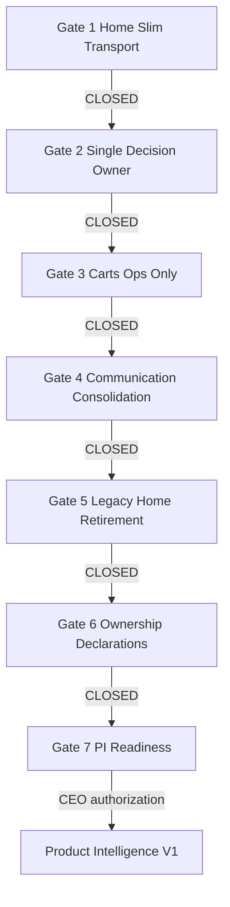

# Constitutional Migration Plan V1

**Document type:** Mandatory governance workflow — **Execution Gates**  
**Date (UTC):** 2026-07-24  
**Amendment:** Constitutional Execution Gates V1 (2026-07-24)  
**Status:** Gate 1 OPEN (deployed); **Gate 2 + 2A/2B/2C DEPLOYED — CEO_REVIEW** (`d20a06f`) — Gates 3–7 LOCKED  


**Law:** [`PRODUCT_CONSTITUTION_V1.md`](PRODUCT_CONSTITUTION_V1.md)  
**Compliance evidence:** [`PRODUCT_CONSTITUTION_COMPLIANCE_V1.md`](PRODUCT_CONSTITUTION_COMPLIANCE_V1.md)  
**Architecture evidence:** [`../architecture/CARTFLOW_ARCHITECTURE_SURFACE_ALIGNMENT_AUDIT_V1.md`](../architecture/CARTFLOW_ARCHITECTURE_SURFACE_ALIGNMENT_AUDIT_V1.md)  

**Out of scope of this document:** Implementing any gate · UI redesign · Product Intelligence V1 feature work  

---

## 0. Mission

Migrate CartFlow from the current architecture to the approved constitutional architecture with:

- Zero ownership ambiguity  
- Minimal regression risk  
- **One Execution Gate at a time**  
- Explicit rollback for every gate  
- Mandatory production verification + CEO visual approval before the next gate opens  

**Product Intelligence V1 does not start until Gate 7 is formally closed with explicit CEO authorization.**

---

## 1. Execution policy — Constitutional Execution Gates

The Constitutional Migration Plan is governed by **Execution Gates**, not sequential implementation tasks and **not** parallel workstreams.

### 1.1 Hard rules

| Rule | Law |
|------|-----|
| **G-1** | A new gate may **not** begin until the current gate is **fully closed** |
| **G-2** | **No gate may overlap** another |
| **G-3** | **No parallel implementation** across gates |
| **G-4** | No Product Intelligence work may begin until **Gate 7** is formally closed |
| **G-5** | Closing a gate requires **all** of: implementation · production deploy · validation · visual CEO review · explicit CEO approval · official closure record |

### 1.2 Mandatory closure checklist (every gate)

A gate is **closed** only when **all** boxes are true:

| # | Requirement |
|---|-------------|
| C-1 | Implementation complete (package blueprint DoD) |
| C-2 | Production deployment complete (Railway Success / live SHA recorded) |
| C-3 | Validation complete (gate validation steps + program checks that apply) |
| C-4 | Visual CEO review complete (Desktop/Mobile evidence as required) |
| C-5 | Explicit CEO approval recorded (name · date UTC · decision) |
| C-6 | Gate officially closed in the **Gate Register** (Section 2) |

Until C-1…C-6 are complete, the gate remains **OPEN** and the next gate remains **LOCKED**.

### 1.3 Gate lifecycle states

```
LOCKED → AUTHORIZED → IN_PROGRESS → DEPLOYED → VALIDATED → CEO_REVIEW → APPROVED → CLOSED
```

Only **CLOSED** unlocks the next gate’s **AUTHORIZED** state.

---

## 2. Gate register (authoritative status)

| Gate | Package | Status | Deploy SHA | CEO approval | Closed (UTC) |
|------|---------|--------|------------|--------------|--------------|
| **Gate 1** | P1 Home Slim Transport + 1-B Composition | **OPEN** — 1-A+1-B deployed; awaiting CEO CLOSE | `f556a5d` / `db1d6aa` | — pending CEO | — |
| **Gate 2** | P2 Owner + 2A/2B/2C Portfolio + Perf | **CEO_REVIEW** — 2C deployed + validated; awaiting CEO CLOSE | `d20a06f` (2C) / `87aff25` (2B) / `39d47eb` (2A) / `76b9728` (2) | — pending CEO | — |
| **Gate 3** | P3 Carts Operations Only | LOCKED | — | — | — |
| **Gate 4** | P4 Communication Consolidation | LOCKED | — | — | — |
| **Gate 5** | P5 Legacy Home Retirement | LOCKED | — | — | — |
| **Gate 6** | P6 Ownership Declarations | LOCKED | — | — | — |
| **Gate 7** | P7 Product Intelligence Readiness | LOCKED | — | — | — |

**Current gate:** Gate 2 **CEO_REVIEW**. Production SHA **`d20a06f`** (Gate 2C). Workspace = Decision Portfolio; Home = Executive Summary; DCE snapshot cache restores Gate 1 perf. Pack: `docs/product/gate_2c_decision_portfolio_v1/`. Gate 1 still OPEN for formal CLOSE. Gates 3–7 LOCKED. No PI.

---

## 3. Execution sequence (strict — no parallelism)

```
Gate 1  P1 Home Slim Transport
   │  CLOSED (C-1…C-6)
   ▼
Gate 2  P2 Single Decision Owner
   │  CLOSED
   ▼
Gate 3  P3 Carts Operations Only
   │  CLOSED
   ▼
Gate 4  P4 Communication Consolidation
   │  CLOSED
   ▼
Gate 5  P5 Legacy Home Retirement
   │  CLOSED
   ▼
Gate 6  P6 Ownership Declarations
   │  CLOSED
   ▼
Gate 7  P7 Product Intelligence Readiness
   │  CLOSED + CEO PI authorization
   ▼
Product Intelligence V1  (separate task — may begin)
```



**Forbidden:** Starting Gate 3 while Gate 2 is IN_PROGRESS · “prep work” on Gate N+1 · PI spikes during Gates 1–6.

---

## 4. Global risk register

| ID | Risk | Severity | Gate | Mitigation |
|----|------|----------|------|------------|
| RK-01 | Home empty / broken after slim transport | High | 1 | Flag `CARTFLOW_HOME_SLIM_TRANSPORT_V1`; fat path fallback one release |
| RK-02 | Decision blank under HES | High | 2 | Decision paint independent of Home HES claim |
| RK-03 | Merchants lose Carts guidance cards | Medium | 3 | Decision parity before Carts strip; release notes |
| RK-04 | Communication history unreachable | High | 4 | Redirect `#messages` → `#communication`; API kept until parity |
| RK-05 | Legacy painter removal breaks lab paths | Medium | 5 | Lab-only flags; unlink boot before delete modules |
| RK-06 | Double-attach removal races | Medium | 1 | Single finalize attach; live+snapshot tests |
| RK-07 | Slim path still calls fat builders | High | 1 | Profile spans prove skip/cheap |
| RK-08 | Ownership docs drift | Low | 6 | PR template gate |
| RK-09 | Starting PI before Gate 7 CLOSED | Critical | 7 | Hard STOP — this policy |

---

## 5. Gate blueprints

Technical content below is the **implementation blueprint** for each gate.  
**Entry / Exit / Production / CEO** blocks are governance and override any earlier “parallel” language.

---

### Gate 1 — P1 Home Slim Transport

#### Entry criteria (gate may AUTHORIZE only if)

- [ ] CEO authorized execution of Constitutional Migration Plan V1  
- [ ] Gate Register shows Gates 2–7 LOCKED  
- [ ] Baseline Home performance capture recorded (before)  

#### Exit criteria (required for CLOSED)

| Requirement | Detail |
|-------------|--------|
| Implementation | Executive slim transport implemented per blueprint below |
| Constitutional | Home requests **only** teaser data (HP-1…HP-7) |
| Performance | Before/after measurement recorded |
| Production | Deployed; live SHA in Gate Register |
| Validation | Gate 1 validation steps pass |
| CEO | Visual review (Desktop/Mobile Home) + explicit approval |
| Closure | Gate Register row updated → CLOSED |

#### Objective

Home requests **only** lightweight executive summaries. No full MEIF pages, full ORV evidence, cart lists, message history, Daily Brief, ACF, or Pulse on the Home critical path. Observation View Details → Decision Workspace (no PI action expand on Home).

#### Current owner → Constitutional owner

| Concern | Current | Constitutional |
|---------|---------|----------------|
| Home paint | `home_executive_summary_v1` | Home |
| Home transport | Fat finalize + live builder | Home slim contract only |
| Obs detail / action | Home in-place expand | Decision Workspace |
| Cart list / messages | Eager boot with Home | Carts / Communication APIs |

#### Everything Home currently requests (fat path)

| Payload / work | Source today |
|----------------|--------------|
| `merchant_home_experience_v1` (+ Daily Brief) | ensure / live builder |
| Full MEIF (5 page packages) | `home_stage_meif_attach` (± double attach) |
| Adaptive cognition | `home_stage_adaptive_cognition` |
| Full ORV then slim | `home_stage_orv_attach` |
| HES package | `home_stage_hes_attach` |
| Commerce signals + Pulse | `home_stage_commerce_pulse` |
| KPI / month / reasons / carts-stats / WA readiness | live builder `main.py` |
| Eager normal-carts + messages | `bootLazyDashboard` |

#### Everything Home should stop requesting

Full MEIF page packages · full ORV evidence · Daily Brief · ACF · Pulse (UI off) · KPI/month/reason/WA-stats on overview · eager Carts/Messages on `#home` · in-place `recommended_action_ar`

#### New lightweight executive payload

```text
home_teaser_inputs_v1:
  health: { watching: bool, abandoned_carts?: int }
  decisions: { count: int, top_title_ar?: str }
  observations: { count: int, top?: { product_name_ar, statement_ar } }  # no action/confidence
  carts: { count: int }
  communication: { sent: int, schedules: int, activity: bool }
```

Output: `home_executive_summary_v1` + `home_surface_mode=executive_summary_v1`.

#### Expected performance improvement

| Stage today | After Gate 1 |
|-------------|----------------|
| `home_stage_meif_attach` | Skipped or cheap teaser query |
| `home_stage_orv_attach` | Count/empty only |
| `home_stage_adaptive_cognition` | Removed from Home finalize |
| `home_stage_commerce_pulse` | Removed when Pulse UI off |
| Boot carts+messages | Deferred until hash |

#### Backward compatibility

Flag `CARTFLOW_HOME_SLIM_TRANSPORT_V1` (OFF restores fat path for rollback).

#### Files / services / APIs / queries / UI

| Layer | Affected |
|-------|----------|
| **Files** | `merchant_home_experience_activation_v1.py`, `home_executive_summary_v1/*`, `home_executive_summary_v1.js`, `merchant_dashboard_lazy.js`, `main.py`, `test_home_executive_summary_v1.py` |
| **Services** | HES; conditional MEIF/ORV; skip Daily Brief/ACF/Pulse |
| **APIs** | `/api/dashboard/summary` |
| **Queries** | Teaser counters; skip fat MEIF/BFL/ORV on Home |
| **UI** | Obs View Details → `#workspace` |

#### Migration risks

RK-01, RK-06, RK-07.

#### Validation steps

1. No `recommended_action_ar` in Home transport  
2. Profile before/after recorded  
3. Production Desktop/Mobile: 5 sections + View Details  
4. Other pages still load via own APIs  
5. Rollback drill: slim flag OFF  

#### Rollback strategy

`CARTFLOW_HOME_SLIM_TRANSPORT_V1=0` or revert deploy.

#### Production verification requirements

- Live SHA + Railway Success  
- `verification.json` or equivalent Home probe  
- Desktop + Mobile screenshots for CEO  

#### CEO approval checkpoint

CEO confirms: Home is executive-only; no deep analysis; performance acceptable → **APPROVED** → Gate 1 CLOSED.

#### Definition of Done (implementation subset of exit criteria)

- [ ] Slim payload tested  
- [ ] Fat stages skipped  
- [ ] No double MEIF  
- [ ] No eager carts/messages on `#home`  
- [ ] Obs → `#workspace`  
- [ ] HP-1…HP-7 + §6 Home block  

---

### Gate 2 — P2 Single Decision Owner

#### Entry criteria

- [ ] **Gate 1 CLOSED** (C-1…C-6)  
- [ ] Gates 3–7 LOCKED  

#### Exit criteria

| Requirement | Detail |
|-------------|--------|
| Implementation | Canonical Decision Workspace selected and live |
| Constitutional | Legacy Decision ownership removed / retired from paint |
| Production | Deployed + verified |
| CEO | Visual review `#workspace` + explicit approval |
| Closure | Gate Register → CLOSED |

#### Objective

Exactly **one** Decision Workspace owns business reasoning. FDE + BFL are data for that surface. Decision paint must not depend on Home HES failure.

#### Legacy decision implementations

1. Cart Workspace + `/api/cart-workspace/v1/projection`  
2. MEIF `applyDecision` + `#meif-decision-root`  
3. Finding Decision Engine via MEBF/MEIF  
4. Historical MEIF Home decision cards (gated)

#### Canonical decision engine (recommended)

| Choice | Recommendation |
|--------|----------------|
| **Canonical UI** | Cart Workspace `#workspace` |
| **Reasoning data** | BFL + FDE → CW cards |
| **Retire UI** | `#meif-decision-root` after parity |

Alternate MEIF-canonical choice allowed only if **recorded before coding**.

#### Migration sequence

1. Record canonical UI choice  
2. Decouple Decision paint from Home MEIF apply  
3. Map FDE → evidence · confidence · reason · impact · action  
4. Align merchant question copy  
5. Home obs deep-link lands on Decision (from Gate 1)  
6. Dual paint off — single root  

#### Removal sequence

Hide non-canonical root → stop unused summary Decision attach → delete painter only after Gate 2 CLOSED (asset cleanup may finish in Gate 5).

#### Files / services / APIs / queries / UI

CW merchant JS/cards · MEIF JS · lazy cascade · `merchant_app.html` workspace · FDE · BFL bind · `cart_workspace/*` · `/api/cart-workspace/v1/projection`

#### Migration risks

RK-02, RK-03.

#### Validation steps

1. HES ON → `#workspace` shows recommendations  
2. Constitution fields or NO DECISION  
3. Home decision teaser count matches  
4. No business decision cards on Carts/Home/Comms  

#### Rollback strategy

`CARTFLOW_DECISION_DUAL_STACK_V1=1` temporary dual roots.

#### Production verification requirements

Desktop/Mobile `#workspace` screenshots · probe that Decision paints under HES · live SHA  

#### CEO approval checkpoint

CEO confirms single Decision owner + reasoning quality → APPROVED → Gate 2 CLOSED.

#### Definition of Done (implementation)

- [x] Canonical UI written (Cart Workspace `#workspace`)  
- [x] One visible Decision surface under HES (FDE enrich CW; MEIF root retired)  
- [x] Constitution fields present (evidence / confidence / why / impact / action)  
- [x] No business decision cards elsewhere (Home teaser / Carts strip / Comms status)  
- [x] Production deploy (`76b9728` Railway Success) + prod probe  
- [ ] CEO visual → Gate Register CLOSED  
- [ ] §6 Decision block (post-CLOSE)  

---

### Gate 3 — P3 Carts Operations Only

#### Entry criteria

- [ ] **Gate 2 CLOSED**  
- [ ] Gates 4–7 LOCKED  

#### Exit criteria

| Requirement | Detail |
|-------------|--------|
| Implementation | Carts = operational responsibilities only |
| Constitutional | No recommendations · no Product Intelligence · no business guidance |
| Production | Deployed + verified |
| CEO | Visual Carts review + approval |
| Closure | Gate Register → CLOSED |

#### Objective

Carts answers only: *What is happening to each cart?* Ops next steps only.

#### Intelligence to remove

MI value stories · recommendation cards · MEIF Carts findings → Decision (if valuable) or retire  

#### Operational responsibilities to keep

Product · customer · value · status · timeline · step · next ops action (Wait / Contact / Scheduled / Purchased / Closed) · filters · proof · VIP **list** (threshold config → Settings)

#### APIs / UI

`/api/dashboard/normal-carts` default without MI primary · hide MI/MEIF findings roots · VIP threshold → Settings  

#### Files

`merchant_dashboard_lazy.js` · `merchant_experience_integration_v1.js` `applyCarts` · `merchant_app.html` carts/MI roots · VIP settings  

#### Migration risks

RK-03.

#### Validation steps

No MI/recommendation UI · ops next step visible · recover/archive/send still work · Decision still holds guidance if relocated  

#### Rollback strategy

`CARTFLOW_CARTS_MI_UI_V1=1`

#### Production verification requirements

Desktop/Mobile Carts screenshots · confirm no PI/recommendations · live SHA  

#### CEO approval checkpoint

CEO confirms Carts is ops-only → APPROVED → Gate 3 CLOSED.

---

### Gate 4 — P4 Communication Consolidation

#### Entry criteria

- [ ] **Gate 3 CLOSED**  
- [ ] Gates 5–7 LOCKED  

#### Exit criteria

| Requirement | Detail |
|-------------|--------|
| Implementation | One communication surface |
| Constitutional | Legacy `#messages` owner retired (redirect OK) |
| Production | Deployed + verified |
| CEO | Visual Communication review + approval |
| Closure | Gate Register → CLOSED |

#### Objective

`#communication` owns lifecycle status. No business intelligence.

#### Duplicates → canonical

| Current | After Gate 4 |
|---------|----------------|
| `#communication` MEIF stub | Canonical paint |
| `#messages` | Redirect → `#communication` |
| Trigger-templates under comms | Settings |
| MEIF Comms findings | Remove |

#### Migration path

Paint lifecycle on `#communication` → redirect `#messages` → remove findings → move templates → lazy fetch on Communication hash only  

#### Files / APIs

`merchant_app.html` · `merchant_app.js` · `merchant_dashboard_lazy.js` · MEIF `applyCommunication` · `/api/dashboard/messages`  

#### Migration risks

RK-04.

#### Validation steps

Lifecycle statuses visible · `#messages` redirects · no business findings · Home teaser → `#communication`  

#### Rollback strategy

Disable redirect; restore `#page-messages` primary  

#### Production verification requirements

Desktop/Mobile Communication screenshots · redirect probe · live SHA  

#### CEO approval checkpoint

CEO confirms one Communication surface → APPROVED → Gate 4 CLOSED.

---

### Gate 5 — P5 Legacy Home Retirement

#### Entry criteria

- [ ] **Gate 4 CLOSED**  
- [ ] Gates 6–7 LOCKED  
- [ ] Gate 2 CLOSED ensures Decision does not depend on MEIF Home apply  

#### Exit criteria

| Requirement | Detail |
|-------------|--------|
| Implementation | Legacy Home rendering paths removed from production boot |
| Constitutional | Dead painters + dead feature flags removed (or lab-only) |
| Production | Deployed + verified |
| CEO | Visual Home review (still HES-only) + approval |
| Closure | Gate Register → CLOSED |

#### Inventory (safe removal order)

1. ORV sibling painter  
2. ECC Dashboard Home V1  
3. Pulse UI Home painter  
4. PeV2 `maApplyHomeExperience`  
5. MEIF Home as Home owner (boot)  
6. Daily Brief / ACF call sites (if any remain)  
7. Pulse UI flag → lab-only  
8. ECC/Pulse/PeV2/ORV script tags  
9. MEIF `pages.settings` generation on summary  

#### Migration risks

RK-05.

#### Validation steps

Production template grep clean · HES-only Home · Decision/Carts/Comms unaffected  

#### Rollback strategy

Revert template/cascade PR; restore flags  

#### Production verification requirements

Home Desktop/Mobile · confirm no legacy painters in network/boot · live SHA  

#### CEO approval checkpoint

CEO confirms clean executive Home boot → APPROVED → Gate 5 CLOSED.

---

### Gate 6 — P6 Ownership Declarations

#### Entry criteria

- [ ] **Gate 5 CLOSED**  
- [ ] Gate 7 LOCKED  

#### Exit criteria

| Requirement | Detail |
|-------------|--------|
| Implementation | Every production feature declares page · service · query · API · data owner |
| Production | Declarations published; review gate active (docs/process may be “production verified” via repo on `main`) |
| CEO | Approval that ownership map is complete |
| Closure | Gate Register → CLOSED |

#### Required declaration fields

Page owner · Service owner · Query owner · API owner · Data owner  
(+ decision type · leads to decision · V-1…V-5 per constitution §6)

#### Deliverable during gate

`docs/product/OWNERSHIP_DECLARATIONS_V1.md` fully filled for production surfaces (baseline table in prior plan section remains the seed list).

#### Process controls

PR template checkbox · refuse merchant PRs without §6 block  

#### Validation steps

All production surfaces listed · no blank owners · compliance architectural section closed  

#### Rollback strategy

Docs-only; warn-only CI if gate too strict initially  

#### Production verification requirements

`OWNERSHIP_DECLARATIONS_V1.md` on `main` · SYSTEM_SUMMARY pointer  

#### CEO approval checkpoint

CEO confirms ownership map → APPROVED → Gate 6 CLOSED.

---

### Gate 7 — P7 Product Intelligence Readiness

#### Entry criteria

- [ ] **Gates 1–6 all CLOSED**  
- [ ] No open constitutional violations on compliance scorecard  

#### Exit criteria

| Requirement | Detail |
|-------------|--------|
| Constitution | Product Constitution fully implemented in product behavior |
| Gates | All previous gates CLOSED |
| Violations | None remaining (compliance scorecard all Yes) |
| Ownership | Architectural ownership stable (Gate 6) |
| Home | Executive Summary compliant |
| Decision | Exclusive owner of Product Intelligence |
| Scorecard | Final Product Intelligence Readiness Scorecard produced (below) |
| CEO | **Explicit authorization: Product Intelligence V1 may begin** |
| Closure | Gate Register → CLOSED |

#### Explicit non-goals inside Gate 7

Implementing PI findings · aesthetic redesign · new merchant features  

Gate 7 is a **readiness + authorization gate** (evidence pack + scorecard + CEO signature).

#### Production verification requirements

Fresh Desktop/Mobile: Home · Decision · Carts · Communication · confirmation no PI outside Decision  

#### Rollback strategy

If scorecard fails → Gate 7 not closed → do not start PI; reopen the failing prior gate if needed  

#### Definition of Done

- [ ] Readiness Scorecard complete  
- [ ] CEO PI authorization recorded  
- [ ] STOP on PI lifted **only** by that authorization  

---

## 6. Final Product Intelligence Readiness Scorecard (Gate 7 deliverable)

Complete at Gate 7; all rows must be **PASS** before CEO PI authorization.

| # | Criterion | Evidence | Result (PASS/FAIL) |
|---|-----------|----------|--------------------|
| R-01 | Product Constitution V1 approved by CEO | Approval record in constitution | |
| R-02 | Gate 1 CLOSED | Gate Register | |
| R-03 | Gate 2 CLOSED | Gate Register | |
| R-04 | Gate 3 CLOSED | Gate Register | |
| R-05 | Gate 4 CLOSED | Gate Register | |
| R-06 | Gate 5 CLOSED | Gate Register | |
| R-07 | Gate 6 CLOSED | Gate Register | |
| R-08 | Home = executive teasers only (5 sections + View Details) | Prod screenshots | |
| R-09 | Home slim transport (HP-1…HP-7) | Profile before/after + probe | |
| R-10 | No PI / recommended action expand on Home | Probe / screenshots | |
| R-11 | Decision Workspace sole business reasoning UI | Prod `#workspace` | |
| R-12 | Decision shows evidence · confidence · reason · impact · action (or NO DECISION) | Screenshots | |
| R-13 | Carts ops-only (no recommendations / PI) | Screenshots | |
| R-14 | One Communication surface | Screenshots + redirect | |
| R-15 | Legacy Home painters removed from production boot | Template/boot inventory | |
| R-16 | Ownership declarations complete | `OWNERSHIP_DECLARATIONS_V1.md` | |
| R-17 | No constitutional Duplicate/Missing rows for PI exclusivity | Compliance matrix | |
| R-18 | Principle 0 satisfied on all five pages | Review note | |
| R-19 | Program validation V1–V10 pass | Checklist below | |
| R-20 | Explicit CEO authorization for Product Intelligence V1 | Signed below | |

### CEO Product Intelligence authorization

| Field | Value |
|-------|-------|
| CEO name | _pending_ |
| Date (UTC) | _pending_ |
| Decision | _pending_ — «Product Intelligence V1 may begin» / REJECTED |
| Notes | |

---

## 7. Program validation checklist (use at each gate close + Gate 7)

| # | Check | Primarily proves |
|---|--------|------------------|
| V1 | Home paints exactly five executive sections | Gate 1 |
| V2 | Home summary profile shows no fat MEIF/ORV/ACF/Pulse | Gate 1 |
| V3 | `#workspace` sole business Decision UI under HES | Gate 2 |
| V4 | Decision cards include constitution fields (or NO DECISION) | Gate 2 |
| V5 | Carts has no MI/recommendation primary UI | Gate 3 |
| V6 | `#communication` sole Comms surface; `#messages` redirects | Gate 4 |
| V7 | Production Home boot has no ECC/Pulse/PeV2/ORV sibling painters | Gate 5 |
| V8 | Ownership declarations file complete | Gate 6 |
| V9 | No Product Intelligence content outside Decision | Gates 2–4, 7 |
| V10 | Desktop + Mobile smoke Home / Decision / Carts / Communication | Every gate |

---

## 8. Rollback strategy (by gate)

| Gate | Primary rollback |
|------|------------------|
| 1 | `CARTFLOW_HOME_SLIM_TRANSPORT_V1=0` |
| 2 | `CARTFLOW_DECISION_DUAL_STACK_V1=1` |
| 3 | `CARTFLOW_CARTS_MI_UI_V1=1` |
| 4 | Disable messages→communication redirect |
| 5 | Revert template/cascade PR |
| 6 | Docs-only revert |
| 7 | Do not start PI |

**Global rule:** Prefer flags for one release soak; delete code only after the owning gate is CLOSED (especially Gate 5).

---

## 9. Program Definition of Done

Constitutional Migration Plan V1 is **complete** when:

1. Gates 1–7 are all **CLOSED** in the Gate Register  
2. Product Intelligence Readiness Scorecard is all **PASS**  
3. CEO has signed Product Intelligence authorization  

Only then may Product Intelligence V1 implementation begin as a **separate** task.

---

## 10. STOP

- Do **not** implement gates in the same change as this governance update unless CEO has authorized Gate 1.  
- Do **not** open Gate N+1 while Gate N is open.  
- Do **not** run parallel gates.  
- Do **not** start Product Intelligence until Gate 7 is CLOSED with explicit CEO authorization.  

**Next action:** CEO accept [`DECISION_OWNERSHIP_REPORT_V1.md`](DECISION_OWNERSHIP_REPORT_V1.md) (canonical owner + inventory) → implement Gate 2 moves M1–M8 → CEO CLOSE. Formally CLOSE Gate 1 when reviewing. Gates 3–7 LOCKED. No Product Intelligence.
