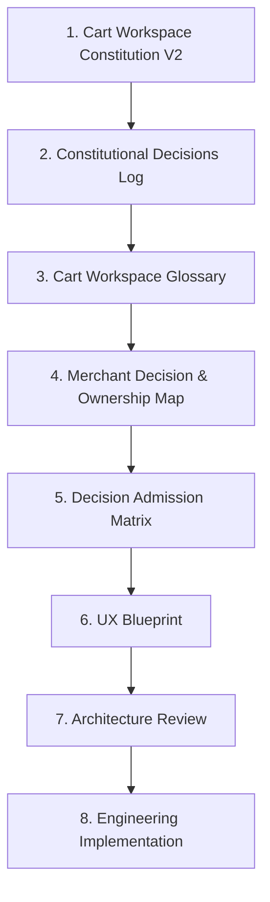

# Cart Workspace Constitution Ratification V1

**Status:** RATIFIED  
**Date (UTC):** 2026-07-12  
**Nature:** Official constitutional gate closure — governance only  
**Out of scope:** UX, architecture, engineering, implementation

---

## Executive verdict

# Verdict A — Ratified

**Justification:** The Cart Workspace Governance Pack (Constitution V2 + Constitutional Decisions Log V1 + Glossary V1) is internally consistent, ownership-deterministic under validation Scenarios A–F, and now free of open constitutional blockers. Q1–Q6 are **Closed** with binding resolutions recorded herein and in CDR-011…CDR-014. Cart Workspace philosophy is complete. Downstream work may proceed only under the hierarchy in §3, beginning with **Merchant Decision & Ownership Map**.

---

## 1. Governance Pack definition

### Cart Workspace Governance Pack

The **Cart Workspace Governance Pack** is the single constitutional reference for Cart Workspace. It contains exactly three documents, reviewed **together**:

| Document | Role | Path |
|----------|------|------|
| **Cart Workspace Constitution V2** | Law — what must and must not be | [`cart_workspace_constitution_v2.md`](cart_workspace_constitution_v2.md) |
| **Constitutional Decisions Log V1** | Memory — why the law exists (CDR-001…) | [`cart_workspace_constitutional_decisions_log_v1.md`](cart_workspace_constitutional_decisions_log_v1.md) |
| **Cart Workspace Glossary V1** | Language — canonical meanings | [`cart_workspace_glossary_v1.md`](cart_workspace_glossary_v1.md) |

### Pack rules

1. These documents operate as **one** constitutional reference.  
2. They are **never** versioned independently without governance review of the Pack as a whole.  
3. Future documents must **reference** Pack definitions; they may not redefine them.  
4. Supporting records (Validation Report, this Ratification) explain verification and gate status; they do not replace Pack authority.

**Supporting records (not Pack members):**

| Record | Path |
|--------|------|
| Validation & Ratification Report (pre-gate) | [`cart_workspace_constitution_v2_validation.md`](cart_workspace_constitution_v2_validation.md) |
| This Ratification | [`cart_workspace_ratification_v1.md`](cart_workspace_ratification_v1.md) |

---

## 2. Closure of constitutional questions (Q1–Q6)

No unresolved constitutional ambiguity remains for Cart Workspace identity, ownership, Wait semantics, precedence, history scope, Override notification policy, or Override surface shape.

### Q1 — VIP Decision Ownership

| Field | Value |
|-------|--------|
| **Status** | **Closed** |
| **Governing sections** | Constitution §6.3 Priority Override; §6.4 Dual ownership; §7 Ownership transitions; Glossary *Priority Override*, *Decision Ownership*; CDR-005, CDR-006; Validation Scenario D |
| **Binding resolution** | On Priority Override, **Decision Ownership transfers to the Merchant immediately upon Override Admission**. Transfer does **not** wait for merchant acknowledgment of a notification or card. Execution Ownership remains CartFlow unless a separate scoped manual-execution handoff occurs. |
| **Closure** | Confirmed Closed. |

---

### Q2 — Wait is Operational Strategy, not Decision

| Field | Value |
|-------|--------|
| **Status** | **Closed** |
| **Governing sections** | Constitution §6.5 Decision Over Status (Waiting as status category banned); §4 Decision / Status; Glossary *Status*, *Decision*, *Action*; CDR-004; CDR-011 |
| **Binding resolution** | **Wait is operational strategy / Status**, not an L2 admitted Decision on Cart Workspace. CartFlow may wait as Decision Owner without interrupting the merchant. “Waiting” must never organize Workspace. A merchant-facing **Wait Action** is allowed only if separately admitted as a true Decision under Decision Admission — and only when Human Gain requires asking the merchant to choose wait vs another Action. Sibling Cart Page “Wait as primary decision” language **does not** make Waiting a Workspace category and yields to this Pack under Q3. |
| **Closure** | Confirmed Closed. |

---

### Q3 — Constitutional precedence

| Field | Value |
|-------|--------|
| **Status** | **Closed** |
| **Governing sections** | Constitution §0 Authority and precedence; §1.3 Singular identity; §9 Boundaries; CDR-003, CDR-012; this Ratification §3 |
| **Binding resolution** | For all Cart Workspace / merchant Decision-surface conflicts, **Cart Workspace Constitution V2 (Governance Pack) prevails**. The Cart Page Product Constitution and related cart-page product docs are **subordinate** on Workspace identity, mission question (ما يحتاج قرارك؟), Decision vs Status organization, Quiet by Default, Attention Budget, and Override semantics. Peer authorities that **mint truth / evidence / engineering law** (Engineering Constitution, Lifecycle Truth, Purchase Truth, Merchant Decision Governance for decision-stage contracts) remain peers and are not overridden by this Pack for those domains. |
| **Closure** | Confirmed Closed. |

---

### Q4 — Operational History scope

| Field | Value |
|-------|--------|
| **Status** | **Closed** |
| **Governing sections** | Constitution §5 Layer L4; §9 (timeline-as-identity banned); Glossary *Completed Outcome*, *Background Operations*, *Workspace*; CDR-010, CDR-013; Validation Scenario E |
| **Binding resolution** | **Operational History** (timelines, completed recovery truth, archive/completed/purchased browsing) is **outside L2 Decision Workspace**. It is an L4 / history / Knowledge-appropriate concern. Completed Outcomes are not active Decisions. Archive, reopen, and purchased visibility may exist as **separate or adjacent product surfaces** bound by history separation and Attention Budget when they touch merchant attention — they are **not** governed as Decision Cards under One Card = One Decision. They must not reintroduce status-taxonomy IA into Workspace. |
| **Closure** | Confirmed Closed. |

---

### Q5 — Customer Service notification policy

| Field | Value |
|-------|--------|
| **Status** | **Closed** |
| **Governing sections** | Constitution §6.3 Priority Override; Glossary *Priority Override*; CDR-005; Validation Scenario D |
| **Binding resolution** | Customer-service notification on Priority Override is a **configurable capability**. When not configured, L0 is **not** violated. Immediate **merchant** notification and Override Admission path remain constitutional requirements of Priority Override. |
| **Closure** | Confirmed Closed. |

---

### Q6 — Dedicated VIP Surface

| Field | Value |
|-------|--------|
| **Status** | **Closed** |
| **Governing sections** | Constitution §5 L0→L2; §6.3; §1.3 Singular identity; Glossary *Workspace*, *Priority Override*, *Decision Card*; CDR-005, CDR-014 |
| **Binding resolution** | Priority Override **may** use a **dedicated VIP / Override surface** that remains **Cart Workspace** under this Pack (same mission, Glossary, Admission, One Card = One Decision). Dedicated surface is isolation of Override policy, **not** a separate product identity, CRM, inbox, or admin console. Same-list isolation remains an allowed UX choice downstream; constitution does **not** forbid either shape so long as Override Decisions never wait behind normal queues and never become L3 noise. |
| **Closure** | Confirmed Closed. |

---

### Closure summary

| # | Topic | Status |
|---|--------|--------|
| Q1 | VIP Decision Ownership | **Closed** |
| Q2 | Wait = operational strategy, not Decision | **Closed** |
| Q3 | Constitutional precedence | **Closed** |
| Q4 | Operational History scope | **Closed** |
| Q5 | CS notification configurable | **Closed** |
| Q6 | Dedicated VIP surface allowed | **Closed** |

---

## 3. Governance hierarchy

Future documents **must derive from** higher levels without contradiction.

| Rank | Artifact | Authority |
|------|----------|-----------|
| **1** | Cart Workspace Constitution V2 | Highest Workspace law |
| **2** | Constitutional Decisions Log | Why / settled philosophy (CDRs) |
| **3** | Cart Workspace Glossary | Linguistic authority |
| **4** | Merchant Decision & Ownership Map | *(next authorized stage)* |
| **5** | Decision Admission Matrix | Future |
| **6** | UX Blueprint | Future |
| **7** | Architecture Review | Future |
| **8** | Engineering Implementation | Future |

**Pack cohesion:** Ranks 1–3 are the Governance Pack and move together under amendment review.

**Inheritance rule:** Lower ranks may specialize; they may not redefine Pack terms, reopen Closed Q1–Q6, or contradict Pack principles without a formal amendment (§5).

---

## 4. Ratification statement

**Cart Workspace Constitution V2 is hereby ratified as the governing constitutional authority for Cart Workspace.**

All future specifications, UX, architecture, and implementation must derive from the **Cart Workspace Governance Pack** (Constitution V2, Constitutional Decisions Log V1, Glossary V1) without contradiction.

After this ratification:

- Governance philosophy for Cart Workspace is **complete**.  
- Constitutional questions Q1–Q6 are **Closed**.  
- Future work must **not** revisit constitutional philosophy unless the amendment process in §5 is initiated.  
- The next authorized stage is **Merchant Decision & Ownership Map**.

---

## 5. Amendment process

Constitutional change is deliberate. Philosophy evolves through governance, not through implementation or silent doc edits.

### Rules

1. **No silent edits** to ratified Pack meanings, Closed Q resolutions, or CDR Final Decisions.  
2. Every constitutional change requires **all** of:  
   - **Proposal** (what changes and why)  
   - **Constitutional review** (Pack consistency, Attention Budget, ownership determinism, boundaries)  
   - **Constitutional Decision Record** (new CDR; prior CDRs not erased)  
   - **Ratification** (updated ratification record / Pack version bump)  
3. Glossary extensions for new concepts are allowed; **silent redefinition** of existing terms is forbidden.  
4. Implementation, UX experiments, or architecture preferences **never** amend the Pack by implication.  
5. Pack members are not versioned independently without governance review of the Pack as a whole.

### Non-amendments

Clarifications that do not change meaning may be additive notes if they cite the governing CDR/section and do not alter Closed resolutions. When in doubt, open a proposal.

---

## 6. Governance completion — project stage update

| Stage | Status |
|-------|--------|
| Research | **Closed** |
| Product Discovery | **Closed** |
| Constitution | **Closed** (V2 ratified) |
| Constitutional Decisions Log | **Closed** (V1; extend-only thereafter) |
| Glossary | **Closed** (V1; extend-only thereafter) |
| Constitution Ratification | **Closed** (this document — Verdict A) |
| **Merchant Decision & Ownership Map** | **Authorized — next stage** |
| Decision Admission Matrix | Not started (gated after Ownership Map unless Pack allows parallel derivation) |
| UX Blueprint | Not started |
| Architecture Review | Not started |
| Engineering Implementation | Not started |

### Gate lift

Downstream artifacts previously forbidden under Verdict B are now **authorized to begin**, in hierarchy order, starting with **Merchant Decision & Ownership Map**.

Still forbidden without amendment:

- Reopening Q1–Q6  
- Redefining Glossary terms  
- Building Workspace as CRM / dashboard / inbox / status taxonomy  
- Bypassing Decision Admission (including Override path)  
- Treating Priority Override as queue priority  

---

## 7. Consistency with prior validation

Validation Report Verdict B is **superseded** by this Ratification Verdict A.

| Prior blocker | How closed |
|---------------|------------|
| Q2 | §2 Q2 + CDR-011 |
| Q3 | §2 Q3 + CDR-012 |
| Q4 remainder | §2 Q4 + CDR-013 |
| Q6 | §2 Q6 + CDR-014 |
| Q1 / Q5 | Affirmed Closed (Validation Scenario D + §2) |

Scenarios A–F, ownership matrix, Quiet ↔ Override coexistence, boundary stress, and future-layer compatibility remain **passed** and are part of the ratification evidence base.

---

## 8. Ratification checklist

| Check | Result |
|-------|--------|
| Governance Pack defined and co-reviewed | **Pass** |
| Hierarchy ranks 1–8 established | **Pass** |
| Q1–Q6 Closed with governing section refs | **Pass** |
| Official ratification statement recorded | **Pass** |
| Amendment process defined | **Pass** |
| Stages closed; Ownership Map authorized | **Pass** |
| No UX / engineering started by this act | **Pass** |

---

**End of Cart Workspace Constitution Ratification V1.**

**Verdict A — Ratified.**
