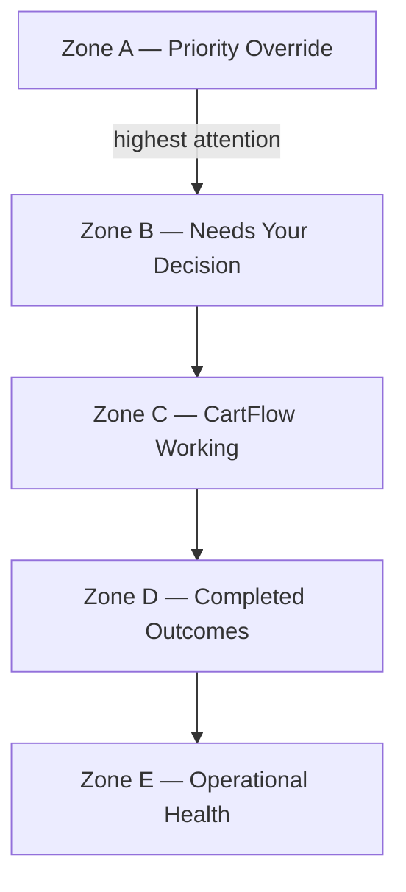

# Cart Workspace UX Blueprint V1

**Status:** Behavioral architecture — pending review/approval before Architecture / Engineering / visual design  
**Date (UTC):** 2026-07-12  
**Nature:** Operational experience blueprint. **Not** visual design, Figma, CSS, components, or implementation.

**Governance parents (every visible element must trace here):**  
- [`cart_workspace_constitution_v2.md`](cart_workspace_constitution_v2.md)  
- [`cart_workspace_glossary_v1.md`](cart_workspace_glossary_v1.md)  
- [`merchant_decision_and_ownership_map_v1.md`](merchant_decision_and_ownership_map_v1.md)  
- [`decision_admission_matrix_v1.md`](decision_admission_matrix_v1.md)  
- [`cart_workspace_ratification_v1.md`](cart_workspace_ratification_v1.md)  

**Out of scope:** colors, typography, layout pixels, component libraries, APIs, database shapes.

---

## Part 1 — Workspace Philosophy

### Governing UX principle

Cart Workspace answers **one question only**:

> **ما الذي يحتاج قرارك الآن؟**  
> *(What needs your decision now?)*

Everything visible exists to support that question.  
Nothing may compete with it for primary attention.

| Allowed | Forbidden |
|---------|-----------|
| Admitted Decisions (and Override-admitted Decisions) | Status taxonomies, inbox, CRM lists |
| Minimal reassurance that CartFlow is working | Activity theater / “watch the bot” |
| Compact completed summary | Timeline-as-product |
| Exceptional operational health that needs merchant awareness | Technical diagnostics, Admin Ops |

**Governance:** Constitution §§1, 3, 6.11 Quiet by Default; CDR-003 Decision Workspace; Glossary *Workspace*.

---

## Part 2 — Merchant Mental Model

Design for how merchants think — not how data is stored.

### What the merchant expects to see first

1. Whether anything needs their judgment **now** (Override first if active, else admitted Decisions).  
2. If nothing needs them: calm confidence that CartFlow owns recovery.  
3. Never a dump of carts, messages, or statuses.

### What creates confidence

| Signal | Meaning |
|--------|---------|
| Quiet when empty | Automation is succeeding (not failure) |
| One clear Decision + one Action | Merchant knows what to do |
| Explain Before Asking context | Merchant understands why they were interrupted |
| After Action: ownership returns / Workspace calms | CartFlow resumes; merchant is not a supervisor |

### What creates confusion

| Anti-pattern | Why it fails |
|--------------|--------------|
| Status buckets (Waiting, Sent, Replied) | Status ≠ Decision (Constitution §6.5) |
| Multiple equal CTAs | Violates One Card = One Decision |
| Always-visible queues of “work” | Forces supervision; burns Attention Budget |
| VIP as “higher sort in same list” without Override policy | Collapses Priority Override |
| History / archive as primary zone | Completions are not Decisions |

### What should remain invisible

- Signals, raw Evidence lists, provider retries, scheduler ticks  
- Knowledge claims that did not pass Decision Admission  
- Admin / engineering diagnostics  
- Duplicate observations, refresh noise  
- Execution internals while Decision Owner is CartFlow  

**Governance:** Admission Matrix default Do Not Admit (AE-2); Ownership Map S1 Quiet; Background Operations (Glossary).

---

## Part 3 — Operational Zones

Workspace is **zones**, not pages. Zones appear or stay calm based on governance state — not navigation IA.

### Zone Map

| Zone | Name | Content rule | Visibility |
|------|------|--------------|------------|
| **A** | Priority Override (Dynamic) | Override-admitted Decisions only (Admission T2 / R07) | **Only when L0 Active and Override-admitted** |
| **B** | Needs Your Decision | Normally admitted Decisions only (T1 / Admit=Yes rows) | When ≥1 admitted Decision; else empty-state calm |
| **C** | CartFlow Working | Reassurance that Execution Owner = CartFlow is progressing | Peripheral; never a workload list |
| **D** | Completed Outcomes | Compact summary of recent Completed Outcomes | Compact; not Operational History browser |
| **E** | Operational Health | Exceptional merchant-relevant operational issues only | Rare; never technical diagnostics |



### Zone A — Priority Override (Dynamic)

| Field | Rule |
|-------|------|
| **Purpose** | Isolate Override Decisions so they never wait behind normal Decisions |
| **Content** | Decision Cards under Override Admission only |
| **Absent when** | L0 inactive |
| **Ownership** | Exec: CartFlow; Dec: Merchant (S4) |
| **Governance** | Constitution §6.3; Ownership T2/T8; Admission Gate F; Ratification Q6 (dedicated surface allowed) |

### Zone B — Needs Your Decision

| Field | Rule |
|-------|------|
| **Purpose** | Primary Workspace — answer ما الذي يحتاج قرارك الآن؟ |
| **Content** | Admitted Decision Cards only (one Decision per card) |
| **Absent content** | Statuses, non-admitted carts, knowledge-only items |
| **Ownership** | Exec: CartFlow; Dec: Merchant (S2) |
| **Governance** | Constitution L2; Admission Admit=Yes; CDR-008 |

### Zone C — CartFlow Working

| Field | Rule |
|-------|------|
| **Purpose** | Reassurance, not workload |
| **Content** | Aggregate calm indicators (e.g. “CartFlow is recovering carts”) — **not** a per-cart status board |
| **Must not** | Invite Action; list Signals; imply merchant must supervise |
| **Governance** | Quiet + Automation Before Escalation; Ownership S1; Zone fails Cognitive Load Audit if it becomes a queue |

### Zone D — Completed Outcomes

| Field | Rule |
|-------|------|
| **Purpose** | Compact proof that recovery finishes — confidence, not history product |
| **Content** | Short summary counts / recent completions only |
| **Must not** | Become timeline, archive browser, or Decision surface |
| **Governance** | L4 / CDR-010 / Ratification Q4; Glossary *Completed Outcome* |

### Zone E — Operational Health

| Field | Rule |
|-------|------|
| **Purpose** | Rare merchant-awareness of exceptional operational issues that affect their ability to decide or trust recovery |
| **Content** | Exceptional only (e.g. recovery blocked in a way that needs merchant awareness — still not Admin diagnostics) |
| **Must not** | Show stack traces, pool metrics, provider dashboards |
| **Governance** | Attention Budget; fail closed to hidden unless Human Gain of awareness > cost; Admin Ops remains separate |

---

## Part 4 — Decision Card Blueprint

Canonical structure for **one** Decision Card. Applies to Zone A and Zone B.

### Required fields (Explain Before Asking)

| Order | Element | Merchant meaning | Governance |
|-------|---------|------------------|------------|
| 1 | **Why it appeared** | Why Admission consumed attention | Admission AA-3; Constitution §6.6 |
| 2 | **What CartFlow already did** | Execution history, merchant-safe | §6.6; Exec Owner = CartFlow |
| 3 | **Why automation stopped** | Why Gate C failed / Override required | Admission Gates C/F |
| 4 | **Expected merchant action** | Exactly one primary Action | §6.7; Glossary *Action*; AI-5 |
| 5 | **Expected outcome after action** | What happens when they act; CartFlow resumes | Ownership T3 return; Quiet |

### Actions

| Rule | Statement |
|------|-----------|
| **Primary** | Exactly one primary Action control |
| **Secondary** | Optional only if constitutionally justified (does not compete as equal Decision; does not create second Decision) |
| **Forbidden** | Toolbox of equal CTAs; Action without Decision; Action without explanation |

### Card invariants

- One card = one Decision  
- No status category as card title taxonomy  
- No re-Admit of same Evidence as second card (AS-1, AI-16)  

---

## Part 5 — Information Hierarchy

Merchant attention flows **strictly** in this order. No section may compete equally.

| Rank | Zone | Attention role |
|------|------|----------------|
| **1** | **A — Priority Override** | Immediate |
| **2** | **B — Needs Your Decision** | Primary |
| **3** | **C — CartFlow Working** | Peripheral reassurance |
| **4** | **D — Completed Outcomes** | Peripheral confidence |
| **5** | **E — Operational Health** | Exceptional only; below decisions |

If Zone A is empty, Zone B is first.  
If A and B are empty, C+D communicate success via empty-state confidence — not “blank page failure.”

**Governance:** Priority Override never waits behind normal queues (I6); Attention Budget §6.9; AE-4 higher-value admits.

---

## Part 6 — Attention Architecture

| Tier | What | Examples | Rule |
|------|------|----------|------|
| **Immediate** | Override-admitted Decisions | Zone A cards | Always above normal Decisions |
| **Primary** | Normally admitted Decisions | Zone B cards | Only Admit=Yes |
| **Peripheral** | Reassurance + compact results | Zones C, D | No Actions; low density |
| **Exceptional** | Rare health awareness | Zone E | Justify attention cost or hide |
| **Hidden** | Signals, Status boards, retries, knowledge-without-Admit, Admin diagnostics, history browsers | Background / other surfaces | Never in Workspace as workload |

Every visible element must justify Attention Cost (AE-1, Constitution §6.9). If removing it does not reduce Decision quality, it must not exist (§6.1).

---

## Part 7 — Empty States

Empty is **success**, not void.

| Condition | Intentional empty-state meaning |
|-----------|----------------------------------|
| No Zone A, no Zone B | **No decisions.** CartFlow does not need the merchant now. |
| Zone C visible with calm copy | **CartFlow is actively recovering carts.** Confidence, not emptiness. |
| Zone D compact zero/near-zero | Completions may be sparse; do not invent fake activity |
| All calm | Canonical Quiet: لا يوجد ما يحتاج قرارك الآن. CartFlow يتابع عمليات الاسترداد تلقائيًا. |

**Forbidden empty states:** “No data”; error-looking blanks; “Start by reviewing all carts.”

**Governance:** Quiet by Default §6.11; CDR-007.

---

## Part 8 — Decision Flow

Behavioral journey only — no UI, no implementation.

```text
Open Workspace
    ↓
Is Priority Override active with Override-admitted Decision?
    Yes → Attend Zone A (highest-value Override Decision)
    No  → Attend Zone B (highest-value admitted Decision)
    ↓
If no admitted Decision → Perceive Quiet confidence (Zones C/D)
    ↓
If Decision present:
    Understand context (Why / What CartFlow did / Why stopped)
    ↓
Take exactly one primary Action
    ↓
Confidence that CartFlow resumes Execution Ownership
    Decision Ownership returns per Ownership Map (T3/T4/T5)
    ↓
Workspace calms (card leaves; Quiet if none remain)
```

**Merchant inactivity:** Decision remains until policy expiry/return — Workspace does not nag via re-Admit (R14, AI-16).  
**After completion elsewhere:** Completed Outcome may appear compactly in D — never as a new Decision without Admission.

---

## Part 9 — Cognitive Load Audit

| Zone / element | Can remove? | Can merge? | Can CartFlow do it instead? | Deserves attention? | Verdict |
|----------------|-------------|------------|-----------------------------|---------------------|---------|
| Zone A Override | No (when active) | No — must isolate | No — needs Merchant Decision | Yes when L0 admitted | **Keep** |
| Zone B Decisions | No (mission) | No | Only if not admitted | Yes if Admit | **Keep** |
| Zone C Working as **queue** | Yes | — | Yes | No | **Reject queue form** |
| Zone C Working as **calm reassurance** | Prefer keep minimal | May merge verbally with empty state | N/A | Peripheral yes | **Keep minimal** |
| Zone D full history | Yes | — | Knowledge/History surfaces | No | **Reject history form** |
| Zone D compact summary | Optional minimal | — | Partially | Peripheral | **Keep compact only** |
| Zone E always-on health | Yes | — | Admin Ops | Usually no | **Reject always-on** |
| Zone E exceptional only | Keep rare | — | Prefer CartFlow | Only if awareness > cost | **Keep exceptional** |
| Status category tabs | Yes | — | Yes | No | **Reject** |
| Multi-CTA cards | Yes | Merge to one Action | — | No | **Reject** |
| Knowledge cards in B | Yes | — | Knowledge Layer | No without Admit | **Reject** |

**Audit rule:** Anything failing “deserves merchant attention?” is out of Workspace.

---

## Part 10 — Workspace Success Metrics

UX success is **not** clicks or page views.

| Metric | Intent |
|--------|--------|
| **Time to first correct decision** | Merchant reaches the right Action quickly when Admit=Yes |
| **Decisions avoided** | Quiet rate; unnecessary Admits prevented (AE-4, OE-4) |
| **Merchant confidence** | Empty state reads as success; post-Action calm |
| **Cognitive load reduction** | Fewer competing zones/CTAs; one question |
| **Decision completion clarity** | Merchant knows outcome after Action; ownership resumed |

**Anti-metrics (do not optimize):** card impressions, time-on-page, notification volume, carts listed.

**Governance:** Constitution §6.10 Operational Success; Ownership Economics; Admission AE-4.

---

## Part 11 — UX Invariants

| ID | Invariant |
|----|-----------|
| **UX-1** | One Decision per card. |
| **UX-2** | No operational status categories as Workspace IA. |
| **UX-3** | No duplicated Actions / equal competing CTAs. |
| **UX-4** | No competing priorities — hierarchy A→B→C→D→E is strict. |
| **UX-5** | CartFlow owns recovery by default (Execution). |
| **UX-6** | Merchant never supervises automation. |
| **UX-7** | Nothing visible without Admission (except peripheral C/D reassurance and rare E — never Decisions without Admit). |
| **UX-8** | Quiet empty state communicates confidence. |
| **UX-9** | Override never visually or behaviorally waits behind normal Decisions. |
| **UX-10** | Completed Outcomes never presented as active Decisions. |
| **UX-11** | Every card field maps to Explain Before Asking. |
| **UX-12** | No orphan UX — every element cites governance. |
| **UX-13** | Secondary Action only if constitutionally justified and non-competing. |
| **UX-14** | Zone C must not become a workload. |
| **UX-15** | Zone E must not become Admin Operations. |

---

## Part 12 — UX Validation Report

| UX decision | Governing principle / artifact |
|-------------|-------------------------------|
| Single mission question | Constitution §§1, 3; CDR-003 |
| Zones not pages | L0–L4 stack; Ownership states S1–S9 |
| Zone A dynamic Override | §6.3; Gate F; T2; Q6 dedicated surface allowed |
| Zone B admitted only | Admission binary; AE-2 default No |
| Zone C reassurance not queue | Automation Before Escalation; UX Cognitive Load Audit |
| Zone D compact not history | CDR-010; Q4; L4 |
| Zone E exceptional only | Attention Budget; Admin Ops separation |
| Decision Card five fields | §6.6 Explain Before Asking |
| One primary Action | §6.7; AI-5; CDR-008 |
| Hierarchy A→B→C→D→E | I6 Override; §6.9 Attention Budget |
| Empty = confidence | §6.11 Quiet; CDR-007 |
| Flow Open→Decide→Calm | Ownership T1/T2 then T3; Quiet |
| Metrics = decisions avoided etc. | §6.10; AE-4 |
| No status IA | §6.5; CDR-004; CDR-011 Wait≠Decision |
| Hidden signals/retries | Background Operations; AS-2; AI-16 |

**Orphan UX decisions:** **None.**  
**Conflicts with Admission / Ownership:** **None** (Zone C/D/E explicitly non-Decision).  
**Verdict:** Blueprint is ready for high-fidelity prototype **behavior**; visual design may proceed only after this blueprint is approved — still no implementation until Architecture Review.

---

## Operational Zone Blueprint (summary)

| Zone | Role | Admission link | Ownership link |
|------|------|----------------|----------------|
| A | Override Decisions | Gate F / T2 | S4 |
| B | Normal Decisions | T1 Admit | S2 |
| C | Reassurance | Do Not Admit path visible only as calm | S1 Execution CF |
| D | Compact completions | R11 never Admit as Decision | S7 |
| E | Rare awareness | Not Decision unless separately Admitted into A/B | — |

---

## Decision Card Blueprint (summary)

Why appeared → What CartFlow did → Why automation stopped → One Action → Expected outcome → CartFlow resumes.

---

## Attention Hierarchy (summary)

**Immediate:** A → **Primary:** B → **Peripheral:** C, D → **Exceptional:** E → **Hidden:** all else.

---

## Derivation gate

| Stage | Status |
|-------|--------|
| Governance Pack | Ratified |
| Ownership Map | Parent |
| Decision Admission Matrix | Parent |
| **Cart Workspace UX Blueprint V1** | Behavioral architecture — **review/approve before Architecture / Engineering / visual pixels** |
| Architecture Review | **Blocked** until this blueprint approved |
| Engineering Implementation | **Blocked** |
| Visual / Figma | **Blocked** until blueprint approved (then still not engineering) |

---

**End of Cart Workspace UX Blueprint V1.**
