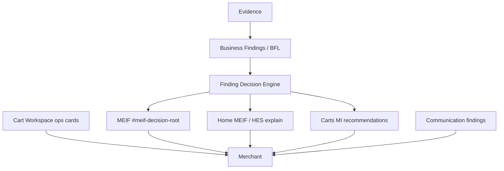
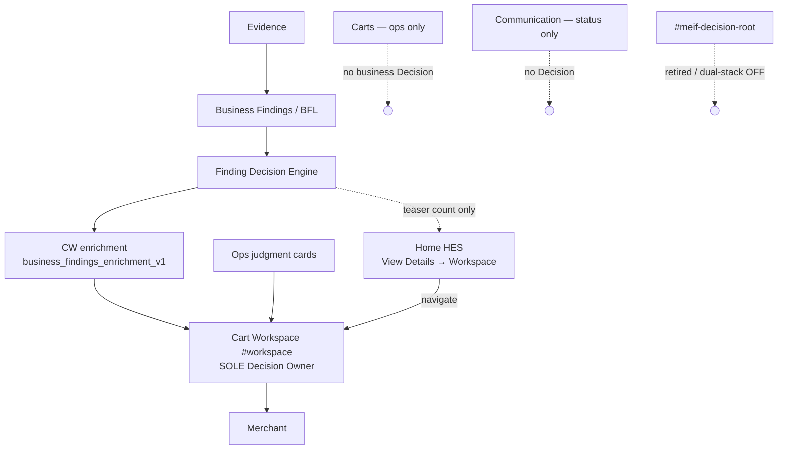

# Before / After Architecture — Gate 2 Decision Ownership

**Date (UTC):** 2026-07-24

---

## Before (duplicate Decision ownership)



Problems:

- Three+ merchant paint paths for business reasoning  
- Under Home slim transport, FDE often never reached a Decision surface  
- Carts showed recommendations parallel to Workspace  

---

## After (single Decision Owner)



Permitted flow only:

```text
Evidence → Business Finding → Confidence → Recommended Action → Decision
  → Cart Workspace → Merchant
```

---

## Ownership table

| Concern | Before | After |
|---------|--------|-------|
| Business Decision UI | MEIF + CW + Home + Carts | **CW only** |
| Home decisions | Explain / fat MEIF | Teaser + CTA → CW |
| Carts recommendations | Painted | Stripped |
| Communication findings | Painted | Status only |
| FDE data | Attached to MEIF packages | Enriched into CW projection |
| Rollback | N/A | `CARTFLOW_DECISION_DUAL_STACK_V1=1` |
