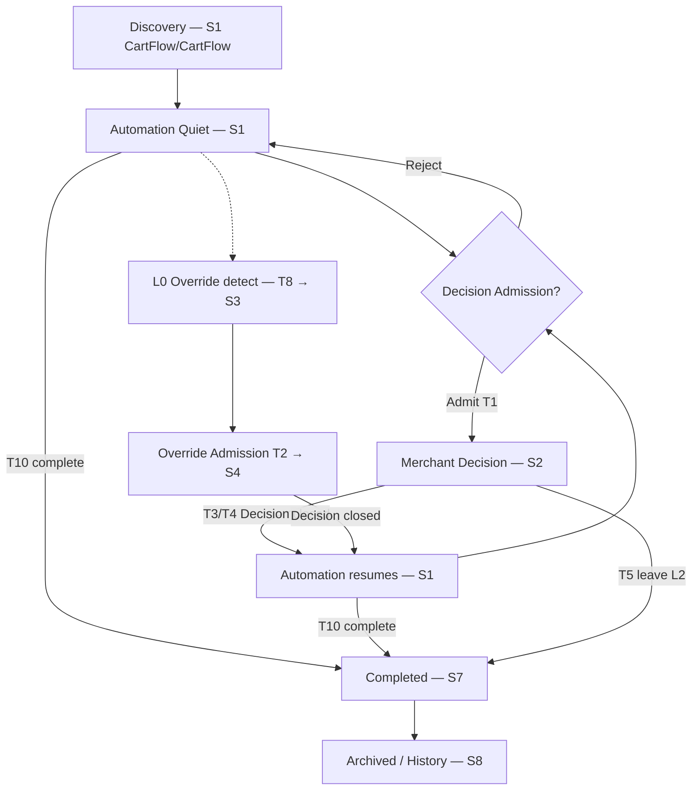
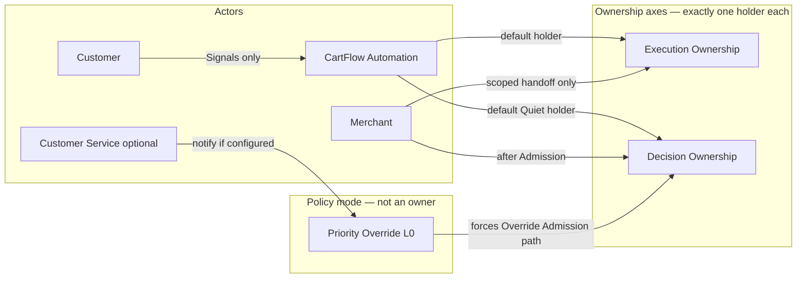

# Merchant Decision & Ownership Map V1.1

**Status:** Foundation — pending review/approval before Admission Matrix / UX / Architecture  
**Version:** V1.1 (Ownership Economics + Ownership Stability)  
**Date (UTC):** 2026-07-12  
**Authority parent:** Cart Workspace Governance Pack (ratified)  
**Law:** [`cart_workspace_constitution_v2.md`](cart_workspace_constitution_v2.md)  
**Language:** [`cart_workspace_glossary_v1.md`](cart_workspace_glossary_v1.md)  
**Reasoning:** [`cart_workspace_constitutional_decisions_log_v1.md`](cart_workspace_constitutional_decisions_log_v1.md)  
**Ratification:** [`cart_workspace_ratification_v1.md`](cart_workspace_ratification_v1.md) — Verdict A  

**Nature:** Operational ownership model for every recovery journey.  
**Not:** a workflow, state machine for UI, screen design, API contract, database schema, or Decision Admission Matrix.

**V1.1 addition:** Ownership Economics (OE-1…OE-5), Ownership Stability (OS-1…OS-5), and permanent principle **Governance Must Compile Into Runtime Simplicity**. Design-time governance only — zero hot-path latency, zero polling, zero runtime interpretation of this document.

---

## Document purpose

This map answers, for any recovery scenario, without reading implementation:

| Question | Answered by |
|----------|-------------|
| Who owns execution? | Execution Ownership |
| Who owns the business decision? | Decision Ownership |
| Why? | Transition trigger + evidence |
| What evidence caused the transition? | Transition Matrix |
| When does ownership return? | End / return conditions |
| What is forbidden? | Invariants + forbidden transitions |

Downstream artifacts (**Decision Admission Matrix**, **UX Blueprint**, **Decision Engine**, **Architecture Review**, engineering) **derive from** this map. They must not redefine ownership. Do not begin those documents until this map is reviewed and approved.

---

## Part 1 — Operational Actors

Actors participate in recovery. Only **CartFlow** and **Merchant** may hold Execution Ownership or Decision Ownership. Other actors influence signals, notifications, or policy — they do **not** become Execution or Decision Owners.

### 1.1 CartFlow Automation

| Axis | Definition |
|------|------------|
| **Identity** | The platform’s autonomous recovery operator (default Execution Owner; default Decision Owner when no Decision is admitted). |
| **Responsibilities** | Run recovery (schedule, message, observe, progress lifecycle); hold Execution Ownership by default; hold Decision Ownership when Quiet; evaluate Proof toward Decision Admission; apply Automation Confidence; continue execution under Priority Override unless scoped manual handoff; record Completed Outcomes into L4-appropriate truth. |
| **Authority** | Execute recovery without merchant attention; wait as operational strategy without interrupting; reject interruption when automation can safely continue; transfer Decision Ownership only through Decision Admission (normal or Override path); accept Decision Ownership back when Decision resolves/expires/returns or cart leaves L2. |
| **Ownership boundaries** | May own Execution and/or Decision. Never shares either axis with another owner at the same time. |
| **May never own** | Customer consent/intent as a substitute for merchant business judgment; Admin Operations identity; Knowledge Layer as Decision Owner; Customer Service’s human CS work as CartFlow Execution Ownership. |

### 1.2 Merchant

| Axis | Definition |
|------|------------|
| **Identity** | The business judgment actor invited only when Human Gain (or Override policy) justifies Attention Budget spend. |
| **Responsibilities** | Resolve admitted Decisions (one Action per Decision); optionally execute scoped manual recovery **only** under explicit Execution handoff; protect own attention by not supervising automation. |
| **Authority** | Hold Decision Ownership after Admission (including Override Admission); hold Execution Ownership only under scoped manual-execution policy; return Decision Ownership by resolving/returning Decision per policy. |
| **Ownership boundaries** | Decision Owner only after Admission. Never Decision Owner while CartFlow still owns Decision without Admission. Never permanent unsupervised dual Decision Owner with CartFlow. |
| **May never own** | Truth minting; Evidence Registry authority; Lifecycle Truth; Admin Operations; “always watching” Execution Ownership by default; Workspace organization by Status. |

### 1.3 Customer

| Axis | Definition |
|------|------------|
| **Identity** | External party generating Signals (replies, purchases, questions, silence). |
| **Responsibilities** | None toward Cart Workspace ownership. Customer behavior is observed, not owned as Execution/Decision. |
| **Authority** | None over Execution Ownership or Decision Ownership. |
| **Ownership boundaries** | Customer actions produce Signals → Evidence → Proof; they never transfer ownership by themselves. |
| **May never own** | Execution Ownership; Decision Ownership; Workspace; Escalation triggers solely by existing. |

### 1.4 Customer Service (optional)

| Axis | Definition |
|------|------------|
| **Identity** | Optional human support channel notified under Priority Override **when configured** (Ratification Q5). |
| **Responsibilities** | External CS handling when engaged; does not replace Merchant Decision Ownership or CartFlow Execution Ownership unless a future governed handoff policy explicitly says so (see Open Ownership Questions). |
| **Authority** | Receive Override notifications when configured. No constitutional right to Decision Ownership or Execution Ownership on the cart. |
| **Ownership boundaries** | Outside Cart Workspace dual-ownership axes unless a later Pack-amendment creates a scoped CS execution/decision role. |
| **May never own** | Silent takeover of Decision or Execution; bypass of Decision Admission; redefinition of Quiet by Default. |

### 1.5 Priority Override

| Axis | Definition |
|------|------------|
| **Identity** | Constitutional **operational mode / Layer L0** (e.g. VIP) — **not** a third Execution or Decision Owner. |
| **Responsibilities** | Activate Override policy: immediate merchant notify; CS notify if configured; Override Admission path that never waits behind normal queues; immediate Decision Ownership eligibility → Merchant on Override Admission; keep CartFlow on Execution unless scoped manual handoff. |
| **Authority** | Change **policy path** and **Admission path**; force Override Admission eligibility; isolate Override Decisions from normal queue wait. Does not seize Execution Ownership by existing. |
| **Ownership boundaries** | Mode flag on the journey: Active / Inactive. Orthogonal to who holds Execution vs Decision. |
| **May never own** | Execution Ownership as “VIP owns execution”; Decision Ownership as “VIP owns decision” (Merchant does, after Override Admission); queue-priority semantics; Admission bypass. |

---

## Part 2 — Ownership Types

### 2.1 Required types (exactly two)

Constitution forbids inventing a third owner **type** on the cart’s operational axes. Two types only:

| Type | Purpose |
|------|---------|
| **Execution Ownership** | Who runs recovery work now |
| **Decision Ownership** | Who owns the next business judgment |

### 2.2 Explicitly not ownership types

| Concept | Classification |
|---------|----------------|
| Priority Override | **Policy mode** (L0), not an owner |
| Knowledge / Observation / Proof | **Upstream authorities**, not cart owners |
| Admin Operations | **Separate operator surface** |
| Customer / Customer Service | **Actors**, not Execution/Decision owners |
| Status / Signal | **Observations**, not ownership |

### 2.3 Execution Ownership

| Field | Rule |
|-------|------|
| **Purpose** | Assign responsibility for running recovery (scheduling, messaging, observation, lifecycle progression, policy-constrained automation). |
| **Authority** | Execute, pause (wait strategy), retry, observe, complete under policy; request Decision Admission evaluation; apply Override-constrained execution when L0 active. |
| **Holders** | **CartFlow** (default) or **Merchant** (scoped manual-execution only). |
| **Start conditions** | Journey discovery / recovery arm → CartFlow. Merchant starts only via explicit scoped manual-execution handoff gate. |
| **End conditions** | Journey reaches Completed Outcome (L4) under CartFlow; or scoped manual scope closes → return to CartFlow; or governed cancellation ends active execution. |
| **Transfer rules** | CartFlow → Merchant: **only** explicit scoped manual-execution handoff. Merchant → CartFlow: manual scope closed or policy return. Priority Override **does not** transfer Execution Ownership. |

### 2.4 Decision Ownership

| Field | Rule |
|-------|------|
| **Purpose** | Assign responsibility for the next business judgment; protect Quiet when CartFlow holds it. |
| **Authority** | CartFlow-as-Decision-Owner: continue without merchant interruption; wait as strategy; never present Workspace Decisions. Merchant-as-Decision-Owner: resolve the admitted Decision’s Action; receive Explain Before Asking context. |
| **Holders** | **CartFlow** (default; no admitted Decision) or **Merchant** (after Admission — normal or Override). |
| **Start conditions** | Journey start → CartFlow. Merchant starts only on Decision Admission success. |
| **End conditions** | Decision resolved, expired, returned, or superseded per policy → CartFlow; or cart leaves L2 (Completed Outcome / archive exit) → CartFlow (no active Decision). |
| **Transfer rules** | CartFlow → Merchant: Decision Admission success only (normal or Override path). Merchant → CartFlow: resolve / expire / return / supersede / leave L2. Notification alone does not transfer. Acknowledgment alone does not transfer (Q1: transfer is at Override Admission, not ack). |

---

## Part 3 — Ownership States

States are **operational ownership configurations**, not UI screens. Each active recovery journey is always in exactly one composite state on the dual axes, plus policy mode and journey phase.

### 3.1 Core dual-axis states (active recovery)

| ID | Execution Owner | Decision Owner | Override mode | Objective |
|----|-----------------|----------------|---------------|-----------|
| **S1 Automation Quiet** | CartFlow | CartFlow | Inactive | Recover without merchant attention |
| **S2 Automation + Merchant Decision** | CartFlow | Merchant | Inactive | CartFlow executes; merchant judges admitted Decision |
| **S3 Override Quiet** *(transient / rare)* | CartFlow | CartFlow | Active | L0 detected; Override Admission not yet complete |
| **S4 Override + Merchant Decision** | CartFlow | Merchant | Active | Override-admitted Decision; CartFlow continues execution |
| **S5 Manual Execution + CartFlow Decision** | Merchant | CartFlow | * / * | Scoped manual run; no admitted Decision (unusual; policy-gated) |
| **S6 Manual Execution + Merchant Decision** | Merchant | Merchant | * / * | Scoped manual run while Merchant also holds Decision |

\* Override mode may be Active or Inactive independently in S5/S6.

**Note on S3:** Prefer minimizing dwell. Constitutional intent is immediate Override Admission → S4. S3 exists so detection ≠ ownership transfer without the Admission gate.

### 3.2 Terminal / non-L2 states

| ID | Owner posture | Objective |
|----|---------------|-----------|
| **S7 Completed Outcome** | No active L2 Decision; Execution complete under automation or after handback; Decision Owner = CartFlow with nothing to ask | Record success/failure outcome; leave Workspace |
| **S8 Archived / History** | Outside L2; history/Knowledge posture | Preserve Operational History; no Decision Ownership invitation |
| **S9 Knowledge only** | No Execution/Decision claim on cart as Workspace subject | Claims/proof available upstream; not a Workspace Decision |

S7–S9 are **not** Decision Cards. Re-entry to S1–S6 requires a governed reason (Part 5).

### 3.3 Per-state transition rules

| State | Allowed transitions | Forbidden transitions |
|-------|---------------------|------------------------|
| **S1** | → S2 (normal Admission); → S3 (L0 detect); → S7 (complete); → S8 (archive path) | → S2 without Admission; → S4 without Override Admission; Customer Signal alone → S2 |
| **S2** | → S1 (Decision resolved/returned/expired); → S6 (scoped exec handoff while Decision open); → S7/S8 (leave L2); → S4 if L0 activates and Override re-Admission applies | → S1 while Decision still open without resolve/expire/return; Merchant inactivity ≠ Execution Ownership transfer |
| **S3** | → S4 (Override Admission); → S1 (L0 cancelled before Admission — rare) | → S4 without Override Admission; dwell as permanent “VIP watching” without Decision |
| **S4** | → S1 (Decision closed + L0 cleared or Override Decision closed under policy); → S2 (L0 cleared, normal Decision remains); → S6 (scoped exec); → S7/S8 | Wait behind normal queue; Execution → Merchant solely because VIP |
| **S5** | → S1 (manual scope closed); → S6 (Admission while manual); → S7 | Implicit Decision Ownership to Merchant |
| **S6** | → S4/S2 (manual scope closed, Decision remains); → S1 (both closed); → S7/S8 | Dual Execution Owners |
| **S7** | → S8 (history); → S1 only via governed reopen/new journey policy | Silent return to S2 as “status show” |
| **S8** | → S1 via governed reopen only | Treat archive browse as Decision Ownership |
| **S9** | May feed Proof toward Admission on an active journey (S1…) | Become Decision Owner |

---

## Part 4 — Ownership Transitions

### 4.1 Ownership Transition Matrix

| ID | Axis | From | To | Trigger | Authority | Evidence required | Destination owner |
|----|------|------|-----|---------|-----------|-------------------|-------------------|
| **T1** | Decision | CartFlow | Merchant | Normal Decision Admission success | Decision Admission (L1) | Proof that automation cannot safely improve further + Human Gain / policy | Merchant |
| **T2** | Decision | CartFlow | Merchant | Override Admission success | Priority Override path (L0→L1) | Override eligibility (e.g. VIP) + Override Admission gate | Merchant |
| **T3** | Decision | Merchant | CartFlow | Decision resolved (Action completed) | Decision closure policy | Decision outcome recorded | CartFlow |
| **T4** | Decision | Merchant | CartFlow | Decision expired / returned / superseded | Expiry / return / supersede policy | Policy event + prior Admission id | CartFlow |
| **T5** | Decision | Merchant | CartFlow | Leave L2 (Completed Outcome / exit Workspace scope) | Completion / L4 exit | Completion or archive-exit evidence | CartFlow |
| **T6** | Execution | CartFlow | Merchant | Scoped manual-execution handoff | Explicit handoff policy | Scoped mandate + actor Merchant | Merchant |
| **T7** | Execution | Merchant | CartFlow | Manual scope closed / policy return | Handoff closure policy | Scope-closed evidence | CartFlow |
| **T8** | Policy mode | Inactive | Active | Priority Override detection | L0 policy | Override eligibility evidence | *(mode only — owners unchanged until T2)* |
| **T9** | Policy mode | Active | Inactive | Override cleared / journey no longer override-eligible | L0 clear policy | Clearance evidence | *(mode only)* |
| **T10** | Journey phase | Active (S1–S6) | S7 Completed | Recovery completed (purchase, resolved, auto-complete) | Completion authority / Lifecycle Truth peers | Terminal completion evidence | CartFlow Decision; Execution done |
| **T11** | Journey phase | Active / S7 | S8 Archived | Archive / history placement | History policy (outside L2) | Archive reason | No L2 Decision Owner invitation |
| **T12** | Journey phase | S8 | S1 | Governed reopen / new active recovery | Reopen policy | Governed reopen reason | CartFlow / CartFlow |

**Determinism rule:** No transition without an ID’d gate. Signals, notifications, UI navigation, and Status changes are **not** transitions.

### 4.2 Explicit non-transitions

| Event | Ownership effect |
|-------|------------------|
| Customer reply / question | Signal only → may feed Proof; no ownership change alone |
| Provider send failure | Execution remains CartFlow; may retry; no Merchant Decision unless Admission |
| Merchant notification delivered | Not Decision Ownership transfer |
| Merchant views Workspace / opens card | Not ownership transfer (ownership already transferred at Admission for S2/S4) |
| CS notified | No ownership transfer |
| VIP detected | T8 only; Decision transfer requires T2 |
| Knowledge claim published | Not Escalation |

---

## Part 5 — Ownership Invariants

These must never be violated. Downstream designs that break an invariant are unconstitutional.

| ID | Invariant |
|----|-----------|
| **I1** | Execution Ownership always has **exactly one** owner. |
| **I2** | Decision Ownership always has **exactly one** owner. |
| **I3** | Owners of either axis are only **CartFlow** or **Merchant**. |
| **I4** | Merchant never holds Decision Ownership without Decision Admission (normal or Override). |
| **I5** | Workspace must not interrupt the merchant while Decision Owner is CartFlow. |
| **I6** | Priority Override **never** waits behind normal Decision Admission queues. |
| **I7** | Priority Override does **not** transfer Execution Ownership by itself. |
| **I8** | Priority Override does **not** skip Override Admission (L0 → L1 → L2). |
| **I9** | Completed recovery (S7) never returns to active Decision Ownership without a **governed** reason (T12-class). |
| **I10** | Archived / history (S8) is never an active Decision surface. |
| **I11** | Customer and Customer Service never hold Execution or Decision Ownership under this map. |
| **I12** | Priority Override is never an Execution or Decision Owner. |
| **I13** | Wait (strategy) never implies Merchant Decision Ownership. |
| **I14** | Every ownership transition is explainable: **from → to → gate → evidence/policy id**. |
| **I15** | No implicit ownership changes. |
| **I16** | Dual ownership axes are independent: Decision can move without Execution moving, and vice versa (subject to gates). |
| **I17** | Ownership transfers obey Ownership Economics (OE-1…OE-5): transfers are scarce and value-justified; returns also require justification. |
| **I18** | Ownership obeys Ownership Stability (OS-1…OS-5): no oscillation without new evidence; no poll/refresh/duplicate-observation transfers; Override non-oscillating; completion terminal without governed reopen. |

---

## Part 6 — Ownership Boundaries

Exclusive responsibilities — no overlap on the same duty.

### 6.1 Exclusive to CartFlow

- Default Execution Ownership of recovery  
- Default Decision Ownership when Quiet  
- Automation, retries, observation, lifecycle progression under policy  
- Producing Signals/Statuses as Background Operations  
- Evaluating toward Proof and requesting Admission  
- Holding Execution during Priority Override (default)  
- Recording Completed Outcomes into appropriate truth/history paths  

### 6.2 Exclusive to Merchant

- Business judgment on **admitted** Decisions  
- Consuming Attention Budget for Workspace Decisions  
- Scoped manual Execution **only** when handoff policy grants it  
- Resolving / returning admitted Decisions (as Decision Owner)  

### 6.3 Exclusive to Customer Service (when configured)

- Receiving Override CS notifications  
- Performing **external** CS work outside Cart Workspace ownership axes  
- **Not** Cart Workspace Decision Ownership; **not** default Execution Ownership  

### 6.4 Exclusive to Priority Override (mode)

- Declaring Override eligibility and L0 policy effects  
- Forcing Override Admission path (no normal-queue wait)  
- Triggering immediate Decision eligibility for Merchant upon Override Admission  
- **Not** owning Execution or Decision  

### 6.5 Shared inputs (not shared ownership)

Customer Signals, provider events, Knowledge claims, and Observation evidence **inform** CartFlow’s Execution and Admission evaluation. They do not split ownership.

---

## Part 7 — Operational Timeline (ownership evolution)

Ownership evolution across a complete journey. Not UI.

### Narrative (normal path)

1. **Discovery** — Execution: CartFlow; Decision: CartFlow (S1).  
2. **Automation** — CartFlow executes; Quiet; Wait allowed as strategy.  
3. **Decision Admission** — Gate only; if reject, remain S1.  
4. **Merchant Decision** — T1 → S2; Execution still CartFlow.  
5. **Automation resumes** — T3/T4 → S1.  
6. **Completed** — T10 → S7; then optional T11 → S8.

### Narrative (Priority Override)

1. S1 → **T8** L0 Active (S3 briefly).  
2. **T2** Override Admission → S4 (Decision: Merchant; Execution: CartFlow).  
3. Decision closes → return toward S1 (and T9 if Override clears).  
4. Completion → S7 / S8 as above.

### Narrative (manual execution)

Only via **T6**: S2/S4/S1 → S5 or S6. Return via **T7**.

---

## Part 8 — Failure Scenarios (ownership remains deterministic)

| Scenario | Execution Owner | Decision Owner | Transition notes |
|----------|-----------------|----------------|------------------|
| **Merchant inactivity** while Decision open (S2/S4) | CartFlow (or Merchant if S6) | Merchant until T4 expiry/return/supersede policy fires | Inactivity ≠ Execution handoff; ≠ silent Decision return without policy; OS-1 holds |
| **Customer inactivity** | CartFlow | CartFlow (S1) unless Decision already admitted | Silence is Signal/Status material; Wait strategy OK; no Escalation alone |
| **Provider failure** | CartFlow | CartFlow unless Admission already granted | Retry under Execution; failure ≠ Merchant Decision without Admission |
| **Retry / retry loop** | CartFlow | Unchanged | Retry is Execution work; no ownership change; OS-3 |
| **Provider retry** | CartFlow | Unchanged | Same as retry; duplicate provider attempts ≠ transfer |
| **Duplicate webhook** | Unchanged | Unchanged | Idempotent observation; OS-3 — no second T1/T2 |
| **Repeated observation** | Unchanged | Unchanged | Same Evidence does not re-fire transfer (OS-1, OS-3) |
| **Recovery cancellation** | Ends active Execution under cancel policy → toward S7/S8 | Decision → CartFlow via T4/T5 if open | Must record gate; no orphan Decision Owner |
| **Purchase completion** | Complete → S7 | CartFlow; no L2 Decision | T10; Completed Outcome ≠ Decision Card; OS-5 terminal |
| **VIP interruption** | Remains CartFlow (I7) | After T2 → Merchant immediately (Q1) | T8 then T2; never normal-queue wait (I6); OS-4 no Override oscillation |

---

## Part 9 — Future Compatibility

| Future / peer layer | Compatibility rule |
|---------------------|-------------------|
| **Decision Admission Matrix** | Implements gates for T1/T2; may not invent ownership types or skip I4/I8 |
| **Knowledge Layer** | Supplies claims/proof inputs; never becomes Decision/Execution Owner; never auto-escalates (S9) |
| **Observation Layer** | Feeds Signals/Evidence; never transfers ownership alone |
| **Operational Excellence Framework** | Measures I-compliance and Attention Budget outcomes; must not redefine owners |
| **Admin Operations** | Separate surface; must not absorb Merchant Decision Ownership or merge into Workspace |
| **UX Blueprint** | Projects S2/S4 Decisions; must not treat S1 Quiet as failure or S7 as Decision |
| **Architecture / Engineering** | Encode Transition Matrix + Invariants; no implicit transitions in code paths |

**Compatibility verdict:** No listed layer requires redefining ownership if it inherits this map.

---

## Part 10 — Ownership Economics

### 10.1 Philosophy

Ownership transfer is an **expensive operational event**.

The cost is **not** computational latency, CPU, or request duration.

The cost is measured in:

- merchant attention  
- context switching  
- operational interruption  
- business responsibility assumed by the receiving owner  

Every transfer spends Attention Budget and imposes Cognitive Load. Therefore transfers are scarce instruments, not routine bookkeeping.

### 10.2 Operational rationale

Recovery volume scales with carts. Merchant judgment does not. If ownership moved freely on Signals, Statuses, retries, or webhooks, Cart Workspace would become a supervision product and destroy Quiet by Default.

Economics makes the Transition Matrix **selective**: fewer justified transfers beat more transfers. Decision Admission exists to spend Human Gain only when it exceeds Attention Cost.

### 10.3 Governing principles

| ID | Principle |
|----|-----------|
| **OE-1** | **Ownership transfers are expensive.** Every transfer must produce measurable business value. |
| **OE-2** | **Execution Ownership should remain with CartFlow** whenever automation is still capable of improving the outcome. |
| **OE-3** | **Decision Ownership transfers only when expected Human Gain exceeds Attention Cost.** |
| **OE-4** | **Ownership transfers must be minimized.** Success is measured by fewer justified transfers, not more transfers. |
| **OE-5** | **Returning ownership to CartFlow also carries operational cost.** Return only when justified by new evidence or explicit policy (not by refresh noise, polling, or impatience). |

### 10.4 Non-goals

Ownership Economics does **not**:

- introduce runtime cost scoring on the recovery hot path  
- require live “attention price” calculation per request  
- add polling to detect whether a transfer was “worth it”  
- create additional Execution steps, retries, or Admission evaluations beyond pre-defined rules  
- redefine Glossary terms or Constitution principles  

### 10.5 Architectural consequences

| Consequence | Effect |
|-------------|--------|
| Prefer S1 over S2 | Stay Quiet while Automation Confidence holds (OE-2, OE-4) |
| T1/T2 are costly gates | Admission Matrix must encode Human Gain > Attention Cost once as rules — not reinterpret economics online |
| T3/T4/T5 are also costly | Return paths need policy justification (OE-5); avoid thrash back to Merchant |
| T6 is rare and expensive | Manual Execution handoff is exceptional |
| Metrics | Operational Excellence should count justified transfers avoided, not transfer volume |
| Engine design | Compile OE-1…OE-5 into static Admission / transition rules |

---

## Part 11 — Ownership Stability

### 11.1 Philosophy

Ownership must be **stable**, **predictable**, and **resistant to oscillation**.

A correct single transfer is valuable. A ping-pong of transfers destroys merchant trust, wastes Attention Budget, and makes Execution nondeterministic from the merchant’s perspective.

### 11.2 Governing principles

| ID | Principle |
|----|-----------|
| **OS-1** | **Ownership must never oscillate without new evidence.** CartFlow → Merchant → CartFlow → Merchant is forbidden unless each leg is independently justified by new evidence / explicit policy. |
| **OS-2** | **Every ownership transition requires trigger + evidence + justification** (aligns with I14; economics adds value justification via OE-1). |
| **OS-3** | **Repeated transitions caused only by polling, refresh, or repeated observations are prohibited.** Same Evidence must not re-fire T1/T2/T3/T4. |
| **OS-4** | **Priority Override cannot oscillate.** Once Active (T8), it remains Active until **explicit resolution** (T9 or journey terminal under clear policy) — not toggling on duplicate VIP detections. |
| **OS-5** | **Completed ownership is terminal.** S7/S8 do not re-enter active Decision Ownership without **explicit new evidence** and governed reopen (T12). |

### 11.3 Stability relative to Transfer Matrix

| Pattern | Rule |
|---------|------|
| Second T1/T2 on identical Proof | **Forbidden** (OS-1, OS-3) |
| T3 then immediate T1 without new Evidence | **Forbidden** (OS-1, OE-5) |
| Dashboard refresh / list reload | **No ownership effect** |
| Duplicate webhook / idempotent observe | **No ownership effect** (OS-3) |
| L0 detect twice while already Active | **No second T8**; remain Active (OS-4) |
| Purchase → S7 then auto S2 | **Forbidden** (OS-5) |

### 11.4 Ownership Stability Tests (governance)

Design-time checks. Runtime implements outcomes as simple deterministic rules — not by evaluating this chapter per request.

| Test ID | Scenario | Required ownership outcome |
|---------|----------|----------------------------|
| **OST-1** | Merchant inactive while Decision open | Decision Owner stays Merchant until T4 policy; no Execution handoff; no oscillation |
| **OST-2** | Customer inactive | Remain S1 (or prior state); no Escalation from silence alone |
| **OST-3** | Purchase completed | T10 → S7; Decision Owner CartFlow with nothing to ask; terminal unless T12 |
| **OST-4** | Retry loop (N provider/send retries) | Ownership axes unchanged for entire loop |
| **OST-5** | Provider retry / duplicate delivery | Idempotent; no second transition |
| **OST-6** | Duplicate webhook | No ownership change |
| **OST-7** | Repeated observation of same Signal/Evidence | No ownership change |
| **OST-8** | VIP detect while Override already Active | Stay Active; no T8/T9 flap (OS-4) |
| **OST-9** | Refresh / poll / re-read Workspace | No ownership change |

**Verdict requirement:** For each OST, Execution Owner and Decision Owner remain deterministic and match Parts 3–4 and 8.

### 11.5 Non-goals

Ownership Stability does **not**:

- add polling to “check stability”  
- add debounce timers as governance theater on the hot path (debounce may exist in engineering for providers — that is Execution, not ownership evaluation)  
- require reading this document at runtime  
- soften Priority Override urgency (stability ≠ delay Override Admission)  

---

## Part 12 — Governance Must Compile Into Runtime Simplicity

### Permanent principle

**Governance Must Compile Into Runtime Simplicity.**

| Statement | Meaning |
|-----------|---------|
| Complex governance is acceptable | Economics, stability, invariants, and matrices may be rich at design time |
| Complex runtime is not | Recovery hot path must not interpret governance documents, score economics live, or poll for ownership |
| Governance simplifies execution | OE/OS/I/T rules **compile** into pre-defined Decision Engine / Admission / transition rules |
| No runtime governance evaluation | Ownership Economics and Ownership Stability are **design-time governance**. No runtime evaluation of governance documents is permitted |

### Runtime constraint (binding)

1. **Zero additional runtime dependencies** from Parts 10–12 (no new services, no governance interpreter, no attention-cost microservice on the hot path).  
2. **Zero additional hot-path latency** attributable to reading or evaluating this map.  
3. **Decision Engine executes pre-defined rules** derived from this map; it does not load or reason over markdown governance during requests.  
4. Ownership transitions remain those in **Part 4** only — economics/stability constrain *which rules are allowed to exist*, not *extra steps at runtime*.

### Validation of V1.1 additions

| Claim | Demonstration |
|-------|----------------|
| Zero additional runtime dependencies | Parts 10–12 add principles and tests only; no actors, services, or APIs |
| Zero additional hot-path latency | No new evaluation steps; compile-time rule shaping only |
| Deterministic transitions preserved | T1–T12 unchanged; OS/OE forbid illegal patterns without new transition IDs |
| Reduced architectural drift | Future Admission/UX/Architecture must justify transfers (OE) and ban oscillation (OS) |
| Stronger Admission, simpler execution | Admission becomes the compiled gate for OE-3; Engine stays rule-based |

**Success criterion:** More governance, simpler runtime.

---

## Operational Ownership Diagram

---

## Ownership Invariants (summary)

See **Part 5** (I1–I18). Reinforced by **OE-1…OE-5** and **OS-1…OS-5**. Non-negotiable for all derived work.

---

## Open Ownership Questions

Only genuine unresolved ownership items. Closed Pack questions (Q1–Q6) are **not** reopened here.

| ID | Question | Why it matters | What does *not* block |
|----|----------|----------------|----------------------|
| **OQ-1** | What exact policy events constitute Decision **expiry**, **return**, and **supersede** (T4) — timers, merchant dismiss, conflicting Proof, Override clear? | Needed for Admission Matrix / Engine detail; OE-5/OS-1 constrain answers | Dual-axis model; T3/T5 already defined |
| **OQ-2** | What is the **minimum constitutional content** of a scoped manual-execution handoff (T6) — duration, allowed actions, who may initiate (merchant only vs system-proposed)? | Needed before S5/S6 appear in UX/architecture | Default Execution = CartFlow remains settled |
| **OQ-3** | If Customer Service is configured, may a **future** governed policy ever grant CS a *scoped* Execution or Decision role, or is CS permanently notification-only under this map? | Prevents accidental CS-as-owner drift | CS is not an owner **today** (I11) |
| **OQ-4** | For **governed reopen** (T12), which evidence classes are sufficient (merchant reopen action, new cart identity, purchase reverse, etc.)? | Needed for archive/reopen product surfaces; OS-5 requires explicit new evidence | S8 outside L2 is settled (Q4) |

These OQs do **not** block review of this Ownership Map foundation. They must be answered before or inside Decision Admission Matrix / reopen specs — without changing I1–I16, OE-*, or OS-*.

---

## Derivation gate

| Stage | Status |
|-------|--------|
| Governance Pack | Ratified |
| **This Ownership Map V1.1** | Foundation — parent of Admission Matrix |
| **Decision Admission Matrix V1** | Foundation — [`decision_admission_matrix_v1.md`](decision_admission_matrix_v1.md) |
| **Cart Workspace UX Blueprint V1** | Behavioral architecture — [`cart_workspace_ux_blueprint_v1.md`](cart_workspace_ux_blueprint_v1.md) |
| Architecture Review | Blocked until UX Blueprint approved |
| Engineering Implementation | Blocked |

---

## Change log

| Version | Change |
|---------|--------|
| **V1** | Actors, ownership types, states S1–S9, transitions T1–T12, invariants I1–I16, timeline, failure scenarios, compatibility, open OQs |
| **V1.1** | Ownership Economics OE-1…OE-5; Ownership Stability OS-1…OS-5 + OST tests; permanent principle **Governance Must Compile Into Runtime Simplicity**; expanded Part 8 stability scenarios. No Constitution/Glossary/CDR edits. No runtime behavior. |

---

**End of Merchant Decision & Ownership Map V1.1.**
