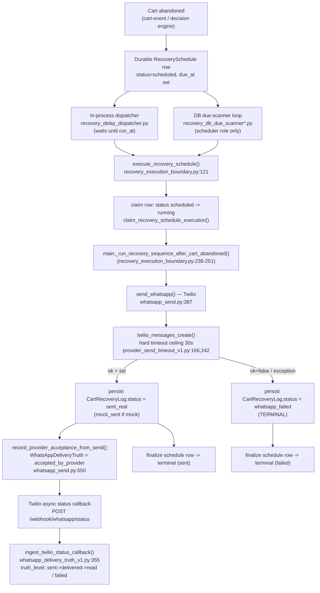
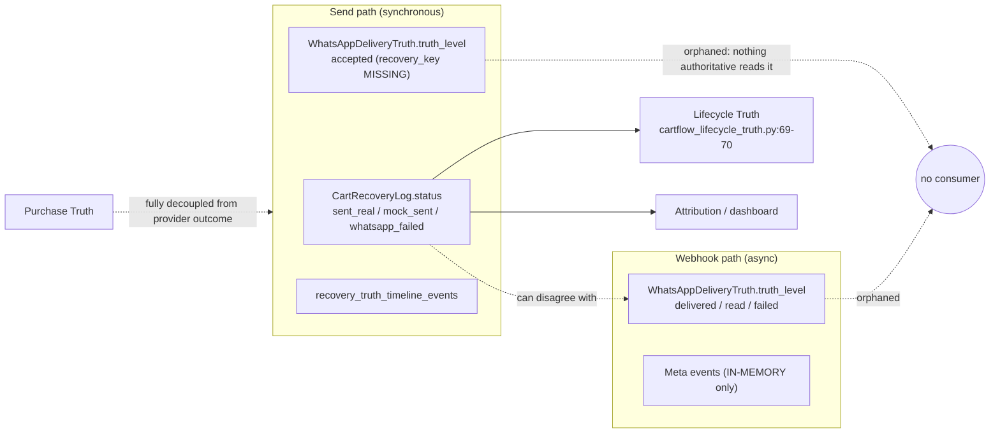
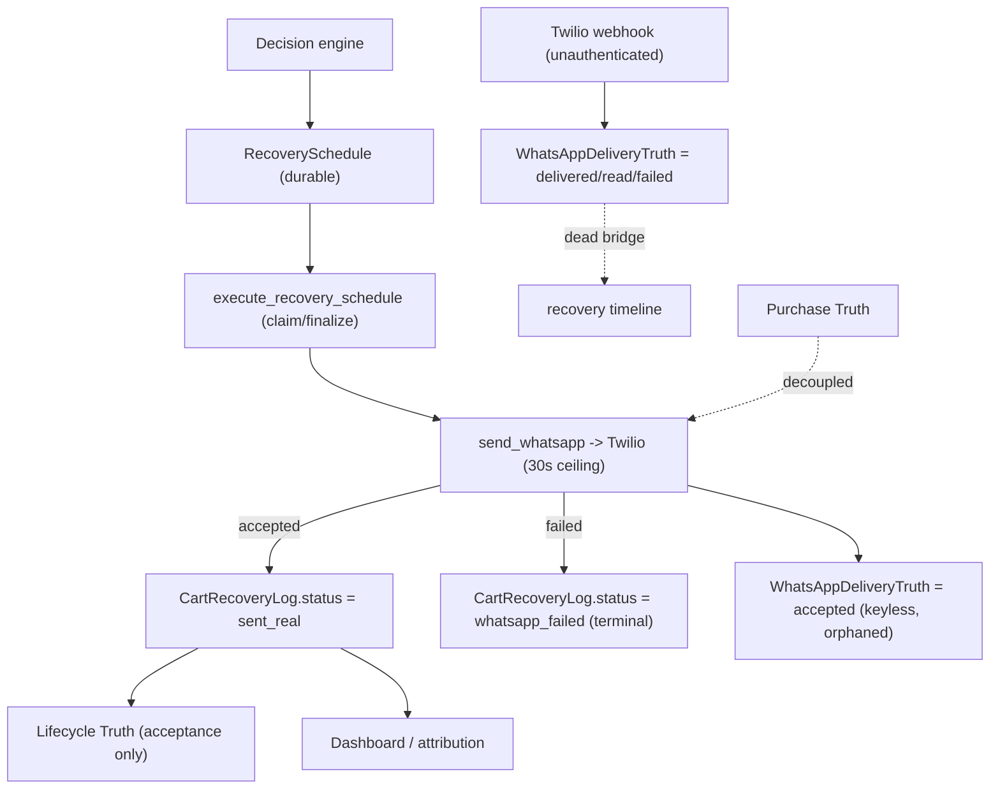

# Provider Reliability Foundation V1 — Audit

**Status:** Audit (read-only) — no implementation, no behavior change
**Phase:** Engineering Constitution Lifecycle §4 Stage 1 (Audit → Governance → …)
**Scope:** All outbound message providers (Twilio today; Meta placeholder; future providers)
**Method:** Evidence only — code read at `file:line`, no runtime changes
**Feeds:** Provider Reliability Governance V1

---

## 0. Executive summary

CartFlow's outbound provider layer **works** (real Twilio WhatsApp sends, a hard send-timeout ceiling, DB-backed idempotency, categorical failure classification, and an additive delivery-truth foundation), but it is **not yet measured, reconciled, or enforced**. The audit's central findings:

1. **The production send is a single synchronous Twilio call — there is no automated retry of a *failed* send.** The multi-attempt in-memory queue (`services/whatsapp_queue.py`, 3 attempts) is **test-only** — it has no production callers. In production, a failure persists `whatsapp_failed` and is **terminal**; the due-scanner only re-picks `status="scheduled"` rows, never failed ones.
2. **Provider truth is split across four disjoint stores that can disagree with nothing reconciling them:** `CartRecoveryLog.status` (de-facto authoritative, drives lifecycle/attribution/dashboard), `recovery_truth_timeline_events`, `WhatsAppDeliveryTruth.truth_level` (**orphaned** — nothing authoritative reads it), and Meta events (**in-memory only**).
3. **`CartRecoveryLog.status` records provider *acceptance*, not *delivery*.** A row can be `sent_real` while the customer never received the message (`WhatsAppDeliveryTruth = failed_delivery`), and the platform treats it as a successful send.
4. **`Retry-After` / `429` rate-limit backoff is never parsed or honored.** Rate limiting is classified (`FAILURE_RATE_LIMITED`) for merchant copy but treated operationally like any other failure.
5. **There is exactly one aggregate reliability number** — `recent_send_failures_24h` (a raw `COUNT` of `whatsapp_failed` rows). No rate, no denominator, no delivery-rate, no retry metrics, no latency. The two richest real-time signals (send-event ring buffer cap 80, anomaly buffer cap 200) are **in-memory and lost on restart**.
6. **Inbound provider webhooks are unauthenticated** — neither the Twilio status callback nor the Meta event POST verifies a signature.

**Maturity verdict (Engineering Maturity Model):** **Level 1 — Working**, with isolated Level-2 "Governed" components. Not Measured, not Enforced. See §9.

---

## 1. Provider send lifecycle (successful path)

### 1.1 Production path (durable, DB-backed)

**Step-by-step (verified):**

| # | Stage | Owner / evidence |
|---|-------|------------------|
| 1 | Recovery decision → durable schedule | Decision engine writes `RecoverySchedule (status=scheduled, due_at)` — the durable unit of work. |
| 2 | Dispatch | In-process `recovery_delay_dispatcher.py:266` (waits then calls) **or** the DB due-scanner loop (`recovery_db_due_scanner*.py`, scheduler role) picks `status=scheduled AND due_at<=now`. |
| 3 | Execution boundary | `execute_recovery_schedule()` (`recovery_execution_boundary.py:121`) — claims row (`scheduled→running`), loads context, is safe to call twice (terminal / claim-race guarded). |
| 4 | Send | `main._run_recovery_sequence_after_cart_abandoned()` → `send_whatsapp()` (`whatsapp_send.py:387`) → `twilio_messages_create()` with a **hard 30s ceiling** on a worker thread (`provider_send_timeout_v1.py:20,166,242`). |
| 5 | Persist send outcome | `CartRecoveryLog.status` written per the truth table (`whatsapp_send.py:677-685`): provider `ok+sid` → `sent_real`; mock → `mock_sent`; `ok=false` → `whatsapp_failed`. |
| 6 | Record acceptance | `record_provider_acceptance_from_send()` writes `WhatsAppDeliveryTruth = accepted_by_provider` (`whatsapp_send.py:550`). **Note:** `recovery_key` is **not** passed here — this orphans the delivery-truth→timeline bridge (see §5.3). |
| 7 | Delivery confirmation (async) | Twilio POSTs to `/webhook/whatsapp/status` → `ingest_twilio_status_callback()` (`whatsapp_delivery_truth_v1.py:355`) advances `truth_level` (`accepted → sent → delivered → read`, or `failed`). |
| 8 | Purchase Truth | **Decoupled** — driven by `/api/conversion`, never by provider send outcome. |
| 9 | Lifecycle Truth | Reads `CartRecoveryLog.status` only (`cartflow_lifecycle_truth.py:69-70`): reflects **acceptance**, never delivery truth. |

### 1.2 Test-only path (not production)

`services/whatsapp_queue.py` implements a per-event-loop `asyncio.Queue` worker with **`MAX_WA_SEND_ATTEMPTS = 3`** (`:25`), 1s backoff (`:51`), inflight dedup, and richer statuses (`failed_retry`, `failed_final`). Its entry point `enqueue_recovery_and_wait()` (`:357`) has **zero non-test callers** (only `tests/…` and one doc reference). **This retry engine does not protect production sends.**

---

## 2. Failure taxonomy

Classification lives in `cartflow_provider_readiness.classify_provider_failure()` (`:296`), mapping Twilio/Meta signals → stable failure classes (`:20-28`). The table below states **current behavior** for every category.

| # | Provider outcome | Failure class / signal | Persisted status | Automated retry? | Merchant-visible? | Notes |
|---|------------------|------------------------|------------------|------------------|-------------------|-------|
| 1 | **Success (accepted+sid)** | `ok+sid` | `sent_real` | n/a | via dashboard | `WhatsAppDeliveryTruth=accepted_by_provider` (not delivered) |
| 2 | **Success (mock)** | `ok`, no sid | `mock_sent` | n/a | via dashboard | Sandbox / non-production |
| 3 | **Timeout** | `provider_timeout` → `provider_unavailable` | `whatsapp_failed` | **No** | generic | 30s ceiling; anomaly `ANOMALY_PROVIDER_SEND_FAILURE`; ring-buffer event |
| 4 | **Temporary failure** | `500/502/503/connection` → `FAILURE_UNAVAILABLE` | `whatsapp_failed` | **No** | "مزود واتساب غير متاح مؤقتاً" | No distinction from permanent at the send path |
| 5 | **Rate limit / 429** | `20429` / "rate limit" → `FAILURE_RATE_LIMITED` | `whatsapp_failed` | **No** | "الحدّ المسموح من المزود" | **`Retry-After` never parsed/honored** |
| 6 | **`Retry-After` header** | — | — | **No** | — | **Not read anywhere** (blind spot) |
| 7 | **Provider unavailable** | `unavailable` → `FAILURE_UNAVAILABLE` | `whatsapp_failed` | **No** | generic-unavailable | |
| 8 | **Auth failure** | `401/403/20404/20003`, token/sid → `FAILURE_PROVIDER_AUTH` | `whatsapp_failed` | **No** | "تعذر الاتصال بمزود واتساب" | Also surfaces via readiness (`configured=false`) |
| 9 | **Invalid destination** | `invalid_phone` (send) / `21211` → `FAILURE_REJECTED` | `whatsapp_failed` | **No** | "المزود لم يقبل الرسالة" | Rejected before or by provider |
| 10 | **Template rejected** | `63013/63014`, "not approved" → `FAILURE_TEMPLATE_NOT_APPROVED` | `whatsapp_failed` / `blocked_template_required` | **No** | "قالب واتساب غير معتمد" | Pre-send enforcement gate in `whatsapp_production_reality_v2` can block before the call |
| 11 | **Sandbox recipient** | `63016/63017/63018` / "sandbox…join" → `FAILURE_SANDBOX_RECIPIENT` | `whatsapp_failed` | **No** | "رقم الاختبار غير مفعّل" | Sandbox mode only |
| 12 | **Not configured** | `twilio_not_configured` → `FAILURE_PROVIDER_NOT_CONFIGURED` | `whatsapp_failed` | **No** | "واتساب غير مفعّل" | Missing `TWILIO_*` env |
| 13 | **Duplicate send** | DB idempotency HIT | `skipped_duplicate` | n/a | — | `recovery_whatsapp_idempotency.py` blocks on existing `sent_real/mock_sent/queued` (`:15`) |
| 14 | **Unknown status** | no signal | `FAILURE_UNKNOWN` → `whatsapp_failed` | **No** | "تعذر إرسال واتساب" | Default bucket |
| 15 | **Internal skip (converted)** | `_is_converted` | `stopped_converted` | n/a | — | Cancels remaining sends |
| 16 | **Internal skip (rejected help)** | `user_rejected_help` | `skipped_user_rejected_help` | n/a | — | Customer opted out |
| 17 | **Internal skip (operational control)** | kill-switch / control block | control block dict | n/a | — | `operational_control_v1` |

**Key taxonomy gaps:** categories 4 (temporary) and 5 (rate-limit) are *classified* for merchant copy but **operationally identical** to permanent failures — there is no "retryable vs terminal" axis driving behavior.

---

## 3. Retry behavior

| Dimension | Production reality | Evidence |
|-----------|--------------------|----------|
| **Retry owner** | *None for a failed send.* The only retry engine (`whatsapp_queue.py`, 3 attempts) is **test-only**. | `whatsapp_queue.py:25,164`; zero prod callers of `:357` |
| **Retry trigger** | None. A `whatsapp_failed` outcome is terminal; the due-scanner only re-selects `status="scheduled"`. | `recovery_execution_boundary.py:179` (terminal short-circuit); due-scanner selects scheduled |
| **Retry limits** | 0 automated re-attempts after a failure. (Multi-message *sequences* / `recovery_attempts` are **new scheduled reminders**, not retries of a failed send.) | `whatsapp_send.py:230` `_max_recovery_attempts` |
| **Retry timing / backoff** | N/A in production. (Test queue backoff = `WHATSAPP_QUEUE_RETRY_BACKOFF_SECONDS`, default 1s.) | `whatsapp_queue.py:51` |
| **Retry persistence** | None — no DB re-arm of failed sends. | `recovery_db_due_scanner*` never re-picks failed rows |
| **Retry cancellation** | Conversion / user-rejected / operational-control checks stop *future* scheduled sends. | `whatsapp_queue.py:151-207`, `whatsapp_send.py:73-85` |
| **Retry observability** | `failed_retry`/`failed_final` exist but are **queue-path only**; production only ever shows `whatsapp_failed`. | `whatsapp_send.py:677-685` |

**Crash-during-send:** a claimed row left `running` is closed by the stale-repair path to `failed_resume_stale` (terminal) when there is no send-evidence log — i.e. an in-flight crash is **also not auto-retried** (`recovery_execution_boundary.py:101-118`).

---

## 4. Failure durability

| Event | Survives? | What is preserved / lost |
|-------|-----------|---------------------------|
| **Process restart** | Partial | **Survives:** `RecoverySchedule` (scheduled rows re-armed by resume-scan / due-scanner), `CartRecoveryLog`, `WhatsAppDeliveryTruth`. **Lost:** `asyncio.Queue`, `_inflight` dedup dict, in-process delay tasks (re-derived from DB), provider send-event ring buffer (cap 80), anomaly buffer (cap 200). |
| **Deploy** | Same as restart | Durable schedules re-armed; in-memory diagnostics reset. |
| **Worker restart** | Partial | Same as process restart; only the scheduler-role process re-arms (`recovery_process_role_v1`). |
| **Scheduler restart** | Yes (for scheduled) | Resume-scan re-arms `scheduled` rows; `running` rows are stale-repaired to terminal. |
| **Process crash mid-send** | No auto-retry | `running` → `failed_resume_stale` (terminal) if no send evidence. |

**Durability summary:** the *scheduling* substrate is durable and idempotent; the *send outcome* and *observability* substrate is not retried and (for diagnostics) not persisted.

---

## 5. Provider truth ownership

### 5.1 The four stores

| Store | Values | Who reads it | Authority |
|-------|--------|--------------|-----------|
| **`CartRecoveryLog.status`** | queued / sent_real / mock_sent / whatsapp_failed / failed_retry / failed_final / skipped_* | Lifecycle Truth (`:69-70`), attribution, dashboard | **De-facto authoritative for "did we send"** — but only *acceptance*, not delivery |
| **`WhatsAppDeliveryTruth.truth_level`** | accepted / sent / delivered / read / failed | diagnostic/display only; `customer_delivered_for_attribution_future()` returns `False` today (`:203`) | **Orphaned** — richest truth, no authoritative consumer |
| **`recovery_truth_timeline_events`** | scheduled / sent / webhook_delivered / … | timeline/diagnostics | Event log; the `webhook_delivered` bridge is effectively dead (§5.3) |
| **Meta events** | (varies) | in-memory buffer | **Volatile** — lost on restart |

### 5.2 Can they disagree? — Yes

`CartRecoveryLog.status = sent_real` (provider accepted) can coexist with `WhatsAppDeliveryTruth.truth_level = failed_delivery` (customer never got it). **Nothing reconciles them**, and Lifecycle/attribution follow the *acceptance* store — so a message that failed delivery is counted as sent.

### 5.3 The orphaned delivery-truth bridge

`ingest_twilio_status_callback()` can promote a `delivered` event into the recovery timeline **only if the delivery-truth row carries a `recovery_key`** (`whatsapp_delivery_truth_v1.py:428`). But the send path calls `record_provider_acceptance_from_send()` **without `recovery_key`** (`whatsapp_send.py:550-557`), so the row is created keyless and the bridge never fires. Delivery confirmation is therefore captured but never propagated.

### 5.4 Purchase & Lifecycle coupling

- **Purchase Truth:** fully decoupled from provider outcome (driven by `/api/conversion`).
- **Lifecycle Truth:** reflects provider **acceptance** only, via `CartRecoveryLog` (`_SENT_LOG_STATUSES`/`_FAILED_LOG_STATUSES`, `cartflow_lifecycle_truth.py:69-70`); never reads delivery truth.

**Ownership verdict:** **No single reconciled source of provider truth.** Four disjoint stores, one de-facto authority that captures the wrong altitude (acceptance, not delivery).

---

## 6. Operational visibility

### 6.1 What operators CAN see today

| Signal | Source | Restart-durable? |
|--------|--------|------------------|
| Provider readiness (categorical: configured / ready / failure_class + Arabic copy) | `cartflow_provider_readiness.get_whatsapp_provider_readiness()` | derived (yes) |
| Live Meta connectivity / integration health | `integration_health_v1.py` | derived |
| Per-store WhatsApp mode (production/sandbox) | `merchant_whatsapp_mode_v1`, readiness | derived |
| Per-message delivery truth (one SID at a time) | `whatsapp_delivery_truth_v1.get_delivery_truth()` | **yes** (DB) |
| **`recent_send_failures_24h`** (only aggregate) | `cartflow_runtime_health.py:175-199` — `COUNT(whatsapp_failed)` | derived |
| Provider send-event ring buffer (timeouts/failures, cap 80) | `provider_send_timeout_v1.drain_recent_provider_send_events()` | **no (in-memory)** |
| Runtime anomaly buffer (`ANOMALY_PROVIDER_SEND_FAILURE`, cap 200) | `cartflow_runtime_health` | **no (in-memory)** |
| Structured logs `[WA SEND TRUTH]` / `[WA DELIVERY TRUTH]` / `[PROVIDER FAILURE]` / `[PROVIDER TIMEOUT]` | send + timeout modules | log retention only |
| Admin WhatsApp/Meta status surfaces | `admin_whatsapp_visibility_v1`, `admin_whatsapp_meta_status_v1` | derived |

### 6.2 Operational blind spots

1. **No send-total / no denominator** → failure *count* exists, failure *rate* does not.
2. **No delivery-rate** — delivery truth is never aggregated (and is orphaned per §5.3).
3. **No retry metrics** (retry-success, retry-exhaustion) — because there are no production retries.
4. **No send-latency metric** despite a 30s ceiling being enforced.
5. **`Retry-After` / 429 backoff invisible and unhandled.**
6. **In-memory diagnostics vanish on restart** (ring buffer cap 80, anomaly buffer cap 200) — no persistence, no cross-process aggregation.
7. **No per-provider error-rate breakdown** — Twilio vs Meta vs mock not separable in aggregate.
8. **Acceptance vs delivery conflation** — operators cannot distinguish "provider accepted" from "customer received".
9. **Unauthenticated inbound webhooks** — Twilio status callback and Meta POST verify no signature (integrity/observability trust gap).

---

## 7. Metrics inventory

| Metric | Exists? | Location |
|--------|---------|----------|
| Sends total | ❌ | — |
| Failures (24h count) | ✅ (only this) | `cartflow_runtime_health.py:175-199` |
| Failure rate (%) | ❌ | — (no denominator) |
| Retries / retry-success / retry-exhaustion | ❌ | production has no retries |
| Send latency | ❌ | — |
| Delivery rate | ❌ | truth exists per-SID, never aggregated |
| Read rate | ❌ | — |
| Provider error breakdown (by class/provider) | ❌ | classes exist per-event only |
| `operational_metrics_v1` provider section | ❌ | not in `build_operational_metrics_report` / `list_metric_contracts` |

**Net:** provider reliability has **one** aggregate number and **no ratio anywhere**.

---

## 8. Provider lifecycle & ownership map (consolidated)

**Ownership one-liner:** *scheduling* is owned durably and idempotently by `RecoverySchedule` + the execution boundary; *send outcome* is owned (as acceptance) by `CartRecoveryLog.status`; *delivery truth* is owned by `WhatsAppDeliveryTruth` but has no authoritative reader; there is **no owner that reconciles acceptance with delivery**.

---

## 9. Current maturity assessment

Per Engineering Constitution §5 (Maturity Model: 0 Experimental → 1 Working → 2 Governed → 3 Measured → 4 Enforced → 5 Institutionalized → 6 Production Proven).

| Dimension | Level | Justification |
|-----------|-------|---------------|
| Send execution | **2 Governed** | Durable schedule, claim/finalize idempotency, 30s ceiling, DB idempotency — governed but not measured |
| Failure classification | **2 Governed** | Stable `FAILURE_*` taxonomy + merchant copy; but no retryable/terminal behavior axis |
| Retry | **0–1** | No production retry engine; the 3-attempt queue is test-only |
| Durability | **2 Governed** | Scheduling durable + restart-safe; send outcome not retried |
| Truth ownership | **1 Working** | Multiple disjoint stores, no reconciliation, wrong altitude (acceptance) |
| Observability | **1 Working** | One count metric; rich signals are in-memory/orphaned |
| Metrics | **0–1** | No rates, no denominators, no provider section |
| Security (webhooks) | **1 Working** | Functional but unauthenticated |

> **Overall maturity: Level 1 — "Working", with isolated Level-2 "Governed" components.**
> It is **not** Measured (no rates), **not** Enforced (no CI/contract gate), and provider truth is not reconciled. Per the constitution, "Working" is not "complete".

---

## 10. Remaining provider-reliability risks (ranked)

> Risks only — remediation belongs to Provider Reliability Governance V1. Ranked P0 (highest) → P3.

| ID | Risk | Rank | Rationale |
|----|------|------|-----------|
| PR-R1 | **No automated retry of failed/temporary/timeout/rate-limited sends** — a transient Twilio blip permanently drops a recovery message | **P0** | Directly loses recoverable revenue; temporary and permanent failures are indistinguishable operationally |
| PR-R2 | **Acceptance counted as delivery** — `sent_real` ≠ delivered; delivery truth orphaned (keyless bridge, no reader) | **P0** | Corrupts the meaning of "recovered"; undermines attribution & lifecycle correctness |
| PR-R3 | **Unauthenticated inbound webhooks** (Twilio status, Meta POST) | **P1** | Spoofable delivery/read/failed events; integrity of any future delivery-driven logic |
| PR-R4 | **No aggregate reliability metrics** (rate/denominator/latency/delivery-rate) | **P1** | A provider outage or credential expiry is invisible until merchants complain |
| PR-R5 | **`Retry-After`/429 not honored** | **P1** | Rate-limit storms can cascade failures with no backoff |
| PR-R6 | **In-memory diagnostics lost on restart** (ring buffer 80, anomaly 200) | **P2** | Post-incident forensics evaporate on deploy/restart |
| PR-R7 | **No single reconciled provider-truth owner** (4 disjoint stores) | **P2** | Sources can silently disagree; violates "one source of truth per question" |
| PR-R8 | **Dead test-only retry queue** (`whatsapp_queue.py`) misleads readers into believing retries exist | **P3** | Maintainability / false confidence; candidate for removal or promotion |
| PR-R9 | **Meta path is a placeholder** — no send, events in-memory only | **P3** | Provider-agnostic model must accommodate it before Meta go-live |

---

## 11. Success criteria — answered

- **Exactly how provider reliability currently works:** §1 (durable schedule → claim → single synchronous Twilio send with 30s ceiling → acceptance persisted → async delivery webhook).
- **Every failure path:** §2 (17 categories with current behavior).
- **Every retry path:** §3 (none automated in production; test-only 3-attempt queue).
- **Every ownership boundary:** §5, §8 (four disjoint stores; no reconciliation).
- **Every operational blind spot:** §6.2 (nine).
- **Every production risk:** §10 (PR-R1 … PR-R9).

**No runtime behavior was changed by this audit.**

---

## 12. Recommended next step

Proceed to **Provider Reliability Governance V1** (Constitution §4 Stage 2). Governance should define contracts before any implementation, prioritized by §10: a **retryable-vs-terminal** failure axis + durable retry (PR-R1), an **acceptance-vs-delivery** truth contract with a single reconciled owner (PR-R2, PR-R7), **webhook authentication** (PR-R3), and a **provider metrics contract** with rates/denominators (PR-R4). This audit is the evidentiary foundation for that governance.
