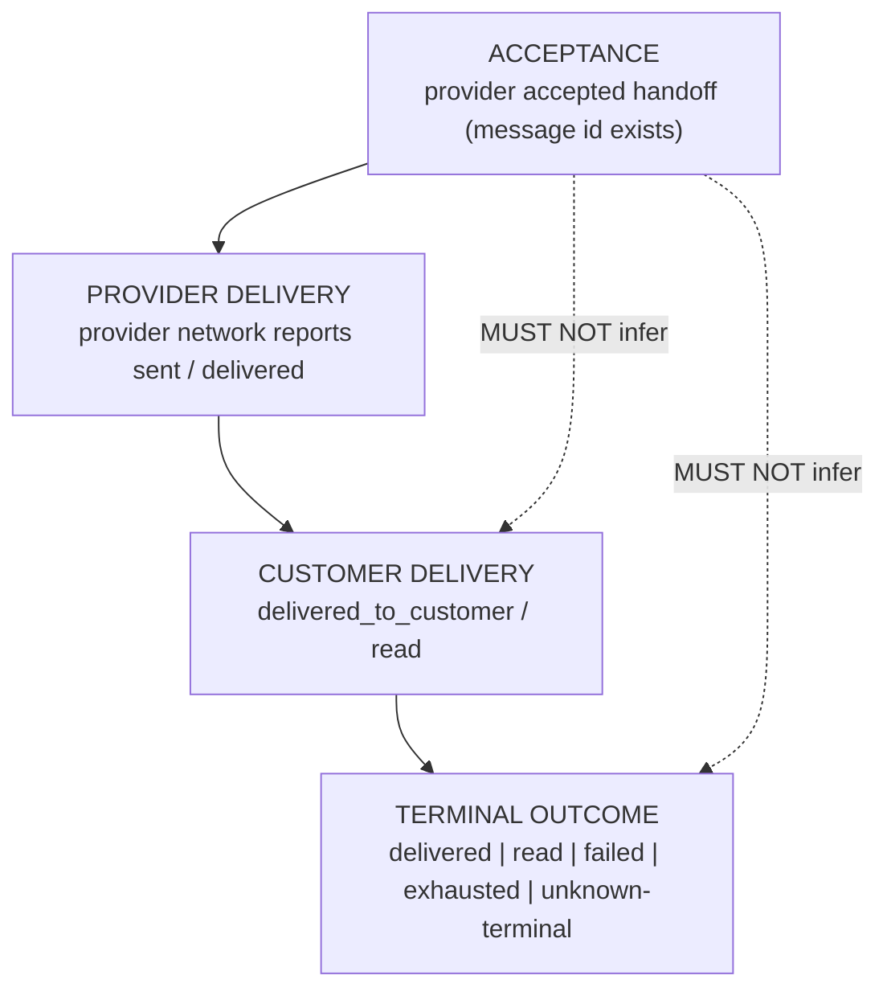

# Provider Reliability Governance V1

**Status:** Governance (authoritative engineering contract) — no implementation, no runtime change
**Phase:** Engineering Constitution Lifecycle §4 Stage 2 (Audit → **Governance** → Contracts → Implementation → …)
**Domain:** All outbound message providers — Twilio (active), Meta (placeholder), and any future provider
**Single source of evidence:** `docs/provider_reliability_foundation_v1_audit.md`
**Precedence:** Subordinate to the Engineering Constitution (`docs/engineering_constitution_v1.md`); peer to Purchase Truth, Lifecycle Truth, Snapshot Generation Governance, Data Growth Governance. Governs *provider reliability*; it does not override Purchase Truth or Lifecycle Truth ownership.

> This document defines **HOW provider reliability must work** — not how it currently works (that is the audit) and not how it will be built (that is future implementation). Future implementation work does not get to *decide* reliability behavior; it *implements this governance*.

---

## 0. Scope, authority, and traceability

**In scope:** the reliability semantics of every outbound provider send — acceptance, delivery, failure classification, retry, truth ownership, observability, and metrics.

**Out of scope (governed elsewhere, must not be weakened):** Purchase Truth (`cartflow_purchase_truth`), Lifecycle Truth (LT-C1, `customer_lifecycle_states_v1`), Scheduler ownership, Dashboard UI, message copy/templates, recovery *scheduling* semantics.

**Evidentiary discipline:** every contract in this document traces to a demonstrated audit finding. No contract invents a problem the audit did not show. Traceability is stated explicitly in §5.3.

**Provider-agnostic rule:** every contract applies identically to Twilio, Meta, and future providers. A provider-specific detail (error codes, header names) is an *implementation mapping*, never a change to the contract.

---

## 1. Reliability Philosophy

The permanent principles that all provider-reliability decisions serve. When principles conflict, resolve via the Engineering Constitution §3 Decision Hierarchy (Correctness > Truth ownership > Operational safety > Reliability > … ).

1. **Reliability Before Throughput.** Delivering the messages we promised matters more than sending more messages faster.
2. **Delivery Truth Before Success Metrics.** A number is only allowed to say "recovered/sent" if the underlying truth supports it. We never inflate success by measuring the easy signal (acceptance) instead of the true one (delivery).
3. **Acceptance Is Not Delivery.** Provider acceptance (a message id) is a *receipt for handoff*, never proof the customer received anything.
4. **Retry Is A Controlled Decision, Never An Accident.** A retry happens because a policy decided it should, with an owner, a budget, and an audit trail — not as an implicit side effect.
5. **Temporary Failure Must Not Become Silent Failure.** A transient provider error must be either retried under policy or recorded as an explainable terminal outcome. It must never simply vanish.
6. **Every Failure Has An Owner.** Every provider outcome resolves to exactly one accountable layer that owns its truth and its next action.
7. **Provider Failure Must Be Explainable.** Every failure carries a stable, PII-free class that maps to an operator action and a merchant explanation.
8. **Unknown Is A State, Not An Absence.** "We don't know the outcome" is a first-class, observable state — never an untracked gap.
9. **Provider Truth Has One Reconciled Owner.** Acceptance, delivery, and terminal outcome for a single send are reconciled under one authority; disjoint stores may exist as inputs but must never *independently* answer the same question.
10. **Observability Is Not Optional.** If a reliability decision cannot be observed, it did not happen in a governable way.

---

## 2. Provider Truth Model

Provider reliability has exactly **four truth altitudes**, in strict order. Each altitude has **one owner**. A higher altitude may only be reached by evidence proper to it — never inferred from a lower one.

| Altitude | Meaning | Evidence that may set it | Owner (governed) |
|----------|---------|--------------------------|------------------|
| **Acceptance** | Provider accepted the message for handoff | Synchronous send returns a provider message id | **Acceptance Owner** — the send-outcome record |
| **Provider Delivery** | Provider network reports movement (sent/delivered) | Provider delivery event (webhook/poll) | **Delivery Truth Owner** |
| **Customer Delivery** | Message reached / was read by the customer | Provider `delivered`/`read` event | **Delivery Truth Owner** |
| **Terminal Outcome** | Final, reconciled disposition | Any layer, reconciled | **Reconciled Provider Truth Owner** |

### 2.1 Ownership contracts

- **PR-TM-1 — Single reconciliation authority.** For any single send, exactly one **Reconciled Provider Truth Owner** produces the terminal disposition by reconciling Acceptance + Delivery evidence. (Audit §5.2 showed four disjoint stores with no reconciliation → PR-R7.)
- **PR-TM-2 — No cross-altitude inference.** A layer that only knows Acceptance must never write Delivery or Terminal-success. (Audit §5.2/§5.3: `sent_real` coexisting with `failed_delivery`, delivery bridge dead → PR-R2.)
- **PR-TM-3 — Truth flows upward only.** Truth may advance altitude (accepted→delivered→read) and may go terminal-failed; it must never silently *regress* to a weaker claim.
- **PR-TM-4 — Delivery evidence must be linkable.** Every delivery event must be joinable to its originating send (a durable correlation key must be persisted at send time). (Audit §5.3: send omits `recovery_key`, orphaning delivery truth.)
- **PR-TM-5 — Truth is decoupled from Purchase Truth.** Provider truth never mutates Purchase Truth; Purchase Truth remains conversion-driven. Lifecycle Truth may consume *reconciled* provider truth but remains the sole owner of lifecycle state (LT-C1 unchanged).

---

## 3. Failure Taxonomy Governance

Every provider outcome resolves to exactly one governed class. Each class declares an **owner**, an **expected action**, and an **observability requirement**. Behavior is driven by the **retryable / terminal / non-provider** axis — not by merchant copy (audit §2 showed classification existed but did not drive behavior).

| Class | Axis | Owner | Expected action (governed) | Observability requirement |
|-------|------|-------|----------------------------|---------------------------|
| **success (accepted)** | — | Acceptance Owner | Record acceptance; await delivery evidence | Acceptance event + correlation key |
| **temporary** | **retryable** | Retry Owner | Retry under budget + backoff; if exhausted → terminal-explainable | Retry attempt + reason emitted |
| **timeout** | **retryable** | Retry Owner | Same as temporary; timeout is a transient class | Timeout event + latency recorded |
| **rate_limit** | **retryable** | Retry Owner | Backoff; honor provider guidance | Rate-limit event + backoff decision |
| **retry_after** | **retryable (constrained)** | Retry Owner | Retry **no earlier than** the provider's `Retry-After`; never ignore it | `Retry-After` value logged + honored |
| **provider_unavailable** | **retryable** | Retry Owner | Retry under budget; escalate on sustained unavailability | Availability signal + retry decision |
| **permanent** | **terminal** | Reconciled Truth Owner | No retry; record explainable terminal failure | Terminal failure class visible |
| **authentication** | **terminal (operator)** | Operator / config | No retry; raise operator/config alert | Auth-failure surfaced as provider-health, not silent |
| **invalid_destination** | **terminal** | Reconciled Truth Owner | No retry; record terminal; do not re-send | Terminal class visible |
| **template_rejected** | **terminal (merchant)** | Merchant / template layer | No retry; block + merchant guidance | Terminal class + merchant explanation |
| **duplicate** | **suppressed** | Idempotency Owner | Suppress send; preserve prior truth | Duplicate suppression observable |
| **unknown** | **unknown-terminal (observable)** | Reconciled Truth Owner | Bounded reconciliation window, then explicit `unknown` terminal — never silent success | `unknown_state_rate` observable |
| **internal_skip** (converted / opted-out / operational-control) | **non-provider** | Recovery / control layer | Not a provider failure; suppress future sends | Skip reason recorded |

**PR-FX-1 — Retryable/terminal is mandatory.** Every class MUST be tagged retryable, terminal, suppressed, unknown-terminal, or non-provider. A failure with no axis is a governance violation. (Audit §2: temporary and permanent were operationally identical → PR-R1.)

**PR-FX-2 — Config/auth failures are health, not per-message noise.** `authentication` / `not_configured` MUST surface as provider-health state, not merely per-send failures.

---

## 4. Retry Governance (principles only — no implementation)

Retries are a **controlled, durable, observable** policy. This section governs the principles; it defines no mechanism.

1. **PR-RT-1 — Explicit ownership.** Exactly one **Retry Owner** decides whether a given failure class is retried. No layer retries implicitly.
2. **PR-RT-2 — Retry budget.** Retries are bounded by an explicit budget (max attempts and/or max wall-clock window). Unbounded retry is forbidden.
3. **PR-RT-3 — Retry exhaustion is a terminal, observable state.** When the budget is spent, the outcome becomes an explainable terminal failure and is counted (`retry_exhaustion_rate`). It never disappears. (Audit §3 → PR-R1.)
4. **PR-RT-4 — Retry cancellation.** Retries MUST stop when the reason to send no longer holds: conversion, customer opt-out, or operational-control block. (Audit §2 categories 15-17.)
5. **PR-RT-5 — Retry persistence & restart survival.** A pending retry MUST be represented durably so it survives process/worker/scheduler/deploy restart and crash. In-memory-only retry state is forbidden as the system of record. (Audit §4 → PR-R6; audit §1.2 dead in-memory queue → PR-R8.)
6. **PR-RT-6 — Retry observability.** Every retry decision (attempt, backoff, reason, exhaustion) MUST be observable. (Audit §6.2 → PR-R4.)
7. **PR-RT-7 — `Retry-After` compliance.** When a provider specifies `Retry-After` (or an equivalent), the retry MUST NOT occur earlier. Provider guidance is authoritative over local backoff. (Audit §2 category 6 → PR-R5.)
8. **PR-RT-8 — Idempotency preserved across retries.** A retry MUST NOT produce a duplicate customer message. Retry composes with the existing send-idempotency contract. (Audit §2 category 13.)
9. **PR-RT-9 — Only retryable classes retry.** Terminal classes (permanent, invalid_destination, template_rejected, authentication) MUST NOT be retried. (Audit §3.)
10. **PR-RT-10 — Crash-in-flight is a bounded, resolvable state.** A send interrupted mid-flight MUST resolve to a governed terminal or a governed retry — never an unbounded `running` limbo. (Audit §3 crash note.)

---

## 5. Provider Contracts (permanent)

These are the permanent, testable contracts of the domain. Numbering is stable; contracts are only added or formally superseded (never silently weakened — Constitution §3).

### 5.1 Contracts

- **PR-1 — Acceptance is not delivery.** Acceptance MUST NOT be recorded, counted, or displayed as delivery or as "recovered". *(PR-R2)*
- **PR-2 — Delivery must never be inferred.** Delivery/customer-delivery MUST be set only by delivery evidence, never derived from acceptance or elapsed time. *(PR-R2)*
- **PR-3 — Terminal failures are observable.** Every terminal failure carries a stable class and is visible to operators and (where appropriate) merchants. No silent terminal. *(PR-R1, PR-R4)*
- **PR-4 — Retries are durable.** Any retry policy is durable and survives restart/deploy/crash; in-memory-only retry is never the system of record. *(PR-R1, PR-R6, PR-R8)*
- **PR-5 — Provider truth has one reconciled owner.** Acceptance + delivery for a send are reconciled under a single authority; no two stores independently answer "did it deliver". *(PR-R7)*
- **PR-6 — Unknown provider states must remain observable.** `unknown` is an explicit, counted terminal after a bounded window — never an untracked gap. *(PR-R7, PR-R4)*
- **PR-7 — Temporary failure must not become silent failure.** Every failure is tagged retryable or terminal; retryable failures are retried-under-policy or recorded as explainable exhaustion. *(PR-R1)*
- **PR-8 — Provider guidance is authoritative for backoff.** `Retry-After`/rate-limit guidance is honored and never overridden by local optimism. *(PR-R5)*
- **PR-9 — Every failure is classified and owned.** No failure is `unknown` by default when a provider signal exists; every class maps to an owner and an action. *(Audit §2, §3)*
- **PR-10 — Metrics have denominators.** Reliability is expressed as rates over a denominator, not bare counts. *(PR-R4)*
- **PR-11 — Inbound provider webhooks are authenticated.** Delivery/read/failed events are accepted only when their provider authenticity is verified. *(PR-R3)*
- **PR-12 — Reliability signals are durable and aggregatable.** Reliability observability (at minimum aggregate counters/rates) survives restart; volatile buffers are diagnostics, not the record. *(PR-R6)*
- **PR-13 — Provider-agnostic contracts.** All contracts apply identically to Twilio, Meta, and future providers; provider specifics are mappings only. *(PR-R9)*
- **PR-14 — Correlation is mandatory at send time.** A durable correlation key linking a send to its future delivery events is persisted when the send occurs. *(PR-R2, PR-R7 — audit §5.3 orphaned bridge)*
- **PR-15 — Decoupling from Purchase Truth is preserved.** Provider truth never writes Purchase Truth; Lifecycle Truth remains the sole owner of lifecycle state. *(Audit §5.4)*

### 5.2 Contract enforcement stance

Contracts are **normative now** (they govern all future work) and become **enforced** (CI/tests/metrics) during implementation per §8–§9. Documentation-stage contracts that lack enforcement are still binding on design review.

### 5.3 Traceability (contract → audit evidence → risk)

| Contract | Audit evidence | Risk |
|----------|----------------|------|
| PR-1, PR-2, PR-14 | §5.2, §5.3 (acceptance≠delivery; keyless orphaned bridge) | PR-R2 (P0) |
| PR-3, PR-7, PR-4 | §2, §3 (temporary=permanent; no durable retry) | PR-R1 (P0) |
| PR-11 | §6.2 (unauthenticated webhooks) | PR-R3 (P1) |
| PR-10, PR-6 | §7 (one count, no rate) | PR-R4 (P1) |
| PR-8 | §2 cat. 5-6 (`Retry-After` unhandled) | PR-R5 (P1) |
| PR-12 | §6.1 (ring/anomaly buffers in-memory) | PR-R6 (P2) |
| PR-5 | §5.1-§5.2 (four disjoint stores) | PR-R7 (P2) |
| PR-4 (dead queue) | §1.2 (test-only retry queue) | PR-R8 (P3) |
| PR-13 | §5.1, §9 (Meta placeholder) | PR-R9 (P3) |
| PR-9 | §2 taxonomy | — |
| PR-15 | §5.4 (Purchase Truth decoupled) | — |

---

## 6. Operational Visibility (mandatory)

Operators MUST be able to answer each question below **without** ad-hoc DB queries or log grepping. This section governs *what must be visible*, not the UI.

| Operators must know | Governed requirement |
|---------------------|----------------------|
| **Current provider health** | Per-provider health state (ready / degraded / unavailable / misconfigured), continuously observable |
| **Delivery success** | Delivery rate over a denominator, per provider |
| **Failures** | Failure rate + breakdown by governed class |
| **Retries** | Retry rate and in-flight retry backlog |
| **Retry exhaustion** | Exhaustion rate (messages that ran out of budget) |
| **Provider latency** | Send latency distribution (at least p50/p95 or bounded ceiling breaches) |
| **Backlog** | Count of sends pending / awaiting delivery evidence / awaiting retry |
| **Provider availability** | Availability signal per provider over time |
| **Unknown states** | Rate of sends stuck at `unknown` after the reconciliation window |

**PR-OV-1 — Restart-durable visibility.** The above MUST NOT rely solely on in-memory buffers that reset on restart (audit §6.1 → PR-R6). **PR-OV-2 — Acceptance and delivery displayed distinctly.** Visibility MUST never conflate acceptance with delivery (PR-1).

---

## 7. Metrics Governance (mandatory metric contracts)

Each metric is a **rate over an explicit denominator** (PR-10), per provider where applicable, and surfaced through the platform's operational-metrics contract registry (peer to `snapshot_generation` metrics).

| Metric | Definition (governed) | Denominator |
|--------|-----------------------|-------------|
| `acceptance_rate` | accepted / attempted | attempted sends |
| `delivery_rate` | delivered_to_customer / accepted | accepted sends |
| `retry_rate` | retried attempts / attempted | attempted sends |
| `retry_success_rate` | eventually-succeeded-after-retry / retried | retried sends |
| `retry_exhaustion_rate` | budget-exhausted / retried | retried sends |
| `provider_latency` | send latency distribution (p50/p95 or ceiling breaches) | per send |
| `provider_errors` | failures by governed class | attempted sends |
| `provider_availability` | healthy-time / total-time per provider | observation window |
| `unknown_state_rate` | sends terminal-`unknown` / attempted | attempted sends |

**PR-MT-1 — No bare counts as reliability KPIs.** A raw count (e.g. today's `recent_send_failures_24h`) may exist as an input but MUST NOT be the platform's reliability KPI (audit §7 → PR-R4). **PR-MT-2 — Metrics are provider-attributed.** Every metric is decomposable by provider (Twilio/Meta/future) (PR-13).

---

## 8. Provider Reliability Maturity Model

Aligned to Engineering Constitution §5. A level is reached only when the previous level's exit criteria hold. **Current domain state (per audit §9): Level 1, with isolated Level-2 components.**

| Level | Name | Exit criteria for the provider-reliability domain |
|-------|------|---------------------------------------------------|
| **0** | Experimental | A send can happen at all |
| **1** | Working | Real sends succeed; failures are caught, not crashing *(current baseline)* |
| **2** | Governed | This document exists; truth model, taxonomy, retry, and contracts are ratified and drive design *(this document → domain enters Level 2 on adoption)* |
| **3** | Measured | §7 metrics exist with denominators; delivery truth is aggregated; acceptance/delivery displayed distinctly |
| **4** | Enforced | Contracts are enforced by tests/CI and metric contracts; violations fail review/build (e.g. "acceptance counted as delivery" is a failing check) |
| **5** | Operationally Proven | Operators run on §6 visibility; retries, exhaustion, and `Retry-After` behave under real provider incidents |
| **6** | Production Proven | Sustained production evidence across providers; reconciled truth, durable retry, authenticated webhooks all validated in production |

**PR-MM-1 — "Working" is not "done".** Per the Constitution, the domain goal is Level 6; Level 1 is a starting line, not a resting point.

---

## 9. Future Implementation Guidance (phases only — no implementation)

Implementation MUST proceed in audit-risk priority order and implement the contracts above. This section sequences work; it defines no mechanism and changes no runtime behavior.

- **Phase 1 — Truth reconciliation & correlation (P0: PR-R2, PR-R7 → PR-1, PR-2, PR-5, PR-14).** Establish a single reconciled provider-truth owner; persist the correlation key at send time so delivery evidence links back; stop counting acceptance as delivery.
- **Phase 2 — Durable retry with a retryable/terminal axis (P0: PR-R1 → PR-3, PR-4, PR-7, PR-RT-*).** Introduce a durable, restart-surviving retry policy for retryable classes with a bounded budget, exhaustion terminal, cancellation, and idempotency — governed by §4.
- **Phase 3 — Webhook authentication (P1: PR-R3 → PR-11).** Verify inbound provider authenticity before accepting delivery/read/failed events.
- **Phase 4 — Metrics with denominators (P1: PR-R4 → PR-10, §7).** Add the §7 metric contracts to the operational-metrics registry; retire the bare-count KPI.
- **Phase 5 — `Retry-After` compliance (P1: PR-R5 → PR-8, PR-RT-7).** Parse and honor provider backoff guidance within the retry policy.
- **Phase 6 — Durable observability (P2: PR-R6 → PR-12, PR-OV-1).** Persist aggregate reliability signals so they survive restart; keep volatile buffers as diagnostics only.
- **Phase 7 — Cleanup & provider expansion (P3: PR-R8, PR-R9 → PR-4, PR-13).** Resolve the dead test-only queue (remove or promote under PR-4); extend the reconciled model to the Meta path before Meta go-live.

**Each phase closes only under the Constitution Definition of Done (§6): behavior verified, contracts satisfied, metrics available, production validated, risks reclassified, institutional memory + SYSTEM_SUMMARY updated.**

---

## 10. Governance closure

After this document, provider reliability is a **governed engineering domain** — peer to Purchase Truth, Lifecycle Truth, Snapshot Generation, Data Growth, and the Engineering Constitution. Future implementation does not decide reliability behavior; it implements these contracts. Amendments to PR-1…PR-15 or the truth model require formal, versioned supersession recorded here and in institutional memory (Constitution §11). This governance is the authoritative reference for all current and future providers.
