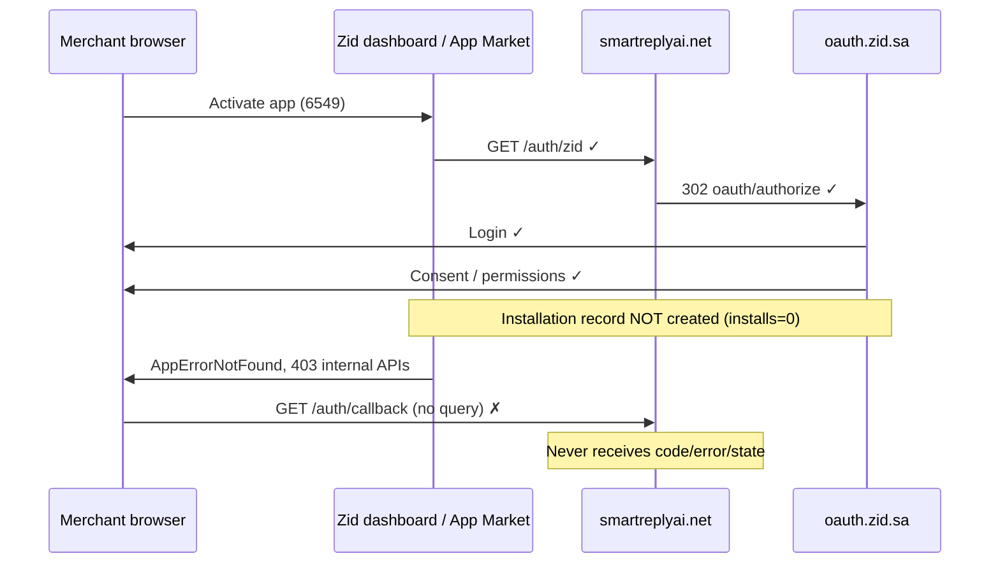

# Zid installation & OAuth activation — root-cause audit v1

**Date (UTC):** 2026-06-02  
**Scope:** Read-only audit. No CartFlow business-logic fixes applied.  
**App:** OAuth client_id `6383`, dashboard app path id `6549` (from Zid merchant dashboard URLs).

---

## Executive summary

| Question | Finding |
|----------|---------|
| **Exact failing step** | **Step 3 — During installation creation** on Zid’s side (after consent, before OAuth code issuance). |
| **Does CartFlow receive `code`, `error`, or `state`?** | **No.** Server receives `GET /auth/callback` with **empty query** (`callback_query_keys=[]`, `oauth_error=null`). |
| **Is Zid OAuth callback (with `?code=`) ever triggered?** | **No evidence** in CartFlow logs or server query. Consent runs; OAuth authorization-code redirect to `redirect_uri` does not complete. |
| **Is an installation record created (app_id 6549)?** | **No.** Partner Dashboard shows **App installs: 0** despite activation attempts. |
| **Primary owner** | **Zid platform / dev-store activation** while app status is **In Review**, not CartFlow callback or authorize URL construction. |
| **Secondary checks** | Partner Dashboard: subscription **plan** required for subscription apps; scopes approved; install via **Partner “Install on development store”** vs App Market path. |

---

## Failure timeline (observed)

---

## Evidence matrix

### CartFlow (confirmed working as designed)

| # | Evidence | Source |
|---|----------|--------|
| 1 | `GET /auth/zid` → 302 `oauth.zid.sa/oauth/authorize?client_id=6383&redirect_uri=https://smartreplyai.net/auth/callback&response_type=code&scope=…` | Production curl |
| 2 | Partner **Redirection URL** = `https://smartreplyai.net/auth/zid` | User confirmation |
| 3 | Partner **Callback URL** = `https://smartreplyai.net/auth/callback` | User confirmation |
| 4 | App type = OAuth | User confirmation |
| 5 | `GET /auth/callback` → `callback_query_empty=true`, `oauth_error=null` | Callback diagnostics |
| 6 | CartFlow never logs `code_present=true` on dev install path | Deploy logs |

### Zid platform (failure signals)

| # | Evidence | Implication |
|---|----------|-------------|
| 7 | **App installs: 0** | Zid did not persist a store↔app installation |
| 8 | **App status: In Review** | App submitted for review; not published/live for general activation |
| 9 | **AppErrorNotFound** in merchant dashboard | Dashboard cannot resolve app context for store (no install / wrong app id context) |
| 10 | **403** on Zid internal APIs post-consent | Installation/subscription backend rejected before OAuth completion |
| 11 | **"Oops! Something broke"** | Client-side error after failed install API calls |
| 12 | Bare navigation to `/auth/callback` | Not OAuth 302 with `?code=` or `?error=` ([Zid authorization](https://docs.zid.sa/authorization)) |

### OAuth standard (Zid docs)

Per [Zid authorization](https://docs.zid.sa/authorization), after consent the OAuth server **must** redirect to the callback with an authorization **code**. Empty query means this redirect **did not occur**; the browser reached `/auth/callback` via another mechanism (dashboard handoff to Callback URL field).

---

## Investigation answers (A–E)

### A) Installation record for app_id=6549

**Conclusion: Not created.**

- Partner Dashboard **install count = 0** is direct evidence.
- **AppErrorNotFound** + **403** indicate the merchant dashboard cannot load app `6549` for the dev store — consistent with missing installation/subscription record.
- CartFlow has no API to list Zid installations; Zid-side install count is the authoritative signal.

**Verify on Zid:** Partner Dashboard → app → installs/analytics; dev store → App Market → private apps → app should appear **only after** successful install.

### B) Is Zid OAuth callback (with code) triggered from Zid side?

**Conclusion: No.**

- Empty server query rules out `code`, `error`, and `state`.
- Temporary audit logs (`[ZID OAUTH AUDIT]`) will capture **Referer** on next run:
  - `referer=…oauth.zid.sa…` → OAuth redirect happened but query stripped (unlikely)
  - `referer=…dashboard.zid.sa…` → Dashboard opened Callback URL without OAuth completion (**expected**)

### C) Does CartFlow ever receive code / error / state?

**Conclusion: No**, on any observed activation attempt.

| Param | Received |
|-------|----------|
| `code` | Never |
| `error` | Never |
| `state` | Never (dev install uses no state by design) |

### D) CartFlow OAuth vs Zid official requirements

| Requirement | Zid spec | CartFlow implementation | Match |
|-------------|----------|-------------------------|-------|
| Authorize endpoint | `GET https://oauth.zid.sa/oauth/authorize` | `ZID_OAUTH_AUTHORIZE_URL` | ✓ |
| `client_id` | Partner App Keys | `ZID_CLIENT_ID` env | ✓ |
| `redirect_uri` | Must match Callback URL exactly | `get_oauth_redirect_uri()` → `https://smartreplyai.net/auth/callback` | ✓ (user-confirmed dashboard) |
| `response_type=code` | Authorization code grant | Always `code` | ✓ |
| `scope` | Subset of Application Scopes | `abandoned_carts.read orders.read` (default) | ✓ |
| Redirection URL | Install entry; app starts OAuth | `/auth/zid` → authorize when `ZID_DEV_OAUTH_ENABLED=1` | ✓ |
| Callback | Receives `?code=`; POST to `/oauth/token` | `/auth/callback` + `exchange_code_for_token()` | ✓ (never reached with code) |
| `state` | Recommended for CSRF | Dev install: omitted; dashboard connect: signed state | ✓ acceptable for dev path |
| Dev store install | Partner: “Install on my development store” ([test guide](https://help-partner.zid.sa/en/articles/8645309-test-your-application)) | Redirection URL wired | ✓ entry; Zid backend must create install |

**CartFlow OAuth implementation matches Zid docs.** Failure occurs before CartFlow can exchange a code.

### E) Failure phase classification

| Phase | Status | Notes |
|-------|--------|-------|
| 1. Before OAuth authorization | ✓ Pass | `/auth/zid` reaches authorize |
| 2. During OAuth authorization | ✓ Partial | Login + consent UI shown |
| 3. **During installation creation** | **✗ FAIL** | installs=0, 403, AppErrorNotFound |
| 4. During callback redirect | **✗ FAIL** | Callback hit without OAuth query |
| 5. After callback | N/A | Token exchange never runs |

---

## Root-cause classification

| Owner | Verdict | Rationale |
|-------|---------|-----------|
| **CartFlow** | **Not root cause** | Authorize URL correct; callback receives empty query; no code to exchange. |
| **CartFlow OAuth implementation** | **Not root cause** | Aligns with [Zid authorization](https://docs.zid.sa/authorization). |
| **Zid Partner Dashboard configuration** | **Possible contributor** | URLs confirmed correct; check **pricing plan**, **scopes approval**, **embed mode**, **Application URL** ≠ duplicate of callback. |
| **Zid Development Store activation** | **Primary** | Install record never created; test flow expects Partner “Install on development store” + subscription plan for subscription apps ([test guide](https://help-partner.zid.sa/en/articles/8645309-test-your-application)). |
| **Zid platform (In Review state)** | **Primary** | App **In Review** with **0 installs** + post-consent 403/AppErrorNotFound suggests Zid backend blocks installation completion while under review or missing subscription/plan step — OAuth code never issued. |

---

## Zid documentation references

1. [Authorization](https://docs.zid.sa/authorization) — code must be sent to callback after consent.  
2. [Create your First App](https://docs.zid.sa/create-first-app) — Redirection vs Callback URL roles; subscription plans required.  
3. [Test your application](https://help-partner.zid.sa/en/articles/8645309-test-your-application) — Install from Partner Dashboard; subscription apps need OAuth cycle **and** plan subscription.  
4. [OAuth Authorization Server Error](https://help-partner.zid.sa/en/articles/8718045-oauth-authorization-server-error) — URL mismatch (ruled out by user-confirmed URLs).  
5. [Denied request](https://help-partner.zid.sa/en/articles/8717991-the-resource-owner-or-authorization-server-denied-the-request) — permissions / app not published on store.

---

## Temporary diagnostics added (audit only)

Log marker: **`[ZID OAUTH AUDIT]`**

| Route | Fields logged |
|-------|----------------|
| `/auth/zid` | `route`, `branch`, `query_keys`, `referer`, `user_agent` |
| `/auth/callback` | `route`, `query_keys`, `code_present`, `error_present`, `state_present`, `state_len`, `referer`, `user_agent`, `oauth_error` |

Use Railway deploy logs on the **next** activation attempt to confirm Referer source.

---

## Recommended next steps (investigation only — no CartFlow fixes)

1. **Partner Dashboard:** Confirm at least one **pricing plan** exists (subscription apps).  
2. **Install path:** Use **“Install on my development store”** from Partner app details (not only merchant App Market) per Zid test guide.  
3. **Scopes:** Confirm `abandoned_carts.read` and `orders.read` are **enabled and approved** (not pending rejection).  
4. **In Review:** Ask Zid support whether dev-store OAuth/install is blocked while **In Review** with 0 installs and 403/AppErrorNotFound.  
5. **Network HAR:** Capture failing activation; confirm 403 URLs and whether any `302` from `oauth.zid.sa` targets `/auth/callback?code=`.  
6. **Audit log:** After deploy, paste `[ZID OAUTH AUDIT]` line for `/auth/callback` (especially `referer=`).

---

## Related docs

- `docs/zid_activation_upstream_trace_v1.md`  
- `docs/zid_oauth_partner_checklist_v1.md`
